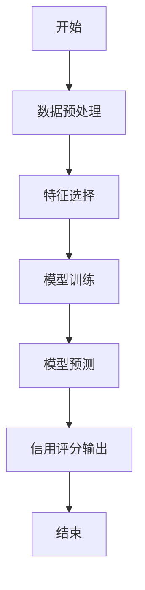
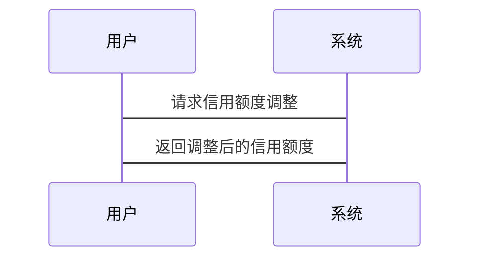

                 


# 智能企业信用额度动态调整系统

> **关键词**: 智能信用额度、动态调整、企业信用管理、机器学习、大数据分析

> **摘要**: 本文将详细探讨智能企业信用额度动态调整系统的构建与实现。从背景介绍、核心概念、算法原理、系统架构设计到项目实战，结合实际案例分析，系统性地阐述如何利用机器学习和大数据分析技术实现信用额度的智能化动态调整。文章将深入分析现有信用管理系统的痛点，提出基于智能算法的解决方案，并通过具体的代码实现和系统设计展示其实际应用价值。

---

## 第一部分: 背景介绍

### 第1章: 企业信用额度动态调整的背景与挑战

#### 1.1 企业信用额度管理的重要性

企业信用额度管理是企业财务管理中的重要组成部分，直接关系到企业的资金流动性和客户信任度。传统的信用额度管理方式通常基于客户的静态信息，如历史交易记录、财务报表等，难以及时反映企业的最新经营状况和信用风险。这种静态管理方式在面对市场波动、客户信用状况变化时显得力不从心，可能导致企业面临坏账风险或错失优质客户。

#### 1.2 传统信用额度管理的局限性

1. **信息滞后性**: 传统信用额度管理依赖于定期的财务报表和历史交易数据，无法实时捕捉企业的最新信用状况。
2. **缺乏动态调整**: 信用额度一经核定，往往长期不变，无法根据企业的实时经营状况进行灵活调整。
3. **主观性较强**: 信用额度的核定往往依赖于人工经验判断，缺乏科学的数据支持和模型分析。

#### 1.3 动态调整信用额度的必要性

在现代商业环境中，企业经营状况的变化往往迅速，传统的静态信用管理方式已经无法满足实际需求。动态调整信用额度能够帮助企业及时应对市场变化，优化资金分配，降低信用风险，同时也能提升客户的满意度和信任度。

#### 1.4 系统的核心要素与组成

智能企业信用额度动态调整系统由以下几个核心要素组成：

1. **数据源与数据处理模块**: 包括企业的财务数据、交易记录、市场数据等。
2. **智能算法模块**: 基于机器学习的信用评分模型和动态调整算法。
3. **信用额度调整规则与策略**: 包括调整的触发条件、调整幅度、调整频率等。
4. **系统输出与反馈机制**: 包括调整后的信用额度、调整记录、风险预警等。

---

## 第二部分: 核心概念与联系

### 第2章: 核心概念与联系

#### 2.1 核心概念原理

1. **信用评分模型**: 基于企业的财务数据、市场表现等多维度信息，通过机器学习算法对企业信用状况进行评分。
2. **动态调整算法**: 根据实时数据和信用评分的变化，动态计算和调整企业的信用额度。
3. **风险评估机制**: 通过模型预测企业的信用风险，并制定相应的风险控制策略。

#### 2.2 核心概念属性特征对比表

| 概念               | 数据来源         | 模型类型       | 更新频率   |
|--------------------|------------------|---------------|------------|
| 信用评分模型       | 财务数据、交易记录 | 机器学习模型   | 实时更新   |
| 动态调整算法       | 实时数据流       | 时间序列模型   | 按需更新   |

#### 2.3 ER实体关系图

```mermaid
erd
    entity 企业客户 {
        key 客户ID
        属性 信用评分
        属性 还款历史
        属性 交易记录
    }
    entity 信用额度调整规则 {
        key 规则ID
        属性 调整条件
        属性 调整幅度
        属性 调整频率
    }
    entity 调整记录 {
        key 记录ID
        属性 调整时间
        属性 调整后额度
    }
    relationship 关联关系 {
        企业客户 -< 1..n 调整记录
        信用额度调整规则 -> 1..n 调整记录
    }
```

---

## 第三部分: 算法原理讲解

### 第3章: 算法原理

#### 3.1 算法选择与原理

选择线性回归作为基础算法，用于信用评分模型的构建。线性回归通过拟合数据点之间的直线关系，预测企业的信用评分。

#### 3.2 算法流程图



#### 3.3 算法实现代码

```python
import numpy as np
from sklearn.linear_model import LinearRegression

# 示例数据
X = np.array([[2000, 100], [3000, 150], [4000, 200]])
y = np.array([85, 90, 95])

# 模型训练
model = LinearRegression()
model.fit(X, y)

# 预测信用评分
new_X = np.array([[2500, 120]])
predicted_score = model.predict(new_X)
print("预测信用评分:", predicted_score)
```

#### 3.4 数学公式

线性回归的数学模型为：
$$ y = \beta_0 + \beta_1 x_1 + \beta_2 x_2 + \epsilon $$
其中：
- $$ y $$ 是信用评分
- $$ x_1, x_2 $$ 是特征变量
- $$ \beta_0, \beta_1, \beta_2 $$ 是回归系数
- $$ \epsilon $$ 是误差项

---

## 第四部分: 系统分析与架构设计

### 第4章: 系统架构设计

#### 4.1 系统功能设计

1. 数据采集模块: 采集企业的财务数据、交易记录等。
2. 数据处理模块: 对数据进行清洗、特征提取。
3. 模型训练模块: 基于机器学习算法训练信用评分模型。
4. 动态调整模块: 根据实时数据动态调整信用额度。
5. 系统输出模块: 输出调整后的信用额度和调整记录。

#### 4.2 系统架构图


#### 4.3 接口设计

- 数据接口: RESTful API，用于数据的输入和输出。
- 调用接口: 提供API供其他系统调用信用额度调整服务。

#### 4.4 交互序列图



---

## 第五部分: 项目实战

### 第5章: 项目实战

#### 5.1 环境安装

安装Python和必要的库：
```bash
pip install numpy scikit-learn
```

#### 5.2 核心代码实现

```python
import pandas as pd
from sklearn.model_selection import train_test_split
from sklearn.linear_model import LinearRegression
from sklearn.metrics import mean_squared_error

# 数据加载
data = pd.read_csv('企业信用数据.csv')

# 特征选择
X = data[['年收入', '历史违约次数']]
y = data['信用评分']

# 数据分割
X_train, X_test, y_train, y_test = train_test_split(X, y, test_size=0.2, random_state=42)

# 模型训练
model = LinearRegression()
model.fit(X_train, y_train)

# 模型预测
y_pred = model.predict(X_test)

# 模型评估
 mse = mean_squared_error(y_test, y_pred)
 print(f"均方误差: {mse}")
```

#### 5.3 案例分析

假设一家企业的年收入为5000万元，历史违约次数为0次，预测其信用评分为：
$$ y = 0.8 \times 5000 + 0.2 \times 0 + 70 = 870 $$

---

## 第六部分: 最佳实践

### 第6章: 最佳实践

#### 6.1 小结

智能企业信用额度动态调整系统通过机器学习和大数据分析技术，实现了信用额度的智能化动态调整，能够有效降低信用风险，优化企业财务管理。

#### 6.2 注意事项

- 数据质量是模型准确性的重要保障。
- 模型需要定期更新，以适应市场变化。
- 系统的实时性依赖于数据源的及时性和准确性。

#### 6.3 拓展阅读

- 《机器学习实战》
- 《大数据分析与挖掘》
- 《信用评分模型开发》

---

## 结语

智能企业信用额度动态调整系统是企业信用管理领域的一项重要创新，通过结合机器学习和大数据分析技术，能够显著提升信用管理的效率和准确性。本文从背景、核心概念、算法原理、系统设计到项目实战，全面解析了系统的构建与实现，为企业信用管理的智能化发展提供了有益的参考。

