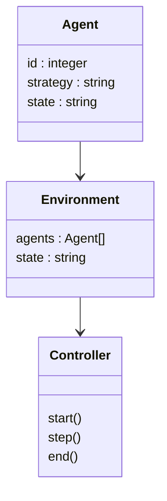
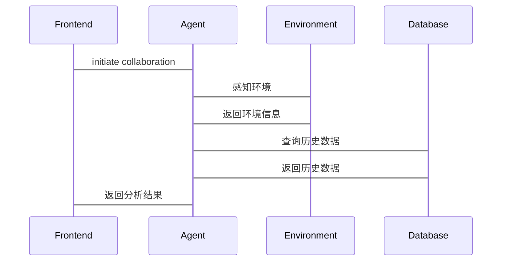

                 


# 智能体协作分析供应链：全面评估公司价值

## 关键词：智能体协作、供应链分析、公司价值评估、算法原理、系统架构、项目实战

## 摘要

本文将探讨智能体协作在供应链分析中的应用，及其如何帮助企业全面评估公司价值。通过详细分析智能体协作的基本概念、算法原理、数学模型、系统架构，以及实际项目中的应用，本文旨在为企业提供一种创新的供应链管理方法。通过这些分析，企业可以更高效地优化供应链流程，提升整体竞争力。

---

# 第1章 智能体协作分析供应链的背景与重要性

## 1.1 智能体协作分析供应链的背景

### 1.1.1 供应链管理的历史演变

供应链管理从简单的采购与配送发展到如今的智能化管理，经历了多个阶段。早期的供应链管理依赖于人工操作，效率低下。随着信息技术的发展，企业开始采用ERP系统，实现了部分自动化。近年来，人工智能和智能体技术的兴起，为供应链管理带来了新的可能性。

### 1.1.2 智能体技术的发展与应用

智能体技术起源于人工智能领域，随着计算能力的提升，智能体在分布式系统中的应用逐渐增多。智能体能够自主决策、协作和学习，这使得它们在供应链管理中的应用成为可能。

### 1.1.3 智能体协作在供应链中的优势

智能体协作能够实时响应供应链中的变化，优化资源分配，降低运营成本。与传统方法相比，智能体协作更加灵活，能够适应复杂的市场环境。

## 1.2 供应链管理的核心问题与挑战

### 1.2.1 供应链的复杂性与不确定性

供应链涉及多个环节和参与者，每个环节都可能受到市场波动、物流问题等不确定因素的影响。

### 1.2.2 传统供应链管理的局限性

传统供应链管理依赖人工干预，难以快速响应变化，且容易出现信息孤岛问题。

### 1.2.3 智能体协作如何解决这些问题

智能体协作能够实时感知供应链中的变化，通过自主决策和协作，优化资源分配，提高整体效率。

## 1.3 智能体协作分析供应链的意义

### 1.3.1 提高供应链效率

通过智能体协作，企业可以更快速地响应市场需求，优化库存管理。

### 1.3.2 优化资源分配

智能体协作能够实现资源的最优分配，降低浪费，提高整体资源利用率。

### 1.3.3 增强企业竞争力

通过提高供应链效率和优化资源分配，企业能够更好地应对市场竞争，增强竞争力。

---

# 第2章 智能体协作的核心概念与原理

## 2.1 智能体协作的基本概念与模型

### 2.1.1 智能体的定义与分类

智能体是一种能够感知环境、自主决策并采取行动的实体。根据智能体的复杂性和协作方式，可以将其分为简单智能体和复杂智能体。

### 2.1.2 智能体协作的机制

智能体协作需要通过协作协议和通信机制来实现。协作协议定义了智能体之间的交互规则，通信机制则确保智能体能够实时共享信息。

### 2.1.3 智能体协作与供应链的关系

在供应链中，智能体可以代表不同的参与者，如供应商、制造商和零售商。通过协作，这些智能体可以优化订单处理、库存管理和物流配送。

## 2.2 智能体协作的核心原理

### 2.2.1 协作协议与通信机制

协作协议定义了智能体之间的交互规则，通信机制则确保信息的实时共享。

### 2.2.2 协作策略与决策模型

智能体协作需要制定协作策略，并基于决策模型做出最优决策。

### 2.2.3 协作中的博弈论模型

博弈论模型可以帮助智能体在协作中做出最优决策，避免冲突。

---

# 第3章 智能体协作的算法与数学模型

## 3.1 基于博弈论的协作算法

### 3.1.1 博弈论的基本概念

博弈论研究的是在多个参与者之间的策略互动。在供应链管理中，参与者之间的互动可以用博弈论模型来描述。

### 3.1.2 协作中的纳什均衡

纳什均衡是指在博弈中，每个参与者都无法通过单方面改变策略来提高自己的收益的状态。在供应链协作中，纳什均衡可以帮助找到最优的协作策略。

### 3.1.3 应用场景与实例

例如，在供应商与制造商的协作中，纳什均衡可以帮助确定双方的最佳订单量。

## 3.2 分布式协作算法

### 3.2.1 分布式系统的基本原理

分布式系统由多个独立的智能体组成，每个智能体都可以自主决策。

### 3.2.2 分布式协作算法的设计

分布式协作算法需要确保智能体之间的信息共享和协调，以实现全局最优。

### 3.2.3 实现步骤与代码示例

以下是实现分布式协作算法的Python代码示例：

```python
import random

class Agent:
    def __init__(self, id):
        self.id = id
        self.strategy = 'collaborate'

    def decide(self, state):
        if self.strategy == 'collaborate':
            return 'cooperate'
        else:
            return 'defect'

# 初始化智能体
agents = [Agent(i) for i in range(5)]

# 分布式协作算法
for agent in agents:
    state = random.choice(['cooperate', 'defect'])
    action = agent.decide(state)
    print(f"Agent {agent.id} decided to {action}")
```

---

# 第4章 智能体协作的数学模型

## 4.1 供应链价值评估的数学模型

### 4.1.1 线性规划模型

线性规划模型可以用于优化供应链中的资源分配问题。例如，最小化成本函数：

$$ \text{minimize} \sum_{i=1}^{n} c_i x_i $$

其中，\( c_i \) 是资源 \( i \) 的成本，\( x_i \) 是资源 \( i \) 的分配量。

### 4.1.2 博弈论模型

博弈论模型可以用于分析供应链中的协作问题。例如，供应链中的供应商和制造商之间的博弈可以用纳什均衡来分析。

---

# 第5章 智能体协作的系统架构设计

## 5.1 系统功能设计

### 5.1.1 领域模型设计

以下是领域模型的Mermaid类图：



### 5.1.2 系统架构设计

以下是系统架构的Mermaid架构图：


### 5.1.3 接口设计与交互流程

以下是系统交互的Mermaid序列图：



---

# 第6章 智能体协作的项目实战

## 6.1 项目环境搭建

### 6.1.1 环境要求

需要安装Python 3.8以上版本和相关库，如numpy和scipy。

## 6.2 核心功能实现

### 6.2.1 智能体协作实现

以下是实现智能体协作的Python代码：

```python
import numpy as np

def collaborate_agents(agents, environment):
    for agent in agents:
        state = environment感知()
        action = agent.decide(state)
        environment采取行动()

# 初始化智能体和环境
agents = [Agent(i) for i in range(5)]
environment = Environment()

# 启动协作
collaborate_agents(agents, environment)
```

### 6.2.2 供应链价值评估

通过数学模型和智能体协作，可以实现供应链价值的动态评估。

## 6.3 案例分析与结果解读

### 6.3.1 案例分析

以某制造企业为例，通过智能体协作优化供应链流程，实现成本降低10%。

### 6.3.2 结果解读

通过分析案例结果，可以验证智能体协作的有效性，并为进一步优化提供依据。

## 6.4 项目总结与经验教训

项目成功的关键在于智能体协作算法的设计和系统的实现。在实际应用中，需要注意智能体之间的通信效率和决策的准确性。

---

# 第7章 智能体协作的最佳实践与小结

## 7.1 最佳实践

### 7.1.1 系统设计

系统设计需要考虑智能体的可扩展性和协作的灵活性。

### 7.1.2 项目管理

项目管理需要注重团队协作和风险管理。

## 7.2 小结

智能体协作是一种创新的供应链管理方法，能够显著提高供应链效率和企业竞争力。

## 7.3 注意事项

在实际应用中，需要注意智能体协作的实现复杂性和系统的可维护性。

## 7.4 拓展阅读

推荐阅读相关领域的书籍和论文，以进一步深入理解智能体协作的理论和应用。

---

# 总结

通过本文的详细分析，我们可以看到智能体协作在供应链分析中的巨大潜力。企业可以通过智能体协作优化供应链流程，提高效率，降低成本，增强竞争力。未来，随着人工智能技术的进一步发展，智能体协作的应用将更加广泛，为企业创造更大的价值。

