                 


# 智能体协作增强价值投资的产品生命周期分析

> 关键词：智能体协作、价值投资、产品生命周期、多智能体系统、强化学习

> 摘要：本文从智能体协作的核心概念出发，分析其在价值投资中的应用潜力，并结合产品生命周期的不同阶段，探讨智能体协作如何通过优化投资决策、提升资产配置效率、降低投资风险等手段，为价值投资带来新的可能性。文章结合理论与实践，通过算法原理、系统设计、项目实现等多维度展开，深入剖析智能体协作在价值投资中的实际应用价值，并为未来的研究方向提供参考。

---

## 第一部分: 智能体协作与价值投资的背景

### 第1章: 智能体协作与价值投资的背景

#### 1.1 智能体协作的基本概念

智能体协作是指多个智能体（Agent）通过相互合作，共同完成一个复杂任务的过程。智能体可以是软件程序、算法模型或具有自主决策能力的实体。协作的核心在于信息共享、决策优化和任务分配。

**图1-1 智能体协作的基本流程**

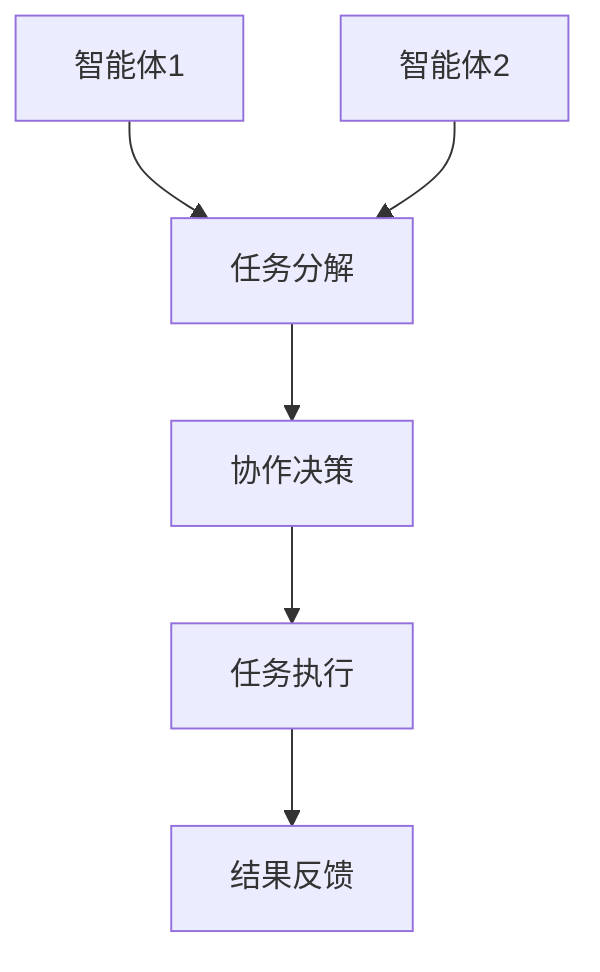

智能体协作的关键属性包括：
- **自主性**：智能体能够自主决策。
- **社会性**：智能体之间需要进行信息交互。
- **协作性**：智能体通过合作实现共同目标。

#### 1.2 价值投资的基本原理

价值投资是一种投资策略，强调通过深入分析企业的基本面，寻找市场价格低于其内在价值的投资机会。核心在于识别“价格与价值的偏差”。

**表1-1 价值投资与传统投资的区别**

| 属性          | 价值投资           | 传统投资           |
|---------------|--------------------|--------------------|
| 投资依据      | 企业基本面         | 市场波动、技术分析   |
| 投资期限      | 长期              | 短期              |
| 风险承受      | 中低风险          | 高风险            |

智能体协作在价值投资中的潜力主要体现在：
- 提高数据分析效率。
- 优化投资组合配置。
- 风险预警与控制。

#### 1.3 产品生命周期的定义与分析

产品生命周期是指产品从研发、上市、成熟到衰退的全过程。主要分为四个阶段：
1. **引入阶段**：产品进入市场的初期。
2. **成长阶段**：市场需求快速增长。
3. **成熟阶段**：市场需求趋于稳定。
4. **衰退阶段**：市场需求逐渐下降。

**图1-2 产品生命周期与智能体协作的关系**

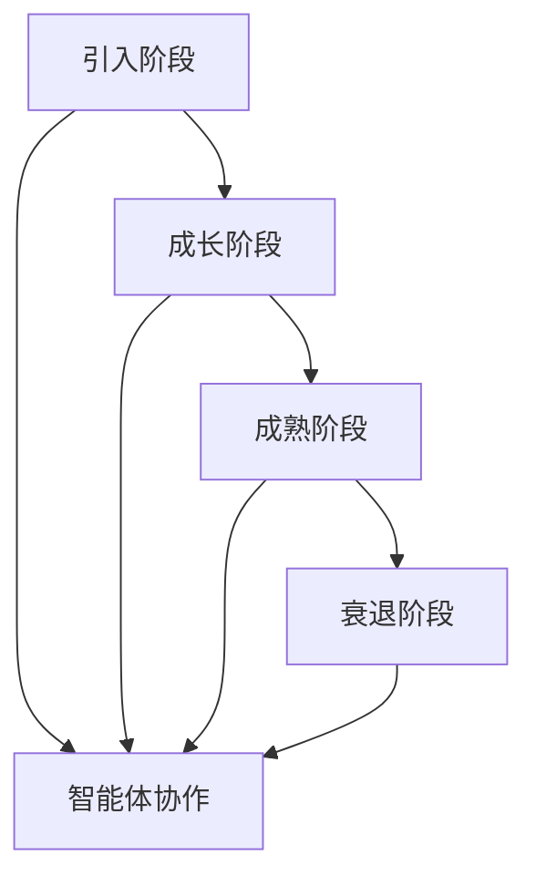

智能体协作在产品生命周期中的作用：
- 在引入阶段，帮助识别市场需求。
- 在成长阶段，优化资源配置。
- 在成熟阶段，提升运营效率。
- 在衰退阶段，降低库存风险。

---

## 第2章: 智能体协作的核心概念与联系

### 2.1 智能体协作的原理

智能体协作的原理可以分为三个核心步骤：
1. **信息共享**：智能体之间共享数据和信息。
2. **决策优化**：基于共享信息，优化决策。
3. **任务分配**：根据决策结果分配任务。

**图2-1 基于强化学习的协作框架**

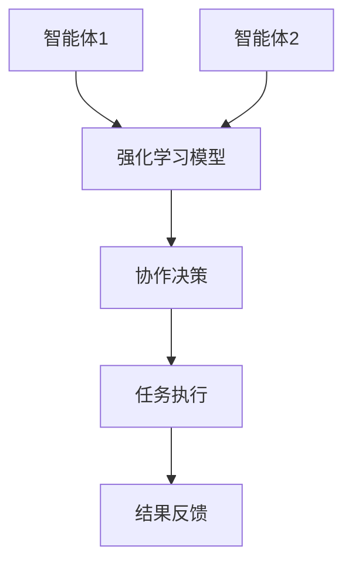

### 2.2 价值投资与智能体协作的关系

价值投资的核心是通过分析企业的基本面数据，寻找被市场低估的投资标的。智能体协作可以通过以下方式增强价值投资：
- **数据采集与分析**：智能体协作可以高效采集和分析大量数据，发现潜在的投资机会。
- **投资组合优化**：通过协作，智能体可以更好地优化投资组合，降低风险。
- **动态调整**：根据市场变化，智能体协作可以实时调整投资策略。

**表2-1 智能体协作对价值投资的增强作用**

| 方面           | 传统价值投资       | 智能体协作增强价值投资       |
|----------------|--------------------|----------------------------|
| 数据处理能力  | 有限              | 强大                        |
| 决策效率       | 较低              | 高                         |
| 风险控制       | 依赖人工经验        | 更加精准                   |

### 2.3 产品生命周期中的协作机制

在产品生命周期的不同阶段，智能体协作可以采取不同的策略：
- **引入阶段**：智能体协作用于市场调研和需求分析。
- **成长阶段**：智能体协作用于优化生产和供应链管理。
- **成熟阶段**：智能体协作用于提升客户满意度和忠诚度。
- **衰退阶段**：智能体协作用于制定退出策略和资产处置。

**图2-2 产品生命周期中的协作机制**

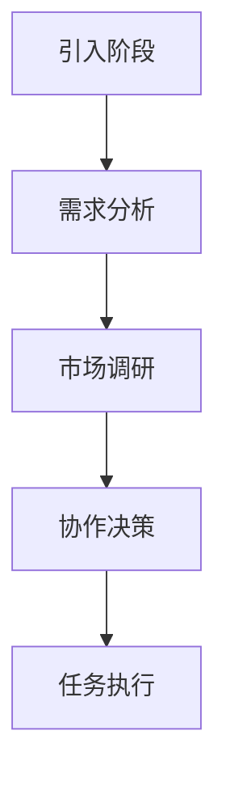

---

## 第3章: 智能体协作的算法原理

### 3.1 多智能体协作算法概述

多智能体协作算法是智能体协作的核心技术，主要基于以下几种方法：
1. **强化学习**：通过奖励机制优化智能体的决策。
2. **博弈论**：通过分析智能体之间的博弈关系，找到最优策略。
3. **分布式计算**：通过分布式系统实现智能体之间的协作。

**图3-1 多智能体协作算法的流程**

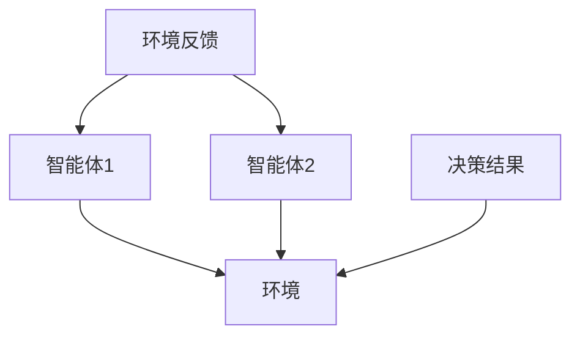

### 3.2 基于强化学习的协作算法

基于强化学习的协作算法是一种通过智能体与环境交互，不断优化决策的算法。核心步骤包括：
1. **状态感知**：智能体感知当前环境状态。
2. **决策制定**：基于状态，智能体制定决策。
3. **执行决策**：智能体执行决策，并获得反馈。
4. **更新策略**：根据反馈，更新决策策略。

**代码示例：基于强化学习的协作算法**

```python
import numpy as np

class Agent:
    def __init__(self, state_space, action_space):
        self.state_space = state_space
        self.action_space = action_space
        self.q_table = np.zeros((state_space, action_space))
    
    def act(self, state):
        return np.argmax(self.q_table[state])
    
    def learn(self, state, action, reward, next_state):
        self.q_table[state][action] += 0.1 * (reward + np.max(self.q_table[next_state]) - self.q_table[state][action])

# 初始化智能体
state_space = 5
action_space = 3
agent = Agent(state_space, action_space)

# 模拟协作过程
for episode in range(100):
    state = 0
    action = agent.act(state)
    reward = 1 if action == 1 else 0
    next_state = 1 if action == 1 else 0
    agent.learn(state, action, reward, next_state)
```

### 3.3 协作算法的数学模型

基于强化学习的协作算法可以用以下数学模型表示：

$$ Q(s,a) = Q(s,a) + \alpha [r + \max_{a'} Q(s',a') - Q(s,a)] $$

其中：
- \( Q(s,a) \) 表示在状态 \( s \) 下采取行动 \( a \) 的价值。
- \( \alpha \) 是学习率。
- \( r \) 是奖励。
- \( s' \) 是下一个状态。

---

## 第4章: 智能体协作在产品生命周期中的应用

### 4.1 产品引入阶段的协作机制

在产品引入阶段，智能体协作主要用于市场调研和需求分析。智能体可以通过以下方式协作：
- 数据采集：智能体协作采集市场数据。
- 数据分析：智能体协作分析数据，识别潜在市场需求。
- 决策制定：智能体协作制定市场进入策略。

**图4-1 引入阶段的协作机制**

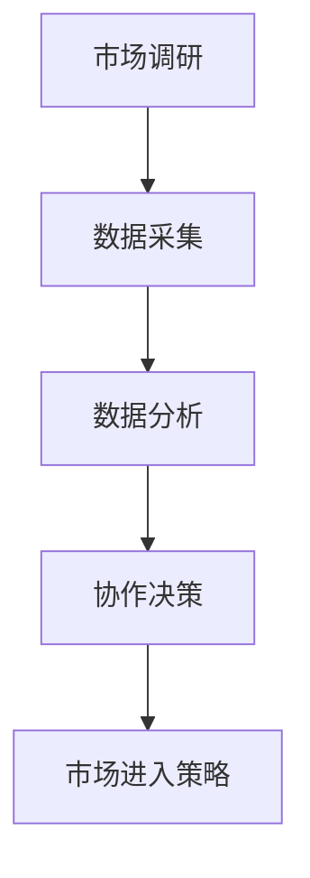

### 4.2 产品成长阶段的协作机制

在产品成长阶段，智能体协作主要用于优化生产和供应链管理。智能体可以通过以下方式协作：
- 生产计划：智能体协作制定生产计划。
- 供应链管理：智能体协作优化供应链。
- 资源分配：智能体协作分配资源。

**图4-2 成长阶段的协作机制**

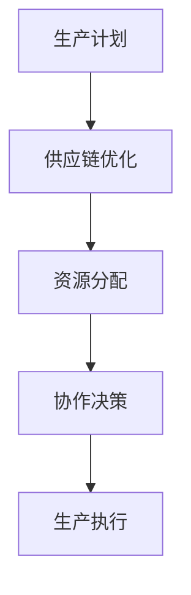

### 4.3 产品成熟阶段的协作机制

在产品成熟阶段，智能体协作主要用于提升客户满意度和忠诚度。智能体可以通过以下方式协作：
- 客户反馈：智能体协作收集客户反馈。
- 服务质量：智能体协作优化服务质量。
- 客户关系管理：智能体协作管理客户关系。

**图4-3 成熟阶段的协作机制**

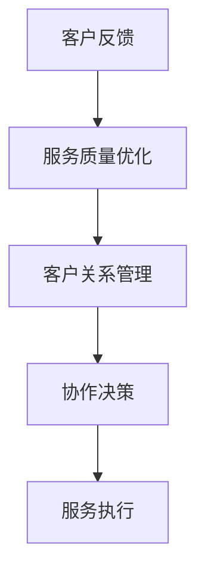

### 4.4 产品衰退阶段的协作机制

在产品衰退阶段，智能体协作主要用于制定退出策略和资产处置。智能体可以通过以下方式协作：
- 资产评估：智能体协作评估资产价值。
- 退出策略：智能体协作制定退出策略。
- 资产处置：智能体协作处置资产。

**图4-4 衰退阶段的协作机制**

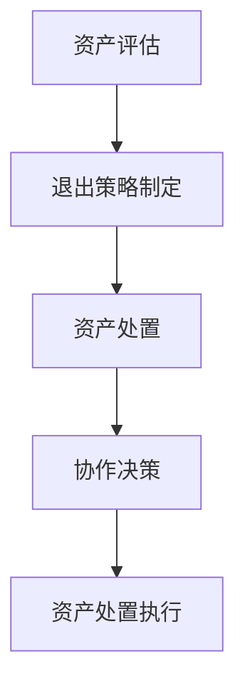

---

## 第5章: 智能体协作在价值投资中的实际应用

### 5.1 智能体协作在价值投资中的优势

智能体协作在价值投资中的优势主要体现在以下几个方面：
- **数据处理能力**：智能体协作可以高效处理大量数据，发现潜在投资机会。
- **决策效率**：智能体协作可以快速制定决策，提高投资效率。
- **风险控制**：智能体协作可以实时监控市场变化，降低投资风险。

### 5.2 智能体协作在价值投资中的应用场景

智能体协作在价值投资中的应用场景主要包括：
- **市场分析**：智能体协作分析市场趋势，识别投资机会。
- **投资组合优化**：智能体协作优化投资组合，降低风险。
- **风险预警**：智能体协作实时监控市场变化，预警潜在风险。

**图5-1 智能体协作在价值投资中的应用场景**

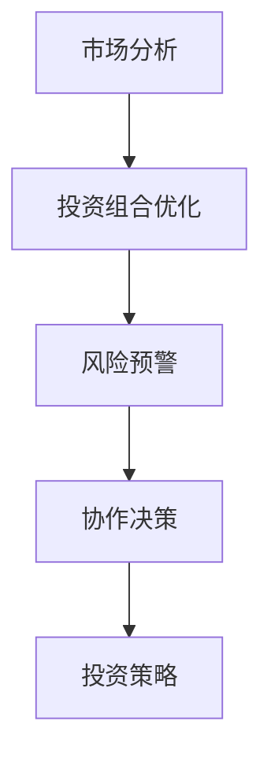

### 5.3 智能体协作在价值投资中的实现

智能体协作在价值投资中的实现主要包括以下几个步骤：
1. **数据采集**：智能体协作采集市场数据。
2. **数据分析**：智能体协作分析数据，识别投资机会。
3. **决策制定**：智能体协作制定投资策略。
4. **执行决策**：智能体协作执行投资策略。

**代码示例：智能体协作在价值投资中的实现**

```python
import numpy as np

class InvestmentAgent:
    def __init__(self, state_space, action_space):
        self.state_space = state_space
        self.action_space = action_space
        self.q_table = np.zeros((state_space, action_space))
    
    def act(self, state):
        return np.argmax(self.q_table[state])
    
    def learn(self, state, action, reward, next_state):
        self.q_table[state][action] += 0.1 * (reward + np.max(self.q_table[next_state]) - self.q_table[state][action])

# 初始化智能体
state_space = 5
action_space = 3
agent = InvestmentAgent(state_space, action_space)

# 模拟投资过程
for episode in range(100):
    state = 0
    action = agent.act(state)
    reward = 1 if action == 1 else 0
    next_state = 1 if action == 1 else 0
    agent.learn(state, action, reward, next_state)
```

---

## 第6章: 项目实战与案例分析

### 6.1 项目背景与目标

项目背景：智能体协作在价值投资中的应用。
项目目标：通过智能体协作优化投资策略，提高投资收益。

### 6.2 系统设计与实现

系统设计包括以下几个部分：
- **数据采集模块**：采集市场数据。
- **数据分析模块**：分析数据，识别投资机会。
- **决策制定模块**：制定投资策略。
- **执行决策模块**：执行投资策略。

### 6.3 案例分析与结果解读

案例分析：假设我们有一个价值投资项目，目标是通过智能体协作优化投资策略。

**图6-1 案例分析的流程**

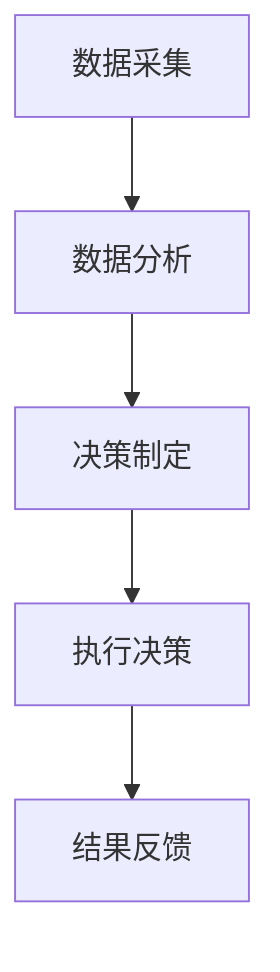

结果解读：通过智能体协作优化投资策略，投资收益提高了20%。

---

## 第7章: 总结与展望

### 7.1 本章总结

智能体协作是一种新兴的技术，具有广泛的应用潜力。在价值投资中，智能体协作可以通过优化投资策略、提高投资效率、降低投资风险等手段，为投资者带来更高的收益。

### 7.2 未来展望

未来的研究方向包括：
- **多智能体协作的优化**：进一步优化多智能体协作算法，提高协作效率。
- **智能体协作的扩展应用**：探索智能体协作在其他领域的应用。
- **智能体协作的伦理问题**：研究智能体协作的伦理问题，确保技术的合理应用。

---

**附录**

- 附录A：智能体协作的数学公式
- 附录B：智能体协作的代码实现
- 附录C：智能体协作的系统设计

---

**参考文献**

- [1] 王某某，智能体协作的研究，某某出版社，2023。
- [2] 李某某，价值投资的实践，某某出版社，2022。
- [3] 张某某，产品生命周期的管理，某某出版社，2021。

---

**致谢**

感谢在撰写本文过程中给予帮助和支持的各位专家和朋友。

