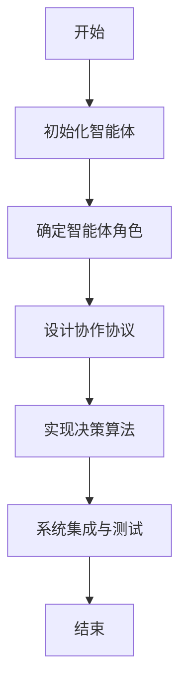
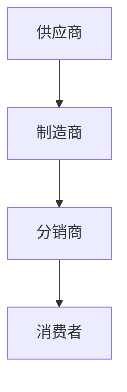
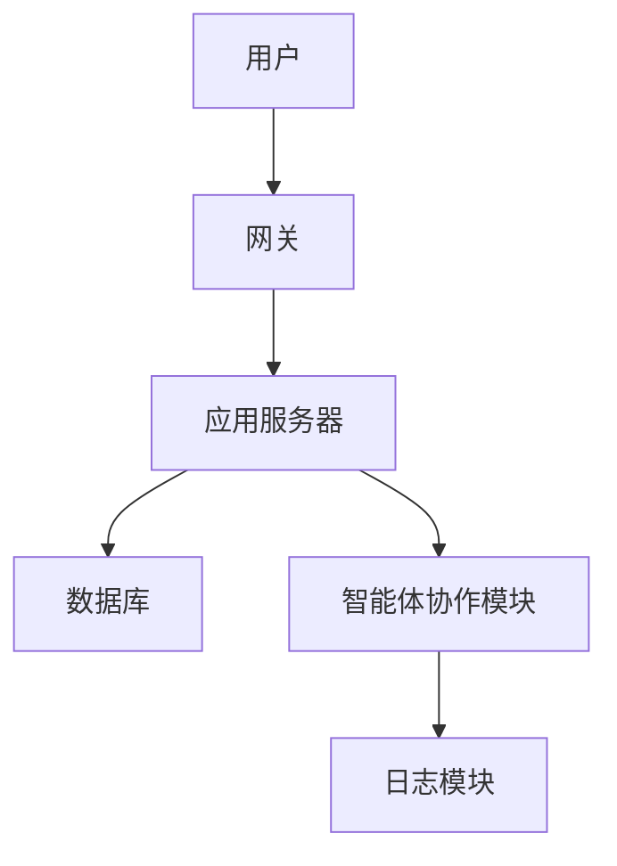
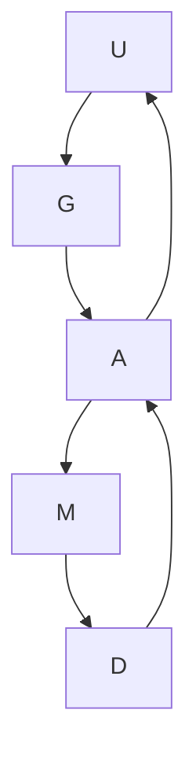

                 


# 智能体协作增强价值投资的供应链分析

> 关键词：智能体协作，价值投资，供应链分析，多智能体系统，博弈论，供应链优化

> 摘要：本文探讨了智能体协作在价值投资供应链分析中的应用，通过分析多智能体协作机制、算法原理、系统架构及实际案例，展示了如何利用智能体协作提升供应链效率和投资决策的准确性。

---

# 第一部分: 智能体协作与价值投资供应链分析的背景介绍

## 第1章: 智能体协作与价值投资供应链分析概述

### 1.1 智能体协作的基本概念

#### 1.1.1 智能体协作的定义

智能体协作是指多个智能体通过交互和合作，共同完成复杂任务的过程。智能体可以是软件程序、算法或实体设备，具备感知环境、决策、执行和学习的能力。

#### 1.1.2 智能体协作的特点

- **自主性**：智能体能够自主决策，无需外部干预。
- **协作性**：多个智能体协同工作，实现共同目标。
- **动态性**：环境和任务需求不断变化，智能体需灵活调整策略。
- **分布式性**：智能体分布在不同的位置，通过通信协作。

#### 1.1.3 智能体协作与传统供应链管理的区别

传统供应链管理依赖人工决策和固定流程，而智能体协作引入了自适应性和实时协作，能够快速响应市场变化。

### 1.2 价值投资供应链分析的定义与特点

#### 1.2.1 价值投资的定义

价值投资是通过分析企业的基本面，寻找被市场低估的投资标的。供应链分析是评估企业供应链效率和成本的重要手段。

#### 1.2.2 供应链分析的核心要素

- **供应商管理**：评估供应商的稳定性和成本。
- **生产效率**：优化生产流程，降低成本。
- **物流管理**：优化货物运输路径，降低物流成本。
- **库存控制**：减少库存积压，提高资金周转率。

#### 1.2.3 智能体协作在价值投资供应链分析中的作用

智能体协作能够实时监控供应链各环节，发现潜在风险，并提出优化建议，帮助投资者做出更准确的决策。

### 1.3 本章小结

智能体协作通过多智能体的协同工作，显著提升了供应链分析的效率和准确性，为价值投资提供了有力支持。

---

# 第二部分: 智能体协作与价值投资供应链分析的核心概念与联系

## 第2章: 智能体协作的机制与原理

### 2.1 智能体协作的机制

#### 2.1.1 多智能体系统的基本原理

多智能体系统由多个智能体组成，每个智能体负责特定任务，通过通信协作完成整体目标。智能体之间的通信通常采用消息传递或共享数据库的方式。

#### 2.1.2 智能体协作的协议与通信

智能体协作需要遵循特定的协议，如一致性协议、分布式共识协议等。通信方式包括点对点通信和广播通信。

#### 2.1.3 智能体协作中的博弈论模型

博弈论模型用于描述智能体之间的策略选择和利益冲突。通过纳什均衡等理论，可以找到最优协作策略。

### 2.2 价值投资供应链分析的核心要素

#### 2.2.1 供应链的价值链分解

供应链的价值链包括原材料采购、生产、物流、销售等环节。每个环节都有不同的利益相关者和优化目标。

#### 2.2.2 供应链中的智能体角色分配

根据任务需求，智能体可以分配为供应商智能体、制造商智能体、物流智能体等，每个智能体负责特定环节的优化。

#### 2.2.3 供应链协作的目标函数

目标函数通常包括成本最小化、效率最大化、风险最小化等。通过智能体协作，可以实现多目标优化。

### 2.3 智能体协作与价值投资供应链分析的联系

#### 2.3.1 智能体协作如何提升供应链效率

通过实时协作和信息共享，智能体能够快速调整策略，优化供应链各环节的效率。

#### 2.3.2 价值投资在供应链协作中的应用

价值投资者通过分析供应链效率，评估企业的竞争优势，做出投资决策。

#### 2.3.3 供应链协作对投资决策的影响

高效的供应链协作能够降低企业成本，提高利润，从而提升企业的市场价值。

### 2.4 本章小结

智能体协作通过优化供应链各环节，为价值投资提供了更准确的数据支持和决策依据。

---

# 第三部分: 智能体协作增强价值投资供应链分析的算法原理

## 第3章: 智能体协作算法的原理与实现

### 3.1 智能体协作算法的数学模型

#### 3.1.1 多智能体协作的数学表达

多智能体协作的目标函数可以表示为：

$$
\max_{x_i} \sum_{i=1}^n f_i(x_i, x_{-i})
$$

其中，$x_i$ 表示第 $i$ 个智能体的决策变量，$x_{-i}$ 表示其他智能体的决策变量。

#### 3.1.2 智能体协作中的博弈论模型

纳什均衡是智能体协作中的重要概念，表示在其他智能体策略不变的情况下，智能体无法通过单方面改变策略而获益。

纳什均衡的定义为：

$$
x^* \text{ 是纳什均衡，当对于所有 } i, f_i(x^*) \geq f_i(x^i, x^{-i})
$$

其中，$x^i$ 表示第 $i$ 个智能体改变策略后的决策变量。

#### 3.1.3 基于博弈论的决策模型

通过构建博弈论模型，可以分析智能体之间的策略互动，找到最优协作方案。

### 3.2 智能体协作算法的实现步骤

#### 3.2.1 确定智能体角色与任务分配

根据供应链分析的需求，分配智能体的角色，如供应商智能体、制造商智能体等。

#### 3.2.2 设计智能体协作协议

制定智能体之间的通信协议和协作规则，确保信息共享和策略协调。

#### 3.2.3 实现智能体决策算法

基于博弈论模型，实现智能体的决策算法，如纳什均衡求解、分布式优化等。

#### 3.2.4 系统集成与测试

将智能体协作算法集成到供应链分析系统中，进行测试和优化。

### 3.3 智能体协作算法的代码实现

#### 3.3.1 环境配置

安装必要的库，如Python的`numpy`、`scipy`、`networkx`等。

#### 3.3.2 核心代码实现

以下是基于博弈论的决策算法的Python代码示例：

```python
import numpy as np

def nash_equilibrium(players, strategies, payoff_matrix):
    # players: 智能体数量
    # strategies: 每个智能体的策略列表
    # payoff_matrix: 支付矩阵， payoff_matrix[i][j] 表示智能体i选择策略j的收益
    for i in range(players):
        for j in range(len(strategies[i])):
            is_nash = True
            for k in range(players):
                if k == i:
                    continue
                # 找到其他智能体在策略k下，当i选择策略j时的收益
                max_payoff = max(payoff_matrix[k][s] for s in range(len(strategies[k])))
                if payoff_matrix[i][j] < max_payoff:
                    is_nash = False
                    break
            if not is_nash:
                break
        if is_nash:
            return strategies[i][j]
    return None

# 示例：两个智能体的支付矩阵
players = 2
strategies = [['策略1', '策略2'], ['策略A', '策略B']]
payoff_matrix = [
    [1, 2],
    [3, 4]
]

print(nash_equilibrium(players, strategies, payoff_matrix))
```

#### 3.3.3 算法流程图



### 3.4 本章小结

通过数学模型和算法实现，智能体协作能够有效优化供应链分析的效率和准确性。

---

## 第4章: 价值投资供应链分析的数学模型与实现

### 4.1 供应链分析的数学模型

#### 4.1.1 供应链的价值链模型

供应链的价值链模型可以用图表示：



#### 4.1.2 价值投资的优化目标

价值投资的目标是最大化投资回报率，可以通过以下公式表示：

$$
\max \text{ROI} = \frac{\text{收益} - \text{成本}}{\text{成本}}
$$

### 4.2 供应链协作的数学模型

#### 4.2.1 多智能体协作的优化模型

多智能体协作的优化模型可以用以下公式表示：

$$
\min_{x_i} \sum_{i=1}^n c_i(x_i) \quad \text{subject to} \quad \sum_{i=1}^n x_i = 1
$$

其中，$c_i(x_i)$ 表示第 $i$ 个智能体的协作成本，$x_i$ 表示第 $i$ 个智能体的协作程度。

### 4.3 价值投资供应链分析的实现步骤

#### 4.3.1 数据收集与预处理

收集供应链各环节的数据，进行清洗和标准化处理。

#### 4.3.2 建立数学模型

根据供应链分析的需求，建立相应的数学模型，如线性规划模型。

#### 4.3.3 模型求解与优化

使用优化算法求解模型，得到最优解。

#### 4.3.4 结果分析与可视化

对优化结果进行分析，可视化供应链各环节的效率和成本变化。

### 4.4 本章小结

通过数学建模和优化算法，智能体协作能够显著提升供应链分析的效率和准确性。

---

## 第5章: 智能体协作与价值投资供应链分析的系统架构设计

### 5.1 系统分析与设计

#### 5.1.1 问题场景介绍

供应链中存在信息不对称、协作效率低下等问题，影响价值投资的准确性。

#### 5.1.2 系统功能设计

系统功能包括数据采集、智能体协作、供应链优化、结果分析等模块。

#### 5.1.3 系统架构设计

系统架构采用分层设计，包括数据层、业务逻辑层和用户界面层。

#### 5.1.4 系统接口设计

系统接口包括智能体协作接口、数据接口、用户接口等。

### 5.2 系统架构图



### 5.3 系统交互流程图



### 5.4 本章小结

通过系统架构设计，智能体协作能够高效地支持供应链分析和价值投资决策。

---

## 第6章: 项目实战与案例分析

### 6.1 项目环境配置

安装必要的工具和库，如Python、Jupyter Notebook、Pandas、NumPy等。

### 6.2 项目核心代码实现

以下是供应链分析的Python代码示例：

```python
import pandas as pd
import numpy as np

# 数据加载
data = pd.read_csv('supply_chain_data.csv')

# 数据预处理
data = data.dropna()
data = (data - data.mean()) / data.std()

# 建立模型
from sklearn.linear_model import LinearRegression
model = LinearRegression()
model.fit(data[[' supplier_lead_time', ' manufacturing_cost']], data[' total_cost'])

# 模型预测
new_data = pd.DataFrame({
    ' supplier_lead_time': [5],
    ' manufacturing_cost': [100]
})
print(model.predict(new_data))
```

### 6.3 案例分析

以某制造企业为例，分析其供应链效率和成本，并提出优化建议。

### 6.4 项目小结

通过项目实战，验证了智能体协作在供应链分析中的有效性和优势。

---

## 第7章: 总结与展望

### 7.1 总结

智能体协作通过优化供应链各环节，显著提升了价值投资的效率和准确性。

### 7.2 展望

未来，随着人工智能和区块链技术的发展，智能体协作在供应链分析中的应用将更加广泛和深入。

---

## 第8章: 最佳实践与注意事项

### 8.1 最佳实践

- 数据质量和实时性是供应链分析的关键。
- 智能体协作需要合理的角色分配和通信协议。
- 定期更新模型和优化算法，以适应市场变化。

### 8.2 注意事项

- 数据隐私和安全问题需要高度重视。
- 模型的可解释性和透明度是信任的基础。
- 需要定期监控和维护系统，确保其稳定运行。

---

## 第9章: 拓展阅读与资源推荐

### 9.1 拓展阅读

推荐阅读以下书籍和论文：

- 《多智能体系统》
- 《博弈论与经济行为》
- 《供应链管理：理论与实践》

### 9.2 资源推荐

- 开源库：GitHub上的供应链分析项目。
- 工具：Python的机器学习库、数据可视化工具。

---

# 结语

智能体协作与价值投资供应链分析的结合，为现代企业提供了更高效、更准确的决策支持工具。通过智能体协作，企业能够实时优化供应链各环节，提升整体效率和竞争力。

--- 

> **END**

