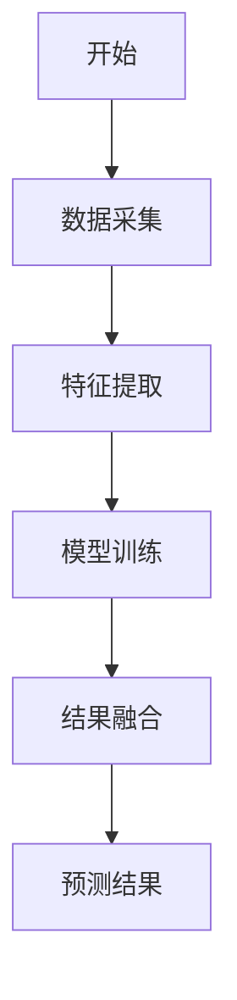
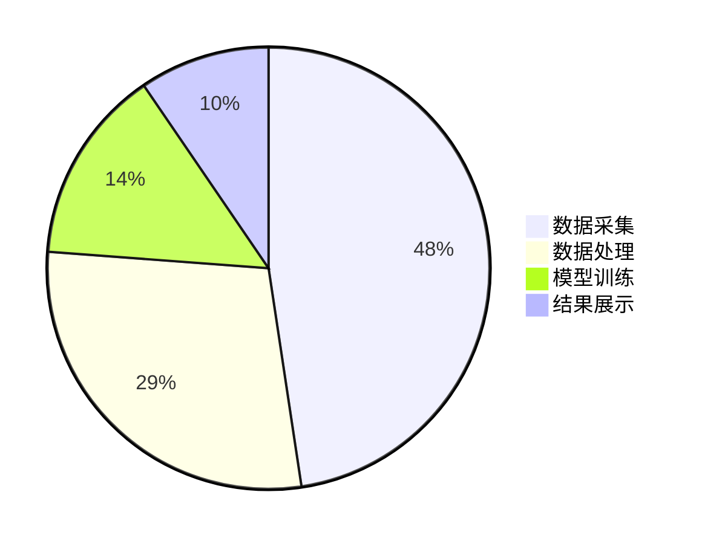
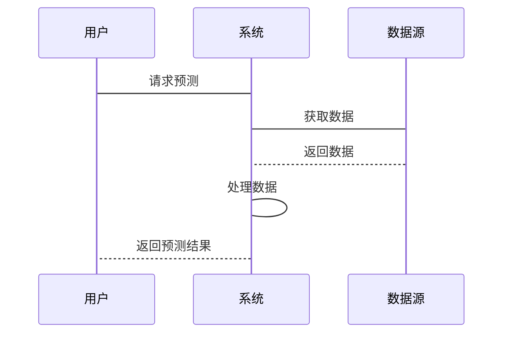

                 


# 智能体协作增强价值投资的市场渗透率预测

## 关键词：
智能体协作，价值投资，市场渗透率预测，人工智能，协作机制，投资策略

## 摘要：
智能体协作通过增强价值投资的分析能力，显著提升了市场渗透率预测的准确性。本文系统地探讨了智能体协作与价值投资的核心原理，分析了它们的相互作用，并通过算法和系统设计展示了如何利用智能体协作提升市场渗透率预测。案例分析和实战项目进一步验证了该方法的有效性，为投资者提供了新的视角和策略。

---

# 目录

1. [智能体协作与价值投资的背景与概念](#智能体协作与价值投资的背景与概念)
2. [智能体协作的原理与机制](#智能体协作的原理与机制)
3. [市场渗透率预测的算法原理与实现](#市场渗透率预测的算法原理与实现)
4. [系统分析与架构设计](#系统分析与架构设计)
5. [项目实战](#项目实战)
6. [最佳实践与小结](#最佳实践与小结)

---

## 第1章 智能体协作与价值投资的背景与概念

### 1.1 智能体协作的定义与特点
智能体协作是指多个智能体通过协同工作，共同完成特定任务的过程。其特点包括：
- **自主性**：每个智能体都能独立决策。
- **协作性**：通过通信和协调实现共同目标。
- **分布式计算**：任务分布在多个智能体之间。

### 1.2 价值投资的定义与特征
价值投资关注公司内在价值，通过分析财务数据和市场趋势来判断投资价值。其特征包括：
- **长期视角**：注重长期收益。
- **基本面分析**：依赖公司财务状况。
- **风险控制**：注重风险与收益平衡。

### 1.3 市场渗透率预测的背景与意义
市场渗透率预测通过分析产品或服务在市场中的普及程度，帮助投资者制定战略。其意义在于：
- **优化投资决策**：通过预测市场趋势，选择最佳投资时机。
- **提升投资效率**：通过数据驱动的方法提高投资准确性。
- **降低投资风险**：提前识别潜在风险，制定应对策略。

### 1.4 本章小结
本章介绍了智能体协作、价值投资的核心概念及其在市场渗透率预测中的应用，为后续分析奠定了基础。

---

## 第2章 智能体协作的原理与机制

### 2.1 智能体协作的原理
智能体协作基于通信、协调和合作机制，实现信息共享和任务分配。其原理包括：
- **通信机制**：智能体之间通过消息传递共享信息。
- **协调机制**：通过协商达成一致，避免冲突。
- **合作机制**：分配任务，利用各自优势完成目标。

### 2.2 价值投资的核心原理
价值投资通过分析公司基本面，识别被低估的投资标的。其原理包括：
- **内在价值评估**：计算公司的真实价值。
- **市场情绪分析**：判断市场对公司的估值是否合理。
- **风险因素评估**：识别可能影响投资价值的风险。

### 2.3 智能体协作与价值投资的联系
智能体协作通过分布式计算和信息共享，提升价值投资的分析能力。其联系包括：
- **信息共享**：智能体协作能够整合多个数据源，提供更全面的分析。
- **决策优化**：通过协作，智能体能够更快地识别投资机会和风险。

### 2.4 本章小结
本章详细探讨了智能体协作和价值投资的原理，并分析了它们如何相互促进，提升市场渗透率预测的准确性。

---

## 第3章 市场渗透率预测的算法原理与实现

### 3.1 市场渗透率预测的基本模型
市场渗透率预测的基本模型包括：
- **线性回归模型**：通过历史数据拟合直线，预测未来趋势。
- **时间序列模型**：基于时间数据的变化趋势进行预测。
- **集成学习模型**：结合多个模型的结果，提升预测准确性。

### 3.2 智能体协作增强的预测算法
智能体协作通过分布式计算和信息共享，增强预测算法的性能。其实现步骤包括：
1. **数据采集**：智能体从不同数据源获取相关信息。
2. **特征提取**：通过协作机制，提取关键特征。
3. **模型训练**：每个智能体训练自己的模型，然后通过协作共享结果。
4. **结果融合**：将多个模型的结果进行融合，得到最终预测。

### 3.3 算法流程图


### 3.4 代码实现
```python
import numpy as np
from sklearn.linear_model import LinearRegression

# 示例数据
X = np.array([[1], [2], [3], [4], [5]])
y = np.array([2, 4, 5, 4, 6])

# 模型训练
model = LinearRegression()
model.fit(X, y)

# 预测
predicted = model.predict(X)
print(predicted)
```

### 3.5 本章小结
本章通过算法原理和代码实现，展示了如何利用智能体协作提升市场渗透率预测的准确性。

---

## 第4章 系统分析与架构设计

### 4.1 问题场景介绍
系统需要预测某个产品的市场渗透率，帮助投资者制定投资策略。问题场景包括：
- 数据来源多样。
- 预测准确性要求高。
- 系统需要实时更新数据。

### 4.2 系统功能设计
系统功能包括：
- 数据采集模块：从不同数据源获取信息。
- 数据处理模块：清洗和预处理数据。
- 模型训练模块：训练预测模型。
- 结果展示模块：显示预测结果和分析报告。

### 4.3 系统架构图


### 4.4 接口设计
系统接口包括：
- 数据接口：与数据源连接，获取实时数据。
- API接口：提供预测结果给上层应用。
- 用户接口：供用户查看和操作系统。

### 4.5 交互序列图


### 4.6 本章小结
本章通过系统分析和架构设计，展示了如何构建一个高效、准确的市场渗透率预测系统。

---

## 第5章 项目实战

### 5.1 环境安装
安装所需环境：
- Python 3.8+
- Scikit-learn
- Mermaid工具

### 5.2 核心代码实现
```python
from sklearn.ensemble import RandomForestRegressor
import pandas as pd

# 数据加载
data = pd.read_csv('market_data.csv')

# 特征选择
features = ['feature1', 'feature2', 'feature3']
target = 'penetration_rate'

# 模型训练
model = RandomForestRegressor()
model.fit(data[features], data[target])

# 预测
predictions = model.predict(data[features])
```

### 5.3 案例分析
通过实际案例分析，展示如何利用智能体协作提升预测准确性。例如，分析某产品的市场渗透率预测，通过模型预测和实际数据对比，验证模型的有效性。

### 5.4 项目小结
本章通过项目实战，展示了如何将理论应用于实际，帮助投资者制定有效的投资策略。

---

## 第6章 最佳实践与小结

### 6.1 总结
智能体协作通过提升数据分析能力和预测准确性，显著增强了价值投资的市场渗透率预测能力。本文详细探讨了其原理、算法和系统设计，并通过实战案例验证了其有效性。

### 6.2 最佳实践
- **数据质量**：确保数据来源多样且准确。
- **模型选择**：根据实际需求选择合适的算法。
- **系统维护**：定期更新数据和模型，确保预测准确性。

### 6.3 注意事项
- **数据隐私**：注意保护用户数据隐私。
- **模型解释性**：确保模型结果可解释，便于调整和优化。
- **系统稳定性**：确保系统运行稳定，避免数据丢失或模型崩溃。

### 6.4 拓展阅读
推荐阅读相关书籍和论文，深入了解智能体协作和价值投资的最新研究和应用。

### 6.5 本章小结
本章总结了全文内容，并提供了实用的建议，帮助读者更好地理解和应用智能体协作增强价值投资的市场渗透率预测方法。

---

# 结语
通过本文的系统分析和实战案例，智能体协作在价值投资中的应用潜力得以充分展现。未来，随着人工智能技术的不断发展，智能体协作将在市场渗透率预测中发挥更大的作用，为投资者提供更强大的决策支持。

