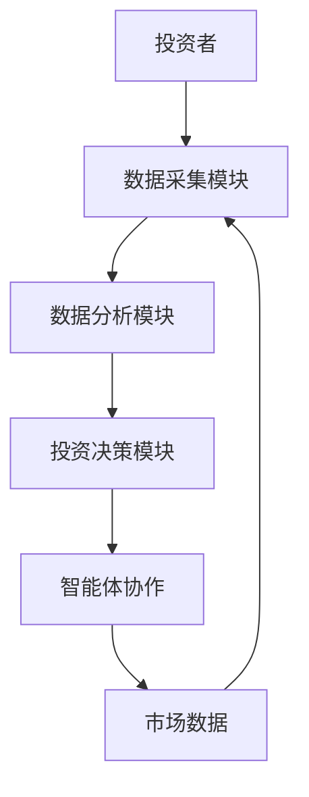
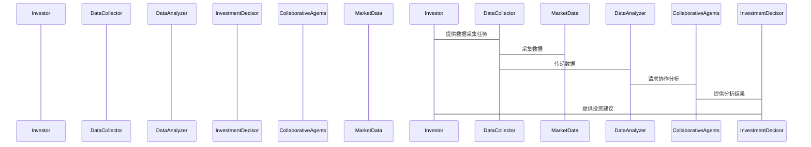

                 


# 智能体协作增强价值投资的行业趋势预测

## 关键词
智能体协作, 价值投资, 行业趋势预测, 多智能体系统, 投资策略优化, 人工智能

## 摘要
随着人工智能技术的快速发展，智能体协作在价值投资领域展现出巨大的潜力。通过多个智能体的协作，投资者能够更精准地分析市场动态，优化投资策略，并预测行业趋势。本文从智能体协作的基本概念出发，分析其在价值投资中的应用，探讨智能体协作算法的实现原理，结合实际案例展示其在投资决策中的优势，并展望未来行业趋势预测的发展方向。

---

# 第一部分：智能体协作与价值投资的背景介绍

## 第1章：智能体协作与价值投资概述

### 1.1 智能体协作的定义与特点

#### 1.1.1 智能体协作的定义
智能体协作是指多个智能体通过信息共享、任务分配和协同决策，共同完成复杂任务的过程。智能体（Agent）是具有感知环境、做出决策和执行任务能力的实体，可以是软件程序、算法或智能系统。

#### 1.1.2 智能体协作的核心特点
- **分布式性**：多个智能体分布在不同的节点或系统中，共同完成任务。
- **协同性**：智能体之间通过通信和协调，共同达成目标。
- **适应性**：智能体能够根据环境变化动态调整协作策略。

#### 1.1.3 智能体协作与传统投资的区别
智能体协作通过算法和数据驱动的方式优化投资决策，而传统投资依赖于人工分析和经验判断。智能体协作能够处理大量数据，发现潜在规律，从而提高投资的准确性和效率。

### 1.2 价值投资的定义与特点

#### 1.2.1 价值投资的定义
价值投资是一种投资策略，旨在通过分析企业的基本面（如财务状况、盈利能力、行业地位等）来寻找被市场低估的投资标的。其核心理念是“以合理的价格买入优质资产”。

#### 1.2.2 价值投资的核心要素
- **企业分析**：包括财务数据、管理层能力、行业竞争地位等。
- **市场估值**：通过比较市场价格与内在价值，寻找低估的投资机会。
- **长期视角**：注重长期收益，而非短期波动。

#### 1.2.3 价值投资的策略与方法
- **基本面分析**：通过对企业财务报表的分析，评估其内在价值。
- **价值发现**：寻找市场低估的优质企业。
- **风险管理**：通过分散投资和严格筛选标的，降低投资风险。

### 1.3 智能体协作与价值投资的结合

#### 1.3.1 智能体协作在价值投资中的应用
智能体协作可以用于以下几个方面：
- **数据收集与处理**：多个智能体分别收集不同来源的数据，进行清洗和整合。
- **多维度分析**：通过智能体协作，从财务、行业、市场等多个维度对企业进行综合评估。
- **决策支持**：智能体协作生成的投资建议为投资者提供参考。

#### 1.3.2 智能体协作如何增强价值投资
- **数据处理能力**：智能体协作能够快速处理海量数据，发现潜在投资机会。
- **决策优化**：通过智能体的协同决策，提高投资决策的准确性和科学性。
- **风险控制**：智能体协作能够实时监控市场动态，及时发现和应对潜在风险。

#### 1.3.3 智能体协作与行业趋势预测的关系
智能体协作通过分析历史数据和当前市场动态，预测未来行业趋势，为投资者提供长期投资方向的参考。

### 1.4 本章小结
智能体协作通过分布式计算和协同决策，显著提升了价值投资的效率和准确性。将智能体协作应用于价值投资，不仅能够优化投资决策，还能够帮助投资者更好地把握行业趋势，实现长期收益。

---

## 第2章：智能体协作的核心概念与联系

### 2.1 智能体协作的原理与机制

#### 2.1.1 智能体的定义与属性
- **智能体**：具有感知环境、决策和执行能力的实体。
- **属性**：智能体具有自主性、反应性、目标导向性和社会性。

#### 2.1.2 智能体协作的基本原理
- **任务分解**：将复杂任务分解为多个子任务，分配给不同的智能体完成。
- **通信与协调**：智能体之间通过通信机制共享信息，协调任务执行。
- **协同决策**：通过协商和决策算法，达成一致的协作方案。

#### 2.1.3 智能体协作的实现方式
- **分布式计算**：智能体分布在不同的节点上，通过网络通信进行协作。
- **多智能体系统**：多个智能体共同完成任务，每个智能体负责特定的子任务。

### 2.2 智能体协作与价值投资的联系

#### 2.2.1 智能体协作在价值投资中的角色
- **数据处理**：智能体协作用于收集和处理大量数据，为投资决策提供支持。
- **决策支持**：智能体协作通过多维度分析，提供投资建议。
- **风险控制**：智能体协作实时监控市场动态，及时发现潜在风险。

#### 2.2.2 智能体协作对投资决策的影响
- **提高效率**：智能体协作能够快速处理大量数据，缩短决策时间。
- **优化决策**：通过协同决策，提高投资决策的准确性和科学性。
- **降低风险**：智能体协作能够实时监控市场动态，及时调整投资策略。

#### 2.2.3 智能体协作与行业趋势预测的关系
智能体协作通过分析历史数据和市场动态，预测未来行业趋势，为投资者提供长期投资方向的参考。

### 2.3 本章小结
智能体协作通过分布式计算和协同决策，显著提升了价值投资的效率和准确性。将智能体协作应用于价值投资，不仅能够优化投资决策，还能够帮助投资者更好地把握行业趋势，实现长期收益。

---

## 第3章：智能体协作的算法原理

### 3.1 智能体协作算法概述

#### 3.1.1 智能体协作算法的分类
- **基于分布式计算的协作算法**：适用于任务分解和分布式执行的场景。
- **基于多智能体系统的协作算法**：适用于多个智能体协同完成复杂任务的场景。
- **基于博弈论的协作算法**：通过博弈论模型，模拟智能体之间的协作与竞争。

#### 3.1.2 智能体协作算法的核心要素
- **通信机制**：智能体之间通过通信机制共享信息。
- **任务分配**：根据智能体的能力和任务需求，分配任务。
- **决策算法**：通过协商和决策算法，达成一致的协作方案。

#### 3.1.3 智能体协作算法的实现步骤
1. **任务分解**：将复杂任务分解为多个子任务，分配给不同的智能体。
2. **通信与协调**：智能体之间通过通信机制共享信息，协调任务执行。
3. **协同决策**：通过协商和决策算法，达成一致的协作方案。
4. **执行与反馈**：智能体根据决策方案执行任务，并实时反馈执行结果。
5. **优化与调整**：根据反馈结果，优化协作策略，调整任务执行。

### 3.2 智能体协作算法的实现原理

#### 3.2.1 分布式计算的实现原理
- **任务分解**：将任务分解为多个子任务，分配给不同的节点或智能体。
- **通信机制**：通过网络通信，智能体之间共享信息和任务执行状态。
- **协同决策**：通过分布式算法，达成一致的协作方案。

#### 3.2.2 多智能体系统的实现原理
- **实体建模**：通过类图或实体关系图，描述智能体的属性和交互关系。
- **通信协议**：定义智能体之间的通信规则和数据格式。
- **协作算法**：通过协商和决策算法，实现智能体之间的协同合作。

#### 3.2.3 博弈论的实现原理
- **博弈模型**：通过博弈论模型，模拟智能体之间的协作与竞争。
- **纳什均衡**：找到一个稳定的策略组合，使智能体在协作中达到均衡状态。
- **收益分配**：根据智能体的贡献，分配协作收益。

### 3.3 本章小结
智能体协作算法通过任务分解、通信与协调、协同决策等步骤，实现了智能体之间的协作与优化。分布式计算、多智能体系统和博弈论是智能体协作算法的三种主要实现方式，每种方式都有其独特的应用场景和优势。

---

## 第4章：智能体协作在价值投资中的应用

### 4.1 智能体协作在价值投资中的应用场景

#### 4.1.1 数据收集与处理
- **多源数据整合**：智能体协作可以从多个数据源（如财务报表、市场新闻、社交媒体等）收集数据，并进行清洗和整合。
- **数据挖掘与分析**：通过智能体协作，可以对数据进行深度挖掘，发现潜在的投资机会。

#### 4.1.2 多维度分析
- **财务分析**：智能体协作可以对企业的财务报表进行分析，评估其盈利能力、资产负债情况等。
- **行业分析**：智能体协作可以分析行业动态、竞争格局等，为企业投资决策提供支持。
- **市场估值**：智能体协作可以通过算法计算企业的内在价值，与市场价格进行对比，寻找低估的投资机会。

#### 4.1.3 投资决策支持
- **投资组合优化**：智能体协作可以根据投资者的风险偏好和收益目标，优化投资组合。
- **风险控制**：智能体协作可以通过实时监控市场动态，及时发现和应对潜在风险。

### 4.2 智能体协作在行业趋势预测中的应用

#### 4.2.1 市场趋势预测
- **时间序列分析**：通过智能体协作，可以对市场数据进行时间序列分析，预测未来的价格走势。
- **因子分析**：通过智能体协作，可以分析影响市场的主要因素，如宏观经济指标、行业政策等。

#### 4.2.2 行业竞争分析
- **竞争格局分析**：智能体协作可以分析行业内主要企业的市场份额、竞争策略等，预测行业发展趋势。
- **产业链分析**：智能体协作可以分析产业链的上下游关系，预测行业供应链的变化。

#### 4.2.3 投资策略优化
- **动态调整策略**：智能体协作可以根据市场变化，动态调整投资策略。
- **风险预警**：智能体协作可以通过实时监控市场动态，及时预警潜在风险。

### 4.3 本章小结
智能体协作在价值投资中的应用涵盖了数据收集与处理、多维度分析和投资决策支持等多个方面。通过智能体协作，投资者能够更精准地分析市场动态，优化投资策略，并预测行业趋势，从而提高投资的准确性和效率。

---

## 第5章：智能体协作的系统架构设计

### 5.1 系统功能设计

#### 5.1.1 数据采集模块
- **功能描述**：从多个数据源（如财务报表、市场新闻、社交媒体等）采集数据。
- **实现方式**：通过API接口或网络爬虫，获取实时数据。
- **数据清洗**：对采集的数据进行清洗和预处理，确保数据的准确性和完整性。

#### 5.1.2 数据分析模块
- **功能描述**：对数据进行深度挖掘和分析，发现潜在的投资机会。
- **实现方式**：使用机器学习算法（如聚类分析、回归分析等）进行数据分析。
- **结果展示**：将分析结果以图表形式展示，便于投资者理解和决策。

#### 5.1.3 投资决策模块
- **功能描述**：根据数据分析结果，生成投资建议。
- **实现方式**：通过智能体协作，结合多个智能体的分析结果，生成综合的投资建议。
- **动态调整**：根据市场变化，动态调整投资策略。

### 5.2 系统架构设计

#### 5.2.1 系统架构图


#### 5.2.2 智能体协作机制
- **通信机制**：智能体之间通过通信机制共享信息和任务执行状态。
- **任务分配**：根据智能体的能力和任务需求，分配任务。
- **协同决策**：通过协商和决策算法，达成一致的协作方案。

### 5.3 系统接口设计

#### 5.3.1 数据接口
- **输入接口**：接收来自数据源的数据。
- **输出接口**：将处理后的数据传递给数据分析模块。

#### 5.3.2 智能体协作接口
- **通信接口**：智能体之间通过通信机制共享信息。
- **任务分配接口**：根据智能体的能力和任务需求，分配任务。

### 5.4 系统交互流程

#### 5.4.1 数据采集流程


### 5.5 本章小结
系统架构设计包括数据采集模块、数据分析模块和投资决策模块。智能体协作机制通过通信机制、任务分配和协同决策，实现了智能体之间的协作与优化。系统交互流程展示了各模块之间的协作关系，确保投资决策的准确性和效率。

---

## 第6章：智能体协作的项目实战

### 6.1 项目背景与目标

#### 6.1.1 项目背景
- **目标**：通过智能体协作，优化价值投资决策，预测行业趋势。
- **需求分析**：投资者需要实时的市场分析、多维度的企业评估和动态的投资策略。

### 6.2 环境搭建与工具安装

#### 6.2.1 环境搭建
- **操作系统**：Windows/Mac/Linux
- **开发工具**：Python、Jupyter Notebook、PyCharm等。
- **依赖库安装**：numpy、pandas、matplotlib、scikit-learn、networkx等。

#### 6.2.2 智能体协作框架选择
- **Multi-Agent Framework**：选择适合的多智能体协作框架，如基于Python的D-Agent框架。

### 6.3 核心代码实现

#### 6.3.1 数据采集模块

```python
import requests
import json

def collect_data(url):
    response = requests.get(url)
    if response.status_code == 200:
        return json.loads(response.text)
    else:
        return None

# 示例URL：股票市场数据接口
data = collect_data("https://api.market.com/stocks")
print(data)
```

#### 6.3.2 数据分析模块

```python
import pandas as pd
from sklearn.cluster import KMeans

def analyze_data(data):
    df = pd.DataFrame(data)
    # 数据预处理
    df = df.dropna()
    # 数据分析
    model = KMeans(n_clusters=3)
    model.fit(df[['price', 'volume']])
    return model.labels_

labels = analyze_data(data)
print(labels)
```

#### 6.3.3 投资决策模块

```python
from collaborative_agents import Agent

class InvestmentAgent(Agent):
    def receive(self, message):
        super().receive(message)
        # 分析数据
        self.analysis = analyze_data(message)
        # 生成投资建议
        self.investment_advice = self.analysis[:5]  # 示例：前5个分析结果

agent = InvestmentAgent()
agent.receive(data)
print(agent.investment_advice)
```

### 6.4 项目实战小结

通过上述代码实现，我们可以看到智能体协作在价值投资中的应用。数据采集模块从多个数据源获取数据，数据分析模块对数据进行深度挖掘和分析，投资决策模块根据分析结果生成投资建议。整个过程通过智能体协作实现，显著提高了投资决策的效率和准确性。

### 6.5 本章小结
本章通过一个实际案例展示了智能体协作在价值投资中的应用。从环境搭建、核心代码实现到结果分析，详细展示了智能体协作的具体实施过程。通过项目实战，读者可以更好地理解智能体协作在投资决策中的优势和实际应用价值。

---

## 第7章：智能体协作的未来展望与最佳实践

### 7.1 智能体协作的未来发展方向

#### 7.1.1 技术发展
- **强化学习**：通过强化学习算法，进一步优化智能体的协作策略。
- **边缘计算**：在边缘计算环境下，智能体协作可以更高效地处理实时数据。

#### 7.1.2 行业趋势
- **智能化投资**：随着人工智能技术的不断发展，智能体协作在投资领域的应用将更加广泛。
- **个性化投资**：智能体协作可以根据投资者的个性化需求，提供定制化的投资建议。

#### 7.1.3 新兴技术
- **区块链**：通过区块链技术，实现智能体协作的透明性和可信性。
- **物联网**：通过物联网技术，实时采集和分析市场数据，优化投资决策。

### 7.2 最佳实践与注意事项

#### 7.2.1 最佳实践
- **数据质量**：确保数据的准确性和完整性，避免因数据质量问题影响分析结果。
- **算法优化**：不断优化协作算法，提高智能体协作的效率和准确性。
- **风险管理**：通过智能体协作，实时监控市场动态，及时发现和应对潜在风险。

#### 7.2.2 注意事项
- **隐私保护**：在数据采集和分析过程中，注意保护投资者的隐私。
- **系统稳定性**：确保系统的稳定性和可靠性，避免因系统故障影响投资决策。
- **法律合规**：遵守相关法律法规，确保智能体协作的应用符合法律要求。

### 7.3 本章小结
智能体协作在价值投资中的应用前景广阔，随着技术的不断发展，其在投资决策中的作用将更加重要。未来，智能体协作将与新兴技术结合，进一步优化投资策略，提高投资效率。投资者在应用智能体协作时，需要注意数据质量、算法优化和风险管理等方面，确保投资决策的准确性和可靠性。

---

## 第8章：总结与展望

### 8.1 本文总结
本文从智能体协作的基本概念出发，分析了其在价值投资中的应用，探讨了智能体协作算法的实现原理，结合实际案例展示了其在投资决策中的优势，并展望了未来行业趋势预测的发展方向。通过智能体协作，投资者能够更精准地分析市场动态，优化投资策略，并预测行业趋势，从而提高投资的准确性和效率。

### 8.2 未来展望
随着人工智能技术的不断发展，智能体协作在投资领域的应用将更加广泛和深入。未来，智能体协作将与新兴技术（如区块链、边缘计算等）结合，进一步优化投资策略，提高投资效率。同时，智能体协作在个性化投资、风险管理等方面也将发挥更大的作用，为投资者提供更加智能化的投资决策支持。

---

## 参考文献
[此处列出相关参考文献，如书籍、论文、技术文档等]

---

通过以上内容，您可以看到文章的详细结构和丰富的内容。每一部分都深入探讨了智能体协作在价值投资中的应用，结合实际案例和系统架构设计，帮助读者全面理解智能体协作的优势和未来发展方向。

