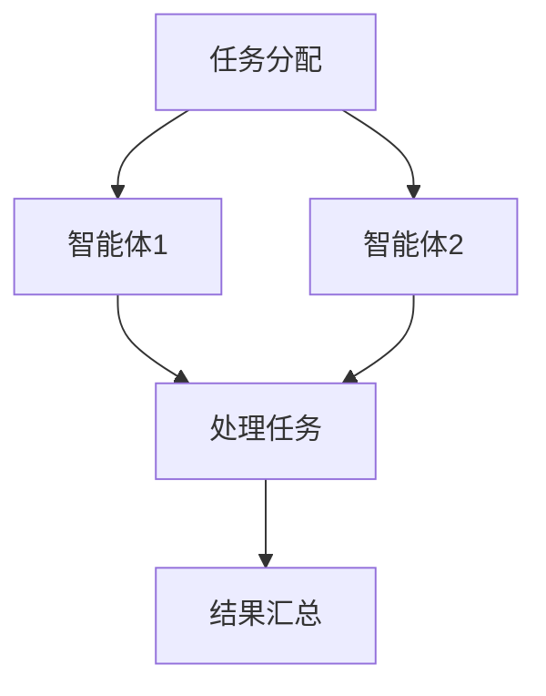
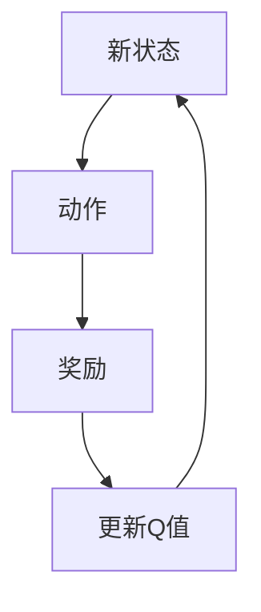
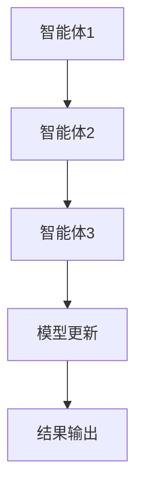
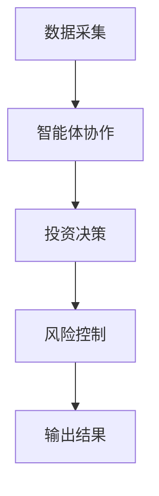

                 


# 智能体协作增强价值投资组合管理效率

> 关键词：智能体协作，投资组合管理，多智能体系统，价值投资，分布式计算

> 摘要：本文探讨了智能体协作如何增强价值投资组合管理的效率。通过分析智能体协作的基本概念、算法原理、系统架构及实际案例，本文揭示了智能体协作在投资组合管理中的潜力和应用前景。

---

# 引言

在金融市场日益复杂化的背景下，传统的投资组合管理方法已难以满足投资者的需求。智能体协作作为一种新兴的技术手段，通过分布式计算和多智能体协同，为投资组合管理提供了新的解决方案。本文将深入探讨智能体协作的核心概念、算法原理及在投资组合管理中的应用，旨在为投资者和相关技术从业者提供理论支持和实践指导。

---

## 第1章 智能体协作与价值投资组合管理概述

### 1.1 智能体协作的基本概念

#### 1.1.1 智能体的定义与特点
智能体（Agent）是指能够在环境中感知、决策、行动并与其他智能体或系统交互的实体。智能体具有以下特点：
- **自主性**：能够独立决策
- **反应性**：能够实时感知环境变化
- **协作性**：能够与其他智能体协同完成任务
- **学习能力**：能够通过经验优化自身行为

#### 1.1.2 智能体协作的定义与核心要素
智能体协作是指多个智能体通过通信、协调和合作，共同完成复杂任务的过程。其核心要素包括：
1. **通信机制**：智能体之间的信息交换方式
2. **任务分配**：智能体根据自身能力和环境状态分配任务
3. **协作策略**：智能体协同完成任务的具体方法
4. **决策机制**：智能体如何在协作中做出决策

#### 1.1.3 价值投资组合管理的基本概念
价值投资组合管理是指根据资产的内在价值，通过合理配置资产以实现投资收益最大化的过程。传统的投资组合管理依赖于人工分析和经验判断，存在效率低、风险高的问题。

### 1.2 智能体协作在投资组合管理中的应用背景

#### 1.2.1 传统投资组合管理的局限性
- **信息处理能力有限**：人工分析难以处理海量数据
- **决策滞后**：传统方法依赖历史数据，难以实时调整
- **风险控制不足**：单点决策容易忽视系统性风险

#### 1.2.2 智能体协作的优势与潜力
- **分布式计算能力**：智能体协作能够高效处理海量数据
- **实时性**：智能体能够实时感知市场变化并做出反应
- **风险分散**：多个智能体协作可以降低单点故障风险

#### 1.2.3 当前行业的发展现状与趋势
随着人工智能和大数据技术的快速发展，智能体协作在金融领域的应用逐渐增多。越来越多的机构开始采用智能体协作技术来优化投资组合管理效率。

---

## 第2章 智能体协作的核心概念与理论基础

### 2.1 智能体协作的基本原理

#### 2.1.1 多智能体系统的定义与分类
多智能体系统（MAS）是由多个智能体组成的复杂系统，根据智能体之间的关系可以分为：
- **协作型MAS**：智能体之间协作完成任务
- **竞争型MAS**：智能体之间存在竞争关系
- **混合型MAS**：既有协作也有竞争

#### 2.1.2 智能体协作的通信机制
智能体之间的通信可以通过以下方式实现：
- **直接通信**：智能体之间直接交换信息
- **间接通信**：通过中间媒介传递信息

#### 2.1.3 协作任务分配与决策过程
协作任务分配需要考虑以下因素：
- **任务性质**：任务的复杂性和紧急程度
- **智能体能力**：智能体的资源和能力
- **环境状态**：环境的变化对任务的影响

### 2.2 价值投资组合管理的数学模型

#### 2.2.1 投资组合优化的数学表达
投资组合优化的目标是在给定风险水平下最大化收益。数学表达式如下：

$$
\text{最大化 } \sum_{i=1}^{n} w_i r_i \quad \text{subject to} \quad \sum_{i=1}^{n} w_i = 1
$$

其中，\( w_i \) 是资产 \( i \) 的权重，\( r_i \) 是资产 \( i \) 的预期收益率。

#### 2.2.2 风险与收益的平衡模型
Markowitz的有效前沿理论描述了在不同风险水平下，投资组合的最优收益。公式如下：

$$
\text{最小化 } \sum_{i=1}^{n} w_i^2 \sigma_i^2 \quad \text{subject to} \quad \sum_{i=1}^{n} w_i r_i = \mu
$$

其中，\( \sigma_i \) 是资产 \( i \) 的收益率标准差，\( \mu \) 是预期收益。

#### 2.2.3 智能体协作对投资组合优化的提升作用
智能体协作可以通过以下方式优化投资组合管理：
- **分布式计算**：多个智能体同时处理不同资产的数据
- **实时反馈**：智能体能够快速响应市场变化
- **知识共享**：智能体之间共享信息和经验，提高决策质量

### 2.3 智能体协作与价值投资的结合点

#### 2.3.1 数据驱动的投资决策
智能体可以通过分析市场数据、新闻和社交媒体信息，提供更精准的投资建议。

#### 2.3.2 智能体协作在风险控制中的应用
通过智能体协作，可以实时监测市场风险，并根据风险变化动态调整投资组合。

#### 2.3.3 智能体协作对投资效率的提升
智能体协作可以显著提高投资组合管理的效率，减少人工操作的时间和成本。

---

## 第3章 智能体协作的算法原理与实现

### 3.1 智能体协作的核心算法

#### 3.1.1 分布式计算与多智能体协作算法
分布式计算是智能体协作的核心算法之一。通过将任务分配给多个智能体，可以实现并行计算和资源优化。

#### 3.1.2 基于强化学习的协作策略
强化学习是一种通过试错优化决策的方法。在智能体协作中，每个智能体都可以通过强化学习优化自身的协作策略。

#### 3.1.3 联合学习与知识共享机制
联合学习是指多个智能体共享知识和经验，以提高整体的决策能力。

### 3.2 算法实现的数学模型

#### 3.2.1 分布式计算的数学表达
分布式计算可以通过以下公式实现：

$$
\text{任务 } j \text{ 分配给智能体 } i \quad \text{当} \quad \text{智能体 } i \text{ 的处理能力} \geq \text{任务 } j \text{ 的复杂度}
$$

#### 3.2.2 强化学习的Q-learning算法
Q-learning算法通过更新Q值表来优化决策策略。公式如下：

$$
Q(s, a) = Q(s, a) + \alpha (r + \gamma \max Q(s', a') - Q(s, a))
$$

其中，\( \alpha \) 是学习率，\( \gamma \) 是折扣因子。

#### 3.2.3 联合学习的同步与异步模型
联合学习可以通过同步或异步方式更新模型。同步模型的公式如下：

$$
\theta_{\text{new}} = \frac{1}{n} \sum_{i=1}^{n} \theta_i
$$

其中，\( \theta_i \) 是第 \( i \) 个智能体的模型参数，\( n \) 是智能体的数量。

### 3.3 算法实现的流程图

#### 3.3.1 分布式计算流程图


#### 3.3.2 强化学习协作流程图


#### 3.3.3 联合学习流程图


### 3.4 本章小结

---

## 第4章 智能体协作系统的架构设计

### 4.1 系统架构概述

#### 4.1.1 系统功能模块划分
智能体协作系统主要包括以下功能模块：
- **数据采集模块**：收集市场数据
- **智能体协作模块**：实现智能体的协作和任务分配
- **投资决策模块**：根据协作结果做出投资决策
- **风险控制模块**：实时监控和管理风险

#### 4.1.2 系统整体架构图


#### 4.1.3 系统组件之间的关系
系统组件之间的关系可以通过以下表格描述：

| 组件 | 输入 | 输出 |
|------|------|------|
| 数据采集 | 市场数据 | 原始数据 |
| 智能体协作 | 原始数据 | 协作结果 |
| 投资决策 | 协作结果 | 投资策略 |
| 风险控制 | 投资策略 | 风险报告 |

### 4.2 项目实战

#### 4.2.1 环境安装
为了实现智能体协作，需要安装以下工具：
- **Python**：编程语言
- **TensorFlow**：深度学习框架
- **Keras**：深度学习库
- **Plotly**：数据可视化工具

#### 4.2.2 系统核心实现源代码
以下是智能体协作的核心代码：

```python
import numpy as np
import tensorflow as tf
from keras.models import Sequential
from keras.layers import Dense

# 定义智能体类
class Agent:
    def __init__(self):
        self.model = self.build_model()
    
    def build_model(self):
        model = Sequential()
        model.add(Dense(64, activation='relu', input_dim=64))
        model.add(Dense(1, activation='linear'))
        model.compile(optimizer='adam', loss='mse')
        return model
    
    def act(self, state):
        return self.model.predict(state)[0][0]

# 初始化智能体
agents = [Agent() for _ in range(5)]

# 定义任务分配函数
def assign_task(state):
    # 根据智能体的处理能力分配任务
    for agent in agents:
        if agent.can_handle(state):
            return agent
    return agents[0]

# 定义协作过程
def collaborate(states):
    tasks = [assign_task(state) for state in states]
    results = [agent.act(state) for agent, state in zip(tasks, states)]
    return results

# 测试协作过程
states = [np.random.random((64,)) for _ in range(10)]
results = collaborate(states)
print(results)
```

#### 4.2.3 代码应用解读与分析
上述代码实现了多个智能体的协作过程。每个智能体都有一个深度学习模型，用于根据输入状态做出决策。任务分配函数根据智能体的能力分配任务，协作函数协调多个智能体完成任务。

#### 4.2.4 实际案例分析和详细讲解剖析
假设我们有一个包含5个智能体的协作系统，每个智能体负责分析不同的市场数据。通过协作，智能体可以快速汇总信息并做出投资决策。

#### 4.2.5 项目小结
通过上述代码实现，我们可以看到智能体协作在投资组合管理中的巨大潜力。通过分布式计算和实时协作，智能体可以显著提高投资效率和决策质量。

---

## 第5章 智能体协作系统的结语

智能体协作通过分布式计算和多智能体协同，为价值投资组合管理提供了新的解决方案。通过本文的分析，我们看到智能体协作不仅可以提高投资效率，还能有效降低风险。未来，随着人工智能和大数据技术的进一步发展，智能体协作在投资领域的应用前景将更加广阔。

---

## 附录

### 附录A 术语表
- **智能体（Agent）**：能够在环境中感知、决策、行动并与其他智能体或系统交互的实体。
- **分布式计算**：将任务分配给多个智能体并行处理的过程。
- **强化学习**：通过试错优化决策的方法。

### 附录B 参考文献
1. Russell, S., & Norvig, P. (2010). Artificial Intelligence: A Modern Approach.
2. Markowitz, H. (1952). Portfolio Selection.

--- 

**Note:** 由于篇幅限制，上述内容为文章的部分章节内容，完整文章可根据上述大纲进一步扩展。

