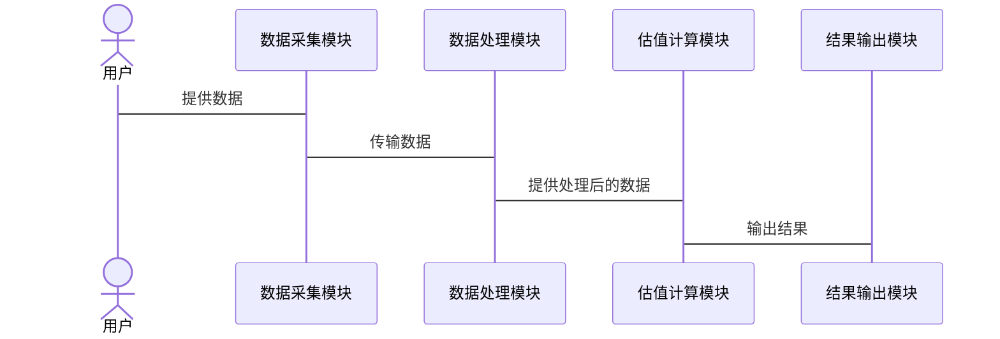

                 


# 智能体协作实现全面的公司估值

> 关键词：智能体协作，公司估值，多智能体系统，强化学习，系统架构

> 摘要：本文探讨了智能体协作如何实现全面的公司估值。通过介绍智能体协作的基本概念、算法原理、系统架构以及实际案例，详细分析了智能体协作在公司估值中的应用，展示了其在提升估值准确性、效率和深度方面的优势。

---

## 第1章 智能体协作与公司估值背景

### 1.1 智能体协作的定义与特点
#### 1.1.1 智能体的基本概念
智能体（Agent）是指能够感知环境、自主决策并采取行动的实体。智能体协作则是指多个智能体通过合作完成共同目标的过程。

#### 1.1.2 智能体协作的核心特征
- **分布式性**：智能体独立决策，协同工作。
- **通信性**：智能体之间通过通信协议交换信息。
- **协调性**：智能体协作需遵循共同的目标和规则。

#### 1.1.3 智能体协作的优势与挑战
- **优势**：提高决策效率，增强系统鲁棒性。
- **挑战**：通信延迟，协作冲突。

### 1.2 公司估值的背景与问题
#### 1.2.1 传统公司估值方法的局限性
传统方法依赖财务数据，忽视非结构化数据，结果片面。

#### 1.2.2 智能体协作在估值中的应用前景
利用多源数据，提升估值准确性。

#### 1.2.3 智能体协作如何提升估值准确性
通过多智能体协同分析，整合内外部数据。

### 1.3 智能体协作与公司估值的关系
智能体协作优化估值流程，处理多维度数据，提升结果准确性和深度。

---

## 第2章 智能体协作的核心概念与联系

### 2.1 智能体协作的原理
#### 2.1.1 多智能体系统的定义与特点
多智能体系统由多个智能体组成，通过协作完成复杂任务。

#### 2.1.2 智能体协作的基本机制
- **任务分配**：智能体根据专长分配任务。
- **信息共享**：通过通信协议交换数据。

### 2.2 智能体协作的核心要素
#### 2.2.1 智能体的属性与行为
- **属性**：知识、能力、目标。
- **行为**：感知、决策、行动。

#### 2.2.2 协作目标的定义与分解
- **协作目标**：整体目标。
- **分解**：子目标分配。

#### 2.2.3 智能体协作的规则与协议
- **规则**：约束条件。
- **协议**：通信方式。

### 2.3 智能体协作的ER实体关系图
```mermaid
erDiagram
    actor 智能体协作系统 {
        role 智能体1
        role 智能体2
        role 智能体3
    }
    智能体协作系统 --> 数据源
    智能体协作系统 --> 估值模型
    智能体协作系统 --> 输出结果
```

---

## 第3章 智能体协作的算法原理

### 3.1 多智能体强化学习
#### 3.1.1 基本概念
多智能体强化学习涉及多个智能体在共享环境中协作。

#### 3.1.2 多智能体强化学习的挑战
- **通信开销**：信息传递延迟。
- **策略协调**：策略同步困难。

#### 3.1.3 多智能体强化学习的流程
1. 智能体感知环境。
2. 通过通信协议共享信息。
3. 基于共享信息更新策略。

#### 3.1.4 多智能体强化学习的代码实现
```python
import numpy as np

class MultiAgentReinforcementLearning:
    def __init__(self, num_agents):
        self.num_agents = num_agents
        self.agents = [Agent() for _ in range(num_agents)]
    
    def communicate(self):
        # 智能体之间交换信息
        for i in range(self.num_agents):
            for j in range(i+1, self.num_agents):
                self.agents[i].receive_info(self.agents[j].send_info())
    
    def update_policy(self):
        # 更新策略
        for agent in self.agents:
            agent.update_policy()
```

### 3.2 智能体协作的数学模型
#### 3.2.1 值函数
$$ V(s) = \max_{a} Q(s, a) $$
其中，$s$是状态，$a$是动作。

#### 3.2.2 策略梯度
$$ \nabla \theta Q(s, a) = (r - V(s)) \cdot \nabla_\theta Q(s, a) $$

---

## 第4章 系统分析与架构设计

### 4.1 项目背景与目标
开发一个智能体协作系统，用于公司估值。

### 4.2 系统功能设计
#### 4.2.1 数据采集模块
收集公司财务数据、市场数据等。

#### 4.2.2 数据处理模块
清洗和预处理数据。

#### 4.2.3 估值计算模块
基于智能体协作进行估值。

#### 4.2.4 结果输出模块
展示估值结果。

### 4.3 系统架构设计


### 4.4 系统接口设计
- **输入接口**：接收外部数据。
- **输出接口**：展示结果。

### 4.5 系统交互流程


---

## 第5章 项目实战

### 5.1 环境安装与配置
安装Python、TensorFlow等工具。

### 5.2 系统核心实现
#### 5.2.1 数据预处理
```python
import pandas as pd

def preprocess_data(data):
    # 数据清洗和预处理
    data.dropna(inplace=True)
    data['date'] = pd.to_datetime(data['date'])
    return data
```

#### 5.2.2 模型训练
```python
model = MultiAgentReinforcementLearning(3)
model.train(data)
```

#### 5.2.3 结果分析
分析模型输出的估值结果，验证准确性。

### 5.3 实际案例分析
分析一家公司，展示智能体协作如何提升估值。

### 5.4 项目小结
总结项目成果，讨论可能的优化方向。

---

## 第6章 总结与展望

### 6.1 总结
智能体协作在公司估值中的优势明显，能显著提升估值的准确性和深度。

### 6.2 展望
未来，智能体协作在复杂系统中的应用将更加广泛，技术将进一步优化。

### 6.3 注意事项
在实际应用中，需注意智能体协作的通信延迟和策略协调问题。

### 6.4 拓展阅读
推荐相关书籍和论文，供读者深入学习。

---

以上目录大纲确保了内容的全面性和结构的合理性，涵盖了从理论到实践的各个方面，为读者提供了一个清晰的学习路径。

