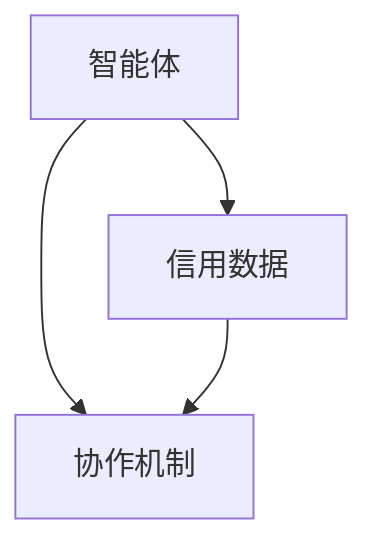
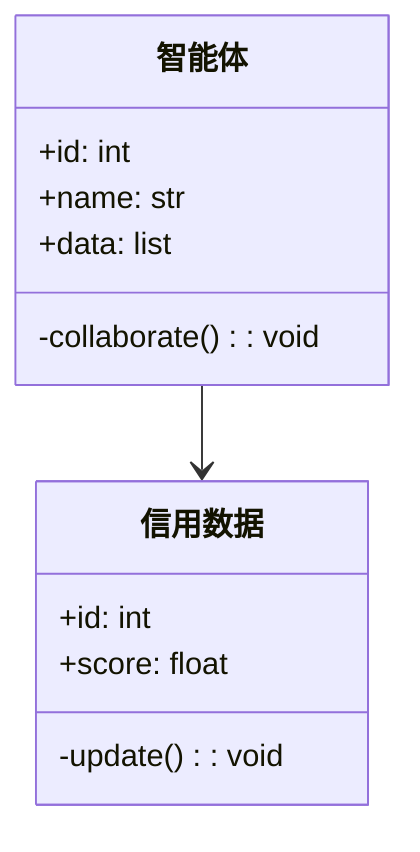
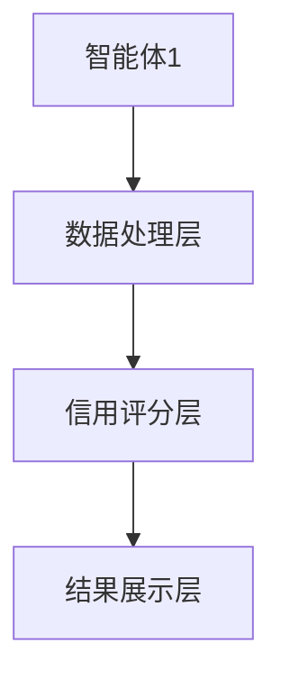
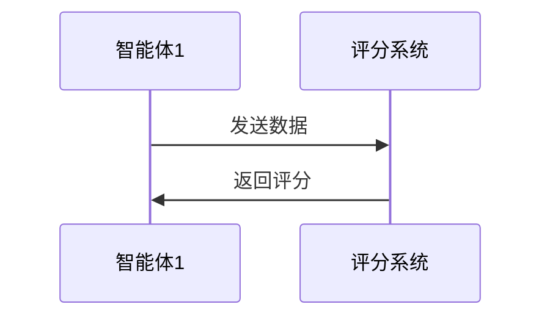

                 


# 智能体协作实现全面的公司信用评级

## 关键词
智能体协作, 公司信用评级, 分布式计算, 多智能体系统, 协作机制, 信用评估

## 摘要
本文探讨智能体协作如何优化公司信用评级过程。通过多智能体系统，企业能够更高效、准确地评估信用，解决传统方法的不足。文章结合理论与实践，分析协作机制，提供系统设计与项目实现的详细指导。

---

## 目录大纲

### 第1章：智能体协作与公司信用评级的背景介绍

#### 1.1 问题背景
- 1.1.1 传统公司信用评级的局限性
- 1.1.2 当前信用评级的主要挑战
- 1.1.3 智能体协作的引入动机

#### 1.2 问题描述
- 1.2.1 公司信用评级的核心目标
- 1.2.2 传统方法的不足
- 1.2.3 智能体协作的必要性

#### 1.3 问题解决思路
- 1.3.1 智能体协作的基本概念
- 1.3.2 协作机制的设计原则
- 1.3.3 目标与实现路径的统一

#### 1.4 边界与外延
- 1.4.1 智能体协作的适用范围
- 1.4.2 相关概念的区分
- 1.4.3 与其他协作方法的对比

#### 1.5 核心要素与概念结构
- 1.5.1 核心要素的定义
- 1.5.2 概念结构的分解
- 1.5.3 外部环境的影响

### 第2章：智能体协作的核心概念与联系

#### 2.1 智能体协作的原理
- 2.1.1 多智能体系统的定义
- 2.1.2 协作机制的分类
- 2.1.3 智能体之间的通信与协调

#### 2.2 智能体协作的核心属性对比
- 2.2.1 智能体的属性特征
- 2.2.2 信用评级的属性特征
- 2.2.3 协作机制的属性特征

#### 2.3 实体关系图（ER图）


### 第3章：智能体协作的算法原理

#### 3.1 算法概述
- 3.1.1 分布式计算的基本原理
- 3.1.2 智能体协作的算法特点

#### 3.2 协作算法的详细步骤
- 3.2.1 初始化阶段
- 3.2.2 数据收集与处理
- 3.2.3 协作计算与决策
- 3.2.4 结果反馈与优化

#### 3.3 算法实现代码
```python
def collaborate_agents(data_points):
    # 分布式计算部分
    import concurrent.futures
    with concurrent.futures.ThreadPoolExecutor() as executor:
        futures = [executor.submit(process_data, point) for point in data_points]
        for future in concurrent.futures.as_completed(futures):
            result = future.result()
            # 处理结果
    return aggregated_result
```

#### 3.4 数学模型与公式
- 协作评分公式：
$$ score = \sum_{i=1}^{n} \alpha_i x_i + \beta $$
其中，$\alpha_i$ 是权重，$x_i$ 是特征值，$\beta$ 是偏置。

### 第4章：系统分析与架构设计方案

#### 4.1 项目背景与目标
- 4.1.1 项目背景介绍
- 4.1.2 系统目标设定

#### 4.2 系统功能设计
- 4.2.1 领域模型类图


#### 4.3 系统架构设计
- 4.3.1 系统架构图


#### 4.4 系统接口设计
- 4.4.1 接口定义
- 4.4.2 交互序列图


### 第5章：项目实战与实现

#### 5.1 环境安装与配置
- 安装Python、多线程库、数据处理库

#### 5.2 核心代码实现
```python
import threading
import logging

class Agent:
    def __init__(self, id, data):
        self.id = id
        self.data = data
        self.collaborated_data = None

    def collaborate(self):
        # 分布式协作逻辑
        pass

def process_data(data):
    # 数据处理函数
    return processed_data

# 初始化多个智能体
agents = [Agent(i, generate_data(i)) for i in range(5)]
# 启动协作
for agent in agents:
    agent_thread = threading.Thread(target=agent.collaborate)
    agent_thread.start()
```

#### 5.3 实际案例分析
- 案例背景介绍
- 应用场景分析
- 分步讲解实现

### 第6章：智能体协作在信用评级中的应用与挑战

#### 6.1 应用场景分析
- 信用评分优化
- 风险控制提升

#### 6.2 挑战与解决方案
- 数据隐私保护
- 计算资源分配

#### 6.3 改进建议
- 算法优化方向
- 系统扩展建议

### 第7章：总结与展望

#### 7.1 全文总结
- 核心观点回顾
- 主要内容概括

#### 7.2 未来展望
- 新技术的应用前景
- 研究热点预测

---

通过以上目录大纲，文章将详细探讨智能体协作在公司信用评级中的应用，从理论到实践，系统地分析和实现，为读者提供全面的指导。

