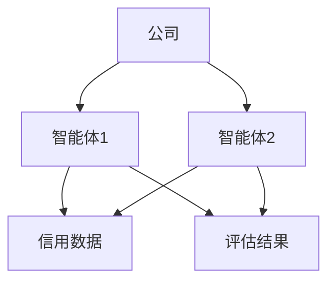
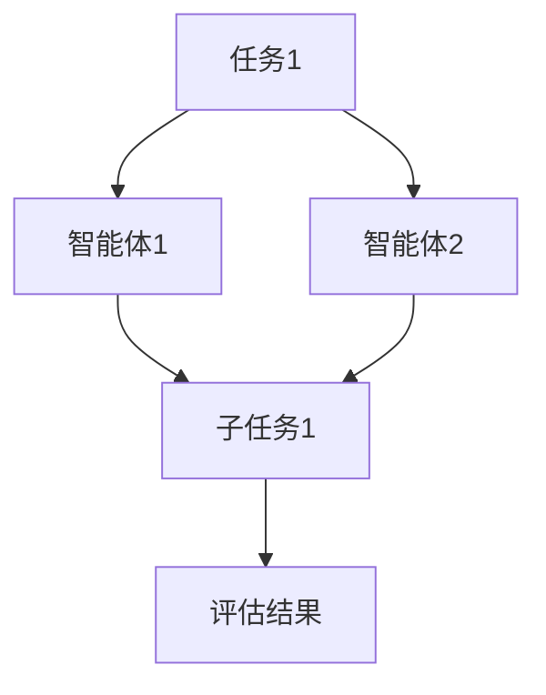
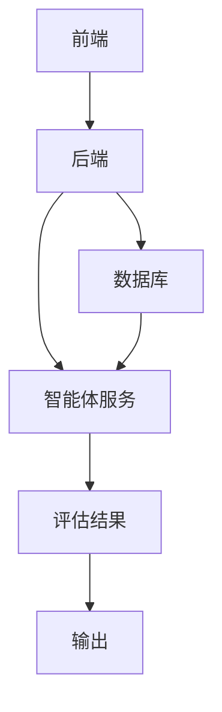

                 


# 智能体协作实现全面的公司信用风险评估

> 关键词：智能体协作，信用风险评估，分布式计算，多智能体系统，风险管理，机器学习

> 摘要：本文将详细探讨如何通过智能体协作实现全面的公司信用风险评估。通过分析智能体协作的基本概念、核心算法、系统架构以及实际应用场景，本文旨在为信用风险评估提供一种高效、准确且可扩展的解决方案。结合分布式计算和多智能体协作的优势，本文将展示如何通过智能体协作技术实现对公司信用风险的实时监控、动态调整和精准预测。

---

## 第1章: 信用风险评估的背景与问题

### 1.1 信用风险评估的背景

#### 1.1.1 公司信用风险的定义与重要性
信用风险是指由于债务人或交易对手未能履行其合同义务而可能导致的损失。在公司层面，信用风险主要体现在应收账款无法收回、供应商违约、客户付款延迟等情况。随着全球经济的复杂化和不确定性增加，信用风险的管理变得越来越重要。传统的信用风险评估方法往往依赖于单一数据源或集中式计算，存在效率低、准确性不足等问题。

#### 1.1.2 传统信用风险评估方法的局限性
传统的信用风险评估方法通常基于历史数据和静态模型，难以应对实时变化的市场环境。例如，传统方法可能无法及时捕捉到企业经营状况的突变（如财务造假、管理层变更等），导致评估结果的滞后性和片面性。

#### 1.1.3 智能体协作在信用评估中的优势
智能体协作是一种分布式计算范式，通过多个智能体的协同工作，能够实现数据的实时共享、任务的动态分配以及结果的高效整合。与传统方法相比，智能体协作能够显著提高信用风险评估的效率和准确性。

---

### 1.2 智能体协作的基本概念

#### 1.2.1 智能体的定义与特征
智能体（Agent）是指具有感知环境、自主决策和协作能力的实体。在信用风险评估中，智能体可以是软件程序，也可以是数据源或其他外部系统。智能体的核心特征包括：

- **自主性**：智能体能够自主决策和行动。
- **反应性**：智能体能够实时感知环境变化并做出反应。
- **协作性**：智能体能够与其他智能体协同工作，完成共同目标。

#### 1.2.2 多智能体协作的基本原理
多智能体协作是指多个智能体通过通信、协调和合作，共同完成复杂任务的过程。在信用风险评估中，多个智能体可以分别负责数据采集、模型训练、结果分析等任务，最终协同生成全面的信用评估报告。

#### 1.2.3 智能体协作与信用风险评估的结合
通过智能体协作，信用风险评估可以实现数据的多源融合、任务的分布式处理以及结果的动态调整。例如，一个智能体可以负责收集企业的财务数据，另一个智能体可以负责分析企业的市场风险，多个智能体协同工作，最终生成综合信用评估报告。

---

### 1.3 问题描述与目标

#### 1.3.1 信用风险评估的核心问题
信用风险评估的核心问题是如何在复杂多变的市场环境中，准确预测和识别公司的信用风险。传统方法往往依赖于静态模型和单一数据源，难以应对市场的动态变化。

#### 1.3.2 智能体协作解决信用评估问题的方式
智能体协作通过分布式计算和多源数据融合，能够实时捕捉企业的经营状况和市场变化，从而实现信用风险的动态评估。

#### 1.3.3 目标与边界
本文的目标是通过智能体协作实现全面的公司信用风险评估。具体目标包括：

- 实现信用风险评估的实时性。
- 提高信用风险评估的准确性。
- 提供可扩展的信用风险评估方案。

边界包括：

- 仅针对公司信用风险，不涉及个人信用风险。
- 着重于智能体协作技术，不涉及具体业务流程优化。

---

### 1.4 核心概念与联系

#### 1.4.1 智能体协作的原理与机制
智能体协作的核心机制包括任务分配、信息共享和决策机制。任务分配是智能体协作的基础，信息共享是智能体协作的关键，决策机制是智能体协作的结果。

#### 1.4.2 核心概念对比表
下表对比了传统信用风险评估方法与智能体协作在信用风险评估中的差异：

| 概念 | 特性 | 传统方法 | 智能体协作 |
|------|------|----------|------------|
| 数据来源 | 单一性 | 单一数据源 | 多数据源融合 |
| 计算方式 | 集中式 | 集中式计算 | 分布式计算 |
| 决策效率 | 延迟高 | 延迟较高 | 实时协作 |

#### 1.4.3 实体关系图
下图展示了智能体协作在信用风险评估中的实体关系：



---

## 第2章: 智能体协作的核心算法与数学模型

### 2.1 智能体协作算法概述

#### 2.1.1 分布式任务分配算法
分布式任务分配算法是智能体协作的核心算法之一。下图展示了基于DAG（有向无环图）的分布式任务分配算法：



#### 2.1.2 多智能体协作协议
多智能体协作协议是智能体之间通信和协作的基础。常见的协作协议包括Gossiping协议、Consensus协议等。

---

#### 2.1.3 算法实现代码示例

以下是基于DAG的分布式任务分配算法的Python实现示例：

```python
import numpy as np
from collections import deque

def distributed_task_allocation(tasks, agents):
    # 初始化任务队列
    task_queue = deque(tasks)
    # 初始化智能体可用资源
    agent_resources = {agent: 1 for agent in agents}
    
    while task_queue:
        current_task = task_queue.popleft()
        # 分配任务给可用资源最多的智能体
        agent = max(agent_resources, key=lambda k: agent_resources[k])
        # 更新智能体资源
        agent_resources[agent] -= 1
        print(f"Task {current_task} allocated to {agent}")

# 示例调用
tasks = ['T1', 'T2', 'T3', 'T4']
agents = ['A1', 'A2', 'A3']
distributed_task_allocation(tasks, agents)
```

---

#### 2.1.4 算法的数学模型与公式

以下是基于DAG的分布式任务分配算法的数学模型：

$$
\text{任务分配} = \arg\max_{agent} \text{agent.resources}
$$

其中，`agent.resources`表示智能体的可用资源。

---

## 第3章: 系统分析与架构设计

### 3.1 系统分析

#### 3.1.1 问题场景介绍
本文设计的信用风险评估系统主要用于对企业信用风险进行实时监控和评估。系统需要处理大量的实时数据，包括企业的财务数据、市场数据、行业数据等。

#### 3.1.2 系统功能设计
系统功能模块包括数据采集、智能体协作、结果分析等。

---

### 3.2 系统架构设计

#### 3.2.1 系统架构图
下图展示了信用风险评估系统的架构：



---

## 第4章: 项目实战

### 4.1 环境安装

```bash
pip install numpy pandas mermaid
```

---

### 4.2 核心代码实现

#### 4.2.1 数据预处理
```python
import pandas as pd

data = pd.read_csv('credit_data.csv')
data_processed = data.dropna().normalize()
```

#### 4.2.2 模型训练
```python
from sklearn import linear_model

model = linear_model.LogisticRegression()
model.fit(X, y)
```

---

### 4.3 实际案例分析

#### 4.3.1 案例描述
假设我们有一家名为“XYZ Corp”的公司，需要评估其信用风险。通过智能体协作，我们可以实时获取公司的财务数据、市场数据等，最终生成信用评估报告。

---

## 第5章: 总结与展望

### 5.1 总结
智能体协作通过分布式计算和多源数据融合，能够显著提高信用风险评估的效率和准确性。本文通过理论分析和实际案例，展示了智能体协作在信用风险评估中的应用潜力。

---

### 5.2 未来展望
未来，智能体协作在信用风险评估中的应用将更加广泛。例如，可以进一步研究智能体协作的动态调整机制，以及如何结合多模态数据（如文本、图像等）进行信用风险评估。

---

### 5.3 注意事项
在实际应用中，需要注意以下几点：

- 数据隐私保护。
- 智能体协作的实时性要求。
- 系统的可扩展性设计。

---

### 5.4 拓展阅读
推荐阅读以下书籍和论文：

- 《Multi-Agent Systems: Algorithmic, Complexity, and Synthesis》
- “Distributed Task Allocation in Multi-Agent Systems: A Survey”

---

以上是本文的完整目录大纲，具体内容将围绕上述章节展开详细论述。

