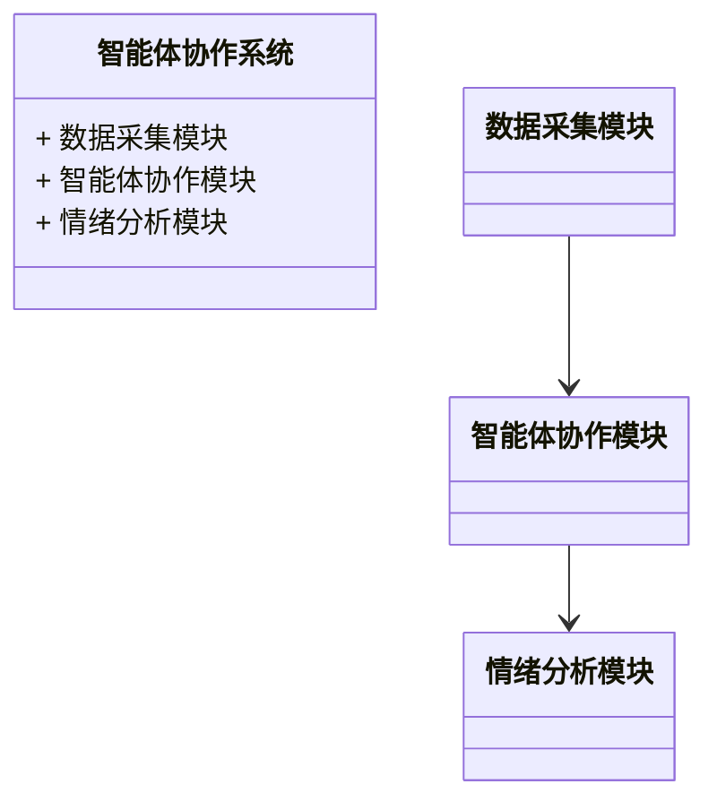

                 


# 智能体协作实现全面的市场情绪分析

---

## 关键词  
智能体协作，市场情绪分析，多智能体系统，情绪计算，分布式计算

---

## 摘要  
本文详细探讨了如何通过智能体协作实现全面的市场情绪分析。文章首先介绍了智能体协作和市场情绪分析的基本概念，接着分析了两者的关联性及应用价值。随后，从算法原理、系统架构到项目实战，逐步深入讲解了如何利用智能体协作技术来提升市场情绪分析的效率和准确性。通过实际案例分析，展示了智能体协作在市场情绪分析中的实际应用和优势。最后，本文总结了当前的研究成果，并展望了未来的发展方向。

---

## 第一部分: 智能体协作与市场情绪分析的背景

### 第1章: 智能体协作与市场情绪分析的背景

#### 1.1 智能体协作的定义与特点
智能体协作是指多个智能体通过协同工作，共同完成特定任务的过程。智能体（Agent）是一种能够感知环境、自主决策并采取行动的实体，可以是软件程序、机器人或其他智能系统。智能体协作的核心在于各智能体之间的通信、协调和合作，以实现整体目标。

**特点：**
- **自主性**：智能体能够自主决策，无需外部干预。
- **协作性**：多个智能体协同工作，共同完成任务。
- **分布式计算**：任务分布在多个智能体之间，避免单点依赖。
- **动态性**：智能体能够适应环境变化，实时调整协作策略。

#### 1.2 市场情绪分析的定义与应用
市场情绪分析是通过对市场参与者的情感、态度和意图进行分析，预测市场行为和趋势的过程。市场情绪分析广泛应用于金融、股票交易、社交媒体分析等领域。

**应用：**
- **金融投资**：通过分析市场情绪，投资者可以做出更明智的决策。
- **舆情监控**：企业通过监控市场情绪，及时调整市场策略。
- **风险管理**：识别市场情绪波动，提前采取应对措施。

#### 1.3 智能体协作与市场情绪分析的结合
智能体协作技术能够显著提升市场情绪分析的效率和准确性。通过分布式计算和多智能体协同，可以实时处理大量数据，捕捉市场情绪的细微变化。

---

### 第2章: 智能体协作的核心机制

#### 2.1 多智能体协作的基本原理
多智能体系统由多个智能体组成，通过通信协议进行信息交换，共同完成任务。核心机制包括：
- **任务分配**：根据智能体的能力和当前状态，分配任务。
- **通信协议**：定义智能体之间的信息传递格式和规则。
- **协同学习**：智能体通过共享经验，不断优化协作策略。

#### 2.2 智能体协作的实现方法
- **分布式计算**：任务分解到多个智能体，实现并行处理。
- **协同学习算法**：如分布式机器学习、联邦学习等。

---

## 第二部分: 市场情绪分析的核心技术

### 第3章: 情绪计算与文本分析
市场情绪分析的关键在于情绪计算和文本分析技术。情绪计算通过自然语言处理（NLP）技术，从文本中提取情感信息；文本分析则用于处理结构化和非结构化数据。

#### 3.1 情绪计算的基本原理
情绪计算通过分析文本中的情感特征，判断整体情绪倾向。常用方法包括：
- **情感词典**：基于预先定义的词汇和情感值，对文本进行情感评分。
- **情感分类模型**：如支持向量机（SVM）、随机森林（RF）和深度学习模型（如LSTM、Transformer）。

#### 3.2 文本分析的关键技术
- **关键词提取**：识别文本中的情感关键词。
- **情感强度分析**：量化情感的强度和方向。

---

### 第4章: 基于智能体协作的市场情绪分析算法

#### 4.1 基于图论的传播模型
图论传播模型模拟市场情绪在智能体之间的传播过程。假设每个智能体代表一个市场参与者，边权重表示信息传递的可能性。

**算法步骤：**
1. 初始化：设置初始情绪值。
2. 传播：通过边权重更新智能体的情绪值。
3. 聚合：将各智能体的情绪值进行汇总，得到整体市场情绪。

**mermaid流程图：**


---

#### 4.2 基于深度学习的情感分类模型
深度学习模型能够从大量数据中学习情感特征，提升情绪分析的准确性。

**模型结构：**
- **输入层**：处理原始文本数据。
- **嵌入层**：将文本转化为向量表示。
- **编码层**：如LSTM或Transformer，提取上下文信息。
- **输出层**：预测情绪类别。

**数学模型：**
$$ \text{预测情绪} = \arg\max_{i} p(y=i | x) $$

---

## 第三部分: 系统设计与实现

### 第5章: 系统功能设计
系统功能模块包括：
- **数据采集模块**：收集市场数据。
- **智能体协作模块**：实现多智能体协作。
- **情绪分析模块**：处理并分析情绪数据。

**mermaid类图：**



---

### 第6章: 系统架构设计

#### 6.1 系统架构图
系统采用分布式架构，多个智能体协同工作，提升处理能力。

**mermaid架构图：**


---

## 第四部分: 项目实战

### 第7章: 项目实战与案例分析

#### 7.1 环境安装
安装Python和相关库（如numpy、pandas、tensorflow）。

#### 7.2 核心代码实现

```python
import numpy as np
import tensorflow as tf

# 定义智能体协作函数
def distribute_task(data):
    # 分割数据
    n = len(data)
    chunk_size = n // 3
    chunks = [data[i:i+chunk_size] for i in range(0, n, chunk_size)]
    return chunks

# 情绪分类模型
class EmotionClassifier(tf.keras.Model):
    def __init__(self):
        super(EmotionClassifier, self).__init__()
        self.embedding = tf.keras.layers.Embedding(1000, 64)
        self.lstm = tf.keras.layers.LSTM(64)
        self.dense = tf.keras.layers.Dense(1, activation='sigmoid')

    def call(self, x):
        x = self.embedding(x)
        x = self.lstm(x)
        x = self.dense(x)
        return x

# 训练模型
model = EmotionClassifier()
model.compile(optimizer='adam', loss='binary_crossentropy', metrics=['accuracy'])
model.fit(x_train, y_train, epochs=10, batch_size=32)
```

---

#### 7.3 实际案例分析
通过具体案例分析模型的预测效果，并总结经验教训。

---

## 第五部分: 总结与展望

### 第8章: 总结与展望

#### 8.1 总结
智能体协作能够显著提升市场情绪分析的效率和准确性。通过多智能体协同和分布式计算，能够实时处理海量数据，捕捉市场情绪的细微变化。

#### 8.2 未来展望
未来的研究方向包括：
- 更高效的协作机制。
- 更先进的深度学习模型。
- 更广泛的应用场景。

---

通过本文的详细讲解，读者可以全面了解智能体协作在市场情绪分析中的应用，并掌握其实现方法和系统设计的关键点。希望本文能为相关领域的研究和实践提供有价值的参考。

