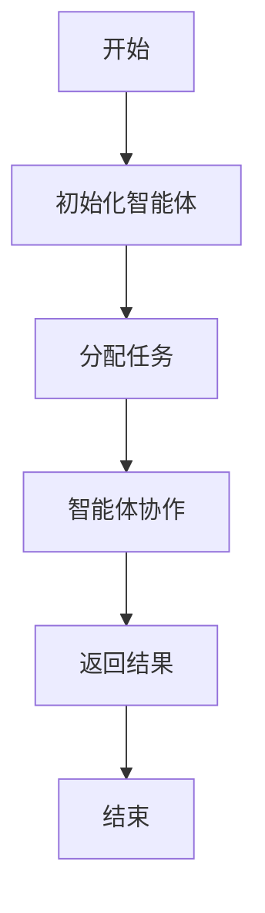
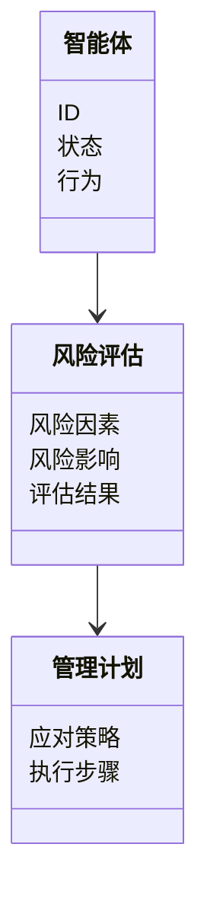

                 


# 智能体协作实现全面的风险评估与管理

## 关键词
智能体协作，风险评估，风险管理，多智能体系统，分布式计算，博弈论，系统架构

## 摘要
本文详细探讨了智能体协作在风险评估与管理中的应用。通过分析智能体协作的核心概念、算法原理、系统架构及实际案例，展示了如何利用智能体协作实现全面的风险管理。文章从背景介绍到项目实战，层层深入，为读者提供了一套完整的解决方案。

---

# 第一部分: 智能体协作与风险评估管理概述

## 第1章: 智能体协作与风险评估管理的背景

### 1.1 问题背景与挑战
#### 1.1.1 风险评估与管理的传统方法
传统风险评估方法依赖于人工分析和经验判断，存在效率低、覆盖面有限的问题。例如，企业在面临市场波动时，往往只能依赖少数专家的判断，难以覆盖所有可能的风险点。

#### 1.1.2 智能体协作的必要性
随着系统复杂性的增加，单一的专家判断难以满足需求。智能体协作通过分布式计算和多智能体协同，能够实时、全面地评估风险。

#### 1.1.3 当前风险评估与管理的痛点
- 数据分散，难以整合。
- 风险评估的实时性不足。
- 管理策略缺乏动态调整能力。

#### 1.1.4 智能体协作和风险评估的定义与特点
智能体协作：多个智能体通过通信和协调完成共同目标。特点包括自主性、反应性、协作性。
风险评估：识别、分析和量化潜在风险的过程。特点包括全面性、动态性和系统性。

### 1.2 问题描述与解决思路
#### 1.2.1 风险评估与管理中的问题描述
传统方法难以应对复杂系统的动态风险。

#### 1.2.2 智能体协作如何解决问题
通过智能体协作，实现风险的实时评估和动态管理。

#### 1.2.3 解决方案的边界与外延
- 解决方案仅关注风险评估与管理，不涉及具体业务操作。
- 外延包括智能体协作技术的引入和优化。

### 1.3 核心概念结构与组成
#### 1.3.1 智能体协作的基本结构
- 智能体：负责具体任务的执行单元。
- 通信机制：智能体之间交换信息的渠道。
- 协调机制：确保智能体协同工作的规则。

#### 1.3.2 风险评估与管理的核心要素
- 风险识别：发现潜在风险。
- 风险分析：评估风险的影响和发生概率。
- 风险应对：制定和执行应对策略。

#### 1.3.3 智能体协作与风险评估的结合方式
- 智能体协作提供数据支持。
- 风险评估为智能体协作提供决策依据。

---

## 第2章: 智能体协作与风险评估的核心概念与联系

### 2.1 核心概念原理
#### 2.1.1 智能体协作的原理
- 分布式计算：任务分解和协同完成。
- 博弈论：智能体之间的策略选择与优化。

#### 2.1.2 风险评估与管理的原理
- 数据收集与分析：识别风险因素。
- 模型构建：预测风险影响。
- 决策优化：制定应对策略。

#### 2.1.3 两者结合的机制
- 智能体协作提供数据和决策支持。
- 风险评估为智能体协作提供优化方向。

### 2.2 概念属性对比
| 概念 | 属性 | 智能体协作 | 风险评估与管理 |
|------|------|------------|----------------|
| 自主性 | 是否独立决策 | 高 | 中 |
| 反应性 | 对环境变化的响应速度 | 高 | 高 |
| 协作性 | 是否需要多单元协同 | 高 | 低 |
| 动态性 | 是否需要实时更新 | 高 | 高 |

### 2.3 ER实体关系图
```mermaid
er
  actor: 智能体
  risk_assessment: 风险评估
  management_plan: 管理计划
  relation: 协作关系
  actor -|many-to-many| relation
  risk_assessment -|one-to-many| relation
  management_plan -|one-to-one| relation
```

---

## 第3章: 智能体协作实现风险评估与管理的算法原理

### 3.1 算法原理概述
#### 3.1.1 分布式计算与多智能体协作
- 分布式计算：任务分解和并行处理。
- 多智能体协作：通过通信和协调完成共同目标。

#### 3.1.2 博弈论与决策优化
- 博弈论：分析智能体之间的策略互动。
- 决策优化：通过数学模型找到最优解。

### 3.2 算法实现
#### 3.2.1 分布式计算算法
```python
def distribute_task(tasks, agents):
    # 分配任务给各个智能体
    agent_tasks = {}
    for task in tasks:
        agent = task % len(agents)
        if agent not in agent_tasks:
            agent_tasks[agent] = []
        agent_tasks[agent].append(task)
    return agent_tasks
```

#### 3.2.2 博弈论模型
$$ \text{收益函数} = \sum_{i=1}^{n} a_i x_i $$
其中，$a_i$ 是智能体 $i$ 的收益权重，$x_i$ 是其决策变量。

### 3.3 算法流程图


---

## 第4章: 智能体协作风险评估系统的架构设计

### 4.1 系统功能设计
#### 4.1.1 领域模型


### 4.2 系统架构设计


### 4.3 系统接口设计
- 智能体协作接口：`/api/agents/collaborate`
- 风险评估接口：`/api/risk/assess`
- 管理计划接口：`/api/management/create`

---

## 第5章: 智能体协作风险评估系统的项目实战

### 5.1 环境安装
```bash
pip install -r requirements.txt
```

### 5.2 核心实现
```python
class Agent:
    def __init__(self, id):
        self.id = id
        self.state = None

    def collaborate(self, other_agents):
        # 实现协作逻辑
        pass
```

### 5.3 案例分析
- 案例背景：某企业面临市场波动。
- 实施步骤：部署智能体协作系统，实时评估风险，制定应对策略。

---

## 第6章: 总结与展望

### 6.1 核心总结
智能体协作通过分布式计算和博弈论，实现了全面的风险评估与管理。

### 6.2 最佳实践 tips
- 定期更新模型参数。
- 保持智能体协作的实时性。

### 6.3 未来展望
- 结合区块链技术，提升数据安全性。
- 引入机器学习，优化风险预测能力。

---

通过以上目录结构，您可以逐步展开每个章节的内容，深入探讨智能体协作在风险评估与管理中的具体应用和实现细节。

