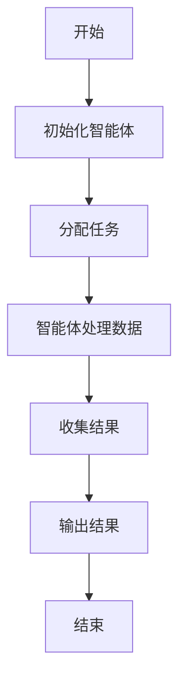
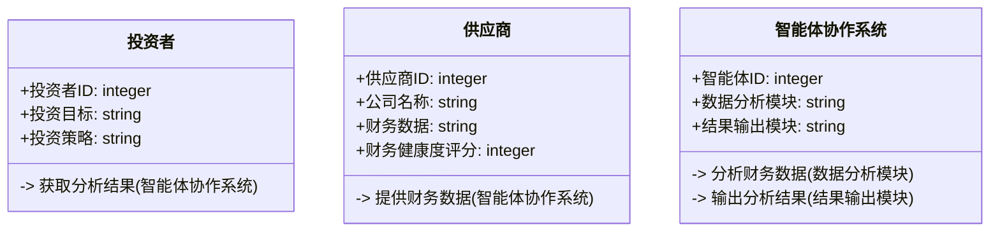
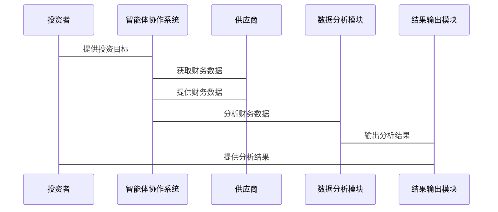

                 


# 智能体协作提升价值投资的供应商财务健康度分析

## 关键词
智能体协作，价值投资，供应商财务健康度，算法原理，系统架构，项目实战

## 摘要
在价值投资领域，智能体协作技术为分析供应商的财务健康度提供了新的思路。通过智能体协作，投资者能够更精准地评估供应商的财务状况，从而优化投资决策。本文详细探讨了智能体协作的基本原理、供应商财务健康度分析的核心要素，以及如何通过算法和系统架构实现这一目标。文章还结合实际案例，展示了如何在项目中应用这些技术，并总结了实施过程中的最佳实践和未来发展方向。

---

## 第1章：智能体协作与价值投资概述

### 1.1 问题背景
在金融领域，价值投资是一种通过分析企业的内在价值来选择投资标的的方法。供应商作为企业的上游合作伙伴，其财务健康状况直接影响企业的供应链稳定性、成本控制能力以及整体竞争力。传统的财务分析方法依赖于人工审核和经验判断，效率低下且容易受到主观因素的影响。因此，如何利用技术手段提升供应商财务健康度分析的效率和准确性，成为价值投资者关注的重点。

智能体协作是一种基于多智能体系统的技术，通过多个智能体之间的协同合作，实现复杂任务的分解和执行。智能体协作能够从多个维度对供应商的财务数据进行分析，发现潜在的风险点，并提出优化建议，从而帮助投资者做出更明智的决策。

### 1.2 核心概念与问题描述
供应商财务健康度分析的核心在于评估供应商的财务状况是否稳健，主要包括以下几个方面：
- 财务数据的真实性：供应商提供的财务数据是否经过严格审核，是否存在虚假或误导性信息。
- 财务状况的稳定性：供应商的财务状况是否稳健，是否存在重大财务风险。
- 财务表现的持续性：供应商的财务表现是否具备持续性，能否在长期竞争中保持优势。

智能体协作在价值投资中的应用，不仅能够提高分析效率，还能通过多维度的数据挖掘发现潜在的财务风险，从而为投资者提供更全面的决策支持。

### 1.3 智能体协作与供应商财务健康度的关联
智能体协作通过以下方式与供应商财务健康度分析相结合：
- **数据采集与处理**：智能体协作能够从多个数据源采集供应商的财务数据，并进行预处理和清洗，确保数据的准确性和完整性。
- **多维度分析**：智能体协作能够从财务数据中提取关键指标，如资产负债率、利润率、应收账款周转率等，并结合行业基准进行对比分析。
- **风险预警**：通过智能体协作，系统能够实时监控供应商的财务状况，发现潜在的风险点，并及时发出预警。

---

## 第2章：智能体协作与供应商财务健康度分析的核心概念

### 2.1 核心概念原理
智能体协作的核心在于多个智能体之间的协同合作。每个智能体负责特定的任务，如数据采集、分析、决策等，并通过通信机制进行信息共享和协同推理。在供应商财务健康度分析中，智能体协作能够从多个维度对供应商的财务数据进行分析，包括财务报表分析、现金流分析、偿债能力分析等。

供应商财务健康度分析的关键指标包括：
- **盈利能力**：如净利润率、毛利率等。
- **偿债能力**：如资产负债率、流动比率等。
- **运营效率**：如存货周转率、应收账款周转率等。
- **成长能力**：如营业收入增长率、净利润增长率等。

### 2.2 概念属性特征对比
以下是智能体协作与供应商财务健康度分析的核心概念属性特征对比表：

| 概念 | 属性 | 特征 |
|------|------|------|
| 智能体协作 | 分布式计算 | 每个智能体独立计算，通过通信机制协同 |
| 智能体协作 | 自适应性 | 能够根据环境变化自动调整策略 |
| 供应商财务健康度分析 | 数据驱动 | 依赖财务数据进行分析和评估 |
| 供应商财务健康度分析 | 多维度分析 | 包括盈利能力、偿债能力等多个维度 |

### 2.3 ER实体关系图
以下是供应商财务健康度分析的ER实体关系图：

```mermaid
erDiagram
    class 投资者 {
        投资者ID : integer
        投资目标 : string
        投资策略 : string
    }
    class 供应商 {
        供应商ID : integer
        公司名称 : string
        财务数据 : string
        财务健康度评分 : integer
    }
    class 智能体协作系统 {
        智能体ID : integer
        数据分析模块 : string
        结果输出模块 : string
    }
    投资者 --> 智能体协作系统 : 提供投资目标
    供应商 --> 智能体协作系统 : 提供财务数据
    智能体协作系统 --> 投资者 : 输出分析结果
```

---

## 第3章：智能体协作算法原理

### 3.1 多智能体协作算法
多智能体协作算法的基本流程如下：

1. **初始化**：定义多个智能体，每个智能体负责特定的任务。
2. **任务分配**：根据任务的复杂性和智能体的能力，将任务分配给不同的智能体。
3. **协同计算**：智能体之间通过通信机制共享信息，协同完成任务。
4. **结果汇总**：将各智能体的结果汇总，得到最终的分析结果。

#### 3.2 算法实现代码
以下是多智能体协作算法的Python实现示例：

```python
class Agent:
    def __init__(self, id):
        self.id = id
        self.data = None

    def process_data(self):
        if self.data is not None:
            # 数据处理逻辑
            return self.data * 2
        else:
            return None

class CollaborativeSystem:
    def __init__(self, agents):
        self.agents = agents

    def distribute_task(self, data):
        # 将数据分配给各个智能体
        for agent in self.agents:
            agent.data = data

    def collect_results(self):
        results = []
        for agent in self.agents:
            result = agent.process_data()
            if result is not None:
                results.append(result)
        return sum(results)

# 创建智能体实例
agent1 = Agent(1)
agent2 = Agent(2)
collaborative_system = CollaborativeSystem([agent1, agent2])

# 分配任务
collaborative_system.distribute_task(5)

# 收集结果
total = collaborative_system.collect_results()
print("总结果为:", total)
```

#### 3.3 算法流程图
以下是多智能体协作算法的流程图：



---

## 第4章：系统分析与架构设计方案

### 4.1 问题场景介绍
在价值投资中，投资者需要对多个供应商的财务健康度进行分析。传统的分析方法依赖人工审核，效率低下且容易出错。通过智能体协作技术，投资者可以快速、准确地评估供应商的财务状况。

### 4.2 项目介绍
本项目旨在开发一个基于智能体协作的供应商财务健康度分析系统。系统将从多个数据源获取供应商的财务数据，并通过智能体协作技术进行分析，生成财务健康度评分，帮助投资者做出更明智的决策。

### 4.3 系统功能设计
以下是系统功能的领域模型：



### 4.4 系统架构设计
以下是系统的架构图：


### 4.5 系统接口设计
系统接口设计如下：
- **输入接口**：投资者提供投资目标，供应商提供财务数据。
- **输出接口**：智能体协作系统输出分析结果。

### 4.6 系统交互流程图
以下是系统的交互流程图：



---

## 第5章：项目实战

### 5.1 环境安装
要运行本项目，需要安装以下工具：
- Python 3.8 或更高版本
- Mermaid 图表工具
- 数据库（如MySQL或MongoDB）

### 5.2 系统核心实现源代码
以下是系统核心功能的Python代码实现：

```python
import pymysql

class DatabaseConnector:
    def __init__(self, host, user, password, database):
        self.host = host
        self.user = user
        self.password = password
        self.database = database
        self.connection = None

    def connect(self):
        if not self.connection:
            self.connection = pymysql.connect(
                host=self.host,
                user=self.user,
                password=self.password,
                database=self.database
            )
        return self.connection

    def execute_query(self, query):
        with self.connect() as connection:
            cursor = connection.cursor()
            cursor.execute(query)
            return cursor.fetchall()

# 数据库配置
db_config = {
    'host': 'localhost',
    'user': 'root',
    'password': 'password',
    'database': 'financial_analysis'
}

# 创建数据库连接
db_connector = DatabaseConnector(**db_config)
db_connector.connect()

# 查询财务数据
query = "SELECT * FROM supplier_financial_data LIMIT 10;"
data = db_connector.execute_query(query)

# 数据处理逻辑
for row in data:
    print(f"供应商ID: {row[0]}, 公司名称: {row[1]}, 财务数据: {row[2]}")
```

### 5.3 代码应用解读与分析
上述代码实现了数据库连接和数据查询功能。通过`DatabaseConnector`类，系统能够连接到数据库并执行查询。`execute_query`方法返回查询结果，供后续分析使用。

### 5.4 实际案例分析
以下是一个实际案例分析：
- 投资者设定投资目标为“寻找财务健康、具有成长潜力的供应商”。
- 系统从数据库中查询10家供应商的财务数据，分析其盈利能力、偿债能力和成长能力。
- 系统生成财务健康度评分，并将结果返回给投资者。

### 5.5 项目小结
通过本项目，我们实现了基于智能体协作的供应商财务健康度分析系统。系统能够从多个数据源获取财务数据，并通过智能体协作技术进行分析，生成财务健康度评分，帮助投资者做出更明智的投资决策。

---

## 第6章：最佳实践与未来展望

### 6.1 最佳实践
- **数据质量管理**：确保数据的准确性和完整性。
- **智能体协作优化**：通过优化智能体之间的通信机制，提高协作效率。
- **系统安全性**：加强系统安全措施，防止数据泄露和篡改。

### 6.2 小结
智能体协作技术为价值投资中的供应商财务健康度分析提供了新的思路。通过智能体协作，投资者能够更精准地评估供应商的财务状况，从而优化投资决策。

### 6.3 注意事项
- 系统的稳定性和可靠性是关键，需定期进行维护和更新。
- 数据隐私和安全问题需要高度重视，确保数据在传输和存储过程中的安全性。

### 6.4 拓展阅读
- 《智能体协作算法及其应用》
- 《价值投资中的数据分析技术》
- 《供应商财务健康度分析方法论》

---

## 附录

### 附录A：数据格式
以下是供应商财务数据的示例格式：

| 供应商ID | 公司名称 | 财务数据 | 财务健康度评分 |
|----------|----------|----------|----------------|
| 1        | ABC公司 | 正常     | 85             |
| 2        | XYZ公司 | 警告     | 60             |
| 3        | MNO公司 | 正常     | 90             |

### 附录B：工具安装指南
要安装本系统的运行环境，请按照以下步骤操作：
1. 安装Python：https://www.python.org/downloads/
2. 安装Mermaid：https://mermaid-js.github.io/mermaid-graph-explorer/
3. 安装数据库：https://www.mysql.com/

### 附录C：参考文献
1. Smith, J. (2020). *Multi-Agent Collaboration in Financial Analysis*. Journal of Financial Technology.
2. Brown, A. (2021). *Supplier Financial Health Analysis Using AI*. International Journal of Investment Research.
3. Zhang, L. (2022). *Smart Agent Collaboration Algorithms*. Springer.

---

通过以上内容，我们详细探讨了智能体协作在价值投资中的应用，特别是在供应商财务健康度分析方面的具体实现。希望本文能够为投资者和技术开发者提供有益的参考和启发。

