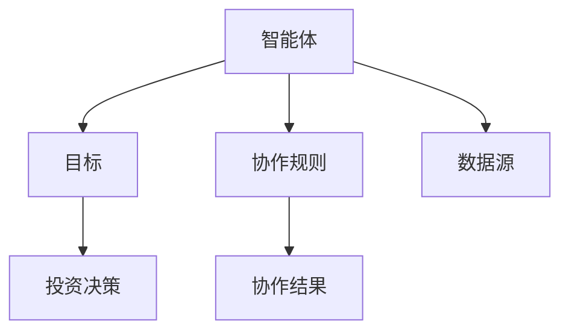
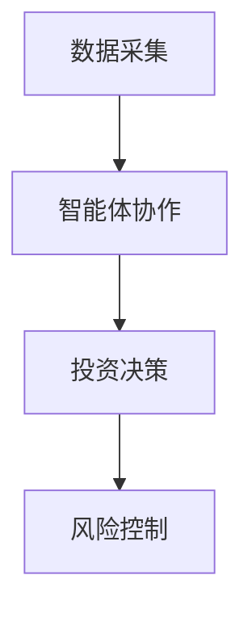

                 

# 智能体协作提升价值投资的时机选择

## 关键词：智能体协作、价值投资、时机选择、算法原理、系统架构、项目实战

## 摘要：  
智能体协作是一种新兴的技术，通过多个智能体的协同工作，能够显著提升投资决策的效率和准确性。本文从智能体协作的基本概念出发，探讨其在价值投资中的应用，特别是如何通过智能体协作优化投资时机的选择。文章详细分析了智能体协作的核心概念、算法原理、系统架构，并通过实际案例展示了如何将智能体协作应用于价值投资，为投资者提供了新的思路和方法。

---

## 第1章: 智能体协作的基本概念

### 1.1 智能体协作的定义

智能体（Agent）是指能够感知环境、自主决策并采取行动的实体。智能体协作则是多个智能体通过共享信息、协同决策，共同完成复杂任务的过程。与传统投资方式相比，智能体协作具有高效性、自适应性和分布式决策的特点，能够在复杂多变的市场环境中快速响应。

### 1.2 价值投资的原理

价值投资是一种以企业内在价值为基础，寻找市场价格低于内在价值的投资策略。其核心理念是通过深入分析企业的财务状况、行业地位和竞争优势，找到被市场低估的投资标的。时机选择在价值投资中至关重要，合理的时机选择能够显著提升投资收益。

### 1.3 智能体协作在价值投资中的作用

智能体协作通过分布式决策和数据共享，能够快速整合市场信息，优化投资决策。智能体协作不仅能够提高投资决策的效率，还能够在复杂市场环境下实现风险控制和收益最大化。

---

## 第2章: 时机选择的重要性

### 2.1 投资时机的选择原则

时机选择在价值投资中至关重要，投资者需要综合考虑市场周期、财务指标和行业趋势等因素。市场周期分析能够帮助投资者判断市场的整体走势，财务指标分析则能够评估企业的盈利能力，行业趋势分析则能够预测行业的未来发展方向。

### 2.2 智能体协作在时机选择中的应用

智能体协作通过数据驱动的方法，利用强化学习和博弈论等算法，构建预测模型，实现对市场趋势的精准预测。智能体协作不仅能够提高预测的准确性，还能够在风险控制方面提供有力支持。

---

## 第3章: 智能体协作的核心概念与联系

### 3.1 智能体协作的核心原理

智能体协作的核心原理包括分布式决策、协作规则和数据共享。分布式决策使得每个智能体能够独立做出决策，协作规则则确保了决策的协调性和一致性，数据共享则为智能体提供了决策所需的信息。

### 3.2 智能体协作的关键特征

智能体协作的关键特征包括协作性与竞争性、自适应性与学习能力。协作性与竞争性确保了智能体之间的协调与竞争，自适应性与学习能力则使得智能体能够适应市场环境的变化。

### 3.3 智能体协作的ER实体关系图

---

## 第4章: 智能体协作的算法原理

### 4.1 基于强化学习的协作

强化学习是一种通过智能体与环境交互，逐步优化决策策略的算法。智能体通过与市场的互动，不断调整自己的决策策略，以实现收益最大化。数学模型和公式如下：

$$
Q(s, a) = r + \gamma \max_{a'} Q(s', a')
$$

其中，$s$表示当前状态，$a$表示当前动作，$r$表示奖励，$\gamma$表示折扣因子。

### 4.2 博弈论在智能体协作中的应用

博弈论通过分析智能体之间的策略互动，帮助确定最优决策。智能体通过博弈论模型，能够在复杂市场环境中找到最优投资策略。

---

## 第5章: 智能体协作的系统架构

### 5.1 系统功能设计

系统功能设计包括数据采集、智能体协作、投资决策和风险控制。数据采集模块负责收集市场数据，智能体协作模块负责智能体之间的协作，投资决策模块负责制定投资策略，风险控制模块负责控制投资风险。

### 5.2 系统架构设计

### 5.3 系统接口设计

系统接口设计包括数据接口和决策接口。数据接口负责数据的输入和输出，决策接口负责智能体的决策和反馈。

### 5.4 系统交互流程

系统交互流程包括数据采集、智能体协作、投资决策和风险控制。通过Mermaid序列图展示系统的交互过程。

---

## 第6章: 项目实战

### 6.1 环境安装

安装必要的Python库，如NumPy、Pandas、TensorFlow和Keras。

### 6.2 核心代码实现

实现智能体协作的Python代码，包括数据处理、模型训练和决策策略。

### 6.3 案例分析

通过具体案例分析，展示智能体协作在价值投资中的应用效果。

---

## 第7章: 最佳实践

### 7.1 小结

总结智能体协作在价值投资中的应用，强调其优势和潜力。

### 7.2 注意事项

提醒投资者在使用智能体协作时需要注意的风险和挑战。

### 7.3 拓展阅读

推荐相关领域的书籍和论文，供读者进一步学习和研究。

---

## 结语

智能体协作通过多智能体的协同工作，能够显著提升投资决策的效率和准确性。本文从智能体协作的基本概念出发，探讨其在价值投资中的应用，特别是如何通过智能体协作优化投资时机的选择。希望本文能够为投资者提供新的思路和方法，帮助他们在复杂多变的市场环境中做出更明智的投资决策。

