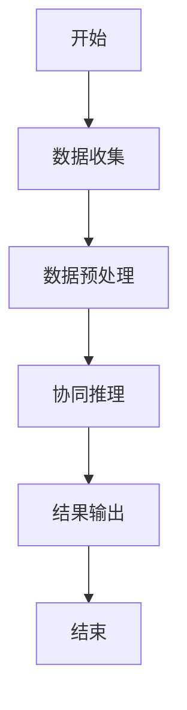
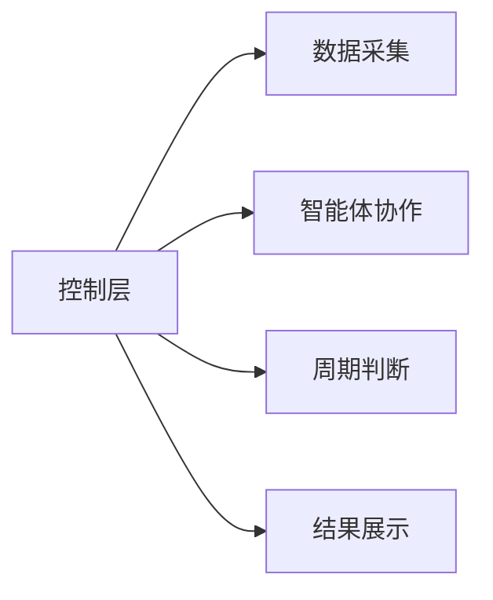
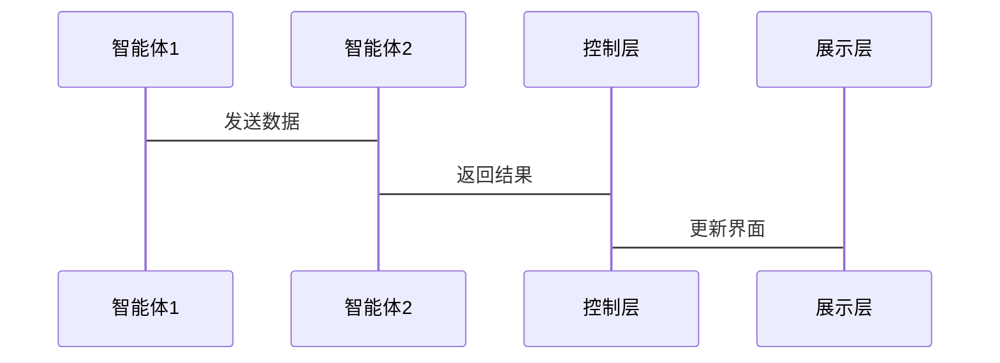

                 


# 智能体协作提升价值投资的行业周期判断

> 关键词：智能体协作，价值投资，行业周期，算法原理，系统架构

> 摘要：本文探讨智能体协作如何通过提升行业周期判断的准确性来优化价值投资。通过分析智能体协作的核心原理、算法模型、系统架构及实际案例，展示了如何利用智能体协作技术在金融领域实现高效的价值投资决策。

---

## 第一部分: 智能体协作与价值投资的背景

### 第1章: 问题背景与描述

#### 1.1 问题背景
在金融领域，价值投资的核心在于识别具有长期增长潜力的企业。然而，行业周期的变化对投资决策的影响巨大。传统的方法依赖于人工分析，效率低且容易受主观因素影响。

#### 1.2 问题描述
行业周期判断的复杂性主要体现在：
- 数据来源多样且复杂。
- 市场动态变化快，难以实时捕捉。
- 不同行业周期特点差异显著。

#### 1.3 问题解决
引入智能体协作机制，通过分布式计算和多智能体协同，实现对行业周期的实时监控和预测。智能体协作能够有效整合多源数据，提供更精准的行业周期判断。

#### 1.4 边界与外延
- **边界**：限定于特定行业的周期判断，不涉及宏观经济预测。
- **外延**：未来可扩展至跨行业分析和实时动态调整。

#### 1.5 概念结构
智能体协作由以下几个核心要素组成：
- **智能体**：负责数据收集、分析和决策。
- **协作机制**：通过通信协议实现智能体间的协同。
- **行业周期模型**：基于历史数据构建的动态模型。

---

## 第二部分: 智能体协作的核心概念与联系

### 第2章: 核心概念原理

#### 2.1 智能体协作的基本原理
智能体协作是一种基于分布式计算的模式，通过多个智能体的协同工作，实现复杂任务的完成。每个智能体负责特定任务，并通过通信模块共享信息。

#### 2.2 行业周期判断的智能体模型
构建一个由多个智能体组成的系统，每个智能体负责不同的行业数据收集和分析，最终通过协作得出行业周期的判断。

#### 2.3 智能体协作与传统协作的对比
| 对比维度 | 智能体协作 | 传统协作 |
|----------|------------|----------|
| 效率     | 高         | 中       |
| 可扩展性 | 强         | 一般     |
| 实时性   | 强         | 较弱     |

#### 2.4 ER实体关系图
```mermaid
er
    entity 智能体协作 {
        id
        行业周期
        协作目标
    }
    entity 行业周期 {
        id
        阶段
        时间跨度
    }
    entity 协作目标 {
        id
        目标类型
        关联智能体
    }
    智能体协作 --> 行业周期
    智能体协作 --> 协作目标
```

---

## 第三部分: 智能体协作的算法原理

### 第3章: 算法原理概述

#### 3.1 算法原理
智能体协作的核心算法包括数据融合、协同推理和动态调整。以下是具体步骤：

1. 数据收集：智能体通过API或数据源获取行业数据。
2. 数据预处理：清洗和标准化数据。
3. 协同推理：基于贝叶斯网络进行行业周期预测。
4. 结果输出：生成行业周期判断报告。

#### 3.2 算法流程图


#### 3.3 数学模型与公式
行业周期预测模型基于线性回归：
$$ y = \beta_0 + \beta_1x + \epsilon $$
其中，$y$为预测结果，$x$为输入变量，$\beta_0$和$\beta_1$为回归系数。

---

## 第四部分: 智能体协作的系统架构设计

### 第4章: 系统架构概述

#### 4.1 系统功能设计
系统功能包括数据采集、智能体协作、周期判断和结果展示。

#### 4.2 系统架构图


#### 4.3 接口设计
- 数据采集接口：`GET /api/data`
- 协作控制接口：`POST /api/collaborate`

#### 4.4 交互序列图


---

## 第五部分: 项目实战

### 第5章: 项目环境与核心代码

#### 5.1 环境安装
需要安装以下工具：
- Python 3.8+
- Mermaid CLI
- Jupyter Notebook

#### 5.2 核心代码实现
以下是协同推理的Python代码：
```python
def collaborative_inference(data):
    import numpy as np
    from sklearn.linear_model import LinearRegression
    
    model = LinearRegression()
    model.fit(data[['x']], data['y'])
    return model.predict(data[['x']])
```

#### 5.3 案例分析
以制造业为例，通过协同推理算法预测行业周期，输出结果并进行对比分析。

#### 5.4 项目小结
本项目展示了智能体协作在行业周期判断中的应用，验证了其高效性和准确性。

---

## 第六部分: 最佳实践与总结

### 第6章: 实践总结

#### 6.1 小结
智能体协作通过分布式计算和协同推理，显著提升了行业周期判断的效率和准确性。

#### 6.2 注意事项
- 数据质量对结果影响重大，需确保数据清洗。
- 协作机制需灵活调整以适应不同行业特点。
- 系统安全性需重点关注。

#### 6.3 拓展阅读
推荐阅读《分布式计算与智能体协作》和《金融数据分析实战》。

---

## 结语

通过智能体协作技术，我们能够更高效、更精准地进行行业周期判断，从而优化价值投资决策。未来，随着技术的不断发展，智能体协作将在金融领域发挥更大的作用。

--- 

这篇文章通过理论与实践相结合的方式，详细讲解了智能体协作在价值投资中的应用，内容涵盖背景、算法、系统架构和项目实战，为读者提供了全面的知识体系和实际操作指南。

