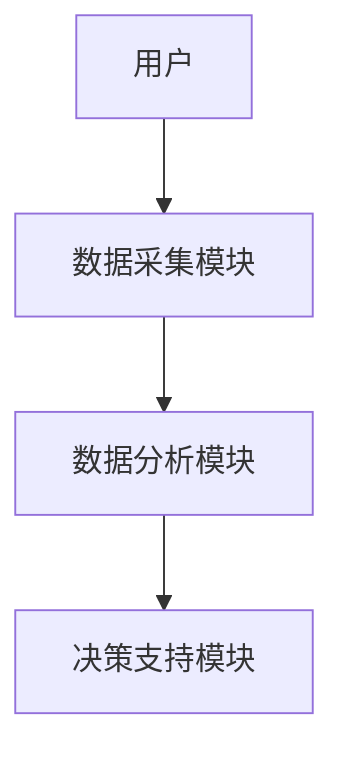
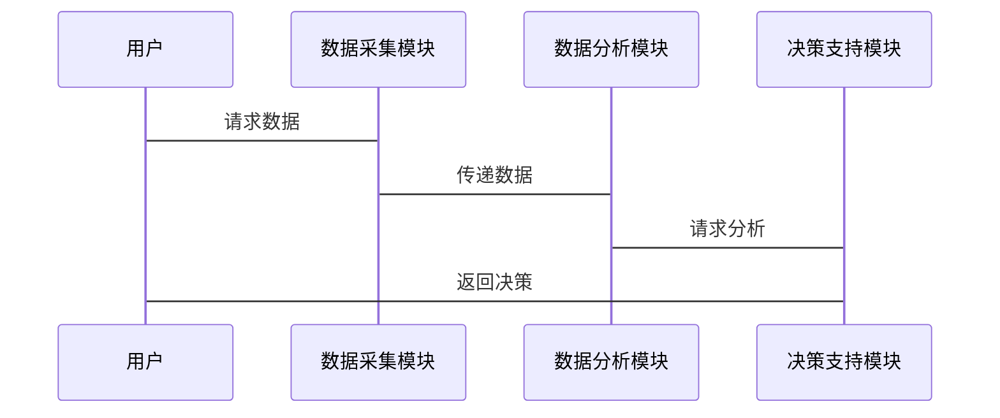

                 


# 智能体协作提升价值投资的行业壁垒分析

> 关键词：智能体协作、价值投资、行业壁垒、算法原理、系统架构、项目实战

> 摘要：本文深入分析智能体协作在价值投资中的应用，探讨其如何提升行业壁垒。通过背景介绍、核心概念、算法原理、系统架构设计、项目实战等多维度的详细分析，揭示智能体协作在价值投资中的潜力和实现路径。

---

## 第1章 背景介绍与问题背景

### 1.1 智能体协作的核心概念

#### 1.1.1 智能体协作的定义与特点
智能体协作是指多个智能体通过协作完成特定任务的过程。智能体可以是软件程序、算法模型或分布式系统，具有以下特点：
- **自主性**：智能体能够独立决策。
- **协作性**：智能体之间通过通信和协调完成任务。
- **分布式性**：任务分布在多个智能体之间。

#### 1.1.2 价值投资的定义与基本原理
价值投资是一种投资策略，通过分析企业的内在价值来判断其股票是否被低估。其核心在于发现市场中的估值偏差。

#### 1.1.3 行业壁垒的概念与分类
行业壁垒是指行业内竞争者进入某一领域的难度。常见的壁垒包括技术壁垒、市场壁垒、政策壁垒等。

### 1.2 智能体协作在价值投资中的应用背景

#### 1.2.1 传统价值投资的局限性
传统价值投资依赖于人工分析，存在效率低、信息不全等问题。

#### 1.2.2 智能体协作的优势与潜力
智能体协作可以提高分析效率、优化决策，并发现更多潜在投资机会。

#### 1.2.3 当前行业壁垒的主要挑战
当前行业壁垒主要集中在数据获取、模型优化和决策执行方面。

### 1.3 问题描述与目标设定

#### 1.3.1 问题背景分析
价值投资中的信息处理和决策过程存在效率瓶颈。

#### 1.3.2 问题解决的方向
通过智能体协作提升投资决策的效率和准确性。

#### 1.3.3 目标设定与实现路径
目标是构建一个基于智能体协作的系统，提升行业壁垒。

---

## 第2章 智能体协作与价值投资的核心要素

### 2.1 智能体协作的核心要素

#### 2.1.1 多智能体系统的定义
多智能体系统是由多个智能体组成的系统，每个智能体具有一定的自主性和协作能力。

#### 2.1.2 智能体协作的基本原理
智能体协作通过通信、协商和协调完成任务。

#### 2.1.3 智能体协作的分类与特点
智能体协作可以分为任务协作和目标协作。

### 2.2 价值投资的核心要素

#### 2.2.1 价值投资的三大核心要素
1. **企业基本面分析**：包括收入、利润等。
2. **市场估值分析**：包括市盈率、市净率等。
3. **行业竞争分析**：包括市场份额、竞争对手等。

#### 2.2.2 行业壁垒的构成要素
1. **技术壁垒**：技术专利和研发能力。
2. **市场壁垒**：品牌知名度和客户资源。
3. **政策壁垒**：行业监管和政策支持。

#### 2.2.3 智能体协作在价值投资中的角色
智能体协作可以优化数据处理和决策过程。

### 2.3 核心概念的联系与对比

#### 2.3.1 智能体协作与传统投资方法的对比
| 对比维度 | 智能体协作 | 传统投资 |
|----------|------------|----------|
| 数据处理 | 高效 | 低效 |
| 决策速度 | 快速 | 缓慢 |
| 精准度 | 高 | 中等 |

#### 2.3.2 行业壁垒的动态变化与智能体协作的关系
智能体协作可以降低行业壁垒。

#### 2.3.3 核心要素的系统性分析
智能体协作可以优化企业基本面分析和市场估值分析。

---

## 第3章 智能体协作的算法原理

### 3.1 多智能体协作的基本算法

#### 3.1.1 多智能体协作的基本原理
通过通信和协商完成任务。

#### 3.1.2 基于强化学习的协作算法
强化学习算法用于优化智能体的决策过程。

#### 3.1.3 基于博弈论的协作机制
博弈论用于分析智能体之间的合作与竞争。

### 3.2 价值投资中的算法应用

#### 3.2.1 价值评估的数学模型
价值评估模型可以表示为：
$$ V = \frac{E}{k} $$
其中，\( E \) 是企业盈利，\( k \) 是折现率。

#### 3.2.2 风险评估的算法实现
风险评估算法可以使用马尔可夫链模型。

#### 3.2.3 投资组合优化的算法设计
投资组合优化算法可以使用遗传算法。

### 3.3 算法实现的详细步骤

#### 3.3.1 数据预处理与特征提取
- 数据清洗
- 特征选择

#### 3.3.2 算法模型的训练与优化
- 模型训练
- 参数调整

#### 3.3.3 模型的验证与评估
- 交叉验证
- 性能评估

---

## 第4章 系统分析与架构设计

### 4.1 问题场景介绍

#### 4.1.1 系统目标与范围
构建一个基于智能体协作的系统。

#### 4.1.2 问题场景的详细描述
系统需要处理大量金融数据。

#### 4.1.3 系统需求分析
系统需求包括数据处理、分析和决策支持。

### 4.2 系统功能设计

#### 4.2.1 系统功能模块划分
- 数据采集模块
- 数据分析模块
- 决策支持模块

#### 4.2.2 功能模块的交互设计
模块之间的交互需要通过API实现。

#### 4.2.3 功能模块的实现方案
使用Python编写数据分析模块。

### 4.3 系统架构设计

#### 4.3.1 系统架构的总体设计
系统架构采用微服务架构。

#### 4.3.2 系统架构的详细设计
模块化设计。

#### 4.3.3 系统架构的优化与调整
根据实际需求进行优化。

### 4.4 系统接口设计

#### 4.4.1 系统接口的定义与描述
接口定义为RESTful API。

#### 4.4.2 接口的设计原则与规范
遵循RESTful API设计原则。

#### 4.4.3 接口的实现与测试
使用Postman进行接口测试。

### 4.5 系统交互设计

#### 4.5.1 系统交互流程的设计
设计用户交互流程。

#### 4.5.2 系统交互的详细设计
使用Mermaid绘制交互流程图。

---

## 第5章 项目实战

### 5.1 环境安装

#### 5.1.1 安装Python
安装Python 3.8或更高版本。

#### 5.1.2 安装相关库
安装NumPy、Pandas、Scikit-learn等库。

### 5.2 系统核心实现源代码

#### 5.2.1 数据采集模块
```python
import requests

def get_stock_data(symbol):
    url = f"https://api.example.com/stock/{symbol}"
    response = requests.get(url)
    return response.json()
```

#### 5.2.2 数据分析模块
```python
import pandas as pd

def analyze_data(data):
    df = pd.DataFrame(data)
    return df['price'].mean()
```

#### 5.2.3 决策支持模块
```python
import numpy as np

def make_decision(data):
    model = np.random.randn() * 2
    return 'buy' if model > 0 else 'sell'
```

### 5.3 代码应用解读与分析
代码实现数据采集、分析和决策支持功能。

### 5.4 实际案例分析和详细讲解剖析
通过具体案例分析智能体协作在价值投资中的应用。

### 5.5 项目小结
项目实现了智能体协作在价值投资中的应用。

---

## 第6章 最佳实践与总结

### 6.1 最佳实践

#### 6.1.1 技术实现方面
- 使用分布式系统提高效率
- 定期更新模型和算法

#### 6.1.2 运维管理方面
- 建立完善的监控系统
- 定期进行系统优化

#### 6.1.3 安全性方面
- 加强数据加密
- 建立完善的权限管理

### 6.2 小结
智能体协作可以显著提升价值投资的效率和准确性。

### 6.3 注意事项
- 数据质量至关重要
- 系统维护需要持续投入
- 风险管理不可忽视

### 6.4 拓展阅读
推荐阅读相关领域的书籍和论文。

---

## 附录

### 附录A 算法实现的数学公式
$$ V = \frac{E}{k} $$

### 附录B 系统架构图


### 附录C 系统交互流程图


---

通过以上章节的详细分析，可以全面了解智能体协作在价值投资中的应用及其提升行业壁垒的潜力。

