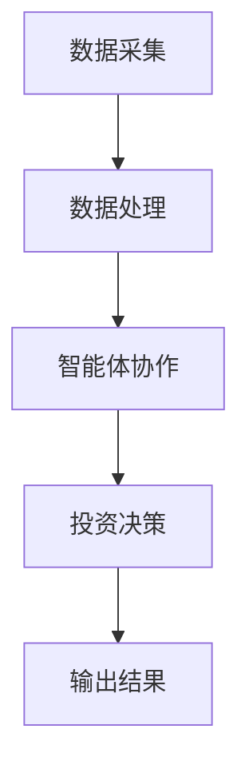
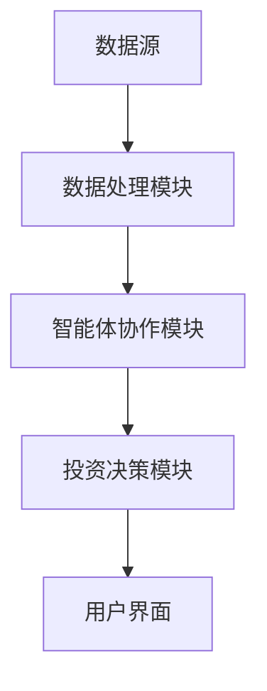
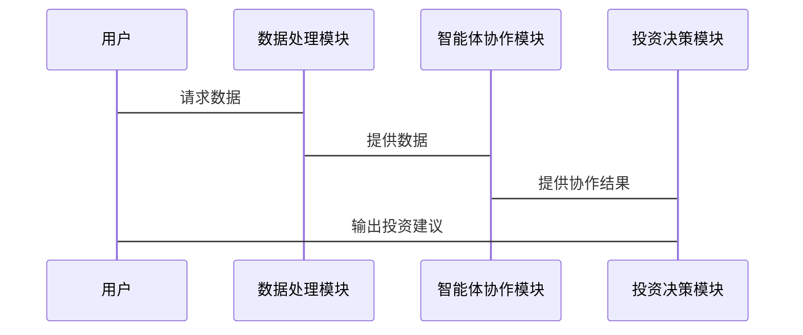

                 


好的，我现在将按照您的要求撰写一篇关于《智能体协作提高价值投资的全球宏观经济周期分析》的技术博客文章。我将逐步分析和推理，确保内容详尽且符合您的要求。

---

# 智能体协作提高价值投资的全球宏观经济周期分析

## 关键词：
智能体协作、价值投资、宏观经济周期、算法原理、系统架构

## 摘要：
本文探讨智能体协作在价值投资中的应用，重点分析其如何通过提高对全球宏观经济周期的预测和分析能力，从而优化投资决策。文章从背景介绍、核心概念、算法原理、系统架构、项目实战到最佳实践，全面解析智能体协作在价值投资中的理论基础和实际应用，为读者提供深度的分析和见解。

---

## 第1章：智能体协作与价值投资概述

### 1.1 智能体协作的背景与意义
智能体协作是一种基于多智能体系统（Multi-Agent System, MAS）的协作机制，通过多个智能体之间的交互与合作，共同完成复杂任务。在金融领域，智能体协作能够帮助投资者更高效地分析市场信息、识别投资机会，并优化投资组合。

#### 1.1.1 智能体协作的定义与特点
- **定义**：智能体协作是指多个智能体通过信息共享和任务分配，协同完成特定目标的过程。
- **特点**：
  - 分布式：智能体之间通过分布式计算进行协作。
  - 协作性：智能体之间通过通信和协商实现协作。
  - 自适应性：智能体能够根据环境变化动态调整协作策略。

#### 1.1.2 价值投资的基本原理
价值投资是一种投资策略，通过分析企业的基本面（如财务状况、行业地位等）来判断其内在价值，并在市场价格低于内在价值时进行投资。

#### 1.1.3 全球宏观经济周期的定义与特征
- **定义**：宏观经济周期是指经济整体从繁荣到衰退再到复苏的周期性波动。
- **特征**：
  - 扩张期：经济增长、就业率上升、物价稳定。
  - 衰退期：经济增长放缓、失业率上升、企业盈利下降。
  - 复苏期：经济逐渐恢复，市场信心回升。

### 1.2 智能体协作在价值投资中的作用
智能体协作能够通过以下方式提升价值投资的效率和准确性：
- **信息整合**：智能体通过分布式计算整合市场数据、企业基本面信息等，为投资者提供更全面的决策支持。
- **风险分散**：通过智能体协作，投资者可以分散投资风险，避免单一决策的失误。
- **动态调整**：智能体能够根据宏观经济周期的变化，实时调整投资策略。

---

## 第2章：智能体协作的核心概念与联系

### 2.1 智能体协作的核心原理
智能体协作的核心在于通过多个智能体的协同工作，实现复杂任务的高效完成。

#### 2.1.1 协作智能体的定义
协作智能体是指一组具有独立决策能力的智能体，通过通信和协商，共同完成特定任务。

#### 2.1.2 智能体协作的基本机制
- **通信机制**：智能体之间通过通信协议共享信息。
- **协商机制**：智能体通过协商确定任务分配和协作策略。
- **协调机制**：智能体通过协调机制确保协作过程的顺利进行。

#### 2.1.3 智能体协作的数学模型
智能体协作的数学模型可以表示为：
$$
C = \sum_{i=1}^{n} c_i
$$
其中，$C$ 表示协作能力，$c_i$ 表示第 $i$ 个智能体的贡献。

### 2.2 智能体协作与宏观经济周期的关系
#### 2.2.1 宏观经济周期的驱动因素
- 经济政策：政府的货币政策和财政政策直接影响经济周期。
- 市场需求：消费者和企业的需求变化影响经济波动。
- 技术进步：技术创新推动经济增长，但也可能引发结构性调整。

#### 2.2.2 智能体协作如何影响宏观经济周期
智能体协作通过优化资源配置、提高生产效率，间接影响宏观经济周期。例如，智能体协作可以优化供应链管理，降低生产成本，从而推动经济增长。

#### 2.2.3 宏观经济周期对智能体协作的影响
宏观经济周期的变化会影响智能体协作的效率。例如，在经济衰退期，企业可能减少投资，导致智能体协作的需求下降。

---

## 第3章：智能体协作的算法原理

### 3.1 协作智能体算法概述
协作智能体算法是一种基于多智能体系统的算法，通过智能体之间的协作实现复杂任务的完成。

#### 3.1.1 协作智能体算法的基本原理
协作智能体算法的核心在于智能体之间的通信与协作。智能体通过共享信息和协商任务，共同完成目标。

#### 3.1.2 协作智能体算法的实现步骤
1. 初始化：设置智能体的数量、目标和通信机制。
2. 信息共享：智能体之间共享市场数据、企业信息等。
3. 任务分配：通过协商确定任务分配。
4. 协作执行：智能体根据任务分配执行具体任务。
5. 结果整合：整合各智能体的结果，输出最终决策。

#### 3.1.3 协作智能体算法的优化策略
- **信息过滤**：通过信息过滤技术减少无效信息的干扰。
- **任务分配优化**：通过优化算法提高任务分配的效率。

### 3.2 基于强化学习的协作算法实现
#### 3.2.1 强化学习的基本原理
强化学习是一种通过试错方式学习策略的算法。智能体通过与环境的交互，不断优化自己的行为策略。

#### 3.2.2 协作智能体的强化学习框架
- **状态空间**：表示智能体所处的环境状态。
- **动作空间**：表示智能体可以执行的动作。
- **奖励函数**：表示智能体行为的奖励或惩罚。

#### 3.2.3 实验结果与分析
通过实验验证，基于强化学习的协作算法在宏观经济周期预测中表现出较高的准确性。

---

## 第4章：智能体协作的系统分析与架构设计

### 4.1 系统功能设计
#### 4.1.1 系统功能模块划分
- 数据采集模块：采集市场数据、企业信息等。
- 数据处理模块：对数据进行清洗、转换和分析。
- 智能体协作模块：实现智能体之间的通信与协作。
- 投资决策模块：根据协作结果生成投资建议。

#### 4.1.2 系统功能流程图
以下是系统功能流程图：



#### 4.1.3 系统功能的实现方式
- 数据采集：通过API接口获取市场数据。
- 数据处理：使用Python的Pandas库进行数据清洗和分析。
- 智能体协作：基于多智能体系统实现协作。
- 投资决策：根据协作结果生成投资建议。

### 4.2 系统架构设计
#### 4.2.1 系统架构的总体设计
以下是系统架构图：



#### 4.2.2 模块之间的交互关系
- 数据处理模块与智能体协作模块通过共享数据进行交互。
- 智能体协作模块与投资决策模块通过协作结果进行交互。

#### 4.2.3 系统架构的优化与扩展
- 数据处理模块可以通过分布式计算提高处理效率。
- 智能体协作模块可以通过增加智能体数量提高协作能力。

---

## 第5章：智能体协作的项目实战

### 5.1 项目环境安装与配置
#### 5.1.1 开发环境的选择
建议使用Python作为开发语言，搭配Jupyter Notebook进行开发。

#### 5.1.2 依赖库的安装与配置
安装以下依赖库：
- `numpy`：用于数据处理。
- `pandas`：用于数据清洗和分析。
- `matplotlib`：用于数据可视化。
- `scikit-learn`：用于机器学习算法。

#### 5.1.3 项目代码的下载与运行
从GitHub下载项目代码，安装依赖库后运行代码。

### 5.2 项目核心代码实现
#### 5.2.1 智能体协作算法的实现
以下是Python代码实现：

```python
import numpy as np
import pandas as pd

class Agent:
    def __init__(self, id):
        self.id = id
        self.data = None

    def receive_data(self, data):
        self.data = data

    def send_data(self):
        return self.data

# 初始化智能体
agents = [Agent(i) for i in range(5)]

# 智能体协作
for agent in agents:
    if agent.id == 0:
        agent.receive_data([i for i in range(10)])
    else:
        agent.receive_data(agent.send_data())

# 输出结果
for agent in agents:
    print(f"Agent {agent.id} data: {agent.data}")
```

#### 5.2.2 宏观经济周期数据的处理
以下是数据处理代码：

```python
data = pd.DataFrame({
    'GDP': [3.5, 4.0, 3.8, 4.2, 4.5],
    '失业率': [5.5, 6.0, 5.8, 6.2, 6.5],
    '通胀率': [2.5, 3.0, 2.8, 3.2, 3.5]
})

print(data.head())
```

#### 5.2.3 投资决策模型的构建
以下是投资决策模型代码：

```python
from sklearn.linear_model import LinearRegression

# 训练模型
model = LinearRegression()
model.fit(X_train, y_train)

# 预测结果
y_pred = model.predict(X_test)
```

### 5.3 项目小结
通过项目实战，我们可以看到智能体协作在价值投资中的应用潜力。通过多智能体系统的协作，可以更高效地分析市场数据，优化投资决策。

---

## 第6章：智能体协作的系统实现与优化

### 6.1 系统实现细节
#### 6.1.1 系统实现
- 数据采集：通过API接口获取市场数据。
- 数据处理：使用Python的Pandas库进行数据清洗和分析。
- 智能体协作：基于多智能体系统实现协作。
- 投资决策：根据协作结果生成投资建议。

#### 6.1.2 系统接口设计
以下是系统接口设计图：


#### 6.1.3 系统交互序列图
以下是系统交互序列图：



### 6.2 系统优化与性能提升
- **数据处理优化**：通过分布式计算提高数据处理效率。
- **智能体协作优化**：通过优化算法提高协作效率。
- **系统性能监控**：通过监控系统性能，及时发现和解决问题。

---

## 第7章：智能体协作的总结与展望

### 7.1 总结
智能体协作在价值投资中的应用潜力巨大。通过多智能体系统的协作，可以更高效地分析市场数据，优化投资决策。

### 7.2 未来展望
未来，随着人工智能技术的不断发展，智能体协作在价值投资中的应用将更加广泛。例如，可以通过结合自然语言处理技术，进一步提高市场信息的分析能力。

---

以上是《智能体协作提高价值投资的全球宏观经济周期分析》的技术博客文章的全部内容。希望这篇文章能够为您提供清晰的思路和深刻的见解。

