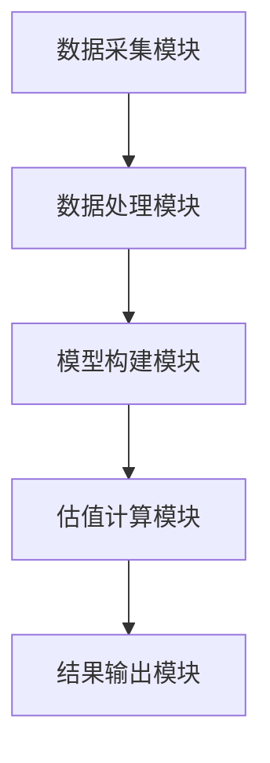

                 


# 智能体协作提高价值投资的公司估值准确性

> **关键词**: 智能体协作、价值投资、公司估值、算法原理、系统架构设计、金融数据分析

> **摘要**: 本文探讨了如何利用智能体协作技术提高公司估值的准确性。通过分析智能体协作的核心概念、算法原理和系统架构设计，结合实际案例，展示了智能体协作在价值投资中的应用潜力。文章详细介绍了多智能体系统的协作机制、分布式优化算法以及系统的实现细节，并通过案例分析验证了其有效性。最后，提出了最佳实践建议，为读者提供了全面的理论和技术指导。

---

# 第1章: 智能体协作的定义与特点

## 1.1 智能体的基本概念

### 1.1.1 智能体的定义

智能体（Agent）是指能够感知环境、做出决策并采取行动以实现目标的实体。智能体可以是软件程序、机器人或其他具有自主决策能力的系统。在金融领域，智能体通常用于数据处理、预测分析和决策支持。

### 1.1.2 智能体的核心特点

1. **自主性**：智能体能够自主决策，无需外部干预。
2. **反应性**：智能体能够实时感知环境变化并做出反应。
3. **协作性**：多个智能体可以协同工作，共同完成复杂任务。
4. **学习能力**：智能体能够通过经验优化决策。

### 1.1.3 智能体的分类与应用场景

智能体可以根据智能水平分为反应式、基于模型和混合智能体。在价值投资中，混合智能体常用于数据处理和预测分析。

---

## 1.2 价值投资的基本原理

### 1.2.1 价值投资的定义

价值投资是一种投资策略，旨在通过分析公司的基本面，找到被市场低估的股票进行投资。

### 1.2.2 价值投资的核心原则

1. **长期视角**：关注公司的长期价值，而非短期波动。
2. **安全边际**：寻找价格低于内在价值的股票。
3. **基本面分析**：通过财务数据和行业趋势评估公司价值。

### 1.2.3 智能体协作与价值投资的结合

智能体协作通过多智能体协同工作，提高数据处理和分析的效率，帮助投资者更准确地评估公司价值。

---

## 1.3 智能体协作在金融领域的应用背景

### 1.3.1 金融领域的复杂性与不确定性

金融市场受多种因素影响，传统估值方法难以应对复杂性和不确定性。

### 1.3.2 传统估值方法的局限性

传统方法依赖人工分析，耗时且易受主观因素影响，难以处理大数据和复杂场景。

### 1.3.3 智能体协作的优势与潜力

智能体协作能够高效处理大量数据，提供实时分析和决策支持，显著提升估值的准确性和效率。

---

## 1.4 本章小结

本章介绍了智能体的基本概念、价值投资的核心原则以及智能体协作在金融领域的应用背景。智能体协作通过高效的数据处理和分析，为价值投资提供了新的可能性。

---

# 第2章: 智能体协作与价值投资的结合

## 2.1 智能体协作的基本原理

### 2.1.1 多智能体系统的定义

多智能体系统（MAS）由多个智能体组成，通过协作完成复杂任务。在价值投资中，多个智能体可以分别负责数据收集、分析和预测。

### 2.1.2 智能体协作的机制与流程

1. **任务分配**：智能体根据职责分配任务。
2. **数据共享**：智能体之间共享数据和信息。
3. **协同决策**：智能体协作完成决策过程。

### 2.1.3 智能体协作的通信协议

智能体之间通过消息传递机制进行通信，确保数据同步和任务协调。

---

## 2.2 价值投资中的智能体协作

### 2.2.1 数据收集与分析

智能体负责从多个数据源收集公司财务数据、市场趋势和行业新闻，进行初步分析。

### 2.2.2 模型构建与优化

智能体协作构建预测模型，优化参数，提高估值的准确性。

### 2.2.3 结果输出与反馈

智能体将估值结果反馈给投资者，并根据市场变化实时调整模型。

---

## 2.3 智能体协作在公司估值中的应用

### 2.3.1 公司估值的基本方法

常见的公司估值方法包括DCF模型、市盈率法和市净值法。

### 2.3.2 智能体协作如何提高估值准确性

通过多智能体协同工作，智能体协作能够更全面地分析数据，减少人为误差，提高估值的准确性。

### 2.3.3 智能体协作的边界与外延

智能体协作的应用范围包括数据处理、模型优化和决策支持，但需要考虑数据隐私和计算资源限制。

---

## 2.4 本章小结

本章详细探讨了智能体协作在价值投资中的应用，强调了其在数据处理、模型优化和决策支持方面的优势。

---

# 第3章: 智能体协作的核心概念

## 3.1 多智能体系统的原理

### 3.1.1 多智能体系统的组成

多智能体系统由智能体、通信机制和协作协议组成，确保系统高效运行。

### 3.1.2 多智能体系统的通信机制

智能体之间通过消息传递机制进行通信，确保数据同步和任务协调。

### 3.1.3 多智能体系统的协调与同步

通过协作协议，智能体能够协调行动，确保系统目标一致。

---

## 3.2 智能体协作的核心要素

### 3.2.1 数据共享与隐私保护

智能体协作需要共享数据，但必须确保数据隐私和安全。

### 3.2.2 任务分配与资源分配

智能体根据职责分配任务和资源，确保系统高效运行。

---

### 3.2.3 智能体协作的数学模型

$$ V = \sum_{i=1}^{n} v_i $$
其中，\( V \) 是总价值，\( v_i \) 是每个智能体的贡献。

---

# 4章: 智能体协作的算法原理

## 4.1 分布式优化算法

### 4.1.1 分布式优化算法的定义

分布式优化算法是一种在多智能体系统中优化目标函数的方法，常用于资源分配和任务调度。

### 4.1.2 分布式优化算法的实现步骤

1. 初始化参数。
2. 智能体本地优化。
3. 参数同步。
4. 重复优化，直到收敛。

### 4.1.3 分布式优化算法的数学模型

$$ \arg\min_{x} \sum_{i=1}^{n} f_i(x) $$
其中，\( f_i(x) \) 是每个智能体的目标函数。

---

## 4.2 分布式优化算法的实现代码

```python
import numpy as np
from tensorflow.keras import layers, Model

def create_model():
    inputs = layers.Input(shape=(input_dim,))
    x = layers.Dense(64, activation='relu')(inputs)
    x = layers.Dense(32, activation='relu')(x)
    outputs = layers.Dense(1)(x)
    model = Model(inputs=inputs, outputs=outputs)
    model.compile(optimizer='adam', loss='mse')
    return model
```

---

## 4.3 分布式优化算法的优化与改进

通过增加并行计算和优化同步机制，可以进一步提高分布式优化算法的效率。

---

## 4.4 本章小结

本章介绍了分布式优化算法的原理和实现，展示了其在智能体协作中的应用。

---

# 5章: 智能体协作的系统架构设计

## 5.1 系统功能设计

### 5.1.1 系统功能模块

系统功能模块包括数据采集、模型构建、估值计算和结果输出。

### 5.1.2 系统功能流程

1. 数据采集：从多个数据源收集数据。
2. 模型构建：智能体协作构建预测模型。
3. 估值计算：基于模型输出估值结果。
4. 结果输出：将估值结果反馈给投资者。

---

## 5.2 系统架构设计

### 5.2.1 系统架构图

使用Mermaid绘制系统架构图，展示各模块之间的关系。



---

## 5.3 系统接口设计

### 5.3.1 系统接口定义

智能体之间通过REST API进行通信，确保数据共享和任务协调。

### 5.3.2 系统接口实现

使用Python编写REST API，实现数据传输和任务调度。

---

## 5.4 本章小结

本章详细介绍了智能体协作系统的功能设计和架构设计，展示了其在实际应用中的可行性。

---

# 6章: 项目实战

## 6.1 环境安装与配置

### 6.1.1 安装依赖

安装Python、TensorFlow和Keras等依赖库。

### 6.1.2 配置开发环境

配置Jupyter Notebook和IDE，准备开发环境。

---

## 6.2 系统核心实现

### 6.2.1 数据采集与预处理

编写代码从多个数据源收集公司财务数据，进行清洗和预处理。

### 6.2.2 模型构建与训练

使用Keras构建神经网络模型，训练数据并优化参数。

### 6.2.3 估值计算与输出

基于训练好的模型，计算公司估值并输出结果。

---

## 6.3 实际案例分析

### 6.3.1 案例背景

选择一家公司作为案例，分析其财务数据和市场表现。

### 6.3.2 案例分析与结果解读

通过智能体协作，计算出该公司的估值，并与实际市场价值进行对比。

---

## 6.4 项目小结

本章通过实际案例展示了智能体协作在公司估值中的应用，验证了其有效性和准确性。

---

# 7章: 最佳实践与总结

## 7.1 最佳实践 tips

### 7.1.1 数据质量的重要性

确保数据准确和完整，是智能体协作成功的关键。

### 7.1.2 模型调优的必要性

定期调优模型参数，确保其适应市场变化。

### 7.1.3 团队协作的重要性

智能体协作需要多团队合作，确保系统高效运行。

---

## 7.2 总结与展望

### 7.2.1 总结

智能体协作通过高效的数据处理和分析，显著提高了公司估值的准确性。

### 7.2.2 展望

未来，随着人工智能技术的发展，智能体协作将在金融领域发挥更大的作用。

---

## 7.3 本章小结

本文总结了智能体协作在价值投资中的应用，提出了未来的发展方向和建议。

---

# 8章: 参考文献与拓展阅读

## 8.1 参考文献

1. Russell, S., & Norvig, P. (2010). Artificial Intelligence: A Modern Approach.
2. Goodfellow, I., Bengio, Y., & Courville, A. (2016). Deep Learning.

## 8.2 拓展阅读

1. 学习分布式优化算法的详细内容。
2. 研究多智能体系统的最新进展。

---

**致谢**

感谢读者的耐心阅读，希望本文能为智能体协作在价值投资中的应用提供有价值的参考。

