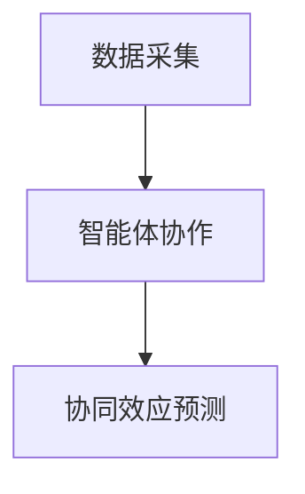

                 


# 智能体协作提高价值投资的并购协同效应预测

> 关键词：智能体协作，价值投资，并购协同效应，预测模型，博弈论，图论，机器学习

> 摘要：本文探讨了智能体协作在价值投资中的应用，特别是如何通过并购协同效应的预测来优化投资决策。结合博弈论和图论，提出了基于智能体协作的预测模型，并通过实际案例验证其有效性，为价值投资者提供新的思路。

---

## 第一部分：引言

### 1.1 背景介绍

在现代金融市场上，价值投资是追求长期收益的重要策略。然而，传统的方法往往依赖于经验判断，难以量化和预测并购后的协同效应。近年来，智能体协作技术的快速发展为价值投资带来了新的可能性。通过智能体协作，投资者能够更精准地预测并购后的协同效应，从而做出更明智的投资决策。

### 1.2 问题描述

并购协同效应是衡量并购成功的重要指标，但其预测难度较高。传统方法通常基于历史数据和经验判断，存在主观性强、缺乏量化支持的问题。此外，复杂的市场环境和企业内部因素进一步增加了预测的难度。

### 1.3 问题解决

智能体协作技术通过模拟多方协作行为，结合博弈论和图论，能够更全面地分析并购中的协同效应。本文将介绍如何构建基于智能体协作的预测模型，并通过实际案例展示其应用效果。

---

## 第二部分：背景与基础

### 2.1 智能体协作的基本概念

智能体协作是指多个智能体通过协同工作，共同完成特定任务的过程。其核心特征包括自主性、反应性和协作性。智能体能够根据环境变化自主决策，并通过协作实现目标。

### 2.2 并购协同效应的定义与分类

并购协同效应是指并购后的企业通过资源整合实现的成本节约和收入增长。其主要类型包括成本协同、收入协同和管理协同。

### 2.3 智能体协作与并购协同效应的关系

智能体协作能够通过模拟企业间的协同行为，预测并购后的协同效应。通过构建智能体模型，投资者可以更准确地评估并购的价值。

---

## 第三部分：算法与模型

### 3.1 基于博弈论的预测模型

#### 3.1.1 博弈论基础

博弈论是研究策略互动的数学理论。在并购预测中，博弈论可以帮助分析企业间的策略选择。

#### 3.1.2 智能体协作的博弈模型

构建博弈模型，分析并购双方的策略选择及其对协同效应的影响。

$$
\text{收益} = \alpha \times \text{成本协同} + \beta \times \text{收入协同}
$$

### 3.2 基于图论的预测模型

#### 3.2.1 图论基础

图论通过网络结构分析关系。在并购预测中，图论可以帮助识别关键节点和网络效应。

#### 3.2.2 并购协同效应的图论模型

构建网络模型，分析企业间的协同效应。

---

## 第四部分：系统设计

### 4.1 功能模块划分

系统包括数据采集、智能体协作、协同效应预测等功能模块。

### 4.2 系统架构图

使用 Mermaid 绘制系统架构图，展示各模块的关系。



### 4.3 系统交互图

展示系统各模块的交互流程。

---

## 第五部分：项目实战

### 5.1 环境安装

介绍所需环境和工具的安装步骤。

### 5.2 核心代码实现

提供 Python 代码示例，展示如何实现智能体协作模型。

```python
class Agent:
    def __init__(self, id):
        self.id = id
        self.strategy = None

    def collaborate(self, other_agents):
        # 简单策略：基于其他智能体的策略计算协同效应
        pass
```

### 5.3 案例分析

通过实际案例分析，验证模型的有效性。

---

## 第六部分：总结

### 6.1 最佳实践

总结智能体协作在并购协同效应预测中的优势和注意事项。

### 6.2 未来展望

探讨未来的研究方向，如多智能体协作的优化和动态环境下的预测模型。

---

通过本文的分析，智能体协作在价值投资中的应用潜力巨大，能够显著提高并购协同效应的预测准确性，为投资者提供更有力的决策支持。

