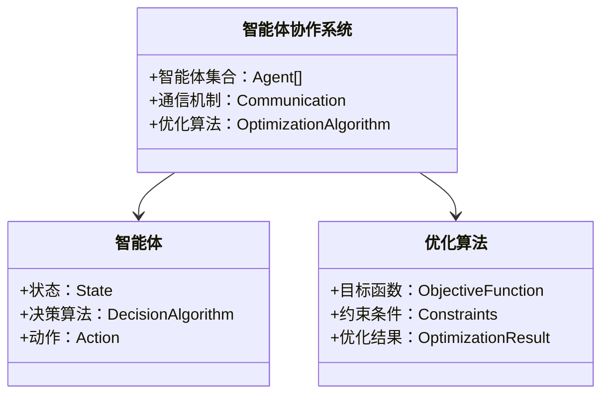
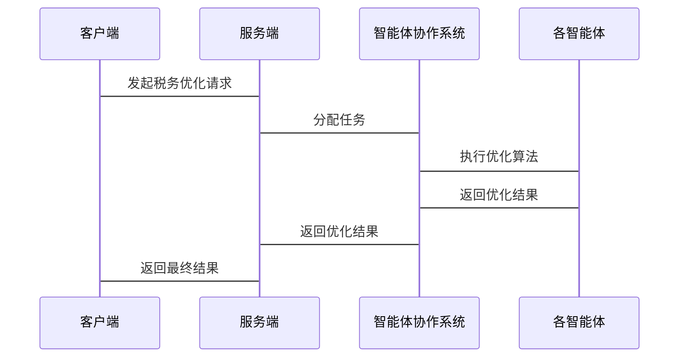

                 


# 智能体协作提高价值投资的税务策略优化

> 关键词：智能体协作，价值投资，税务优化，多智能体系统，分布式优化，算法实现

> 摘要：本文将探讨如何通过智能体协作来优化价值投资的税务策略。通过分析智能体协作的核心原理、价值投资与税务优化的内在联系，结合具体的算法实现和系统设计，提出一种基于智能体协作的税务优化方法。本文将从理论到实践，详细阐述如何利用智能体协作技术来提高价值投资的税务优化效率和效果。

---

## 第一章: 智能体协作与价值投资税务优化的背景介绍

### 1.1 智能体协作的定义与特点

#### 1.1.1 智能体协作的核心概念
智能体协作是指多个智能体（Agent）通过协同工作，共同完成某个复杂任务的过程。智能体可以是软件程序、算法或物理实体，它们通过通信和协调，实现目标的共同优化。智能体协作的核心在于分布式决策和协作优化。

#### 1.1.2 智能体协作的基本特点
- **分布式性**：智能体分布在不同的位置，独立决策。
- **协作性**：通过通信和协调，实现共同目标。
- **动态性**：环境和任务需求可能动态变化。
- **自主性**：智能体能够自主决策，无需中央控制。

#### 1.1.3 智能体协作的边界与外延
智能体协作的边界在于智能体之间的通信和协作机制，外延则包括分布式计算、多智能体系统等领域。

### 1.2 价值投资税务优化的定义与特点

#### 1.2.1 价值投资的基本概念
价值投资是一种投资策略，强调以低于内在价值的价格买入优质资产。其核心在于寻找被市场低估的投资标的。

#### 1.2.2 税务优化的核心目标
税务优化是指通过合理的税务规划，降低税负，提高净收益。在价值投资中，税务优化需要考虑资本利得税、分红税等。

#### 1.2.3 价值投资与税务优化的结合点
- **投资决策**：税务因素影响资产选择和持有时间。
- **收益计算**：税务负担影响投资回报。
- **风险管理**：税务优化需要考虑政策变化和市场波动。

### 1.3 智能体协作与价值投资税务优化的关联

#### 1.3.1 智能体协作在税务优化中的作用
智能体协作可以用于多目标优化，例如在多个资产之间分配投资比例，以实现税后收益最大化。

#### 1.3.2 价值投资与税务优化的内在联系
价值投资注重长期持有的优质资产，税务优化则需要考虑长期持有策略的税务影响。

#### 1.3.3 智能体协作如何提升税务优化效率
通过智能体协作，可以在分布式计算中快速优化税务策略，同时考虑多个变量的影响。

### 1.4 本章小结
本章介绍了智能体协作和价值投资税务优化的基本概念和特点，分析了它们之间的关联，为后续的算法实现和系统设计奠定了基础。

---

## 第二章: 智能体协作的核心原理

### 2.1 智能体协作的基本原理

#### 2.1.1 多智能体系统的基本架构
多智能体系统由多个智能体组成，每个智能体都有自己的目标和决策机制。系统通过智能体之间的协作，实现全局优化。

#### 2.1.2 智能体协作的通信机制
智能体之间需要通过通信协议进行信息交换，例如使用消息队列或事件驱动的方式。

#### 2.1.3 智能体协作的决策过程
智能体根据接收到的信息和自身的状态，通过算法进行决策，并通过动作影响环境。

### 2.2 智能体协作的关键算法

#### 2.2.1 分布式优化算法
分布式优化算法通过局部优化实现全局最优，例如分布式梯度下降。

#### 2.2.2 协作学习算法
协作学习算法通过智能体之间的协作，共同学习和优化模型，例如多智能体强化学习。

#### 2.2.3 跨智能体协调算法
跨智能体协调算法通过协调机制，实现智能体之间的协同优化，例如基于图的分布式优化。

### 2.3 智能体协作的数学模型

#### 2.3.1 多智能体协作的数学表达
$$ f(x_i) \text{ 表示第 } i \text{ 个智能体的优化目标} $$

#### 2.3.2 协作目标的优化函数
$$ \text{全局目标 } F = \sum_{i=1}^n f_i(x_i) $$

#### 2.3.3 智能体间通信的数学模型
$$ x_i \rightarrow x_j \text{ 表示智能体 } i \text{ 向智能体 } j \text{ 发送信息} $$

### 2.4 本章小结
本章详细讲解了智能体协作的核心原理，包括基本架构、通信机制、决策过程以及关键算法，为后续的价值投资税务优化提供了理论基础。

---

## 第三章: 价值投资税务优化的核心原理

### 3.1 价值投资的基本原理

#### 3.1.1 价值投资的核心理念
价值投资强调以低于内在价值的价格买入资产，长期持有，等待市场回归。

#### 3.1.2 价值投资的决策过程
投资者需要分析资产的内在价值，结合市场估值，做出投资决策。

#### 3.1.3 价值投资的数学模型
$$ V = \frac{CF}{r - g} $$ 
其中，$V$ 表示资产的内在价值，$CF$ 表示未来现金流，$r$ 表示折现率，$g$ 表示增长率。

### 3.2 税务优化的基本原理

#### 3.2.1 税务优化的目标
通过合理的税务规划，降低税负，提高净收益。

#### 3.2.2 税务优化的数学模型
$$ \text{税后收益 } = \text{毛收益} \times (1 - \text{税率}) $$

#### 3.2.3 税务优化的算法实现
使用动态规划算法，优化税务策略。

### 3.3 价值投资与税务优化的结合

#### 3.3.1 价值投资中的税务影响
税务负担会影响资产的买入成本和持有成本。

#### 3.3.2 税务优化对投资收益的影响
合理的税务规划可以提高净收益，降低整体税负。

#### 3.3.3 价值投资与税务优化的协同优化
通过智能体协作，实现价值投资与税务优化的协同优化。

### 3.4 本章小结
本章详细讲解了价值投资和税务优化的基本原理，分析了它们之间的结合点，为后续的智能体协作优化提供了理论支持。

---

## 第四章: 智能体协作与价值投资税务优化的算法实现

### 4.1 多智能体协作算法

#### 4.1.1 分布式强化学习算法
通过多智能体强化学习，实现分布式优化。

#### 4.1.2 联合优化算法
通过联合优化算法，实现多个智能体的协作优化。

#### 4.1.3 跨智能体协调算法
通过跨智能体协调算法，实现智能体之间的协同优化。

### 4.2 价值投资税务优化的算法实现

#### 4.2.1 税务优化的数学模型
$$ \text{优化目标} = \max \sum_{i=1}^n r_i \times (1 - t_i) $$
其中，$r_i$ 表示第 $i$ 个资产的收益，$t_i$ 表示税率。

#### 4.2.2 智能体协作的实现步骤
1. 初始化智能体。
2. 智能体之间通信，交换信息。
3. 每个智能体根据信息进行决策。
4. 智能体执行动作，影响环境。
5. 更新优化目标。

### 4.3 本章小结
本章详细讲解了智能体协作与价值投资税务优化的算法实现，通过数学模型和算法步骤，展示了如何利用智能体协作技术来优化税务策略。

---

## 第五章: 系统分析与架构设计

### 5.1 项目背景介绍

#### 5.1.1 项目目标
通过智能体协作技术，优化价值投资的税务策略。

#### 5.1.2 项目范围
涵盖多智能体系统设计、税务优化算法实现、系统架构设计等方面。

### 5.2 系统功能设计

#### 5.2.1 领域模型类图


#### 5.2.2 系统架构设计


#### 5.2.3 系统接口设计
- 智能体协作接口：定义智能体之间的通信和协作机制。
- 税务优化接口：定义税务优化算法的调用接口。

#### 5.2.4 系统交互流程


### 5.3 本章小结
本章通过系统分析和架构设计，展示了如何将智能体协作技术应用于价值投资税务优化，为后续的项目实现奠定了基础。

---

## 第六章: 项目实战

### 6.1 环境安装与配置

#### 6.1.1 安装Python环境
使用Anaconda安装Python 3.8以上版本。

#### 6.1.2 安装依赖库
安装numpy、pandas、scikit-learn等库。

### 6.2 系统核心实现

#### 6.2.1 智能体协作核心代码
```python
class Agent:
    def __init__(self, id):
        self.id = id
        self.state = None
        self.decision_algorithm = None
```

#### 6.2.2 税务优化算法实现
```python
def optimize_taxes/assets:
    # 实现分布式优化算法
    pass
```

### 6.3 代码应用解读与分析

#### 6.3.1 代码功能解读
解释代码的每个部分，包括智能体的定义、通信机制的实现等。

#### 6.3.2 代码优化建议
提出代码优化的建议，例如通过并行计算提高效率。

### 6.4 实际案例分析

#### 6.4.1 案例背景
假设一个价值投资组合，包含多个资产。

#### 6.4.2 案例分析
通过智能体协作优化税务策略，实现税后收益最大化。

### 6.5 项目小结
本章通过实际案例分析，展示了如何利用智能体协作技术优化价值投资的税务策略。

---

## 第七章: 最佳实践与总结

### 7.1 小结

#### 7.1.1 核心观点总结
智能体协作可以显著提高价值投资的税务优化效率。

#### 7.1.2 实践经验总结
通过智能体协作技术，可以实现多目标优化，提高投资收益。

### 7.2 注意事项

#### 7.2.1 智能体协作的局限性
智能体协作可能面临通信延迟和计算资源限制等问题。

#### 7.2.2 税务政策的变化
税务政策的变化可能影响优化策略的有效性。

### 7.3 拓展阅读

#### 7.3.1 推荐书籍
- 《多智能体系统》
- 《价值投资实战》

#### 7.3.2 推荐博客
推荐相关技术博客，供读者进一步学习。

### 7.4 本章小结
本章总结了智能体协作与价值投资税务优化的核心观点，提出了实践中的注意事项，并推荐了拓展阅读资料。

---

## 第八章: 结语

智能体协作与价值投资税务优化的结合，为投资领域带来了新的机遇和挑战。通过智能体协作技术，可以实现多目标优化，提高税务优化效率和效果。未来，随着人工智能技术的不断发展，智能体协作将在价值投资税务优化中发挥更大的作用。

--- 

以上是文章的完整目录和部分内容的详细展开。

