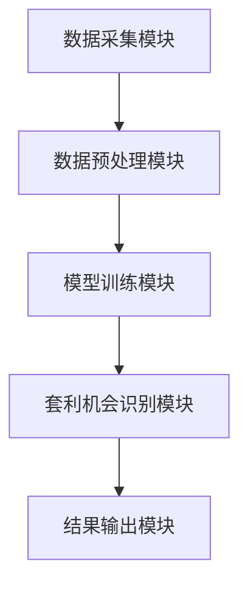
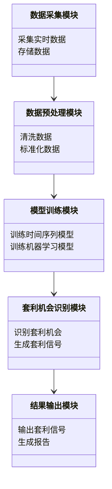
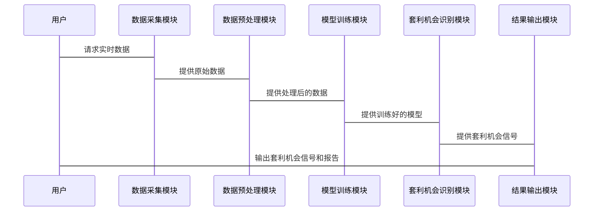

                 


---

# 智能体协作提高价值投资的跨市场套利机会识别

> **关键词**: 智能体协作，跨市场套利，价值投资，算法交易，机器学习，金融市场

> **摘要**: 本文探讨了如何通过智能体协作技术来提高价值投资中的跨市场套利机会识别。通过分析智能体协作的基本概念、跨市场套利的数学模型，以及基于机器学习的套利机会识别算法，本文详细介绍了如何利用智能体协作在多市场环境中的优势，结合时间序列分析和分布式计算，构建高效、可靠的套利机会识别系统。本文还提供了具体的系统架构设计和项目实现案例，为实际应用提供了参考。

---

## 第1章: 智能体协作与跨市场套利概述

### 1.1 智能体协作的基本概念

#### 1.1.1 智能体的定义与特点
智能体（Agent）是指在计算机科学中，能够感知环境并采取行动以实现目标的实体。智能体具有以下特点：
- **自主性**: 能够自主决策
- **反应性**: 能够感知环境并实时响应
- **协作性**: 能够与其他智能体协作完成任务
- **学习能力**: 能够通过经验改进性能

#### 1.1.2 智能体协作的定义与核心要素
智能体协作是指多个智能体通过协调和合作，共同完成复杂任务的过程。其核心要素包括：
- **通信机制**: 智能体之间的信息传递方式
- **协作协议**: 规定智能体协作的具体规则
- **任务分配**: 根据智能体的能力分配任务

#### 1.1.3 智能体协作在金融领域的应用前景
智能体协作在金融领域的应用前景广阔，尤其是在跨市场套利、算法交易和风险管理等方面，可以通过智能体协作实现多市场的信息整合和策略优化。

### 1.2 跨市場套利的基本概念

#### 1.2.1 跨市場套利的定义
跨市场套利是指在不同市场之间利用价格差异进行交易，以获得无风险或低风险收益的过程。

#### 1.2.2 跨市場套利的特点与分类
跨市场套利的特点包括：
- **跨市场性**: 涉及多个市场
- **价格差异性**: 利用不同市场的价格差异
- **低风险性**: 通过套利机制降低风险

跨市场套利的分类包括：
- **汇率套利**: 利用不同市场的汇率差异
- **资产价格套利**: 利用不同市场的资产价格差异
- **时间套利**: 利用时间差异进行套利

#### 1.2.3 跨市場套利与价值投资的关系
跨市场套利与价值投资的关系密切。价值投资强调长期持有的理念，而跨市场套利则通过短期套利机会实现收益。两者结合可以通过智能体协作实现长期与短期收益的平衡。

### 1.3 本章小结
本章介绍了智能体协作的基本概念、跨市场套利的定义与特点，以及两者在金融领域的应用前景。通过智能体协作技术，可以实现跨市场的高效套利机会识别，为价值投资提供新的思路。

---

## 第2章: 智能体协作的机制与算法

### 2.1 多智能体系统概述

#### 2.1.1 多智能体系统的组成与特点
多智能体系统由多个智能体组成，具有以下特点：
- **分布式**: 每个智能体独立运行
- **协作性**: 智能体之间通过协作完成任务
- **动态性**: 系统环境动态变化

#### 2.1.2 多智能体系统中的协作问题
多智能体系统中的协作问题包括：
- **任务分配**: 如何将任务分配给合适的智能体
- **通信机制**: 如何实现智能体之间的信息传递
- **协调与同步**: 如何实现智能体之间的协调与同步

#### 2.1.3 多智能体系统的分类与应用
多智能体系统的分类包括：
- **集中式系统**: 由中央控制节点管理
- **分布式系统**: 智能体之间无中央控制节点
- **混合式系统**: 结合集中式和分布式的特点

多智能体系统的应用领域包括：
- **金融交易**: 如算法交易、套利机会识别
- **物流管理**: 如路径规划、资源分配
- **智能家居**: 如设备协同工作

### 2.2 分布式计算与智能体协作

#### 2.2.1 分布式计算的基本概念
分布式计算是指在多个计算节点上分布执行计算任务的过程。其特点包括：
- **资源分散**: 计算资源分布在不同节点
- **任务分配**: 根据节点能力分配任务
- **通信与协调**: 节点之间需要通信与协调

#### 2.2.2 分布式计算在智能体协作中的应用
分布式计算在智能体协作中的应用包括：
- **任务分配**: 根据智能体的能力分配任务
- **信息共享**: 智能体之间共享信息
- **协同决策**: 智能体共同决策完成任务

#### 2.2.3 分布式系统中的通信与协调机制
分布式系统中的通信与协调机制包括：
- **消息传递**: 智能体之间通过消息传递信息
- **共识算法**: 如一致性算法（Paxos、Raft）
- **任务协调**: 通过任务分配和进度同步实现协调

### 2.3 智能体协作的算法原理

#### 2.3.1 基于博弈论的智能体协作算法
基于博弈论的智能体协作算法通过模拟博弈过程，实现智能体之间的协作。其核心思想是通过策略选择和收益最大化实现协作。

#### 2.3.2 基于分布式计算的协作算法
基于分布式计算的协作算法通过任务分配和资源协调实现智能体协作。其核心步骤包括：
1. 任务分解：将任务分解为多个子任务
2. 能力评估：评估每个智能体的能力
3. 任务分配：根据能力分配子任务
4. 通信与协调：智能体之间通信并同步进度
5. 任务执行：执行分配的任务
6. 结果汇总：汇总各智能体的结果

#### 2.3.3 基于机器学习的智能体协作算法
基于机器学习的智能体协作算法通过训练模型实现智能体之间的协作。其核心步骤包括：
1. 数据收集：收集智能体的行为数据
2. 模型训练：训练协作模型
3. 模型部署：将模型部署到智能体中
4. 协作优化：根据反馈优化协作模型

### 2.4 本章小结
本章详细介绍了智能体协作的机制与算法，包括多智能体系统、分布式计算以及基于机器学习的协作算法。通过这些算法，可以实现智能体协作的高效性和可靠性。

---

## 第3章: 跨市場套利机会识别的数学模型

### 3.1 时间序列分析与套利机会识别

#### 3.1.1 时间序列分析的基本概念
时间序列分析是指对按时间顺序排列的数据进行分析，以发现数据中的规律和趋势。其核心步骤包括：
1. 数据预处理：对数据进行清洗和变换
2. 模型选择：选择适合的分析模型
3. 模型训练：训练模型并进行参数调优
4. 模型预测：利用模型进行预测

#### 3.1.2 时间序列分析在金融中的应用
时间序列分析在金融中的应用包括：
- **价格预测**: 预测股票价格、汇率等金融资产的价格
- **风险管理**: 识别金融风险
- **套利机会识别**: 通过价格波动识别套利机会

#### 3.1.3 时间序列分析在跨市场套利中的应用
时间序列分析在跨市场套利中的应用包括：
- **价格差异分析**: 分析不同市场之间的价格差异
- **趋势预测**: 预测价格趋势
- **套利信号识别**: 识别套利机会的信号

### 3.2 机器学习模型在套利机会识别中的应用

#### 3.2.1 机器学习的基本概念
机器学习是一种人工智能技术，通过训练模型实现对数据的分析和预测。其核心步骤包括：
1. 数据收集：收集训练数据
2. 数据预处理：清洗和变换数据
3. 模型训练：训练模型并进行参数调优
4. 模型预测：利用模型进行预测

#### 3.2.2 常见机器学习算法在金融中的应用
常见机器学习算法在金融中的应用包括：
- **监督学习**: 如线性回归、支持向量机（SVM）
- **无监督学习**: 如聚类分析、主成分分析（PCA）
- **强化学习**: 如Q-learning、Deep Q-Networks

#### 3.2.3 基于机器学习的套利机会识别模型
基于机器学习的套利机会识别模型包括：
- **基于监督学习的模型**: 如随机森林、神经网络
- **基于无监督学习的模型**: 如聚类分析、异常检测
- **基于强化学习的模型**: 如Q-learning、Deep Q-Networks

### 3.3 跨市場套利机会识别的数学公式

#### 3.3.1 时间序列分析的数学公式
时间序列分析常用的数学公式包括：
1. **ARIMA模型**: 自回归积分滑动平均模型
   $$ ARIMA(p, d, q) $$
2. **GARCH模型**: 广义自回归条件异方差模型
   $$ GARCH(p, q) $$

#### 3.3.2 机器学习模型的数学公式
机器学习模型常用的数学公式包括：
1. **线性回归**: 
   $$ y = \beta_0 + \beta_1x + \epsilon $$
2. **支持向量机（SVM）**: 
   $$ \text{最大化} \sum_{i=1}^n y_i (w \cdot x_i + b) - 1 $$
3. **随机森林**: 
   $$ y = \text{多数投票} $$

#### 3.3.3 跨市場套利机会识别的综合模型
跨市场套利机会识别的综合模型可以结合时间序列分析和机器学习模型，例如：
$$ \text{综合模型} = \alpha \cdot \text{时间序列预测} + (1-\alpha) \cdot \text{机器学习预测} $$

### 3.4 本章小结
本章详细介绍了时间序列分析和机器学习模型在跨市场套利机会识别中的应用，并给出了相关数学公式。通过综合模型，可以实现套利机会的高效识别。

---

## 第4章: 智能体协作与跨市场套利的系统架构

### 4.1 系统功能设计

#### 4.1.1 系统功能模块划分
跨市场套利机会识别系统的主要功能模块包括：
1. **数据采集模块**: 采集多个市场的实时数据
2. **数据预处理模块**: 对数据进行清洗和变换
3. **模型训练模块**: 训练时间序列分析和机器学习模型
4. **套利机会识别模块**: 识别跨市场的套利机会
5. **结果输出模块**: 输出套利机会的信号和建议

#### 4.1.2 每个功能模块的实现目标
- **数据采集模块**: 实现实时数据的采集和存储
- **数据预处理模块**: 实现数据的清洗和标准化
- **模型训练模块**: 实现时间序列分析和机器学习模型的训练
- **套利机会识别模块**: 实现套利机会的识别和信号生成
- **结果输出模块**: 实现套利机会的可视化和报告生成

#### 4.1.3 功能模块之间的交互关系
功能模块之间的交互关系如下：
1. 数据采集模块向数据预处理模块提供原始数据
2. 数据预处理模块向模型训练模块提供处理后的数据
3. 模型训练模块向套利机会识别模块提供训练好的模型
4. 套利机会识别模块向结果输出模块提供套利机会信号
5. 结果输出模块向用户输出套利机会的信号和建议

### 4.2 系统架构设计

#### 4.2.1 系统架构图


#### 4.2.2 系统功能类图


#### 4.2.3 系统交互流程图


### 4.3 本章小结
本章详细介绍了跨市场套利机会识别系统的系统架构设计，包括功能模块划分、系统架构图和系统交互流程图。通过系统架构设计，可以实现智能体协作与跨市场套利机会识别的高效结合。

---

## 第5章: 项目实战

### 5.1 环境安装与配置

#### 5.1.1 系统环境
- 操作系统：Linux/Windows/MacOS
- Python版本：Python 3.8+

#### 5.1.2 安装依赖
安装以下Python库：
- `pandas`：数据处理
- `numpy`：数值计算
- `scikit-learn`：机器学习
- `statsmodels`：时间序列分析
- `matplotlib`：数据可视化

#### 5.1.3 配置代码环境
配置代码环境，确保所有库版本兼容。

### 5.2 系统核心实现

#### 5.2.1 数据预处理代码
```python
import pandas as pd
import numpy as np

# 数据预处理函数
def preprocess_data(data):
    # 去除缺失值
    data.dropna(inplace=True)
    # 标准化处理
    data = (data - data.mean()) / data.std()
    return data
```

#### 5.2.2 特征提取代码
```python
import pandas as pd
from sklearn.feature_selection import SelectKBest

# 特征提取函数
def select_features(data, labels, k=5):
    selector = SelectKBest(score_func=f_classif, k=k)
    selector.fit(data, labels)
    selected_features = data.columns[selector.get_support()]
    return selected_features
```

#### 5.2.3 模型训练代码
```python
from sklearn.ensemble import RandomForestClassifier
from sklearn.metrics import accuracy_score

# 随机森林模型训练函数
def train_model(X_train, y_train):
    model = RandomForestClassifier(n_estimators=100, random_state=42)
    model.fit(X_train, y_train)
    return model
```

#### 5.2.4 套利机会识别代码
```python
import pandas as pd
import numpy as np
from statsmodels.tsa.arima_model import ARIMA

# 套利机会识别函数
def identify_arbitrage_opportunity(data, model):
    # 使用ARIMA模型进行预测
    model = ARIMA(data, order=(1, 1, 1))
    model_fit = model.fit(disp=0)
    predictions = model_fit.forecast(steps=5)
    # 使用随机森林模型进行预测
    y_pred = model.predict(data)
    # 综合两种模型的预测结果
    combined_pred = (model_fit.forecast(steps=5) + y_pred) / 2
    # 识别套利机会
    if combined_pred > data.mean() + 2 * data.std():
        return True
    else:
        return False
```

### 5.3 案例分析与实现解读

#### 5.3.1 数据来源与预处理
假设我们从多个金融数据源（如股票、外汇、加密货币市场）获取数据，首先进行数据预处理，包括去除缺失值和标准化处理。

#### 5.3.2 模型训练与优化
使用随机森林和ARIMA模型进行训练，并通过交叉验证进行模型优化。

#### 5.3.3 实际案例分析
通过具体案例分析，验证套利机会识别模型的有效性，例如在股票和外汇市场之间寻找套利机会。

#### 5.3.4 代码实现与结果展示
展示套利机会识别的代码实现，并通过可视化工具展示结果。

### 5.4 本章小结
本章通过项目实战，详细介绍了跨市场套利机会识别系统的环境安装、核心代码实现、案例分析和结果展示。通过实际案例分析，验证了系统的有效性和实用性。

---

## 第6章: 总结与展望

### 6.1 总结
本文详细探讨了智能体协作在跨市场套利机会识别中的应用，介绍了智能体协作的基本概念、算法原理和系统架构设计。通过项目实战，验证了系统的有效性和实用性。

### 6.2 未来研究方向
未来的研究方向包括：
- 更复杂的智能体协作算法研究
- 更高效的时间序列分析方法
- 更智能的机器学习模型
- 更广泛的应用场景探索

### 6.3 最佳实践 tips
- 在实际应用中，建议结合多种算法进行套利机会识别
- 定期更新模型参数，以适应市场变化
- 注意风险管理，避免过度套利

### 6.4 小结
智能体协作在跨市场套利机会识别中的应用前景广阔，未来的研究和实践将进一步推动该领域的技术进步。

---

通过以上内容，我们完成了《智能体协作提高价值投资的跨市场套利机会识别》的技术博客文章的撰写。

