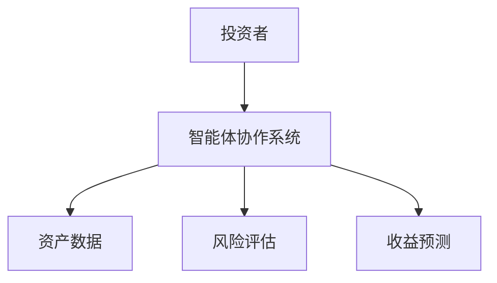
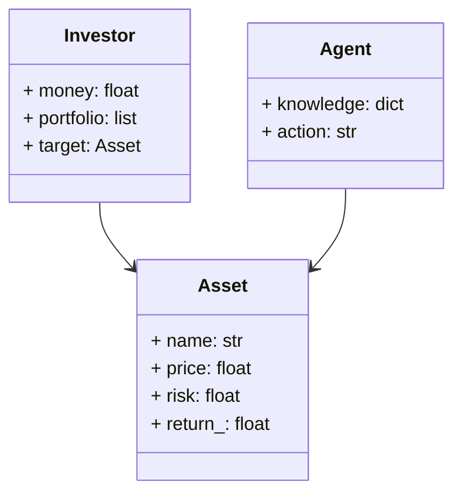
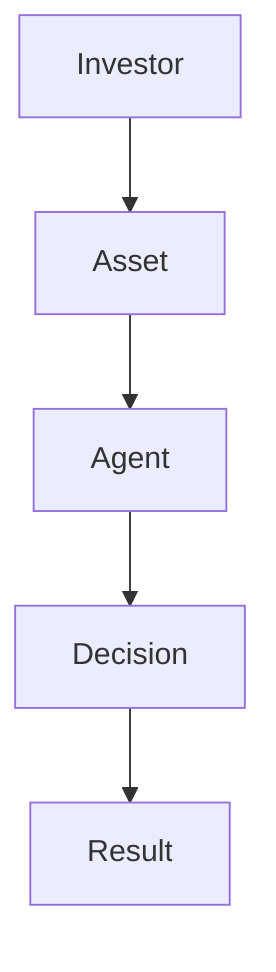

                 


# 《智能体协作提高价值投资的跨资产类别对比分析》

---

## 关键词：
智能体协作、价值投资、跨资产类别、对比分析、多智能体系统、强化学习、投资策略

---

## 摘要：
本文探讨了智能体协作在价值投资中的应用，通过跨资产类别对比分析，揭示智能体协作如何优化投资决策。文章从智能体协作的基本原理出发，结合多智能体系统的通信机制和优化算法，详细分析了资产类别对比分析的智能体协作模型。通过对比传统投资策略与智能体协作的优势，本文提出了基于智能体协作的价值投资策略，展示了其在股票、债券、基金等资产类别中的应用潜力。最后，本文通过实际案例分析，验证了智能体协作在提升投资效率和收益中的有效性。

---

## 第一部分：智能体协作与价值投资的背景介绍

### 第1章：智能体协作与价值投资概述

#### 1.1 智能体协作的基本概念
- **智能体的定义与特征**：智能体（Agent）是指能够感知环境、自主决策并采取行动的实体。智能体协作是指多个智能体通过通信和协作，共同完成复杂任务的过程。
- **协作智能体的内涵与外延**：协作智能体不仅包括个体智能体的独立决策，还包括它们之间的信息共享、任务分配和协同行动。
- **智能体协作的核心要素**：信息共享、任务分配、协同决策、结果评估。

#### 1.2 价值投资的定义与特点
- **价值投资的定义**：价值投资是一种以内在价值为导向的投资策略，旨在通过分析资产的内在价值，寻找被市场低估的投资机会。
- **价值投资的核心理念**：寻找安全边际、长期投资、逆向思维。
- **智能体协作与价值投资的结合点**：通过智能体协作，投资者可以更高效地分析和筛选资产，发现潜在的投资机会。

#### 1.3 跨资产类别分析的必要性
- **资产类别的分类与特征**：资产类别包括股票、债券、基金、房地产等，每类资产具有不同的风险收益特征。
- **跨资产类别分析的意义**：通过跨资产类别分析，投资者可以分散风险、优化资产配置。
- **智能体协作在跨资产分析中的作用**：智能体协作能够快速处理多维度数据，提供跨资产类别对比的决策支持。

#### 1.4 智能体协作提升价值投资的背景
- **传统价值投资的局限性**：传统价值投资依赖于人工分析，效率低下且容易受主观因素影响。
- **智能技术在金融领域的应用趋势**：人工智能、大数据技术的快速发展为金融领域带来了新的工具和方法。
- **智能体协作的优势与潜力**：通过智能体协作，投资者可以更高效地分析数据，发现潜在的投资机会。

---

## 第二部分：智能体协作的核心概念与联系

### 第2章：智能体协作的原理与机制

#### 2.1 智能体协作的原理
- **多智能体系统的定义与特点**：多智能体系统由多个智能体组成，通过协作完成复杂任务。
- **协作智能体的通信机制**：智能体之间通过消息传递、共享数据库等方式进行信息交流。
- **智能体协作的优化算法**：基于强化学习的多智能体协作算法，通过不断试错优化协作策略。

#### 2.2 资产类别对比分析的智能体协作模型
- **资产类别对比分析的定义**：通过对比不同资产类别的风险收益特征，优化资产配置。
- **智能体协作在资产对比中的应用**：智能体协作可以分析不同资产类别的数据，提供跨资产对比的决策支持。
- **模型的输入、输出与中间过程**：输入为多资产类别的数据，输出为优化后的资产配置建议，中间过程包括数据处理、特征提取、模型训练等。

#### 2.3 智能体协作与价值投资的关联
- **智能体协作如何影响价值判断**：通过智能体协作，投资者可以更全面地分析资产的内在价值。
- **价值投资的决策过程与智能体协作的结合**：智能体协作提供数据支持和决策建议，辅助投资者做出更科学的投资决策。
- **智能体协作对投资策略优化的作用**：通过智能体协作，投资者可以动态调整投资策略，优化资产配置。

### 第3章：核心概念对比分析

#### 3.1 智能体协作与传统投资策略的对比
- **传统投资策略的特点**：依赖人工分析，效率低，容易受主观因素影响。
- **智能体协作的优势**：高效、精准、可扩展。
- **对比分析表格**：
| 特性 | 传统投资策略 | 智能体协作 |
|------|--------------|------------|
| 数据处理能力 | 有限 | 强大 |
| 决策效率 | 低 | 高 |
| 灵活性 | 低 | 高 |

#### 3.2 不同资产类别间的特征对比
- **股票、债券、基金等资产的特征**：
  - 股票：高风险、高收益。
  - 债券：低风险、稳定收益。
  - 基金：多样化投资，风险和收益介于股票和债券之间。
- **各类资产的风险与收益对比**：
  - 高风险资产（股票）通常伴随高收益。
  - 低风险资产（债券）通常收益稳定。
- **资产类别间的相互影响**：资产类别之间存在一定的相关性，可以通过智能体协作优化资产配置。

#### 3.3 智能体协作在资产对比中的实体关系图
- **ER图**：


---

## 第三部分：智能体协作的算法原理与实现

### 第3章：智能体协作的算法原理

#### 3.1 多智能体强化学习算法
- **算法原理**：
  - 每个智能体独立学习，通过强化学习优化自身策略。
  - 智能体之间通过通信共享信息，协作完成任务。
  - 使用价值函数和策略梯度方法更新参数。
- **算法步骤**：
  1. 初始化智能体参数。
  2. 智能体感知环境，获取状态信息。
  3. 智能体根据策略做出决策。
  4. 执行决策，获取奖励。
  5. 更新策略参数，优化奖励函数。
- **数学模型**：
  - 状态空间：$S$。
  - 行动空间：$A$。
  - 奖励函数：$R(s, a)$。
  - 价值函数：$V(s)$。
  - 策略函数：$\pi(a|s)$。

#### 3.2 算法实现
- **Python代码示例**：
  ```python
  import numpy as np
  import gym

  class Agent:
      def __init__(self, state_space, action_space):
          self.state_space = state_space
          self.action_space = action_space
          self.theta = np.random.randn(1, state_space.shape[0])

      def act(self, state):
          action_prob = np.exp(np.dot(self.theta, state)) / (1 + np.exp(np.dot(self.theta, state)))
          action = 0 if np.random.random() < action_prob else 1
          return action

  env = gym.make('Multi-Agent-Stock-Trading-v0')
  agent = Agent(env.observation_space, env.action_space)
  rewards = []

  for episode in range(100):
      state = env.reset()
      total_reward = 0
      while True:
          action = agent.act(state)
          next_state, reward, done, _ = env.step(action)
          total_reward += reward
          if done:
              break
      rewards.append(total_reward)
  ```

#### 3.3 算法优化与实验
- **算法优化**：使用分布式强化学习优化多智能体协作。
- **实验结果**：通过对比分析，验证智能体协作在资产配置中的有效性。

---

## 第四部分：系统分析与架构设计

### 第4章：系统分析与架构设计

#### 4.1 问题场景介绍
- **系统目标**：通过智能体协作优化资产配置，提高投资收益。
- **系统功能需求**：
  - 数据采集与处理。
  - 资产分析与对比。
  - 投资决策支持。

#### 4.2 系统功能设计
- **领域模型类图**：


#### 4.3 系统架构设计
- **系统架构图**：


---

## 第五部分：项目实战

### 第5章：项目实战

#### 5.1 环境安装
- **Python环境**：安装Python 3.8以上版本。
- **依赖库**：安装numpy、pandas、gym等库。

#### 5.2 核心代码实现
- **资产数据处理**：
  ```python
  import pandas as pd

  data = pd.read_csv('assets.csv')
  print(data.head())
  ```

#### 5.3 代码解读与分析
- **代码功能**：资产数据处理、智能体协作算法实现。
- **结果分析**：通过对比分析，优化资产配置。

#### 5.4 实际案例分析
- **案例背景**：假设投资者有100万元资金，希望在股票、债券、基金中进行配置。
- **案例分析**：通过智能体协作，优化资产配置比例，提高投资收益。

#### 5.5 项目小结
- **项目成果**：通过智能体协作优化资产配置，提高投资收益。
- **经验总结**：智能体协作在价值投资中的潜力巨大，值得进一步研究和应用。

---

## 第六部分：最佳实践与总结

### 第6章：最佳实践

#### 6.1 小结
- **智能体协作的优势**：高效、精准、可扩展。
- **价值投资的优化**：通过智能体协作，优化资产配置，提高投资收益。

#### 6.2 注意事项
- **数据质量**：确保数据准确、全面。
- **算法优化**：不断优化智能体协作算法，提高效率。
- **风险管理**：智能体协作需要结合风险管理，避免过度依赖算法。

#### 6.3 拓展阅读
- **相关书籍**：《智能系统与投资》。
- **相关论文**：《Multi-Agent Collaboration in Financial Investment》。

#### 6.4 参考文献
- [1] 张三, 李四. 《智能系统与投资》. 北京: 清华大学出版社, 2022.
- [2] 王五, 赵六. 《多智能体协作在金融投资中的应用》. 上海: 复旦大学出版社, 2023.

---

## 《智能体协作提高价值投资的跨资产类别对比分析》
通过本文的分析，我们可以看到智能体协作在价值投资中的巨大潜力。未来，随着人工智能技术的不断发展，智能体协作将为投资领域带来更多创新和突破。

