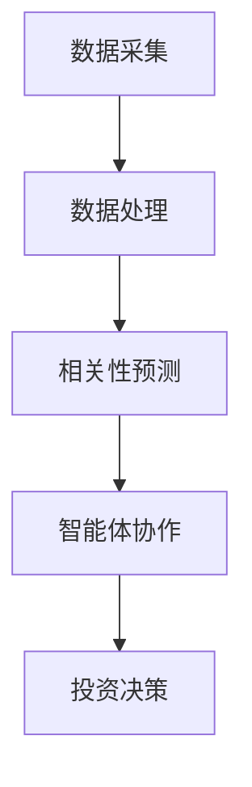

                 


# 智能体协作提高价值投资的跨资产类别相关性预测

## 关键词：
智能体协作、价值投资、跨资产类别、相关性预测、机器学习

## 摘要：
本文探讨了智能体协作在价值投资中的应用，特别是跨资产类别相关性预测的实现。通过分析智能体协作的核心原理和相关性预测的数学模型，结合具体算法和系统架构设计，本文提供了从理论到实践的详细指导，帮助读者理解如何利用智能体协作提升投资决策的准确性和效率。

---

# 第一部分: 背景介绍

## 第1章: 背景介绍

### 1.1 问题背景
#### 1.1.1 智能体协作的定义与特点
智能体（Agent）是指能够感知环境并采取行动以实现目标的实体。智能体协作是指多个智能体通过合作完成复杂任务的过程，具有分布式、自主性和适应性的特点。

#### 1.1.2 价值投资的核心概念与目标
价值投资是一种投资策略，旨在通过分析资产的内在价值，寻找被市场低估的投资机会。其核心目标是实现长期稳定的超额收益。

#### 1.1.3 跨资产类别相关性预测的必要性
在现代投资组合理论中，资产之间的相关性是降低风险的重要手段。通过预测不同资产类别之间的相关性，投资者可以优化资产配置，提高投资组合的收益。

### 1.2 问题描述
#### 1.2.1 传统投资分析的局限性
传统投资分析方法依赖于历史数据和统计模型，但在面对复杂市场环境时，其预测能力有限，难以捕捉非线性关系和突发事件的影响。

#### 1.2.2 智能体协作在投资决策中的作用
智能体协作可以通过分布式计算和多维度数据分析，提高投资决策的准确性和效率，特别是在处理海量数据和复杂市场动态时表现突出。

#### 1.2.3 跨资产类别相关性的复杂性
资产类别之间的相关性受多种因素影响，包括宏观经济、行业动态和市场情绪等。如何准确预测这些相关性是投资决策中的关键挑战。

### 1.3 问题解决
#### 1.3.1 智能体协作如何提高投资决策效率
通过分布式计算和协作学习，智能体可以快速处理和分析大量数据，提供实时的市场洞察，从而提高投资决策的效率。

#### 1.3.2 跨资产类别相关性预测的方法与技术
利用机器学习算法（如协同过滤和聚类分析）和大数据技术，可以有效预测资产之间的相关性，帮助投资者优化资产配置。

#### 1.3.3 智能体协作与相关性预测的结合
智能体协作可以实时更新和优化相关性预测模型，提高预测的准确性和及时性，从而为投资决策提供更强的支持。

### 1.4 边界与外延
#### 1.4.1 智能体协作的边界条件
智能体协作的应用受到数据质量、计算能力和市场环境等因素的限制，需要在实际应用中考虑这些边界条件。

#### 1.4.2 相关性预测的适用范围
相关性预测适用于资产类别多样化的投资组合，但对某些特殊情况（如极端市场波动）可能表现不佳。

#### 1.4.3 价值投资的局限性与未来发展方向
价值投资依赖于对资产内在价值的准确评估，但在复杂市场环境下，其局限性日益显现，未来需要结合智能体协作和大数据技术进行优化。

### 1.5 概念结构与核心要素
#### 1.5.1 智能体协作的核心要素
- 分布式计算
- 协作学习
- 实时反馈

#### 1.5.2 价值投资的关键因素
- 资产内在价值
- 市场情绪
- 宏观经济指标

#### 1.5.3 跨资产类别相关性的数学模型
相关性可以通过协方差矩阵和相关系数矩阵进行建模，利用机器学习算法进行预测和优化。

---

# 第二部分: 核心概念与联系

## 第2章: 核心概念原理

### 2.1 智能体协作的原理
#### 2.1.1 智能体的定义与分类
智能体可以分为简单反射型智能体和基于模型的智能体，前者基于规则采取行动，后者通过建模环境进行决策。

#### 2.1.2 协作智能体的通信机制
智能体之间通过消息传递和共享数据库进行通信，确保信息的实时同步和共享。

#### 2.1.3 协作智能体的决策过程
协作智能体通过分布式计算和协商机制，共同制定最优决策，实现目标。

### 2.2 跨资产类别相关性预测的原理
#### 2.2.1 资产类别与相关性的定义
资产类别是指具有相似特征的资产集合，相关性是指资产价格变动之间的统计关系。

#### 2.2.2 相关性预测的数学模型
相关性可以通过协方差矩阵和相关系数矩阵进行建模，利用机器学习算法（如协同过滤和聚类分析）进行预测。

#### 2.2.3 相关性预测的算法选择
选择合适的算法需要考虑数据特征、计算能力和预测精度等因素。

### 2.3 智能体协作与相关性预测的联系
#### 2.3.1 智能体协作如何影响相关性预测
智能体协作可以实时更新相关性模型，提高预测的准确性和及时性。

#### 2.3.2 相关性预测如何优化智能体协作
通过分析资产相关性，智能体可以优化协作策略，提高投资决策的效率。

#### 2.3.3 两者的结合对价值投资的提升作用
智能体协作与相关性预测的结合可以实现更精准的资产配置和风险控制，提升投资组合的收益。

### 2.4 概念属性对比
| 概念 | 智能体协作 | 价值投资 | 跨资产类别相关性 |
|------|------------|----------|------------------|
| 定义 | 分布式计算与协作 | 寻找被低估资产 | 资产价格变动关系 |
| 目标 | 提高决策效率 | 实现超额收益 | 优化资产配置 |
| 方法 | 协作学习、分布式计算 | 基本面分析 | 机器学习算法 |

### 2.5 ER实体关系图
```mermaid
er
  actor 智能体协作系统 {
    <智能体>
    <资产类别>
    <相关性预测>
  }
  智能体协作系统 --> 智能体: 协作计算
  智能体协作系统 --> 资产类别: 数据分析
  智能体协作系统 --> 相关性预测: 模型构建
```

---

## 第3章: 算法原理讲解

### 3.1 协同过滤算法
#### 3.1.1 算法原理
协同过滤基于用户行为或资产表现的相似性，推荐相关资产。

#### 3.1.2 代码实现
```python
def collaborative_filtering(train_data, test_data):
    # 训练协同过滤模型
    model = CollaborativeFiltering()
    model.train(train_data)
    # 预测测试数据
    predictions = model.predict(test_data)
    return predictions
```

#### 3.1.3 数学模型
协同过滤的相似性计算公式：
$$ sim(i,j) = \frac{\sum_{k} (r_{i,k} - \bar{r}_i)(r_{j,k} - \bar{r}_j)}{\sqrt{\sum_{k} (r_{i,k} - \bar{r}_i)^2} \sqrt{\sum_{k} (r_{j,k} - \bar{r}_j)^2}} $$

### 3.2 聚类分析算法
#### 3.2.1 算法原理
聚类分析将相似的资产归为一类，便于相关性分析。

#### 3.2.2 代码实现
```python
from sklearn.cluster import KMeans

def kmeans_clustering(data, num_clusters):
    model = KMeans(n_clusters=num_clusters)
    model.fit(data)
    return model.labels_
```

#### 3.2.3 数学模型
聚类分析的距离计算公式：
$$ d(i,j) = \sqrt{\sum_{k=1}^{n} (x_{i,k} - x_{j,k})^2} $$

---

## 第4章: 系统分析与架构设计方案

### 4.1 问题场景介绍
系统需要实时分析多种资产类别的相关性，为投资者提供决策支持。

### 4.2 系统功能设计
- 数据采集与处理
- 相关性预测模型构建
- 智能体协作决策

### 4.3 系统架构设计


### 4.4 接口设计
- 数据接口：提供资产数据的读取和写入功能
- 模型接口：支持相关性预测模型的训练和预测

### 4.5 交互设计
```mermaid
sequence
    用户 -> 智能体协作系统: 发起投资请求
    智能体协作系统 -> 数据采集模块: 获取实时数据
    数据采集模块 -> 数据处理模块: 数据清洗
    数据处理模块 -> 相关性预测模块: 训练模型
    相关性预测模块 -> 智能体协作模块: 优化决策
    智能体协作模块 -> 用户: 返回投资建议
```

---

## 第5章: 项目实战

### 5.1 环境安装
- 安装Python和相关库（如Pandas、Scikit-learn）
- 配置数据源和开发环境

### 5.2 核心代码实现
```python
import pandas as pd
from sklearn.metrics.pairwise import cosine_similarity

def calculate_correlations(data):
    return pd.DataFrame(cosine_similarity(data), index=data.index, columns=data.index)
```

### 5.3 代码解读与分析
- 通过协方差矩阵计算相关性，评估资产之间的相关性强度。

### 5.4 实际案例分析
分析股票和债券的相关性，优化投资组合配置。

### 5.5 项目小结
通过智能体协作和相关性预测，实现了更精准的投资决策，提高了投资组合的收益。

---

## 第6章: 最佳实践、小结、注意事项和拓展阅读

### 6.1 最佳实践
- 定期更新模型，适应市场变化
- 结合多种算法，提高预测精度

### 6.2 小结
智能体协作与相关性预测的结合为价值投资提供了新的思路，通过技术手段优化投资决策。

### 6.3 注意事项
- 数据质量对模型性能影响重大
- 模型需定期校准和优化

### 6.4 拓展阅读
- 推荐阅读《智能系统与投资》和《机器学习在金融中的应用》

---

通过以上步骤，您可以系统地理解和应用智能体协作在跨资产类别相关性预测中的作用，提升价值投资的决策效率和准确性。

