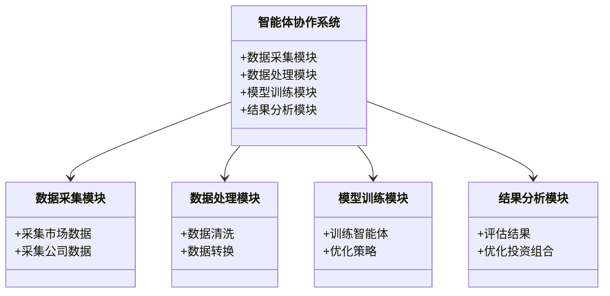
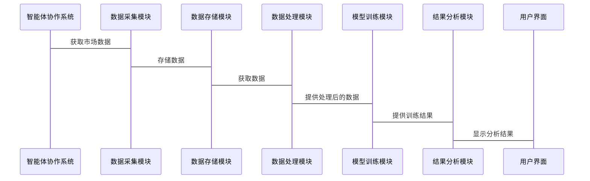

                 


# 智能体协作提高价值投资研究的深度和广度

> 关键词：智能体协作、价值投资、数据分析、人工智能、投资策略

> 摘要：本文探讨了智能体协作在价值投资研究中的应用，分析了其如何通过多智能体协作提升投资决策的深度和广度。通过详细阐述智能体协作的核心概念、算法原理、系统架构以及项目实战，本文展示了如何利用人工智能技术优化投资研究流程，提高投资决策的准确性和效率。

---

# 第一部分: 智能体协作与价值投资研究的背景与基础

## 第1章: 智能体协作与价值投资研究的背景

### 1.1 智能体协作的背景与概念

#### 1.1.1 智能体协作的定义
智能体协作是指多个智能体（Agent）通过协同工作，共同完成复杂任务的过程。智能体可以是软件程序、算法模型或具备自主决策能力的实体。在投资领域，智能体协作能够帮助投资者更高效地分析市场数据、制定投资策略。

#### 1.1.2 智能体协作的核心特点
- **分布式计算**：智能体协作依赖于分布式计算，每个智能体负责不同的任务，共同完成整体目标。
- **自主性**：智能体具备自主决策能力，能够在复杂环境中独立完成任务。
- **协作性**：智能体之间通过通信和协调，实现信息共享和任务分配。
- **动态性**：智能体协作能够适应动态变化的市场环境。

#### 1.1.3 智能体协作在投资研究中的应用潜力
智能体协作能够通过多角度、多层次的数据分析，帮助投资者发现潜在的投资机会，优化投资组合，降低投资风险。

### 1.2 价值投资研究的基本概念

#### 1.2.1 价值投资的定义
价值投资是一种基于对公司内在价值评估的投资策略，旨在以低于内在价值的价格买入股票，长期持有，等待其价值回归。

#### 1.2.2 价值投资的核心要素
- **基本面分析**：通过对公司的财务报表、行业地位、盈利能力等进行分析，评估其内在价值。
- **市场情绪分析**：分析市场参与者的情绪，判断市场的非理性波动。
- **风险管理**：通过合理的资产配置和风险控制，降低投资组合的风险。

#### 1.2.3 价值投资研究的挑战与机遇
- **挑战**：市场数据复杂、信息不对称、市场波动剧烈。
- **机遇**：通过智能体协作，利用大数据分析和机器学习技术，提升分析效率和准确性。

### 1.3 智能体协作与价值投资研究的结合

#### 1.3.1 智能体协作如何提升投资研究的深度
- **多维度数据挖掘**：智能体协作可以从多个数据源获取信息，包括财务数据、新闻数据、社交媒体数据等，全面分析公司价值。
- **复杂模型构建**：通过协作，智能体可以共同构建复杂的金融模型，提高分析的准确性。

#### 1.3.2 智能体协作如何拓展投资研究的广度
- **实时监控**：智能体协作可以实时监控市场动态，捕捉投资机会。
- **全球化视角**：通过协作，智能体可以从全球市场中获取信息，拓展投资研究的广度。

#### 1.3.3 智能体协作在价值投资中的潜在应用场景
- **股票筛选**：通过智能体协作，筛选出具备投资价值的股票。
- **风险预警**：智能体协作可以实时监控市场风险，提前预警。

## 1.4 本章小结
本章介绍了智能体协作的基本概念、核心特点以及其在价值投资研究中的应用潜力。通过智能体协作，投资者可以更高效地进行投资研究，提升投资决策的准确性和效率。

---

# 第2章: 智能体协作的核心概念与联系

## 2.1 智能体协作的核心概念

### 2.1.1 智能体的定义与特征
智能体（Agent）是一种能够感知环境、自主决策并采取行动的实体。智能体具备以下特征：
- **自主性**：能够自主决策。
- **反应性**：能够感知环境并实时响应。
- **协作性**：能够与其他智能体协作完成任务。

### 2.1.2 协作智能体的分类
协作智能体可以分为以下几类：
- **基于规则的协作**：通过预定义的规则进行协作。
- **基于学习的协作**：通过机器学习算法进行协作。
- **基于市场的协作**：通过市场机制进行协作。

### 2.1.3 智能体协作的机制与原理
智能体协作的机制包括通信、协调、合作和冲突解决。通信是智能体之间共享信息的方式，协调是智能体之间达成一致的过程，合作是智能体共同完成任务的过程，冲突解决是处理协作过程中出现的矛盾。

## 2.2 价值投资研究的核心要素

### 2.2.1 价值投资的分析框架
价值投资的分析框架包括以下步骤：
1. **数据收集**：收集公司的财务数据、市场数据等。
2. **数据分析**：对数据进行清洗、处理和分析。
3. **价值评估**：评估公司的内在价值。
4. **投资决策**：根据评估结果制定投资策略。

### 2.2.2 数据驱动的价值投资研究
数据驱动的价值投资研究依赖于大数据分析和机器学习技术，通过分析海量数据，发现投资机会。

### 2.2.3 价值投资研究的复杂性与挑战
- **数据复杂性**：市场数据复杂多样，分析难度大。
- **信息不对称**：投资者获取信息的能力有限，影响投资决策。
- **市场波动**：市场波动剧烈，增加投资风险。

## 2.3 智能体协作与价值投资研究的联系

### 2.3.1 智能体协作如何提升投资研究的深度
通过智能体协作，可以实现多维度的数据分析和复杂的模型构建，提升投资研究的深度。

### 2.3.2 智能体协作如何拓展投资研究的广度
智能体协作可以实时监控市场动态，从全球市场中获取信息，拓展投资研究的广度。

## 2.4 本章小结
本章详细介绍了智能体协作的核心概念，分析了其与价值投资研究的联系，为后续章节的分析奠定了基础。

---

# 第3章: 智能体协作的算法原理

## 3.1 强化学习算法

### 3.1.1 强化学习的基本原理
强化学习是一种通过试错机制，学习最优策略的算法。智能体通过与环境交互，学习如何做出最优决策。

### 3.1.2 Q-learning算法
Q-learning是一种经典的强化学习算法，适用于离散动作空间的问题。其更新公式为：
$$ Q(s,a) = Q(s,a) + \alpha \left(r + \gamma \max Q(s',a') - Q(s,a) \right) $$
其中，$\alpha$是学习率，$\gamma$是折扣因子。

### 3.1.3 智能体协作中的强化学习应用
在智能体协作中，强化学习可以用于智能体之间的策略优化和任务分配。

### 3.1.4 案例分析：股票交易策略
通过Q-learning算法，智能体可以学习到最优的股票交易策略。

## 3.2 协同过滤算法

### 3.2.1 协同过滤的基本原理
协同过滤是一种基于用户相似性推荐的算法。通过分析用户行为，推荐相似用户的喜好。

### 3.2.2 基于物品的协同过滤
基于物品的协同过滤通过分析物品之间的相似性，推荐相关物品。

### 3.2.3 智能体协作中的协同过滤应用
在智能体协作中，协同过滤可以用于任务分配和信息共享。

## 3.3 智能体协作算法的实现

### 3.3.1 算法实现的步骤
1. **环境定义**：定义智能体协作的环境。
2. **智能体设计**：设计智能体的结构和功能。
3. **算法选择**：选择合适的算法进行协作。
4. **训练与优化**：通过训练优化智能体的协作能力。

### 3.3.2 代码实现示例
```python
import numpy as np

# 定义环境
class Environment:
    def __init__(self):
        self.state = 0
        self.reward = 0

    def step(self, action):
        # 更新状态和奖励
        self.state += action
        self.reward = np.random.randn()

        return self.state, self.reward

# 定义智能体
class Agent:
    def __init__(self, env):
        self.env = env
        self.q_table = np.zeros(10, dtype=np.float)

    def act(self):
        # 选择动作
        action = np.argmax(self.q_table)
        state, reward = self.env.step(action)
        # 更新Q表
        self.q_table[action] += 0.1 * (reward + 0.9 * np.max(self.q_table) - self.q_table[action])
        return state, reward

# 初始化环境和智能体
env = Environment()
agent = Agent(env)

# 训练过程
for _ in range(100):
    state, reward = agent.act()
    print(f"状态: {state}, 奖励: {reward}")
```

## 3.4 本章小结
本章详细介绍了智能体协作中常用的算法，包括强化学习和协同过滤，并通过代码示例展示了算法的实现过程。

---

# 第4章: 智能体协作的系统分析与架构设计

## 4.1 系统分析

### 4.1.1 问题场景介绍
智能体协作应用于价值投资研究，需要处理海量数据，构建复杂模型。

### 4.1.2 项目介绍
本项目旨在通过智能体协作，提升价值投资研究的深度和广度。

## 4.2 系统功能设计

### 4.2.1 领域模型（Mermaid类图）


### 4.2.2 系统架构设计（Mermaid架构图）


### 4.2.3 系统接口设计
系统接口包括数据输入接口、模型训练接口和结果输出接口。

### 4.2.4 系统交互流程（Mermaid序列图）


## 4.3 本章小结
本章通过系统分析和架构设计，展示了智能体协作在价值投资研究中的实现过程。

---

# 第5章: 智能体协作的项目实战

## 5.1 环境安装与配置

### 5.1.1 安装Python环境
安装Python 3.8及以上版本，并安装必要的库，如numpy、pandas、scikit-learn等。

### 5.1.2 安装其他工具
安装Jupyter Notebook或其他数据分析工具。

## 5.2 核心代码实现

### 5.2.1 数据预处理代码
```python
import pandas as pd
import numpy as np

# 读取数据
data = pd.read_csv('stock_data.csv')

# 数据清洗
data = data.dropna()
data = data.drop_duplicates()

# 数据转换
data['date'] = pd.to_datetime(data['date'])
data.set_index('date', inplace=True)
```

### 5.2.2 模型训练代码
```python
from sklearn.model_selection import train_test_split
from sklearn.linear_model import LinearRegression

# 划分训练集和测试集
X_train, X_test, y_train, y_test = train_test_split(data[['open', 'high', 'low', 'volume']], data['close'])

# 训练模型
model = LinearRegression()
model.fit(X_train, y_train)

# 预测结果
y_pred = model.predict(X_test)
```

### 5.2.3 结果分析代码
```python
from sklearn.metrics import mean_squared_error

# 计算均方误差
mse = mean_squared_error(y_test, y_pred)
print(f"均方误差: {mse}")
```

## 5.3 案例分析与解读

### 5.3.1 股票预测案例
通过对历史股价数据进行分析，智能体协作可以预测未来股价走势。

### 5.3.2 投资组合优化
通过智能体协作，可以优化投资组合，降低风险，提高收益。

## 5.4 本章小结
本章通过具体的项目实战，展示了智能体协作在价值投资研究中的实际应用。

---

# 第6章: 智能体协作的优势、局限性与未来研究方向

## 6.1 智能体协作的优势

### 6.1.1 提高分析效率
智能体协作可以同时处理海量数据，提高分析效率。

### 6.1.2 增强决策准确性
通过智能体协作，可以利用多智能体的决策结果，提高决策的准确性。

## 6.2 智能体协作的局限性

### 6.2.1 数据依赖性
智能体协作依赖于高质量的数据，数据不足或数据质量差会影响协作效果。

### 6.2.2 算法复杂性
智能体协作涉及复杂的算法，实现难度较大。

## 6.3 未来研究方向

### 6.3.1 更智能的协作机制
研究更智能的协作机制，提高协作效率。

### 6.3.2 更广泛的应用场景
探索智能体协作在更多投资领域的应用，如外汇交易、期货交易等。

## 6.4 本章小结
本章分析了智能体协作的优势与局限性，并提出了未来的研究方向。

---

# 第7章: 总结与展望

## 7.1 本章总结
智能体协作在价值投资研究中具有重要的应用价值，能够提升投资研究的深度和广度。

## 7.2 未来展望
未来，随着人工智能技术的发展，智能体协作将在投资领域发挥更大的作用，为投资者提供更高效、更准确的投资决策支持。

---

# 参考文献
1. Russell, S. J., & Norvig, P. (2010). Artificial Intelligence: A Modern Approach.
2. Goodfellow, I., Bengio, Y., & Courville, A. (2016). Deep Learning.
3. Sutton, R. S., & Barto, A. G. (2018). Reinforcement Learning: An Introduction.

---

通过以上结构，本文系统地探讨了智能体协作在价值投资研究中的应用，分析了其核心概念、算法原理、系统架构以及项目实战，并展望了未来的研究方向。希望本文能为相关领域的研究者和投资者提供有价值的参考。

