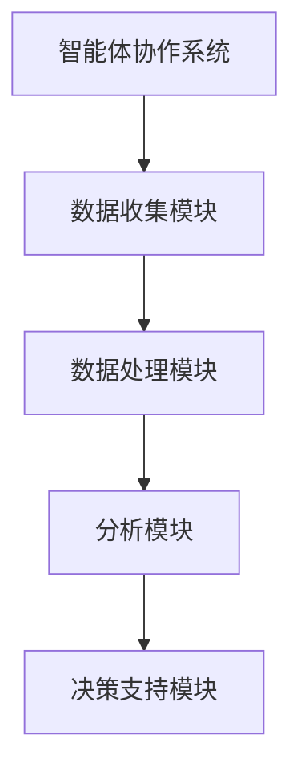
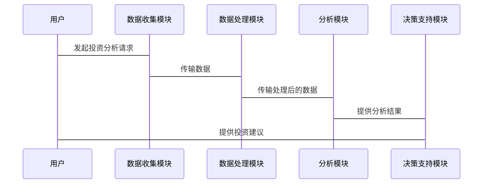
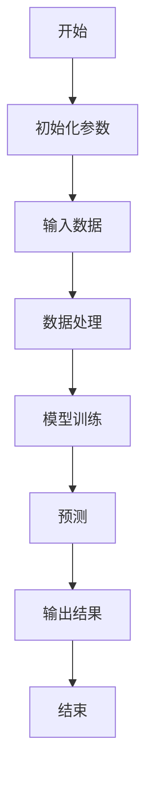

                 


## 第一部分: 智能体协作与价值投资概述

### 第1章: 智能体协作与价值投资的背景

#### 1.1 智能体协作的定义与特点
##### 1.1.1 智能体协作的定义
智能体协作是指多个智能体（Agent）通过协同工作来完成特定任务的过程。智能体可以是软件程序、算法或其他具备自主决策能力的实体。

##### 1.1.2 智能体协作的核心特点
- 分布式：智能体通常分布在不同的节点或系统中。
- 协作性：智能体之间通过通信和协调共同完成任务。
- 自适应性：智能体能够根据环境变化调整策略。

##### 1.1.3 智能体协作与传统投资方法的对比
- 传统投资方法依赖于人工分析和决策。
- 智能体协作通过自动化和分布式计算提高效率和准确性。

#### 1.2 价值投资的定义与特点
##### 1.2.1 价值投资的定义
价值投资是一种投资策略，强调以低于市场价买入具有内在价值的资产。

##### 1.2.2 价值投资的核心要素
- 公司基本面分析：包括财务状况、行业地位等。
- 市场情绪分析：投资者情绪对资产价格的影响。

##### 1.2.3 智能体协作与价值投资的结合点
智能体协作可以通过分析大量数据，提高价值投资的效率和准确性。

#### 1.3 智能体协作在价值投资中的应用背景
##### 1.3.1 传统尽职调查的局限性
- 信息收集不全面。
- 分析效率低下。
- 人工判断的主观性。

##### 1.3.2 智能体协作的优势与潜力
- 高效的数据处理能力。
- 自动化分析和决策。
- 多维度的数据整合。

##### 1.3.3 当前市场环境对智能体协作的需求
- 数据量激增。
- 市场波动加快。
- 投资者对实时分析的需求增加。

### 第2章: 智能体协作的核心概念与原理

#### 2.1 智能体协作的核心概念
##### 2.1.1 智能体的定义与分类
- 定义：智能体是具备感知环境、做出决策并执行动作的实体。
- 分类：包括简单反射型智能体、基于模型的反射型智能体等。

##### 2.1.2 协作智能体的体系结构
- 分层结构：包括感知层、决策层和执行层。
- 通信机制：智能体之间通过消息传递进行协作。

##### 2.1.3 智能体协作的目标与任务
- 目标：提高投资决策的准确性和效率。
- 任务：数据收集、分析、预测和决策支持。

#### 2.2 智能体协作的原理与机制
##### 2.2.1 智能体之间的信息交互
- 数据共享：智能体之间共享数据和分析结果。
- 通信协议：定义智能体之间的通信规则。

##### 2.2.2 智能体协作的决策过程
- 协商机制：智能体之间通过协商确定决策。
- 集成算法：结合多个智能体的分析结果做出决策。

##### 2.2.3 智能体协作的优化算法
- 分布式优化算法：如分布式遗传算法。
- 协作学习：智能体通过学习提高协作效率。

#### 2.3 智能体协作与价值投资的结合
##### 2.3.1 价值投资中的信息处理需求
- 数据量大：包括财务数据、市场数据等。
- 数据多样性：包括结构化和非结构化数据。

##### 2.3.2 智能体协作在尽职调查中的应用
- 数据收集：智能体从不同来源收集数据。
- 数据分析：智能体对数据进行清洗、分析和建模。
- 风险评估：智能体评估投资风险并提出建议。

##### 2.3.3 智能体协作对投资决策的改进
- 提高分析效率：通过分布式计算提高数据处理速度。
- 增强决策准确性：通过多智能体协作提高分析深度和广度。

### 第3章: 智能体协作的数学模型与算法

#### 3.1 智能体协作的数学模型
##### 3.1.1 智能体协作的基本模型
- 智能体协作模型：包括感知、决策和执行三个部分。
- 智能体协作的数学表达式：通过公式描述智能体之间的交互和协作过程。

##### 3.1.2 智能体协作的优化模型
- 优化目标：最大化投资收益或最小化投资风险。
- 约束条件：包括数据可用性、计算资源限制等。

##### 3.1.3 智能体协作的评估模型
- 评估指标：包括准确率、效率、稳定性等。
- 评估方法：通过实验或模拟验证模型的性能。

#### 3.2 智能体协作的核心算法
##### 3.2.1 协作智能体的通信协议
- 通信协议设计：定义智能体之间的消息格式和传输规则。
- 通信效率优化：减少数据传输延迟和带宽消耗。

##### 3.2.2 智能体协作的决策算法
- 分布式决策算法：如分布式一致性算法。
- 协商算法：智能体之间通过协商确定最终决策。

##### 3.2.3 智能体协作的优化算法
- 分布式优化算法：如分布式遗传算法、粒子群优化算法。
- 协作学习算法：智能体通过协作学习提高预测精度。

#### 3.3 智能体协作的数学公式
##### 3.3.1 智能体协作的基本公式
- 智能体协作的收益公式：R = Σ r_i，其中r_i是第i个智能体的收益。
- 智能体协作的成本公式：C = Σ c_i，其中c_i是第i个智能体的成本。

##### 3.3.2 智能体协作的优化公式
- 优化目标函数：f(x) = min/max Σ w_i x_i，其中w_i是权重，x_i是变量。
- 约束条件：g(x) ≤ 0，h(x) = 0。

##### 3.3.3 智能体协作的评估公式
- 准确率公式：Accuracy = (正确预测数)/(总预测数)。
- 召回率公式：Recall = (正确预测的正例数)/(实际正例数)。
- F1分数公式：F1 = 2 * (Precision * Recall)/(Precision + Recall)。

### 第4章: 智能体协作的系统分析与架构设计

#### 4.1 系统分析
##### 4.1.1 问题场景介绍
- 传统投资分析的低效率和高成本。
- 数据量大、复杂性高，难以通过人工完成。

##### 4.1.2 项目目标与范围
- 目标：构建智能体协作系统，提高投资分析的效率和准确性。
- 范围：包括数据收集、分析、预测和决策支持。

##### 4.1.3 系统功能需求
- 数据收集：从多种来源收集数据。
- 数据分析：对数据进行清洗、分析和建模。
- 预测：基于模型进行投资预测。
- 决策支持：提供投资建议和风险评估。

#### 4.2 系统架构设计
##### 4.2.1 系统功能模块划分
- 数据收集模块：负责从不同来源收集数据。
- 数据处理模块：对数据进行清洗和转换。
- 分析模块：对数据进行建模和分析。
- 决策支持模块：提供投资建议和风险评估。

##### 4.2.2 系统架构图


##### 4.2.3 系统接口设计
- 数据接口：定义数据输入和输出的格式和规范。
- 通信接口：定义智能体之间的通信协议。
- 用户接口：提供用户友好的操作界面。

#### 4.3 系统交互设计
##### 4.3.1 系统交互流程
- 用户发起投资分析请求。
- 系统启动数据收集模块收集数据。
- 数据处理模块对数据进行清洗和转换。
- 分析模块对数据进行建模和分析。
- 决策支持模块根据分析结果提供投资建议。

##### 4.3.2 系统交互的mermaid序列图


### 第5章: 项目实战

#### 5.1 环境安装
- 安装Python：推荐使用Anaconda或Miniconda。
- 安装必要的库：如pandas、numpy、scikit-learn等。

#### 5.2 系统核心实现源代码
##### 5.2.1 数据收集模块
```python
import pandas as pd
import requests

def collect_data(api_key):
    url = f"https://api.example.com/data?api_key={api_key}"
    response = requests.get(url)
    data = response.json()
    return pd.DataFrame(data)
```

##### 5.2.2 数据处理模块
```python
def process_data(df):
    # 数据清洗
    df = df.dropna()
    # 数据转换
    df['date'] = pd.to_datetime(df['date'])
    return df
```

##### 5.2.3 分析模块
```python
from sklearn.model_selection import train_test_split
from sklearn.linear_model import LinearRegression

def analyze_data(df, target_column):
    X = df.drop(target_column, axis=1)
    y = df[target_column]
    X_train, X_test, y_train, y_test = train_test_split(X, y, test_size=0.2)
    model = LinearRegression()
    model.fit(X_train, y_train)
    return model
```

##### 5.2.4 决策支持模块
```python
def provide_recommendation(model, new_data):
    prediction = model.predict(new_data)
    return prediction
```

#### 5.3 代码应用解读与分析
- 数据收集模块：从API获取数据并转换为DataFrame。
- 数据处理模块：清洗数据并转换日期格式。
- 分析模块：使用线性回归模型进行预测。
- 决策支持模块：基于模型预测结果提供投资建议。

#### 5.4 实际案例分析和详细讲解剖析
- 案例背景：假设我们要分析某公司的股票价格。
- 数据收集：获取该公司的历史股价、财务数据等。
- 数据处理：清洗数据并处理缺失值。
- 分析：使用线性回归模型预测未来股价。
- 决策支持：根据预测结果提供买入或卖出的建议。

#### 5.5 项目小结
- 项目实现了智能体协作在价值投资中的应用。
- 通过实际案例展示了系统的功能和效果。
- 系统具备高效性和准确性，能够显著提高投资决策的效率。

### 第6章: 最佳实践、总结与扩展阅读

#### 6.1 最佳实践 tips
- 数据质量管理：确保数据的准确性和完整性。
- 系统维护：定期更新模型和优化算法。
- 安全管理：保护数据和系统的安全性。

#### 6.2 小结
- 智能体协作能够显著提高价值投资的效率和准确性。
- 通过系统的构建和优化，投资者可以做出更明智的投资决策。

#### 6.3 注意事项
- 数据隐私和安全问题需要高度重视。
- 系统的可扩展性和灵活性需要充分考虑。
- 模型的准确性和稳定性需要定期验证和优化。

#### 6.4 拓展阅读
- 推荐阅读《智能体协作算法与应用》。
- 参考分布式计算和机器学习的相关文献。

## 附录: 智能体协作的数学公式

### 附录A: 基础公式
- 收益公式：R = Σ r_i
- 成本公式：C = Σ c_i
- 准确率公式：Accuracy = (正确预测数)/(总预测数)
- 召回率公式：Recall = (正确预测的正例数)/(实际正例数)
- F1分数公式：F1 = 2 * (Precision * Recall)/(Precision + Recall)

### 附录B: 优化公式
- 优化目标函数：f(x) = min/max Σ w_i x_i
- 约束条件：g(x) ≤ 0，h(x) = 0

### 附录C: 算法流程图


---

### 总结
这篇文章从智能体协作与价值投资的背景、核心概念、数学模型、系统架构设计、项目实战、最佳实践等方面进行了全面的分析和讲解。通过实际案例和详细的代码实现，展示了智能体协作在投资决策中的应用和优势。希望读者能够通过本文对智能体协作改进价值投资的尽职调查过程有一个清晰的理解和认识。

