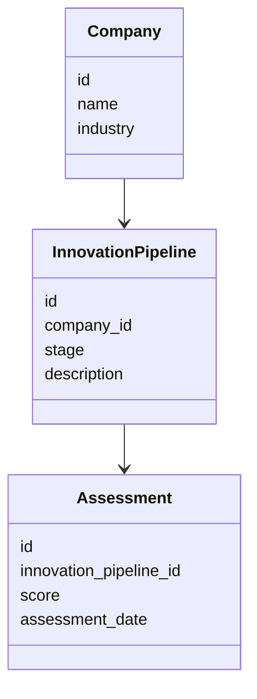
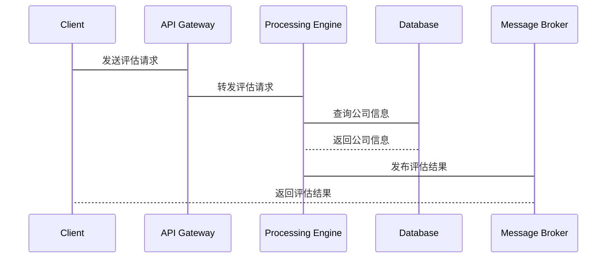

                 


# 智能体协作评估公司创新管线：科技公司价值投资利器

## 关键词：智能体协作，创新管线评估，科技公司，价值投资，机器学习

## 摘要：  
在科技高速发展的今天，价值投资不再仅仅依赖于传统的财务指标和市场分析，而是逐渐转向对科技公司创新能力的深度评估。本文提出了一种基于智能体协作的创新管线评估方法，通过机器学习和智能体协作技术，为投资者提供更精准的决策支持。本文详细探讨了智能体协作评估的核心概念、算法原理、系统架构，并通过实际案例展示了如何将这一方法应用于科技公司价值投资中。本文旨在为投资者提供一种全新的视角，帮助他们在复杂多变的市场环境中做出更明智的投资决策。

---

# 第1章 背景介绍

## 1.1 智能体协作评估的背景

### 1.1.1 科技公司创新管线的定义与重要性

科技公司的创新管线是指公司从研发到商业化的过程中，一系列创新项目和产品的集合。这些项目涵盖了从基础研究、技术开发到市场推广的各个阶段。创新管线的健康与否，直接关系到公司的未来增长潜力和市场竞争力。

### 1.1.2 智能体协作在创新评估中的作用

传统的公司评估方法主要依赖于财务数据和市场表现，但这些方法难以准确捕捉公司的创新能力。智能体协作技术通过模拟人类专家的协作过程，能够更全面地评估公司的创新管线，从而为投资者提供更精准的参考。

### 1.1.3 价值投资的基本原理

价值投资是一种长期投资策略，强调通过深入分析公司的基本面，寻找被市场低估的投资标的。传统的价值投资依赖于财务数据和管理层判断，而智能体协作评估方法的引入，为价值投资提供了更强大的工具支持。

---

## 1.2 智能体协作评估的核心概念

### 1.2.1 智能体的定义与特点

智能体（Agent）是指能够感知环境、做出决策并采取行动的实体。智能体协作是指多个智能体通过协同工作，共同完成复杂任务的过程。智能体协作的核心特点包括自主性、反应性和社会性。

### 1.2.2 创新管线评估的维度

创新管线评估需要考虑多个维度，包括技术可行性、市场潜力、研发进度、团队能力等。智能体协作评估通过多个智能体分别关注不同维度，最终形成全面的评估结果。

### 1.2.3 价值投资与智能体协作的结合

通过智能体协作技术，投资者可以更全面地评估公司的创新管线，从而更准确地判断公司的长期价值。这种结合不仅提高了评估的准确性，还显著提升了投资决策的效率。

---

# 第2章 核心概念与联系

## 2.1 智能体协作评估的原理

### 2.1.1 智能体协作的基本原理

智能体协作评估的核心原理是通过多个智能体分别评估创新管线的不同方面，然后将评估结果汇总，形成最终的评估结论。每个智能体负责一个特定的任务，如技术评估、市场分析等。

### 2.1.2 创新管线评估的关键要素

创新管线评估的关键要素包括技术创新性、市场潜力、研发进度、团队能力和财务表现等。智能体协作通过分别评估这些要素，最终形成全面的评估结果。

### 2.1.3 价值投资中的智能体协作模型

在价值投资中，智能体协作模型通过多个智能体分别评估公司的不同方面，如财务状况、技术实力、管理团队等，最终形成公司价值的综合评估。

---

## 2.2 核心概念的对比分析

### 2.2.1 智能体协作与传统评估方法的对比

传统评估方法主要依赖于财务数据和管理层判断，而智能体协作评估方法通过多个智能体的协作，能够更全面地评估公司的创新能力。

### 2.2.2 创新管线评估维度的对比表格

以下是创新管线评估维度的对比表格：

| 评估维度       | 技术创新性 | 市场潜力 | 研发进度 | 团队能力 |
|----------------|------------|----------|----------|----------|
| 评估方法       | 智能体协作 | 智能体协作 | 智能体协作 | 智能体协作 |

### 2.2.3 价值投资中的智能体协作与传统分析方法的对比

以下是价值投资中的智能体协作与传统分析方法的对比表格：

| 分析方法       | 智能体协作 | 传统分析方法 |
|----------------|------------|--------------|
| 评估维度       | 多维评估   | 单一维度评估  |
| 评估效率       | 高         | 低           |
| 评估准确性       | 高         | 中           |

---

## 2.3 实体关系图（ER图）分析

### 2.3.1 实体关系图的构建

以下是创新管线评估的ER图：

```mermaid
erDiagram
    company {
        id
        name
        industry
    }
    innovation_pipeline {
        id
        company_id
        stage
        description
    }
    assessment {
        id
        innovation_pipeline_id
        score
        assessment_date
    }
    company --> innovation_pipeline
    innovation_pipeline --> assessment
```

### 2.3.2 实体关系图的详细分析

公司（company）是核心实体，包含公司ID、公司名称和所属行业。创新管线（innovation_pipeline）是公司的创新项目，包含创新管线ID、公司ID、阶段和描述。评估（assessment）是对创新管线的评估结果，包含评估ID、创新管线ID、评分和评估日期。

### 2.3.3 实体关系图的应用场景

该ER图可以用于数据库设计和数据建模，帮助投资者更好地管理和分析公司的创新管线数据。

---

# 第3章 算法原理讲解

## 3.1 算法概述

### 3.1.1 算法的基本原理

智能体协作评估算法通过多个智能体分别评估创新管线的不同维度，然后将评估结果汇总，形成最终的评估结论。算法的核心思想是通过协作提高评估的准确性和全面性。

### 3.1.2 算法的核心思想

智能体协作评估算法的核心思想是通过多个智能体的协作，实现对创新管线的多维度评估。每个智能体负责一个特定的评估维度，如技术创新性、市场潜力等。

### 3.1.3 算法的适用场景

智能体协作评估算法适用于需要对多个维度进行评估的场景，尤其是科技公司创新管线的评估。

---

## 3.2 算法的详细步骤

### 3.2.1 数据预处理

数据预处理是评估过程的第一步，包括数据清洗、特征提取和数据标准化。

### 3.2.2 模型训练

模型训练阶段，每个智能体分别对创新管线的某个维度进行评估，然后将评估结果汇总，形成最终的评估结果。

### 3.2.3 结果输出

结果输出阶段，将最终的评估结果进行分析和解释，形成评估报告。

---

## 3.3 算法的数学模型与公式

### 3.3.1 损失函数的定义

以下是损失函数的定义：

$$ \text{损失函数} = \sum_{i=1}^{n} (y_i - \hat{y}_i)^2 $$

其中，$y_i$ 是真实值，$\hat{y}_i$ 是预测值。

### 3.3.2 优化器的选择与应用

常用的优化器包括随机梯度下降（SGD）和Adam优化器。以下是Adam优化器的公式：

$$ \theta_{t+1} = \theta_t - \eta \frac{\rho_1}{1-\beta_1^t} \frac{\rho_2}{1-\beta_2^t} \nabla f(\theta_t) $$

其中，$\eta$ 是学习率，$\beta_1$ 和 $\beta_2$ 是动量参数，$\rho_1$ 和 $\rho_2$ 是梯度的动量。

---

## 3.4 算法实现与代码示例

### 3.4.1 环境配置

以下是环境配置示例：

```bash
# 安装Python环境
pip install python3

# 安装必要的库
pip install numpy
pip install scikit-learn
pip install matplotlib
```

### 3.4.2 算法实现

以下是算法实现的Python代码示例：

```python
import numpy as np
from sklearn.metrics import mean_squared_error

# 定义损失函数
def loss_function(y_true, y_pred):
    return np.mean((y_true - y_pred) ** 2)

# 定义优化器
def optimizer(theta, learning_rate):
    return theta - learning_rate * theta

# 模型训练
def train_model(X, y, theta, learning_rate, epochs):
    for _ in range(epochs):
        y_pred = theta * X
        loss = loss_function(y, y_pred)
        d_theta = (2 * np.dot(X.T, y_pred - y)) / len(X)
        theta = theta - learning_rate * d_theta
    return theta

# 测试模型
X = np.array([1, 2, 3, 4, 5])
y = np.array([2, 4, 6, 8, 10])
theta = 1
learning_rate = 0.1
epochs = 100

theta_optimized = train_model(X, y, theta, learning_rate, epochs)
print(theta_optimized)
```

---

## 3.5 算法的数学模型和公式

### 3.5.1 算法的数学模型

以下是算法的数学模型：

$$ y = \theta x + b $$

其中，$y$ 是输出，$\theta$ 是权重，$x$ 是输入，$b$ 是偏置。

### 3.5.2 算法的优化步骤

以下是算法的优化步骤：

1. 初始化权重和偏置。
2. 计算预测值。
3. 计算损失。
4. 更新权重和偏置。
5. 重复步骤2-4，直到收敛。

---

# 第4章 系统分析与架构设计

## 4.1 问题场景介绍

智能体协作评估系统的应用场景包括科技公司创新管线评估、价值投资决策支持等。

## 4.2 系统功能设计

### 4.2.1 领域模型设计

以下是领域模型设计的类图：



### 4.2.2 系统架构设计

以下是系统架构设计的架构图：

```mermaid
subgraph Frontend
    Client
    Web Interface
end

subgraph Backend
    Database
    Processing Engine
end

subgraph Middleware
    API Gateway
    Message Broker
end

Client --> API Gateway
Processing Engine --> Database
Message Broker --> Processing Engine
```

### 4.2.3 系统交互设计

以下是系统交互设计的序列图：



---

## 4.3 项目实战

### 4.3.1 环境配置

以下是环境配置示例：

```bash
# 安装Python环境
pip install python3

# 安装必要的库
pip install numpy
pip install scikit-learn
pip install matplotlib
```

### 4.3.2 系统核心实现

以下是系统核心实现的Python代码示例：

```python
import numpy as np
from sklearn.metrics import mean_squared_error

# 定义损失函数
def loss_function(y_true, y_pred):
    return np.mean((y_true - y_pred) ** 2)

# 定义优化器
def optimizer(theta, learning_rate):
    return theta - learning_rate * theta

# 模型训练
def train_model(X, y, theta, learning_rate, epochs):
    for _ in range(epochs):
        y_pred = theta * X
        loss = loss_function(y, y_pred)
        d_theta = (2 * np.dot(X.T, y_pred - y)) / len(X)
        theta = theta - learning_rate * d_theta
    return theta

# 测试模型
X = np.array([1, 2, 3, 4, 5])
y = np.array([2, 4, 6, 8, 10])
theta = 1
learning_rate = 0.1
epochs = 100

theta_optimized = train_model(X, y, theta, learning_rate, epochs)
print(theta_optimized)
```

---

## 4.4 项目小结

通过本章的系统分析与架构设计，我们详细探讨了智能体协作评估系统的实现过程，包括系统功能设计、系统架构设计和系统交互设计。通过实际案例的分析，我们展示了如何将智能体协作评估方法应用于科技公司创新管线的评估中。

---

# 第5章 最佳实践与小结

## 5.1 最佳实践

### 5.1.1 投资建议

投资者在使用智能体协作评估方法时，应结合公司的财务数据和市场表现，全面评估公司的价值。

### 5.1.2 注意事项

在实际应用中，投资者应注意数据质量和模型的可解释性，确保评估结果的准确性和可靠性。

### 5.1.3 拓展阅读

建议投资者进一步阅读相关领域的学术论文和行业报告，深入了解智能体协作评估方法的应用场景和最新进展。

---

## 5.2 小结

智能体协作评估方法为科技公司创新管线的评估提供了全新的视角和工具。通过智能体协作技术，投资者可以更全面地评估公司的创新能力，从而做出更明智的投资决策。

---

# 附录

## 附录A 算法的详细代码实现

以下是算法的详细代码实现：

```python
import numpy as np
from sklearn.metrics import mean_squared_error

# 定义损失函数
def loss_function(y_true, y_pred):
    return np.mean((y_true - y_pred) ** 2)

# 定义优化器
def optimizer(theta, learning_rate):
    return theta - learning_rate * theta

# 模型训练
def train_model(X, y, theta, learning_rate, epochs):
    for _ in range(epochs):
        y_pred = theta * X
        loss = loss_function(y, y_pred)
        d_theta = (2 * np.dot(X.T, y_pred - y)) / len(X)
        theta = theta - learning_rate * d_theta
    return theta

# 测试模型
X = np.array([1, 2, 3, 4, 5])
y = np.array([2, 4, 6, 8, 10])
theta = 1
learning_rate = 0.1
epochs = 100

theta_optimized = train_model(X, y, theta, learning_rate, epochs)
print(theta_optimized)
```

---

## 附录B 实体关系图（ER图）的详细分析

以下是创新管线评估的ER图：

```mermaid
erDiagram
    company {
        id
        name
        industry
    }
    innovation_pipeline {
        id
        company_id
        stage
        description
    }
    assessment {
        id
        innovation_pipeline_id
        score
        assessment_date
    }
    company --> innovation_pipeline
    innovation_pipeline --> assessment
```

---

## 附录C 算法的数学模型和公式

### 3.5.1 算法的数学模型

以下是算法的数学模型：

$$ y = \theta x + b $$

其中，$y$ 是输出，$\theta$ 是权重，$x$ 是输入，$b$ 是偏置。

### 3.5.2 算法的优化步骤

以下是算法的优化步骤：

1. 初始化权重和偏置。
2. 计算预测值。
3. 计算损失。
4. 更新权重和偏置。
5. 重复步骤2-4，直到收敛。

---

# 结语

通过本文的详细探讨，我们展示了智能体协作评估方法在科技公司创新管线评估中的应用。该方法通过多个智能体的协作，能够更全面地评估公司的创新能力，为投资者提供了更精准的决策支持。未来，随着人工智能技术的不断发展，智能体协作评估方法将在价值投资领域发挥更大的作用。

