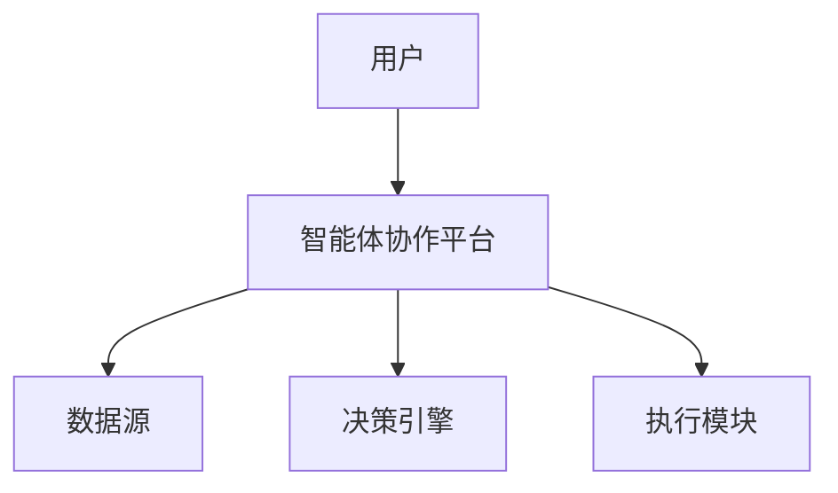

                 


# 智能体协作评估公司数字化转型进程：把握增长机遇

> 关键词：智能体协作，数字化转型，评估模型，系统架构，增长机遇

> 摘要：数字化转型是企业在当今快速变化的商业环境中必须面对的挑战。本文通过智能体协作的视角，深入分析数字化转型的核心要素，构建评估模型，并结合实际案例，为企业提供增长策略。

---

## 第1章: 数字化转型的背景与挑战

### 1.1 数字化转型的定义与内涵
数字化转型是指企业利用数字技术（如人工智能、大数据、云计算等）重构业务流程、商业模式和组织结构，以实现更高效、灵活和创新的运营。其核心在于通过技术驱动，提升企业的竞争力和适应性。

### 1.2 智能体协作的概念与特点
智能体是指具备感知、决策和执行能力的实体或系统。智能体协作是指多个智能体通过信息共享和协同决策，共同完成复杂任务。其特点包括：目标一致性、信息共享性、行为协调性和动态适应性。

### 1.3 数字化转型与智能体协作的关系
数字化转型需要智能体协作来实现跨部门、跨系统的高效协同。智能体协作通过优化信息流和决策过程，推动数字化转型的深入实施。

---

## 第2章: 数字化转型的评估框架

### 2.1 数字化转型评估的核心要素
- **业务目标**：评估数字化转型是否支持企业的战略目标。
- **技术实现**：评估技术架构的先进性和可扩展性。
- **组织结构**：评估组织是否适应数字化转型的需求。
- **价值创造**：评估数字化转型是否为业务创造价值。

### 2.2 智能体协作评估指标
- **协作效率**：任务完成的速度和质量。
- **信息共享**：信息的完整性和及时性。
- **系统集成**：不同系统之间的兼容性和交互性。
- **用户满意度**：用户对协作效果的满意度。

### 2.3 数字化转型评估的流程与方法
1. **评估流程**：从目标设定、数据收集到分析和改进。
2. **评估方法**：包括定性分析和定量分析。
3. **评估工具**：如数据分析平台和协作软件。

---

## 第3章: 智能体协作的数学模型与算法原理

### 3.1 智能体协作的核心算法
智能体协作算法的核心在于信息共享和决策优化。以下是一个简单的协作效率模型：

$$ E = \frac{\sum_{i=1}^{n} w_i x_i}{\sum_{i=1}^{n} w_i} $$

其中：
- $E$ 表示协作效率
- $w_i$ 表示第 $i$ 个智能体的权重
- $x_i$ 表示第 $i$ 个智能体的贡献

### 3.2 信息共享模型
信息共享是智能体协作的关键。以下是一个信息共享模型：

$$ I = \sum_{i=1}^{m} \frac{w_i}{d_i} $$

其中：
- $I$ 表示信息共享度
- $w_i$ 表示第 $i$ 个智能体的信息权重
- $d_i$ 表示第 $i$ 个智能体的信息距离

### 3.3 算法实现与案例分析
以下是实现协作效率计算的Python代码：

```python
def collaborative_efficiency(weights, contributions):
    total_weight = sum(weights)
    weighted_sum = sum(w * c for w, c in zip(weights, contributions))
    return weighted_sum / total_weight

weights = [0.4, 0.3, 0.3]
contributions = [0.8, 0.6, 0.5]
efficiency = collaborative_efficiency(weights, contributions)
print(f"协作效率为: {efficiency}")
```

---

## 第4章: 系统分析与架构设计方案

### 4.1 问题场景介绍
企业在数字化转型中面临数据孤岛、协作低效等问题，需要通过智能体协作来优化流程。

### 4.2 系统功能设计
- **领域模型**：定义系统的核心功能模块。
- **架构设计**：采用微服务架构，确保系统的可扩展性。

### 4.3 系统架构图（Mermaid）



### 4.4 接口设计与交互流程
系统通过API接口实现数据交互，确保各模块之间的高效协作。

---

## 第5章: 项目实战

### 5.1 环境安装
安装Python、Jupyter Notebook和相关库（如numpy、pandas）。

### 5.2 核心代码实现
实现协作效率计算的Python代码：

```python
import numpy as np

def calculate_efficiency(weights, contributions):
    return np.dot(weights, contributions) / sum(weights)

weights = np.array([0.4, 0.3, 0.3])
contributions = np.array([0.8, 0.6, 0.5])
efficiency = calculate_efficiency(weights, contributions)
print(f"协作效率为: {efficiency}")
```

### 5.3 案例分析
通过实际案例分析，验证模型的有效性，并总结经验。

---

## 第6章: 最佳实践与总结

### 6.1 小结
智能体协作是推动企业数字化转型的重要手段，通过科学的评估和优化，企业可以实现高效协作和持续增长。

### 6.2 注意事项
- 确保数据安全和隐私保护。
- 定期优化协作模型。
- 培训员工，提升协作能力。

### 6.3 拓展阅读
推荐相关书籍和论文，进一步深入学习智能体协作和数字化转型的知识。

---

通过以上内容，企业可以更好地理解和实施数字化转型，抓住增长机遇，实现可持续发展。

