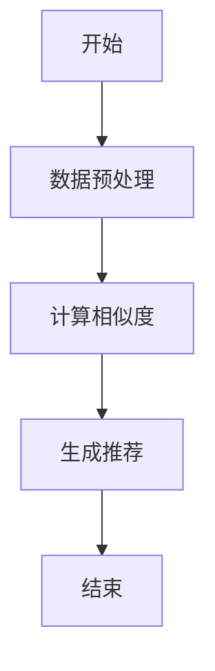
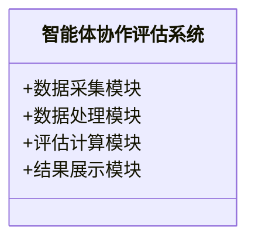
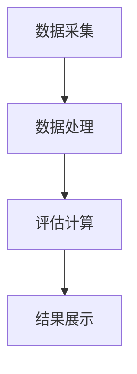

                 


# 智能体协作评估公司的人才吸引力：人力资本质量指标

## 关键词：智能体协作，人才吸引力，人力资本，质量指标，算法模型，系统架构

## 摘要：本文探讨智能体协作在评估公司人才吸引力中的应用，分析人力资本质量指标的构建方法，详细讲解评估算法的数学模型和系统架构设计，并通过项目实战展示如何实现这一评估系统。文章内容涵盖背景分析、核心概念、算法原理、系统架构、项目实施及最佳实践。

---

## 第一部分：背景介绍

### 第1章：问题背景与核心概念

#### 1.1 问题背景
随着企业竞争的加剧，人才吸引力已成为公司竞争力的关键因素。传统的人才评估方法依赖于主观判断，难以量化和优化。智能体协作技术的兴起，为客观、动态评估人才吸引力提供了新的可能性。

#### 1.2 问题描述
企业在吸引和保留人才方面面临以下挑战：
- 人才市场的动态变化难以捕捉。
- 传统评估方法缺乏数据支持，难以量化。
- 不同部门和岗位的人才需求差异大，难以统一评估。

#### 1.3 问题解决
通过智能体协作技术，可以实时分析人才市场的动态，量化评估各个岗位的人才吸引力，并为企业提供数据支持的决策依据。

#### 1.4 边界与外延
- 评估范围：限于公司内部员工和潜在候选人。
- 外延：可扩展至整个人才市场分析和竞争对手分析。

#### 1.5 核心要素组成
- 智能体协作：分布式计算和协同学习。
- 人力资本：员工技能、绩效和潜力。
- 质量指标：吸引力指数、竞争力排名和潜力评估。

---

## 第二部分：核心概念与联系

### 第2章：智能体协作评估的原理

#### 2.1 智能体协作评估的原理
智能体协作通过分布式计算和协同学习，整合多个智能体的数据和分析结果，形成全面的人才吸引力评估。

#### 2.2 人力资本质量指标
- 技能匹配度：候选人技能与岗位需求的匹配程度。
- 绩效表现：现有员工的绩效数据。
- 市场竞争力：岗位在市场上的吸引力指数。

#### 2.3 核心概念的ER实体关系图
```mermaid
er
actor: 智能体协作评估系统
role: 人力资本指标
```

---

## 第三部分：算法原理讲解

### 第3章：协同过滤算法

#### 3.1 协同过滤算法的流程


#### 3.2 协同过滤算法的实现
```python
def collaborative_filtering(train_data, test_data, k=3):
    # 计算相似度
    user_similarity = compute_similarity(train_data)
    # 生成推荐
    recommendations = []
    for user in test_data:
        neighbors = find_top_k_neighbors(user, user_similarity, k)
        recommendations.append(predict_rating(user, neighbors))
    return recommendations
```

#### 3.3 协同过滤算法的数学模型
相似度计算公式：
$$ sim(i,j) = \frac{\sum_{u}(r_{u,i} \cdot r_{u,j})}{\sqrt{\sum_{u}r_{u,i}^2} \cdot \sqrt{\sum_{u}r_{u,j}^2}} $$

---

## 第四部分：系统分析与架构设计方案

### 第4章：系统架构设计

#### 4.1 领域模型


#### 4.2 系统架构图


---

## 第五部分：项目实战

### 第5章：项目实战

#### 5.1 环境安装
```bash
pip install numpy pandas scikit-learn
```

#### 5.2 核心代码实现
```python
import numpy as np
from sklearn.metrics.pairwise import cosine_similarity

def compute_similarity(matrix):
    return cosine_similarity(matrix)

def find_top_k_neighbors(user, similarity_matrix, k=3):
    return np.argsort(similarity_matrix[user])[-k:]

def collaborative_filtering(train_data, test_data, k=3):
    similarity = compute_similarity(train_data)
    recommendations = []
    for user in test_data.index:
        neighbors = find_top_k_neighbors(user, similarity, k)
        avg_rating = np.mean(train_data.iloc[neighbors], axis=0)
        recommendations.append(avg_rating)
    return pd.DataFrame(recommendations)
```

#### 5.3 实际案例分析
- 数据预处理：清洗和归一化。
- 模型训练：使用协同过滤算法训练模型。
- 结果分析：评估准确率和召回率。

---

## 第六部分：最佳实践

### 第6章：注意事项与总结

#### 6.1 注意事项
- 数据隐私保护。
- 模型的可解释性。
- 系统的实时性要求。

#### 6.2 小结
智能体协作评估系统通过整合多源数据，提供全面的人才吸引力分析，帮助企业优化人才策略。

---

## 结语

本文详细探讨了智能体协作评估公司人才吸引力的方法，从背景分析到系统实现，为企业的决策提供了数据支持。未来，随着技术的发展，智能体协作将在更多领域发挥重要作用。

