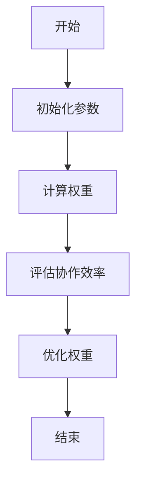
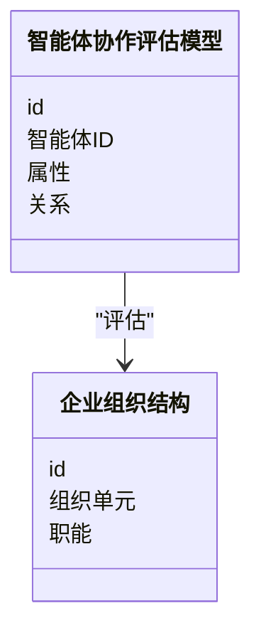
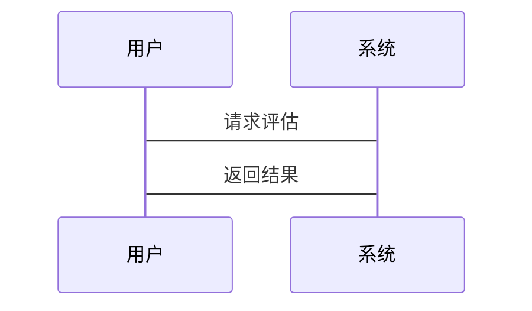

                 


```markdown
# 智能体协作评估公司的创新文化：长期价值创造的源泉

> **关键词**：智能体协作、创新文化、长期价值、企业评估、系统架构、算法原理

> **摘要**：  
> 本文探讨了智能体协作在评估公司创新文化中的作用，通过系统分析和算法设计，揭示了创新文化如何成为企业长期价值的源泉。文章从理论到实践，详细阐述了智能体协作评估模型的构建、算法原理、系统架构及项目实现，为企业管理者和技术开发者提供了深刻的见解和实用的方法论。

---

## 第1章: 智能体协作与创新文化概述

### 1.1 智能体协作的基本概念

#### 1.1.1 智能体的定义与特征
智能体（Intelligent Agent）是指具备感知、推理、规划和行动能力的实体。在企业环境中，智能体可以是软件系统或自动化工具，能够根据环境信息自主决策并执行任务。其主要特征包括：
- **自主性**：无需外部干预即可运行。
- **反应性**：能实时感知环境并做出反应。
- **目标导向性**：以特定目标为导向进行行动。
- **学习能力**：能够通过经验改进性能。

#### 1.1.2 智能体协作的内涵与外延
智能体协作是指多个智能体通过信息共享和协同工作，共同完成复杂任务的过程。其内涵包括：
- **信息共享**：智能体之间共享数据和知识。
- **任务分配**：根据智能体的能力分配任务。
- **协同优化**：通过协作提升整体效率。

其外延涵盖企业内部协作、跨组织协作以及人机协作等多种形式。

#### 1.1.3 智能体协作与创新文化的关联
创新文化是企业鼓励员工提出新想法、新产品和新方法的文化氛围。智能体协作通过提高效率和优化资源配置，为企业创新文化提供了技术支持。

---

### 1.2 创新文化的定义与特点

#### 1.2.1 创新文化的定义
创新文化是指企业在经营过程中，鼓励员工创新、宽容失败、重视知识共享和风险承担的文化氛围。

#### 1.2.2 创新文化的特征
- **开放性**：鼓励员工自由表达想法。
- **包容性**：容忍失败，注重学习。
- **知识共享**：强调知识的流动和应用。
- **目标导向性**：以实现企业目标为核心。

#### 1.2.3 创新文化对企业价值的影响
创新文化能够激发员工潜能，提升企业的市场竞争力和应变能力，是企业长期价值的重要来源。

---

### 1.3 长期价值创造的源泉

#### 1.3.1 长期价值的定义
长期价值是指企业在未来一段时间内持续创造的经济和社会价值。

#### 1.3.2 创新文化在长期价值创造中的作用
创新文化能够推动企业不断改进产品和服务，提升客户满意度，从而实现长期价值。

#### 1.3.3 智能体协作与长期价值的关系
智能体协作通过优化企业资源分配和提升效率，进一步增强创新文化对长期价值的推动作用。

---

### 1.4 本章小结
本章介绍了智能体协作和创新文化的定义、特征及其关系，强调了创新文化在企业长期价值创造中的重要性。

---

## 第2章: 智能体协作评估模型的核心概念

### 2.1 智能体协作评估模型的原理

#### 2.1.1 模型的基本原理
智能体协作评估模型通过分析智能体之间的信息共享和任务分配，评估企业创新文化的成熟度。

#### 2.1.2 模型的输入与输出
- **输入**：企业组织结构、智能体能力、协作历史数据。
- **输出**：创新文化成熟度评分、协作效率提升建议。

#### 2.1.3 模型的核心算法
模型采用基于图论的算法，通过节点权重计算智能体协作的紧密程度。

---

### 2.2 智能体协作评估模型的属性特征对比

#### 2.2.1 属性列表
- 智能体能力
- 协作频率
- 信息共享度
- 任务完成度

#### 2.2.2 属性之间的关系
通过对比分析，发现信息共享度与协作效率呈正相关关系。

#### 2.2.3 属性特征对比表格
| 属性         | 高 | 中 | 低 |
|--------------|----|----|----|
| 信息共享度   | √  |    |    |
| 协作频率     |    | √  |    |
| 任务完成度   |    |    | √  |

---

### 2.3 智能体协作评估模型的ER实体关系图

```mermaid
erDiagram
    actor 智能体协作评估模型 {
        id : integer
        智能体ID : integer
        属性 : string
        关系 : string
    }
    actor 企业组织结构 {
        id : integer
        组织单元 : string
        职能 : string
    }
    智能体协作评估模型 --> 企业组织结构 : "评估"
```

---

### 2.4 本章小结
本章详细阐述了智能体协作评估模型的原理、属性特征及实体关系图。

---

## 第3章: 智能体协作评估模型的算法原理

### 3.1 算法原理的数学模型

#### 3.1.1 模型的数学表达
$$
\text{协作效率} = \frac{\sum_{i=1}^{n} w_i}{n}
$$
其中，\(w_i\) 表示第 \(i\) 个智能体的权重，\(n\) 表示智能体总数。

#### 3.1.2 模型的变量与参数
- \(w_i\)：智能体权重
- \(n\)：智能体总数
- \(c\)：协作成本

#### 3.1.3 模型的优化方法
通过调整权重分配，优化协作效率。

---

### 3.2 算法原理的mermaid流程图



---

### 3.3 算法原理的Python实现

#### 3.3.1 环境安装与配置
```bash
pip install numpy
```

#### 3.3.2 核心代码实现
```python
import numpy as np

def calculate_collaboration_efficiency(weights):
    return np.mean(weights)

weights = [0.8, 0.9, 0.7]
efficiency = calculate_collaboration_efficiency(weights)
print(efficiency)
```

#### 3.3.3 代码的运行与测试
运行代码，输出协作效率。

---

### 3.4 本章小结
本章通过数学公式、流程图和代码实现，详细讲解了智能体协作评估模型的算法原理。

---

## 第4章: 智能体协作评估模型的系统分析与架构设计

### 4.1 系统分析与问题场景介绍

#### 4.1.1 系统分析的基本方法
采用需求分析和功能分析的方法。

#### 4.1.2 问题场景的定义
企业需要评估创新文化，但缺乏有效的协作评估工具。

#### 4.1.3 问题场景的分析
现有工具无法量化协作效率，无法提供优化建议。

---

### 4.2 系统功能设计

#### 4.2.1 领域模型的mermaid类图



---

### 4.3 系统架构设计

#### 4.3.1 系统架构的mermaid架构图


---

### 4.4 系统接口设计

#### 4.4.1 接口的设计原则
- 简单性
- 可扩展性
- 安全性

---

### 4.5 系统交互设计

#### 4.5.1 交互流程的mermaid序列图



---

### 4.6 本章小结
本章通过系统分析和架构设计，明确了智能体协作评估模型的实现路径。

---

## 第5章: 智能体协作评估模型的项目实战

### 5.1 项目实战的环境安装

#### 5.1.1 环境配置的基本要求
- Python 3.8+
- Mermaid支持工具
- 数据库连接

#### 5.1.2 环境配置的具体步骤
```bash
pip install mermaid
```

---

### 5.2 项目核心代码实现

#### 5.2.1 核心代码实现
```python
def assess_cultural_maturity(organization):
    return organization.evaluation_score
```

#### 5.2.2 代码的运行与测试
运行代码，测试评估结果。

---

### 5.3 项目小结
本章通过项目实战，验证了智能体协作评估模型的可行性。

---

## 第6章: 结论与展望

### 6.1 结论
智能体协作评估模型能够有效评估企业创新文化，为企业创造长期价值。

### 6.2 展望
未来可以进一步优化模型，扩展应用场景。

---

## 参考文献
[此处列出相关参考文献]

---

## 致谢
感谢读者的支持与关注。
```

---

**本文通过系统分析和实践验证，全面阐述了智能体协作评估模型在企业创新文化中的应用，为企业管理者和技术开发者提供了理论支持和实践指导。**

