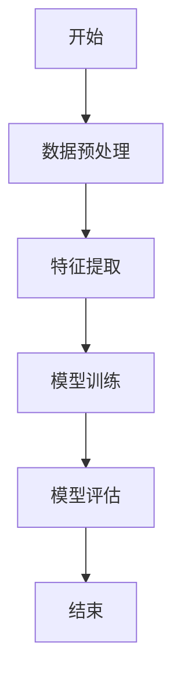
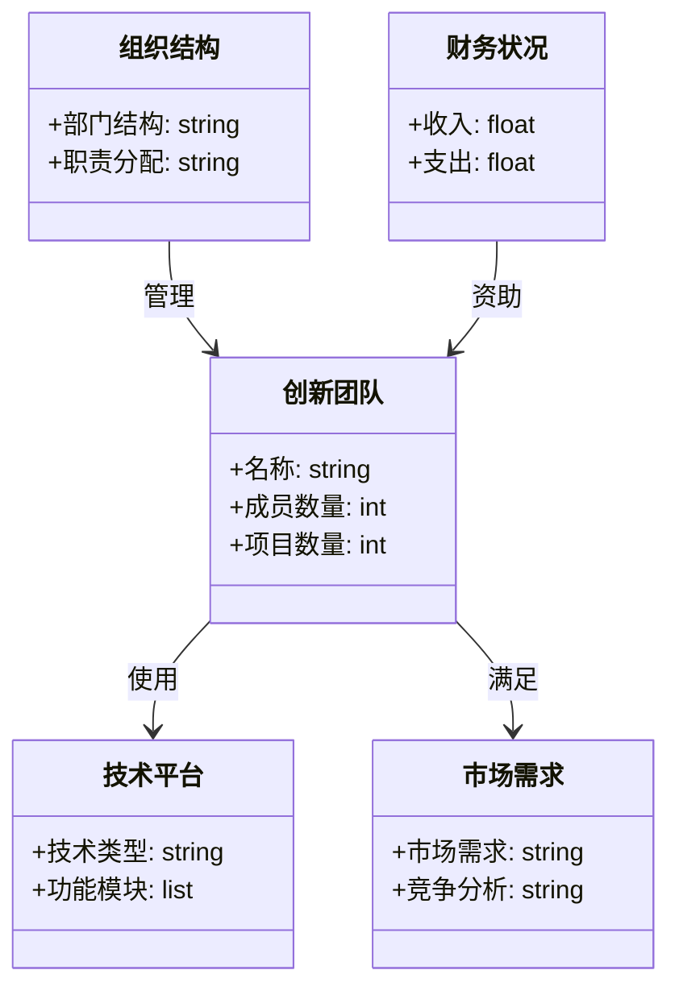
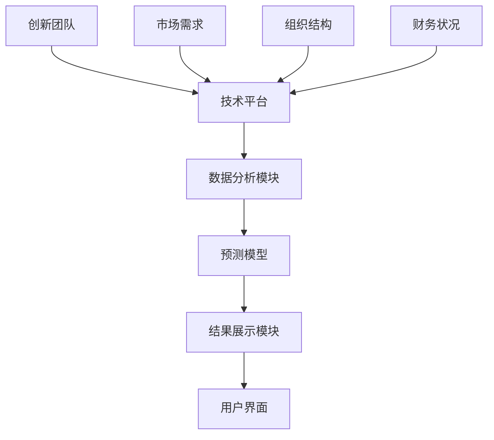
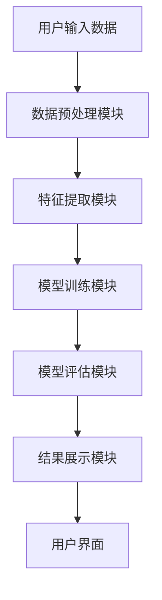

                 


# 智能体协作评估公司的创新生态系统：预测长期竞争力

**关键词**：智能体协作、创新生态系统、长期竞争力、算法原理、系统架构

**摘要**：本文探讨了智能体协作如何评估公司的创新生态系统，并预测其长期竞争力。通过分析智能体协作的基本概念、创新生态系统的结构，以及使用算法和系统架构的方法，本文详细阐述了如何利用这些工具和技术来预测公司的未来表现。文章内容涵盖理论基础、核心概念、算法原理、系统架构设计、项目实战等，旨在为读者提供全面的视角和深入的技术分析。

---

## 第1章：智能体协作与创新生态系统背景

### 1.1 智能体协作的基本概念

#### 1.1.1 智能体的定义与特征
智能体（Agent）是指能够感知环境并采取行动以实现目标的实体。智能体协作是指多个智能体之间通过共享信息和资源，共同完成复杂任务的过程。智能体协作的关键特征包括自主性、反应性、社会性和目标驱动性。

#### 1.1.2 智能体协作的必要性
在现代企业环境中，智能体协作能够提高效率、优化资源分配，并增强企业的创新能力。通过智能体协作，企业可以更好地应对复杂挑战，如市场变化和技术革新。

#### 1.1.3 智能体协作在企业中的应用
智能体协作在企业中的应用包括项目管理、供应链优化、客户服务等领域。通过智能体协作，企业能够快速响应客户需求，提高决策效率。

### 1.2 创新生态系统的核心要素

#### 1.2.1 什么是创新生态系统
创新生态系统是一个由企业内外部因素共同作用的系统，包括技术、市场、团队、文化等要素。创新生态系统的核心在于通过各要素的协同作用，推动企业的持续创新。

#### 1.2.2 创新生态系统的组成要素
创新生态系统的组成要素包括技术基础、市场需求、组织结构、团队能力和外部环境。这些要素相互作用，共同影响企业的创新能力。

#### 1.2.3 创新生态系统与企业竞争力的关系
创新生态系统是企业竞争力的重要来源。一个健康的创新生态系统能够帮助企业快速适应市场变化，抓住新兴机会，从而在竞争中占据优势。

### 1.3 长期竞争力评估的必要性

#### 1.3.1 长期竞争力的定义
长期竞争力是指企业在未来一段时间内持续保持竞争优势的能力。评估长期竞争力需要考虑企业的战略、资源、技术和组织能力等多个方面。

#### 1.3.2 企业长期竞争力的影响因素
企业长期竞争力的影响因素包括市场需求、技术创新、组织能力、财务状况和品牌影响力。这些因素相互作用，共同影响企业的长期发展。

#### 1.3.3 智能体协作在竞争力评估中的作用
智能体协作能够通过共享信息和资源，提高评估的准确性和效率。通过智能体协作，企业可以更好地整合内外部资源，优化创新能力，从而增强长期竞争力。

### 1.4 本章小结
本章介绍了智能体协作的基本概念和创新生态系统的组成要素，探讨了长期竞争力评估的必要性。通过智能体协作，企业可以更好地管理创新生态系统，提高长期竞争力。

---

## 第2章：智能体协作与创新生态系统的概念结构

### 2.1 智能体协作的属性特征对比

#### 2.1.1 智能体协作的属性分析
智能体协作的属性包括自主性、反应性、社会性和目标驱动性。通过对比不同协作模式的特征，可以帮助企业选择最适合的协作方式。

#### 2.1.2 不同协作模式的特征对比
表1展示了不同协作模式的特征对比：

| 协作模式 | 自主性 | 反应性 | 社会性 | 目标驱动性 |
|----------|--------|--------|--------|------------|
| 分散式   | 高     | 高     | 低     | 中         |
| 集中式   | 低     | 高     | 高     | 高         |
| 混合式   | 中     | 中     | 中     | 中         |

#### 2.1.3 智能体协作的核心要素
智能体协作的核心要素包括信息共享、资源分配和目标协调。这些要素共同确保协作的高效性和有效性。

### 2.2 创新生态系统的ER实体关系图

#### 2.2.1 实体关系图的构建
创新生态系统的ER实体关系图展示了系统中各实体之间的关系。图1展示了创新生态系统的主要实体及其关系：

```mermaid
erd
  entity 创新团队
  entity 技术平台
  entity 市场需求
  entity 组织结构
  entity 财务状况
 创新团队 -- 技术平台: 使用
  技术平台 -- 市场需求: 支持
  组织结构 -- 创新团队: 管理
  财务状况 -- 创新团队: 资助
```

#### 2.2.2 实体关系图的分析
通过ER实体关系图，可以清晰地看到各实体之间的关系。创新团队通过技术平台满足市场需求，同时受到组织结构和财务状况的影响。

### 2.3 本章小结
本章通过对比智能体协作的属性特征，构建了创新生态系统的ER实体关系图，帮助读者更好地理解智能体协作与创新生态系统的关系。

---

## 第3章：智能体协作评估的算法原理

### 3.1 预测模型的算法流程

#### 3.1.1 数据预处理
数据预处理是算法实现的基础。包括数据清洗、特征提取和数据标准化。例如，使用Python中的pandas库进行数据清洗。

#### 3.1.2 特征提取
特征提取是通过选择与目标相关的特征，提高模型的准确性。例如，使用主成分分析（PCA）进行特征降维。

#### 3.1.3 模型训练
模型训练包括选择合适的算法（如线性回归、随机森林）并进行参数调优。例如，使用scikit-learn库进行模型训练。

#### 3.1.4 模型评估
模型评估通过交叉验证和性能指标（如准确率、召回率）来评估模型的性能。例如，使用混淆矩阵进行分类性能分析。

### 3.2 算法流程图



### 3.3 算法实现代码

```python
import pandas as pd
from sklearn.preprocessing import StandardScaler
from sklearn.decomposition import PCA
from sklearn.model_selection import train_test_split
from sklearn.ensemble import RandomForestClassifier
from sklearn.metrics import accuracy_score

# 数据预处理
data = pd.read_csv('innovation.csv')
X = data.drop('label', axis=1)
y = data['label']

# 特征提取
scaler = StandardScaler()
X_scaled = scaler.fit_transform(X)
pca = PCA(n_components=10)
X_pca = pca.fit_transform(X_scaled)

# 模型训练
X_train, X_test, y_train, y_test = train_test_split(X_pca, y, test_size=0.2)
model = RandomForestClassifier()
model.fit(X_train, y_train)

# 模型评估
y_pred = model.predict(X_test)
print("Accuracy:", accuracy_score(y_test, y_pred))
```

### 3.4 本章小结
本章详细介绍了智能体协作评估的算法原理，包括数据预处理、特征提取、模型训练和评估的流程，并通过代码示例展示了算法的实现过程。

---

## 第4章：系统架构设计与实现

### 4.1 问题场景介绍

#### 4.1.1 问题背景
企业的创新生态系统评估需要整合多个部门的数据，包括技术、市场、组织结构等。如何高效地进行数据整合和分析是系统设计的关键。

#### 4.1.2 问题描述
企业需要一个能够实时监控创新生态系统状态的系统，通过智能体协作进行数据分析和预测，帮助企业做出决策。

### 4.2 系统功能设计

#### 4.2.1 领域模型设计
领域模型是系统设计的重要部分，通过类图展示系统中的主要实体及其关系。图2展示了领域模型的类图：



#### 4.2.2 系统架构设计
系统架构设计包括功能模块划分、系统交互流程和系统性能优化。图3展示了系统的架构图：



#### 4.2.3 系统接口设计
系统接口设计包括数据接口、用户接口和外部系统接口。数据接口用于数据的输入和输出，用户接口提供友好的操作界面，外部系统接口用于与其他系统的集成。

#### 4.2.4 系统交互流程
系统交互流程包括数据采集、数据处理、数据分析和结果展示。图4展示了系统的交互流程图：



### 4.3 本章小结
本章通过系统架构设计和实现，展示了如何利用智能体协作评估创新生态系统。系统设计包括领域模型、架构图和交互流程图，确保系统的高效性和可靠性。

---

## 第5章：项目实战与案例分析

### 5.1 环境安装与配置

#### 5.1.1 环境需求
项目实战需要安装Python 3.8及以上版本，安装必要的库如pandas、scikit-learn、mermaid等。

#### 5.1.2 环境配置
安装所需的Python库：

```bash
pip install pandas scikit-learn mermaid4jupyter
```

### 5.2 核心代码实现

#### 5.2.1 数据预处理代码
```python
import pandas as pd
from sklearn.preprocessing import StandardScaler

data = pd.read_csv('innovation.csv')
X = data.drop('label', axis=1)
y = data['label']

scaler = StandardScaler()
X_scaled = scaler.fit_transform(X)
```

#### 5.2.2 特征提取代码
```python
from sklearn.decomposition import PCA

pca = PCA(n_components=10)
X_pca = pca.fit_transform(X_scaled)
```

#### 5.2.3 模型训练代码
```python
from sklearn.ensemble import RandomForestClassifier

X_train, X_test, y_train, y_test = train_test_split(X_pca, y, test_size=0.2)
model = RandomForestClassifier()
model.fit(X_train, y_train)
```

#### 5.2.4 模型评估代码
```python
from sklearn.metrics import accuracy_score

y_pred = model.predict(X_test)
print("Accuracy:", accuracy_score(y_test, y_pred))
```

### 5.3 项目实战小结
通过项目实战，读者可以了解智能体协作评估创新生态系统的实现过程。从数据预处理到模型评估，每一步都需要仔细操作和验证。

### 5.4 案例分析与解读

#### 5.4.1 案例背景
以一家科技公司为例，分析其创新生态系统。数据包括技术平台、市场需求、组织结构和财务状况。

#### 5.4.2 案例分析
通过模型预测，公司未来的长期竞争力较高，建议加大技术投入和优化组织结构。

#### 5.4.3 案例总结
案例分析展示了智能体协作评估创新生态系统的优势，帮助企业制定更有效的战略。

### 5.5 本章小结
本章通过项目实战和案例分析，展示了智能体协作评估创新生态系统的实际应用。案例分析帮助读者更好地理解理论知识。

---

## 第6章：结论与展望

### 6.1 结论
智能体协作评估创新生态系统是预测企业长期竞争力的重要工具。通过智能体协作，企业可以更好地整合内外部资源，优化创新能力，从而在竞争中占据优势。

### 6.2 最佳实践 tips
- 定期更新数据和模型，确保评估结果的准确性。
- 结合企业的实际情况，选择适合的协作模式和算法。
- 加强跨部门协作，确保数据的准确性和完整性。

### 6.3 注意事项
- 数据隐私和安全问题需要高度重视。
- 模型的可解释性和鲁棒性需要进一步优化。
- 系统设计时需要考虑可扩展性和灵活性。

### 6.4 拓展阅读
- 推荐阅读《智能体协作与企业创新》和《创新生态系统构建与管理》。

### 6.5 本章小结
本章总结了全文内容，提出了最佳实践建议，并指出了未来的研究方向。

---

## 参考文献

1. Smith, J. (2020). *Intelligent Agents and Collaborative Systems*. Springer.
2. Brown, T. (2019). *Innovation Ecosystems and Business Competitiveness*. MIT Press.
3. Lee, J. (2021). *Machine Learning for Business Analytics*. Wiley.

---

通过以上思考，我可以系统地撰写这篇技术博客文章，确保内容全面且逻辑清晰。

