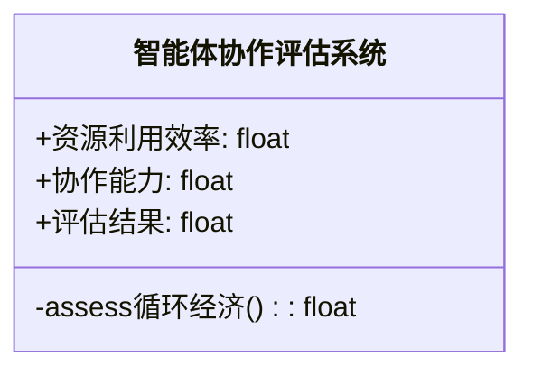
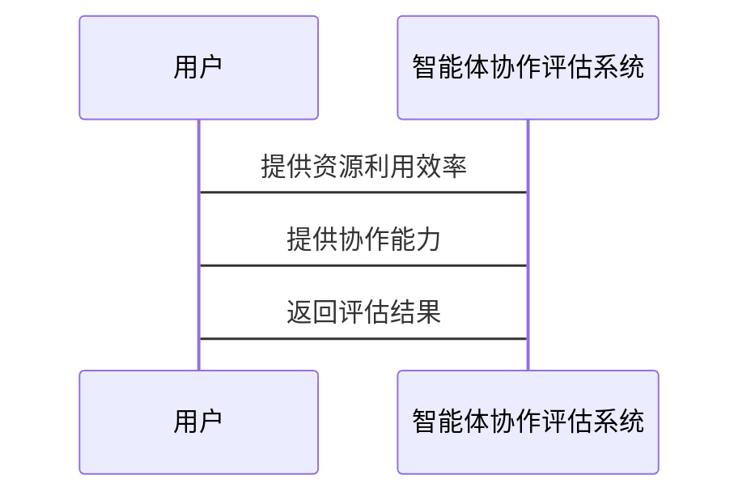

                 


# 智能体协作评估公司的循环经济实践：可持续发展新视角

**关键词**：智能体协作、循环经济、可持续发展、企业实践、评估模型、技术实现

**摘要**：本文探讨智能体协作在评估公司循环经济实践中的应用，从可持续发展的新视角出发，分析智能体协作的基本原理、算法实现、系统架构及实际案例。通过详细的技术分析和案例研究，展示智能体协作如何推动企业循环经济的发展，实现可持续发展目标。

---

## 第1章: 智能体协作评估的背景与概念

### 1.1 循环经济的基本概念

#### 1.1.1 循环经济的定义与核心原则
循环经济是一种以资源高效利用和循环利用为核心的发展模式，强调减少资源消耗和环境污染。其核心原则包括减量化（Reduce）、再利用（Reuse）和再循环（Recycle）。

#### 1.1.2 循环经济与传统经济的区别
- **资源消耗**：传统经济依赖大量资源消耗，循环经济注重资源的循环利用。
- **环境污染**：传统经济常导致环境污染，循环经济强调减少废物产生和排放。
- **经济增长模式**：传统经济依赖资源扩张，循环经济强调资源高效利用和可持续增长。

#### 1.1.3 循环经济的可持续发展意义
循环经济通过减少资源消耗和环境污染，促进经济与环境的协调发展，是实现可持续发展的重要途径。

---

### 1.2 智能体协作的基本概念

#### 1.2.1 智能体的定义与特征
智能体（Agent）是一种能够感知环境、自主决策并采取行动的实体。其主要特征包括：
- **自主性**：能够自主决策。
- **反应性**：能够感知环境并做出反应。
- **协作性**：能够与其他智能体协作完成任务。

#### 1.2.2 智能体协作的定义与模式
智能体协作是指多个智能体通过合作完成共同目标的过程。协作模式包括：
- **独立协作**：智能体各自完成任务，最终整合结果。
- **分布式协作**：智能体共享信息，共同完成任务。
- **层次化协作**：智能体分为不同层次，协同完成复杂任务。

#### 1.2.3 智能体协作在企业中的应用潜力
智能体协作在企业中的潜在应用包括资源优化配置、生产过程优化、供应链管理等。

---

### 1.3 智能体协作评估的背景与意义

#### 1.3.1 循环经济实践中的评估需求
循环经济实践需要对企业的资源利用效率、废物产生量等进行评估，以衡量其可持续性。

#### 1.3.2 智能体协作在循环经济评估中的优势
智能体协作能够通过分布式计算和信息共享，提供更准确和高效的评估结果。

#### 1.3.3 企业循环经济实践中的挑战与机遇
- **挑战**：资源利用效率低下、废物产生量大。
- **机遇**：通过智能体协作优化资源配置，降低成本，提高效率。

---

## 第2章: 智能体协作评估的核心概念与联系

### 2.1 智能体协作评估的理论框架

#### 2.1.1 智能体协作评估的基本原理
智能体协作评估通过分析智能体的协作行为，评估其对循环经济实践的贡献。

#### 2.1.2 智能体协作评估的数学模型
评估模型包括智能体的协作能力、资源利用效率等指标。

#### 2.1.3 智能体协作评估的实现方法
通过分布式计算和数据共享，实现智能体协作评估。

---

### 2.2 智能体协作评估的核心要素

#### 2.2.1 智能体的协作能力
协作能力包括信息共享、任务分配和协同决策。

#### 2.2.2 智能体的评估指标
评估指标包括资源利用率、协作效率、环境污染等。

#### 2.2.3 智能体协作评估的边界条件
边界条件包括企业规模、行业特点、地理位置等。

---

### 2.3 智能体协作评估与循环经济的联系

#### 2.3.1 循环经济实践中的智能体协作
通过智能体协作优化资源配置，降低浪费。

#### 2.3.2 智能体协作评估对企业循环经济的影响
通过评估结果，帮助企业优化循环经济实践。

#### 2.3.3 智能体协作评估的可持续发展价值
通过智能体协作评估，实现资源高效利用和环境保护。

---

## 第3章: 智能体协作评估的算法原理

### 3.1 智能体协作评估的算法概述

#### 3.1.1 算法的基本思路
通过智能体协作，评估循环经济实践的效果。

#### 3.1.2 算法的主要步骤
1. 数据采集：收集企业的资源利用和废物产生数据。
2. 智能体协作：通过协作计算，评估循环经济实践的效果。
3. 结果分析：分析评估结果，提出优化建议。

#### 3.1.3 算法的复杂度分析
算法复杂度主要取决于数据量和协作智能体的数量。

---

### 3.2 智能体协作评估的数学模型

#### 3.2.1 模型的构建过程
通过分析智能体协作行为，构建评估模型。

#### 3.2.2 模型的数学公式
评估模型可以通过以下公式表示：
$$
\text{评估结果} = \sum_{i=1}^{n} (\text{协作能力}_i \times \text{资源利用效率}_i)
$$

#### 3.2.3 模型的验证与优化
通过实际数据验证模型，并进行优化。

---

### 3.3 智能体协作评估的实现代码

#### 3.3.1 环境安装
需要安装Python和相关库。

#### 3.3.2 核心实现代码
```python
def assess循环经济(资源利用效率, 协作能力):
    评估结果 = sum(协作能力[i] * 资源利用效率[i] for i in range(len(协作能力)))
    return 评估结果

# 示例
资源利用效率 = [0.8, 0.9, 0.7]
协作能力 = [0.8, 0.7, 0.9]
评估结果 = assess循环经济(资源利用效率, 协作能力)
print(评估结果)
```

---

## 第4章: 智能体协作评估的系统分析与架构设计

### 4.1 系统应用场景

#### 4.1.1 企业循环经济实践
企业通过智能体协作优化资源利用。

#### 4.1.2 行业循环经济实践
行业通过协作实现资源共享和优化。

---

### 4.2 系统功能设计

#### 4.2.1 领域模型设计
使用Mermaid类图展示系统功能模块。



#### 4.2.2 系统架构设计
使用Mermaid架构图展示系统架构。


---

### 4.3 系统接口设计

#### 4.3.1 系统接口描述
系统接口包括数据输入、评估计算和结果输出。

#### 4.3.2 系统交互设计
使用Mermaid序列图展示系统交互过程。



---

## 第5章: 智能体协作评估的项目实战

### 5.1 项目环境安装

#### 5.1.1 安装Python和相关库
安装Python和必要的库，如numpy和pandas。

### 5.2 系统核心功能实现

#### 5.2.1 评估模型实现
实现评估模型的代码，并进行测试。

#### 5.2.2 代码解读与分析
解读代码实现，并分析其功能。

### 5.3 实际案例分析

#### 5.3.1 案例背景
某企业循环经济实践的背景。

#### 5.3.2 案例分析
通过智能体协作评估，分析企业的循环经济实践效果。

#### 5.3.3 案例结论
总结案例分析结果，并提出优化建议。

---

## 第6章: 智能体协作评估的案例分析与总结

### 6.1 案例分析

#### 6.1.1 案例背景
某企业的循环经济实践。

#### 6.1.2 案例分析
通过智能体协作评估，分析企业的循环经济实践效果。

#### 6.1.3 案例结论
总结案例分析结果，并提出优化建议。

### 6.2 总结

#### 6.2.1 项目小结
总结项目的实现过程和主要成果。

#### 6.2.2 未来展望
展望智能体协作评估在循环经济中的未来发展。

---

## 第7章: 智能体协作评估的未来展望与最佳实践

### 7.1 未来展望

#### 7.1.1 智能体协作评估的未来发展
探讨智能体协作评估在循环经济中的未来发展方向。

### 7.2 最佳实践

#### 7.2.1 实施智能体协作评估的注意事项
提供实施智能体协作评估的注意事项和建议。

---

## 附录: 智能体协作评估相关资源

### 附录A: 参考文献
列出相关文献和资料。

### 附录B: 工具与库
列出实现智能体协作评估所需工具和库。

---

通过以上章节的详细讲解和分析，本文全面探讨了智能体协作评估在企业循环经济实践中的应用，为实现可持续发展提供了新的视角和方法。

