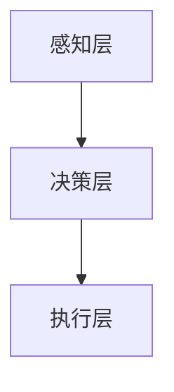
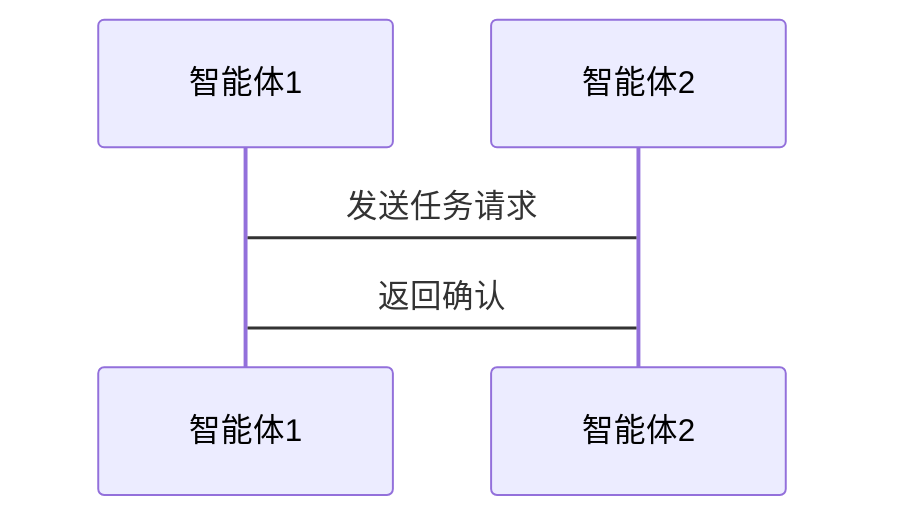

                 


# 智能体协作评估公司的数字化转型进程：把握未来增长点

> **关键词**: 数字化转型, 智能体协作, 系统架构, 协作算法, 企业增长

> **摘要**: 数字化转型是企业实现未来增长的关键，而智能体协作在其中扮演着重要角色。本文将详细探讨智能体协作的核心概念、系统架构、算法原理及其在数字化转型中的应用。通过实际案例分析和最佳实践，帮助读者理解如何利用智能体协作推动企业的数字化转型，抓住未来增长点。

---

## 第一部分: 智能体协作与数字化转型的背景介绍

### 第1章: 智能体协作的核心概念

#### 1.1 问题背景与定义

##### 1.1.1 数字化转型的背景与挑战
数字化转型是企业适应快速变化的商业环境的关键。随着技术的进步，企业需要通过数字化手段提升效率、优化流程并创新业务模式。然而，数字化转型过程中面临诸多挑战，如数据孤岛、协作效率低下、系统集成复杂等。

##### 1.1.2 智能体协作的定义与特点
智能体协作是指多个智能体通过共享信息和协同工作，共同完成特定任务的过程。其特点包括自主性、反应性、协作性和学习能力。智能体能够根据环境变化自主决策，并通过协作实现更复杂的任务。

##### 1.1.3 问题解决方法与边界
通过引入智能体协作技术，企业可以解决传统协作方式中的低效问题。智能体协作的边界在于其应用场景，如企业内部流程优化、跨部门协作、外部合作伙伴协同等。

#### 1.2 数字化转型的范围与目标

##### 1.2.1 数字化转型的范围
数字化转型涵盖企业的各个方面，包括业务流程、组织结构、技术应用和文化变革。从战略层面到执行层面，都需要数字化技术的支持。

##### 1.2.2 数字化转型的目标
数字化转型的目标是通过技术创新提升企业的竞争力，优化运营效率，增强客户体验，并实现业务模式的创新。

##### 1.2.3 数字化转型的关键成功要素
成功的关键要素包括领导力、技术创新、文化变革、数据驱动和员工参与。

#### 1.3 智能体协作在数字化转型中的作用

##### 1.3.1 智能体协作如何推动数字化转型
通过智能体协作，企业可以实现跨部门、跨系统的高效协作，优化业务流程，提升决策效率。

##### 1.3.2 数字化转型对智能体协作的需求
数字化转型需要智能体协作来解决复杂问题，实现动态协作和实时反馈。

---

### 第2章: 智能体协作的核心要素

#### 2.1 智能体协作的核心要素

##### 2.1.1 智能体的定义与属性
智能体是一种能够感知环境、自主决策并执行任务的实体。其属性包括感知能力、决策能力、协作能力和学习能力。

##### 2.1.2 协作的目标与规则
协作目标是通过智能体的协同工作实现特定任务。协作规则包括通信协议、任务分配规则和冲突解决机制。

##### 2.1.3 智能体协作的通信机制
智能体通过消息传递、事件触发等方式进行通信，确保协作过程的信息共享和协调。

#### 2.2 智能体协作的系统架构

##### 2.2.1 分层架构
分层架构将系统分为感知层、决策层和执行层，每层负责不同的功能。

##### 2.2.2 分布式架构
分布式架构允许智能体在不同的节点上运行，通过通信机制协同工作。

##### 2.2.3 集中式架构
集中式架构通过中央控制节点协调智能体的协作。

---

### 第3章: 智能体协作的数学模型与算法

#### 3.1 智能体协作的基本模型

##### 3.1.1 单智能体模型
单智能体模型描述一个智能体在特定环境中的行为。

##### 3.1.2 多智能体模型
多智能体模型涉及多个智能体的协作，通常用于复杂任务的分解和执行。

##### 3.1.3 协作模型
协作模型定义智能体之间的协作规则和通信机制。

#### 3.2 协作算法

##### 3.2.1 分布式一致性算法
分布式一致性算法（如Raft算法）用于确保智能体协作中的数据一致性。

##### 3.2.2 协作任务分配算法
任务分配算法（如负载均衡算法）用于将任务分配给合适的智能体。

##### 3.2.3 协作决策算法
决策算法（如多智能体强化学习）用于智能体在协作中的决策过程。

---

### 第4章: 数字化转型中的智能体协作系统分析

#### 4.1 系统分析与设计

##### 4.1.1 问题场景介绍
以企业供应链管理为例，分析智能体协作如何优化库存管理和订单处理。

##### 4.1.2 系统功能设计
设计一个智能体协作系统，包括订单处理、库存监控和物流管理等功能。

##### 4.1.3 系统架构设计
使用分层架构设计系统，分为感知层、决策层和执行层。

##### 4.1.4 系统接口设计
定义智能体之间的通信接口，确保数据共享和协作。

#### 4.2 系统架构图

##### 4.2.1 系统架构图（Mermaid）


#### 4.3 系统交互图

##### 4.3.1 系统交互图（Mermaid）


---

### 第5章: 项目实战与案例分析

#### 5.1 环境安装与配置

##### 5.1.1 开发环境搭建
安装Python、Java等开发工具，配置开发环境。

##### 5.1.2 工具链安装
安装必要的工具，如Docker、Kubernetes等。

#### 5.2 系统核心实现

##### 5.2.1 智能体协作核心代码
```python
class Agent:
    def __init__(self, id):
        self.id = id
        self.state = 'idle'
    
    def send_message(self, message):
        # 发送消息给其他智能体
        pass
    
    def receive_message(self, message):
        # 处理接收到的消息
        pass
```

##### 5.2.2 系统功能实现
实现订单处理、库存监控等功能，确保智能体协作顺畅。

#### 5.3 案例分析

##### 5.3.1 实际案例分析
以某企业为例，分析智能体协作在数字化转型中的应用效果。

##### 5.3.2 案例实施过程
详细描述项目实施的步骤和方法。

##### 5.3.3 案例效果与总结
总结案例实施的效果，提炼经验教训。

---

### 第6章: 最佳实践与未来展望

#### 6.1 最佳实践

##### 6.1.1 系统设计中的注意事项
确保系统设计的可扩展性和可维护性。

##### 6.1.2 实施过程中的关键点
注重团队协作和项目管理，确保项目顺利推进。

##### 6.1.3 维护与优化建议
定期维护系统，优化协作算法，提升系统性能。

#### 6.2 未来展望

##### 6.2.1 智能体协作技术的发展趋势
智能体协作将更加智能化和自动化，应用场景将更加广泛。

##### 6.2.2 数字化转型的未来方向
数字化转型将深度融合人工智能和大数据技术，推动企业全面数字化。

---

## 结语
智能体协作是数字化转型的核心驱动力。通过本文的详细讲解，读者可以深入了解智能体协作的原理、系统架构和实际应用，从而在未来的数字化转型中抓住增长机遇。

