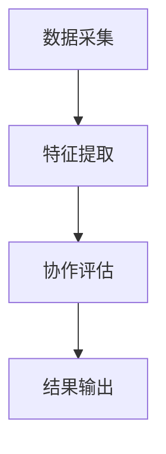

                 


# 智能体协作评估公司的数据资产价值：数字经济时代的关键

## 关键词：
智能体协作、数据资产评估、数字经济、数据价值、协作机制

## 摘要：
在数字经济时代，数据资产已成为企业核心竞争力的关键要素。本文探讨智能体协作在数据资产评估中的应用，通过系统化的分析和方法，揭示如何利用智能体协作机制提升数据资产的价值评估效率和准确性。文章从智能体协作的基本概念出发，结合数据资产评估的理论与实践，详细阐述了智能体协作评估模型的构建、算法实现、系统架构设计及实际案例分析，为企业在数字经济时代优化数据资产价值提供有力支持。

---

## 第1章：智能体协作与数据资产评估的背景

### 1.1 数据资产在数字经济中的重要性
- 数据资产的定义与分类
- 数据资产的经济价值与潜在风险
- 数字经济时代下数据资产的特征与挑战

### 1.2 智能体协作的基本概念
- 智能体的定义与分类
- 协作智能体的特征与优势
- 智能体协作在数据资产评估中的意义

### 1.3 数据资产评估的目标与方法
- 数据资产评估的目标：最大化数据价值
- 数据资产评估的关键维度：完整性、准确性、可用性、安全性
- 智能体协作在数据资产评估中的独特优势

---

## 第2章：智能体协作的理论基础与核心机制

### 2.1 智能体协作的基本原理
- 单智能体与多智能体协作的对比
- 多智能体协作的核心要素：任务分配、信息共享、协同决策
- 智能体协作的数学模型：基于博弈论的协作机制

### 2.2 协作智能体的通信与协调
- 智能体间的通信协议设计
- 协作任务的分配与优化
- 协作过程中的冲突解决机制

### 2.3 协作智能体的激励机制
- 协作中的激励理论与应用
- 基于贡献度的激励分配模型
- 激励机制对数据资产评估效率的提升作用

---

## 第3章：数据资产评估的理论与方法

### 3.1 数据资产评估的理论框架
- 数据资产价值的多维度评估指标
- 数据资产评估的标准化流程
- 数据资产评估中的权重分配方法

### 3.2 数据资产评估的核心算法
- 基于机器学习的评估模型
- 基于规则的评估方法
- 综合评估模型的设计与优化

### 3.3 数据资产评估中的挑战与解决方案
- 数据隐私与安全问题
- 数据质量与完整性的评估难题
- 数据资产评估的动态调整方法

---

## 第4章：智能体协作评估数据资产的算法实现

### 4.1 智能体协作评估模型的构建
- 数据特征提取与分析
- 智能体协作网络的构建与优化
- 评估模型的训练与验证

### 4.2 数据资产评估的数学模型
- 数据资产价值的评估公式
$$ V = \sum_{i=1}^{n} w_i \cdot f_i $$
其中，$w_i$为特征$f_i$的权重，$V$为数据资产价值。

- 基于博弈论的协作优化模型
$$ \max_{x} \sum_{j=1}^{m} u_j(x) $$
其中，$u_j(x)$为智能体$j$的效用函数。

### 4.3 智能体协作评估算法的实现步骤
1. 数据预处理与特征提取
2. 智能体协作任务分配
3. 数据资产评估模型训练
4. 模型优化与验证

---

## 第5章：智能体协作评估系统的架构设计

### 5.1 系统整体架构
- 系统功能模块划分：数据采集、特征提取、协作评估、结果输出
- 系统架构图（使用Mermaid绘制）


### 5.2 系统功能设计
- 数据采集模块：数据源接入与处理
- 特征提取模块：数据特征提取与分析
- 协作评估模块：智能体协作评估与优化
- 结果输出模块：评估结果展示与分析

### 5.3 系统接口设计
- 数据接口：数据输入与输出接口定义
- 协作接口：智能体间的通信与协作接口
- 用户接口：用户操作界面设计

---

## 第6章：智能体协作评估系统的项目实战

### 6.1 项目背景与目标
- 项目背景：某公司的数据资产价值评估需求
- 项目目标：构建智能体协作评估系统

### 6.2 环境配置与工具安装
- 开发环境：Python 3.8、Jupyter Notebook
- 依赖库安装：numpy、pandas、scikit-learn、matplotlib

### 6.3 核心代码实现
```python
# 数据特征提取代码示例
import pandas as pd
from sklearn.feature_extraction import DictVectorizer

data = pd.DataFrame({
    '特征1': ['a', 'b', 'a'],
    '特征2': [1, 2, 3]
})

vectorizer = DictVectorizer()
feature_matrix = vectorizer.fit_transform(data.to_dict('records'))
print(feature_matrix)
```

### 6.4 项目实现步骤
1. 数据采集与预处理
2. 特征提取与模型训练
3. 智能体协作评估与优化
4. 系统测试与部署

### 6.5 实际案例分析
- 案例背景：某电商平台的数据资产价值评估
- 案例分析：智能体协作评估系统的应用与效果
- 案例结论：系统的有效性与可扩展性

---

## 第7章：智能体协作评估系统的优化与展望

### 7.1 系统优化方向
- 模型优化：提升评估精度与效率
- 系统扩展：支持更大规模的数据资产评估
- 功能优化：增强数据安全与隐私保护

### 7.2 未来研究方向
- 新型智能体协作机制的研究
- 数据资产评估的动态优化方法
- 智能体协作在其他领域的应用探索

### 7.3 总结与展望
- 本文总结了智能体协作在数据资产评估中的应用价值
- 展望了未来在数字经济时代，智能体协作技术的发展与创新

---

## 结语
智能体协作评估数据资产价值是数字经济时代的重要课题，通过本文的系统分析与实践，展示了智能体协作技术在提升数据资产评估效率和准确性方面的巨大潜力。未来，随着技术的不断进步，智能体协作将在更多领域发挥重要作用，为企业和社会创造更大的价值。

--- 

（注：文章中的代码示例为简化版，实际应用中需要根据具体场景进行调整与优化。）

