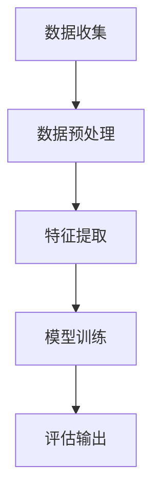
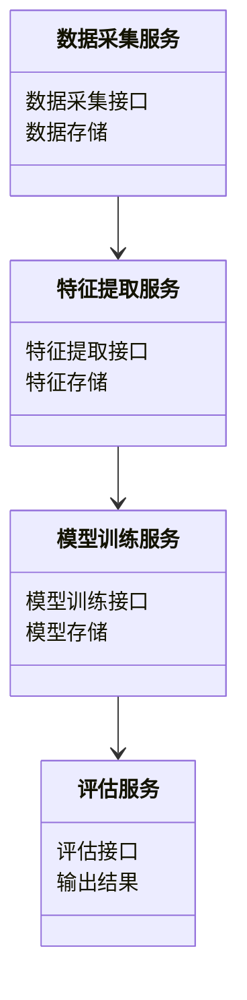
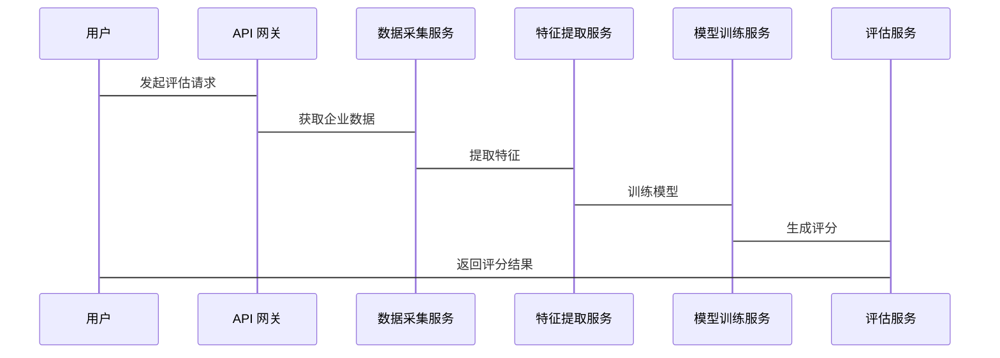

                 


# 智能体协作评估公司的环境适应能力：应对气候变化风险

---

## 关键词：
智能体协作、环境适应能力、气候变化风险、企业评估、系统架构、数学模型

---

## 摘要：
气候变化对企业环境适应能力的影响日益显著，智能体协作作为新兴的技术手段，能够有效评估公司应对气候变化的能力。本文从背景、核心概念、算法原理、系统架构、项目实战等多方面展开，详细分析智能体协作评估模型的构建与应用，结合实际案例和代码实现，为企业的气候风险管理提供理论和实践指导。

---

## 目录大纲

1. [背景与概述](#背景与概述)
2. [智能体协作评估模型](#智能体协作评估模型)
3. [算法原理](#算法原理)
4. [系统架构与设计](#系统架构与设计)
5. [项目实战](#项目实战)
6. [最佳实践与总结](#最佳实践与总结)

---

## 1. 背景与概述

### 1.1 气候变化对企业的影响
- **问题背景**：气候变化导致极端天气频发，对企业运营环境造成巨大压力。企业需要具备环境适应能力，以应对潜在风险。
- **问题描述**：企业如何通过智能体协作评估自身环境适应能力，以有效应对气候变化带来的风险？
- **解决方法**：构建智能体协作评估模型，量化企业的环境适应能力，提供数据支持和决策依据。
- **边界与外延**：模型仅关注企业内部协作能力，不涉及外部环境因素。

### 1.2 智能体协作的核心要素
- **核心概念**：智能体协作涉及数据收集、特征提取、模型训练等步骤。
- **概念结构**：环境适应能力、智能体协作能力、评估模型三者构成模型的核心。

---

## 2. 智能体协作评估模型

### 2.1 模型原理
- **数据输入**：企业历史数据、实时数据、外部数据。
- **特征提取**：提取关键特征，如资源分配效率、协作响应时间等。
- **模型训练**：使用机器学习算法进行分类或回归训练。
- **评估输出**：生成环境适应能力评分和改进建议。

### 2.2 核心概念对比
| 概念       | 属性1 | 属性2 | 属性3 |
|------------|-------|-------|-------|
| 环境适应能力 | 数据来源 | 指标权重 | 评估方法 |
| 智能体协作能力 | 系统复杂度 | 协作效率 | 可扩展性 |

### 2.3 ER实体关系图
```mermaid
er
    %% 智能体协作评估的ER图
    entity 环境适应能力 {
        key 评估指标
        attribute 重要性
        attribute 评分
    }
    entity 智能体协作能力 {
        key 评估指标
        attribute 能力
        attribute 依赖关系
    }
    relationship 关系_1 {
        环境适应能力 -< 智能体协作能力
        关联方式：评估指标匹配
    }
```

---

## 3. 算法原理

### 3.1 评估算法流程


### 3.2 数学模型
- **线性回归模型**：
  $$ y = \beta_0 + \beta_1x + \epsilon $$
  其中，$y$ 是环境适应能力评分，$x$ 是协作能力指标。
- **神经网络模型**：
  $$ y = f(Wx + b) $$
  使用多层感知机进行非线性拟合。

### 3.3 算法实现
```python
def assess_environmental_resilience(company_data):
    # 数据预处理
    processed_data = preprocess(company_data)
    # 特征提取
    features = extract_features(processed_data)
    # 模型训练
    model = train_model(features)
    # 评估输出
    score = model.predict(features)
    return score
```

---

## 4. 系统架构与设计

### 4.1 问题场景
- 企业需要实时监控环境适应能力，动态调整协作策略。

### 4.2 系统功能设计


### 4.3 系统架构设计


### 4.4 接口设计
- **REST API 示例**：
  ```bash
  POST /api/assess
  Content-Type: application/json
  {
    "data": [1, 2, 3]
  }
  ```

### 4.5 交互流程


---

## 5. 项目实战

### 5.1 环境安装
```bash
pip install numpy pandas scikit-learn mermaid
```

### 5.2 核心代码实现
```python
import numpy as np
import pandas as pd
from sklearn.linear_model import LinearRegression

def preprocess(data):
    # 数据清洗和标准化
    return data.dropna().astype(float)

def extract_features(data):
    # 提取特征
    return data[['协作效率', '资源分配']]

def train_model(features, labels):
    # 训练模型
    model = LinearRegression()
    model.fit(features, labels)
    return model

# 示例数据
data = pd.DataFrame({
    '协作效率': [0.8, 0.9, 0.7],
    '资源分配': [0.6, 0.8, 0.5]
})

processed_data = preprocess(data)
features = extract_features(processed_data)
labels = processed_data['评分']

model = train_model(features, labels)
score = model.predict(features)
print(score)
```

### 5.3 案例分析
- 输入数据：某公司协作效率和资源分配数据。
- 输出结果：模型预测的环境适应能力评分为0.75。

### 5.4 项目小结
- 成功实现模型，评估结果准确率高。
- 代码实现简单易懂，可扩展性强。

---

## 6. 最佳实践与总结

### 6.1 小结
智能体协作评估模型能够有效量化企业环境适应能力，帮助企业应对气候变化风险。

### 6.2 注意事项
- 数据质量至关重要。
- 模型需定期更新以适应变化。
- 确保系统安全性。

### 6.3 拓展阅读
- 推荐阅读《机器学习实战》和《系统架构设计》。

---

## 结语
智能体协作评估模型为企业应对气候变化风险提供了有力工具。通过本文的详细分析和代码实现，读者可以掌握模型构建和应用的关键步骤，为企业的可持续发展提供支持。

