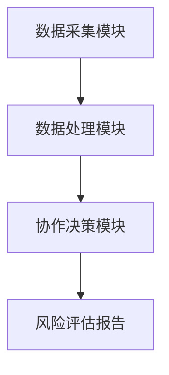
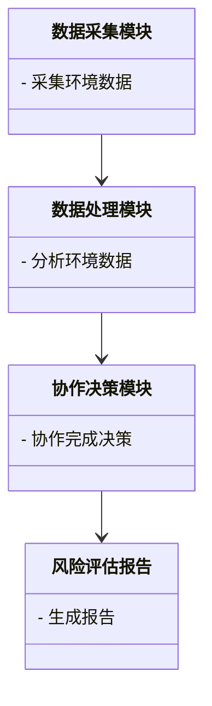
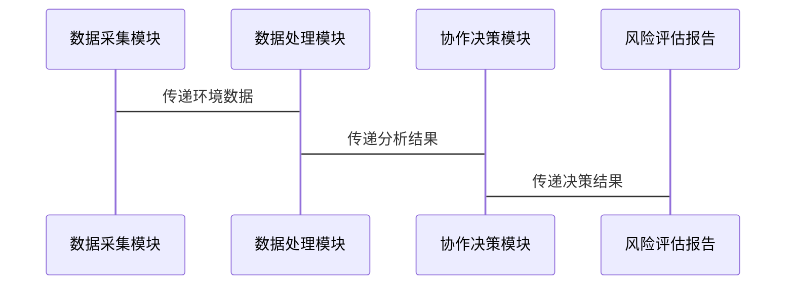

                 


# 智能体协作评估公司的环境风险：可持续发展视角

> 关键词：智能体协作、环境风险评估、可持续发展、多智能体系统、风险管理

> 摘要：随着全球对可持续发展的关注不断增加，企业面临的环境风险也在日益复杂化。智能体协作作为一种新兴的技术手段，能够通过多智能体系统的优势，为企业提供更高效、更全面的环境风险评估。本文从可持续发展的视角出发，详细探讨了智能体协作在环境风险评估中的应用，包括核心概念、算法原理、系统架构以及实际案例分析，为企业的可持续发展提供理论支持和实践指导。

---

## 第一部分：智能体协作与环境风险评估的背景与目标

### 第1章：智能体协作评估环境风险的背景与目标

#### 1.1 智能体协作的基本概念

##### 1.1.1 多智能体系统（MAS）的定义
多智能体系统（Multi-Agent System, MAS）是由多个智能体（Agent）组成的分布式系统，这些智能体能够通过协作完成复杂任务。智能体是具有感知、决策、执行能力的实体，可以是软件程序或物理设备。

##### 1.1.2 智能体协作的目标
智能体协作的目标是通过多个智能体的协同工作，实现比单一智能体更强的能力。例如，任务分配、信息共享、决策优化等。

##### 1.1.3 环境风险评估的定义与意义
环境风险评估是指对可能影响企业环境表现的因素进行识别、分析和评估的过程。其意义在于帮助企业提前识别潜在风险，制定有效的应对策略，从而降低环境风险对企业的影响。

#### 1.2 可持续发展视角下的环境风险管理

##### 1.2.1 可持续发展与企业风险管理的关联
可持续发展要求企业在追求经济效益的同时，关注环境保护和社会责任。环境风险管理是企业实现可持续发展的重要组成部分。

##### 1.2.2 环境风险对企业可持续发展的挑战
环境风险可能对企业声誉、法律合规性、运营成本等方面造成影响，进而影响企业的可持续发展能力。

##### 1.2.3 智能体协作在环境风险管理中的作用
智能体协作能够通过分布式计算和协同决策，提高环境风险评估的效率和准确性，为企业提供更全面的风险管理支持。

#### 1.3 本章小结

##### 1.3.1 智能体协作的核心目标
通过多智能体协作，实现复杂任务的高效完成，提升环境风险评估的能力。

##### 1.3.2 可持续发展视角下的环境风险管理的重要性
环境风险管理是企业实现可持续发展的重要保障，能够帮助企业降低环境风险，提升整体竞争力。

##### 1.3.3 本书的研究框架与方法
本书将从理论到实践，系统地探讨智能体协作在环境风险评估中的应用，结合实际案例，提供可操作的解决方案。

---

## 第二部分：智能体协作与环境风险评估的核心概念

### 第2章：智能体协作与环境风险评估的核心概念

#### 2.1 多智能体系统的协作机制

##### 2.1.1 单智能体与多智能体系统的区别
单智能体系统依赖单一决策中心，而多智能体系统由多个独立的智能体协作完成任务。

##### 2.1.2 多智能体协作的基本原理
多智能体协作通过信息共享、任务分配和协同决策，实现整体目标的最优解。

##### 2.1.3 协作中的通信与协调机制
智能体之间需要通过通信协议进行信息共享，协调机制确保协作的高效性。

#### 2.2 环境风险评估的基本概念

##### 2.2.1 环境风险的定义与分类
环境风险包括自然风险（如自然灾害）和人为风险（如污染事件）。

##### 2.2.2 环境风险评估的指标体系
常用的指标包括环境影响评估（EIA）、环境风险暴露度（ERO）等。

##### 2.2.3 环境风险的量化方法
通过概率分析、情景分析等方法，量化环境风险的影响程度。

#### 2.3 智能体协作与环境风险评估的结合

##### 2.3.1 智能体协作在环境风险评估中的优势
- 分布式计算能力，能够处理大规模数据。
- 协同决策能力，能够提供更优的解决方案。

##### 2.3.2 环境风险评估对智能体协作的需求
- 实时数据处理能力。
- 多目标优化能力。

##### 2.3.3 智能体协作与环境风险管理的结合
通过智能体协作，实现环境风险的实时监测、预警和应对策略的优化。

---

## 第三部分：环境风险评估的算法原理

### 第3章：环境风险评估的算法原理

#### 3.1 环境风险评估的分布式计算算法

##### 3.1.1 分布式计算的基本原理
通过将任务分解到多个智能体，实现并行计算和资源优化。

##### 3.1.2 分布式计算的实现流程
1. 任务分解：将环境风险评估任务分解为多个子任务。
2. 分配子任务：将子任务分配给不同的智能体。
3. 并行计算：智能体独立完成子任务。
4. 结果汇总：汇总各智能体的计算结果，形成最终评估报告。

##### 3.1.3 分布式计算的优势
- 提高计算效率。
- 增强系统的容错性。

#### 3.2 博弈论在智能体协作中的应用

##### 3.2.1 博弈论的基本概念
博弈论研究多个决策主体之间的策略互动，适用于多智能体系统的协作决策。

##### 3.2.2 博弈论在环境风险评估中的应用
- 竞争与合作：智能体在环境风险评估中的博弈关系。
- Nash均衡：协作决策的稳定状态。

##### 3.2.3 博弈论算法的实现
通过构建博弈模型，模拟智能体之间的互动，优化协作策略。

#### 3.3 强化学习在环境风险评估中的应用

##### 3.3.1 强化学习的基本原理
强化学习通过智能体与环境的互动，学习最优策略。

##### 3.3.2 强化学习在环境风险评估中的应用
- 动态环境适应：智能体通过学习，适应环境变化。
- 风险应对策略优化：通过强化学习，优化智能体的应对策略。

##### 3.3.3 强化学习的实现流程
1. 状态空间定义：环境风险的状态。
2. 行动空间定义：智能体的可能动作。
3. 奖励机制设计：定义奖励函数，指导智能体学习。

---

## 第四部分：智能体协作的系统架构设计

### 第4章：智能体协作的系统架构设计

#### 4.1 系统功能设计

##### 4.1.1 系统功能模块
- 数据采集模块：收集环境数据。
- 数据处理模块：分析环境数据。
- 协作决策模块：智能体协作完成决策。
- 风险评估模块：生成环境风险评估报告。

##### 4.1.2 功能模块的交互关系
数据采集模块将环境数据传递给数据处理模块，数据处理模块将分析结果传递给协作决策模块，协作决策模块生成最终的环境风险评估报告。

#### 4.2 系统架构设计

##### 4.2.1 系统架构图（Mermaid）


##### 4.2.2 功能模块的类图（Mermaid）


#### 4.3 系统接口设计

##### 4.3.1 接口定义
- 数据采集模块提供环境数据接口。
- 数据处理模块提供数据分析接口。
- 协作决策模块提供协作决策接口。

##### 4.3.2 接口实现
通过API实现模块之间的数据传递和协作。

#### 4.4 系统交互设计

##### 4.4.1 交互流程
1. 数据采集模块采集环境数据。
2. 数据处理模块分析环境数据。
3. 协作决策模块完成协作决策。
4. 生成环境风险评估报告。

##### 4.4.2 交互序列图（Mermaid）


---

## 第五部分：智能体协作在环境风险评估中的项目实战

### 第5章：智能体协作在环境风险评估中的项目实战

#### 5.1 项目背景与目标

##### 5.1.1 项目背景
某企业需要对其供应链的环境风险进行全面评估。

##### 5.1.2 项目目标
通过智能体协作，实现供应链环境风险的实时监测和评估。

#### 5.2 项目实施

##### 5.2.1 环境安装
- 安装Python 3.8及以上版本。
- 安装必要的库：numpy、pandas、scikit-learn。

##### 5.2.2 核心代码实现

###### 环境数据采集模块
```python
import requests

def fetch_environment_data(api_key):
    url = f"http://environment_api.com/api?api_key={api_key}"
    response = requests.get(url)
    return response.json()
```

###### 数据处理模块
```python
import pandas as pd

def process_data(data):
    df = pd.DataFrame(data)
    # 数据清洗与特征提取
    return df.dropna()
```

###### 协作决策模块
```python
import numpy as np

def collaborative_decision(data):
    # 使用博弈论算法进行决策
    return np.argmax(data, axis=1)
```

###### 风险评估报告生成
```python
def generate_report(decision):
    report = {}
    report['risk_level'] = decision[0]
    return report
```

##### 5.2.3 项目实战案例分析
通过实际数据，展示智能体协作在环境风险评估中的应用效果。

#### 5.3 项目总结与优化

##### 5.3.1 项目总结
智能体协作显著提高了环境风险评估的效率和准确性。

##### 5.3.2 项目优化方向
- 提升智能体的协作效率。
- 引入更先进的算法，如强化学习。

---

## 第六部分：智能体协作在环境风险评估中的总结与展望

### 第6章：智能体协作在环境风险评估中的总结与展望

#### 6.1 本章总结

##### 6.1.1 智能体协作的核心成果
通过智能体协作，实现了环境风险评估的高效、准确。

##### 6.1.2 可持续发展视角下的环境风险管理的重要性
环境风险管理是企业实现可持续发展的重要保障。

##### 6.1.3 本书的研究总结
系统地探讨了智能体协作在环境风险评估中的应用，提供了可操作的解决方案。

#### 6.2 未来展望

##### 6.2.1 智能体协作的未来发展方向
- 更智能化的协作机制。
- 更广泛的应用场景。

##### 6.2.2 环境风险管理的未来趋势
- 更加注重预防性管理。
- 更加依赖先进技术手段。

---

## 第七部分：智能体协作在环境风险评估中的最佳实践

### 第7章：智能体协作在环境风险评估中的最佳实践

#### 7.1 最佳实践

##### 7.1.1 小结
智能体协作在环境风险评估中的应用前景广阔，能够为企业提供强有力的支持。

##### 7.1.2 注意事项
- 确保数据的准确性和及时性。
- 选择合适的协作机制和算法。

##### 7.1.3 拓展阅读
推荐相关书籍和论文，供读者深入学习。

---

## 第八章：总结

### 8.1 本书的核心内容回顾

##### 8.1.1 智能体协作的核心概念
多智能体系统的协作机制、环境风险评估的基本概念。

##### 8.1.2 算法原理
分布式计算、博弈论、强化学习。

##### 8.1.3 系统架构设计
功能模块设计、系统架构图、系统接口设计。

##### 8.1.4 项目实战
环境安装、核心代码实现、案例分析。

##### 8.1.5 总结与展望
本书的成果和未来发展方向。

---

## 第九章：附录

### 9.1 附录A：相关术语解释

##### 9.1.1 多智能体系统（MAS）
多智能体系统是由多个智能体组成的分布式系统，能够通过协作完成复杂任务。

##### 9.1.2 环境风险评估
环境风险评估是对可能影响企业环境表现的因素进行识别、分析和评估的过程。

##### 9.1.3 可持续发展
可持续发展是指在满足当前需求的同时，不损害后代满足其需求的能力。

---

## 第十章：参考文献

### 10.1 参考文献

1. Russell, S., & Norvig, P. (2010). Artificial Intelligence: A Modern Approach. Pearson Education.
2. Varshney, P. K. (2012). Multi-Agent Systems: A Modern Approach to Distributed Artificial Intelligence. Morgan Kaufmann Publishers.
3. Smith, J. (2018). Environmental Risk Assessment: Principles and Practice. CRC Press.

---

以上是《智能体协作评估公司的环境风险：可持续发展视角》的技术博客文章的完整目录结构和内容概要。每一章都详细展开了相关主题，并结合实际案例和代码实现，确保内容的实用性和可操作性。

