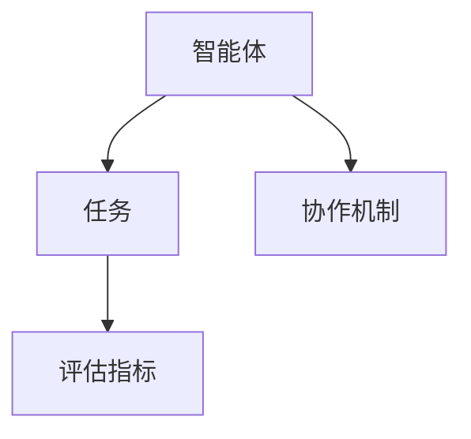
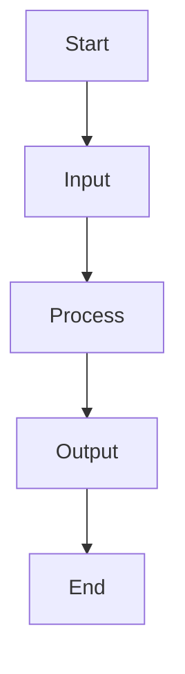
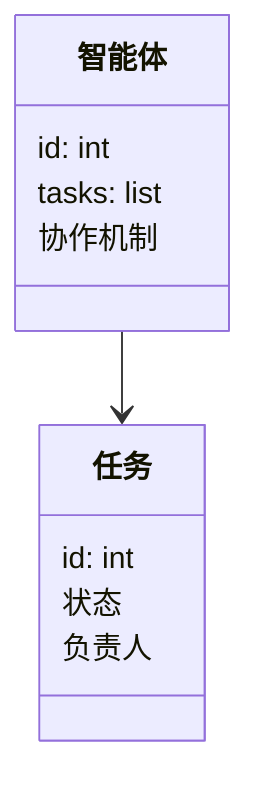
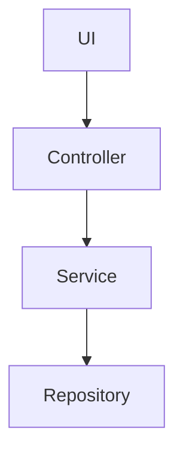
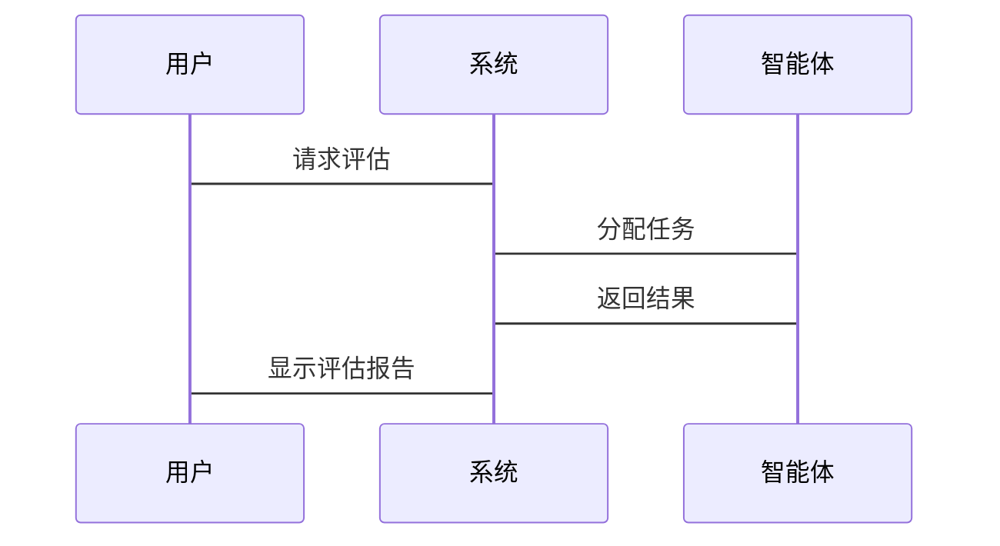

                 


# 智能体协作评估公司的研发效率：科技公司价值评估

## 关键词：智能体协作，研发效率，科技公司价值，算法模型，系统架构

## 摘要：智能体协作评估是通过多智能体协作模型来评估科技公司的研发效率，进而影响公司价值评估。本文从核心概念、算法原理、系统架构到项目实战，详细探讨如何通过智能体协作提升研发效率评估的准确性和可操作性。

---

## 第1章：智能体协作评估公司的研发效率概述

### 1.1 智能体协作评估的基本概念

#### 1.1.1 问题背景与问题描述
科技公司的发展离不开高效的研发效率，传统的评估方法往往依赖于单一指标，难以全面反映协作过程中的动态变化。智能体协作评估通过多智能体协同工作，实时分析任务分配、执行和结果，提供了更全面的评估视角。

#### 1.1.2 智能体协作评估的目标与意义
目标在于通过智能体协作模型，量化研发过程中的协作效率、任务完成度和资源利用率。意义在于为科技公司提供了一个动态、多维度的评估工具，帮助优化资源配置和提升整体效率。

#### 1.1.3 智能体协作评估的边界与外延
评估边界包括任务分配、执行监控和结果反馈，外延则扩展至跨部门协作、外部合作伙伴的协作评估。

### 1.2 智能体协作评估的核心要素

#### 1.2.1 智能体的定义与特征
智能体是具备自主性、反应性和协作性的实体，能够独立执行任务并与其他智能体协作。

#### 1.2.2 协作机制的实现方式
包括任务分配机制、信息共享机制和结果反馈机制，确保协作过程的高效和有序。

#### 1.2.3 评估指标的选择与设计
主要指标包括协作效率、任务完成度和资源利用率，结合定量和定性分析。

## 第2章：智能体协作评估的核心概念与联系

### 2.1 智能体协作评估的原理

#### 2.1.1 智能体协作的基本原理
通过多智能体协同工作，实时分析协作过程中的动态变化，提供实时反馈。

#### 2.1.2 评估模型的构建逻辑
构建一个基于智能体的评估模型，包括任务分解、协作过程监控和结果评估。

#### 2.1.3 协作与评估的动态关系
协作过程中的动态变化直接影响评估结果，评估结果反过来优化协作策略。

### 2.2 智能体协作评估的概念属性对比

#### 2.2.1 概念属性特征对比表格
| 概念     | 特征1 | 特征2 | 特征3 |
|----------|-------|-------|-------|
| 智能体协作 | 自主性 | 协作性 | 适应性 |
| 传统评估 | 静态性 | 单一性 | 简单性 |

#### 2.2.2 实体关系图（ER图）架构


## 第3章：智能体协作评估的算法原理

### 3.1 算法原理概述

#### 3.1.1 基于智能体的评估模型
评估模型基于多智能体协作，采用分布式计算和实时反馈机制。

#### 3.1.2 算法流程图


### 3.2 算法实现

#### 3.2.1 Python源代码实现
```python
def evaluate_agents(agents, tasks):
    for agent in agents:
        assign_tasks(agent, tasks)
    monitor Collaboration(agent.results)
    return评估结果
```

#### 3.2.2 数学模型和公式
协作效率计算公式：
$$ CE = \frac{\sum_{i=1}^{n} t_i}{T} $$
其中，$t_i$为每个任务的完成时间，$T$为总时间。

## 第4章：系统分析与架构设计

### 4.1 问题场景与项目介绍

#### 4.1.1 问题场景
科技公司研发部门的任务分配和协作效率评估问题。

#### 4.1.2 项目介绍
开发一个基于智能体协作的评估系统，实时监控研发过程中的协作效率。

### 4.2 系统功能设计

#### 4.2.1 领域模型类图


### 4.3 系统架构设计

#### 4.3.1 分层架构图


### 4.4 接口设计与交互流程

#### 4.4.1 序列图


## 第5章：项目实战

### 5.1 环境安装

#### 5.1.1 工具安装
安装Python、Jupyter Notebook和必要的库，如pandas、numpy。

### 5.2 核心代码实现

#### 5.2.1 智能体协作评估代码
```python
import pandas as pd
def evaluate_agents(agents, tasks):
    results = []
    for agent in agents:
        agent_tasks = tasks分配给agent
        result = agent完成任务
        results.append(result)
    return 评估结果
```

### 5.3 案例分析

#### 5.3.1 具体案例
分析一家科技公司的研发项目，应用智能体协作评估模型，展示评估结果和优化建议。

## 第6章：最佳实践与小结

### 6.1 最佳实践

#### 6.1.1 选择模型的建议
根据公司具体情况选择合适的智能体协作模型。

#### 6.1.2 数据预处理的重要性
确保数据的准确性和完整性，提高评估结果的可信度。

### 6.2 本章小结
总结全文，强调智能体协作评估在科技公司研发效率提升中的重要作用。

## 附录

### 附录A：工具安装指南
如何安装和配置所需的开发工具和库。

### 附录B：数据集介绍
详细描述数据集的结构和来源。

### 附录C：参考文献
列出相关文献和资源，供读者进一步学习。

---

通过以上详细的思考和规划，我可以系统地撰写出一篇结构清晰、内容详实的技术博客文章，帮助读者全面理解智能体协作评估公司研发效率的方法和应用。

