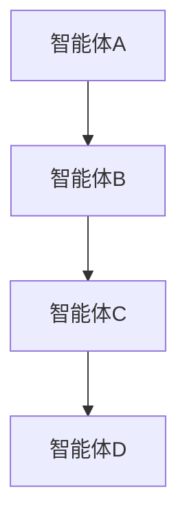
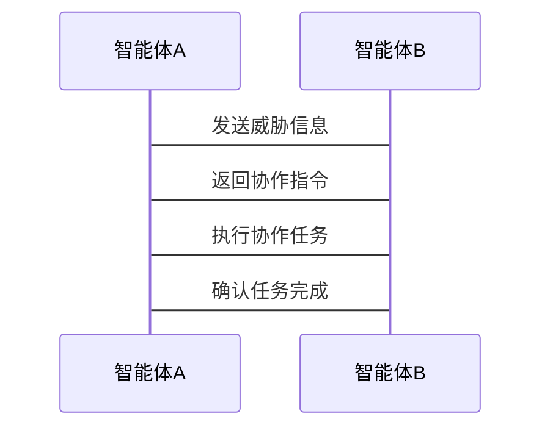

                 


# 智能体协作评估公司的网络安全风险：数字时代的新考量

> 关键词：智能体协作、网络安全风险、数字时代、多智能体系统、风险评估

> 摘要：在数字时代，网络安全风险的评估和管理变得越来越复杂。传统的安全工具和方法已经难以应对日益复杂的威胁。智能体协作作为一种新兴的技术，为网络安全风险的评估提供了新的思路。本文将详细探讨智能体协作在网络安全风险评估中的应用，分析其核心概念、算法原理、系统架构以及实际应用案例，为企业的网络安全管理提供新的视角和解决方案。

---

## 第一部分：智能体协作与网络安全基础

### 第1章：智能体与网络安全概述

#### 1.1 智能体的基本概念
- **智能体的定义与分类**  
  智能体（Agent）是指能够感知环境、做出决策并采取行动的实体。根据功能和智能水平，智能体可以分为简单反应式智能体、基于模型的反应式智能体、目标驱动智能体和效用驱动智能体。  
  - 简单反应式智能体：仅根据当前感知做出反应，如防火墙规则匹配。  
  - 基于模型的反应式智能体：具有内部状态和环境模型，能够预测威胁，如入侵检测系统。  
  - 目标驱动智能体：有明确的目标，如修复漏洞的自动修复智能体。  
  - 效用驱动智能体：基于效用函数优化决策，如动态风险评估系统。

- **智能体在网络安全中的角色**  
  智能体可以在网络安全中扮演多种角色，包括威胁检测、漏洞扫描、风险评估、响应处置等。多个智能体协作可以形成一个完整的网络安全防护体系。

- **智能体与传统安全工具的对比**  
  传统安全工具（如防火墙、入侵检测系统）通常基于规则或模式匹配，缺乏自主性和协作能力。而智能体具有自主决策和协作能力，能够更好地应对复杂和动态的网络安全威胁。

#### 1.2 网络安全风险的基本概念
- **网络安全风险的定义**  
  网络安全风险是指由于网络系统的漏洞或威胁而导致的潜在损失或损害，包括数据泄露、服务中断、隐私侵犯等。

- **网络安全风险的分类**  
  根据威胁来源和影响范围，网络安全风险可以分为以下几类：  
  1. **网络层风险**：如DDoS攻击、流量劫持等。  
  2. **应用层风险**：如SQL注入、跨站脚本攻击（XSS）等。  
  3. **数据层风险**：如数据泄露、数据篡改等。  
  4. **设备层风险**：如设备故障、物理入侵等。  

- **网络安全风险的评估方法**  
  常见的网络安全风险评估方法包括：  
  1. **基于规则的评估**：如防火墙规则匹配、入侵检测系统日志分析。  
  2. **基于概率的评估**：如贝叶斯网络模型用于风险概率计算。  
  3. **基于知识的评估**：如知识库驱动的漏洞扫描。  
  4. **基于智能体的评估**：通过智能体协作实现动态、自适应的风险评估。

#### 1.3 智能体协作的背景与意义
- **数字时代网络安全的新挑战**  
  随着数字化转型的推进，企业网络的复杂性和暴露面不断增加，传统的静态安全防护手段已难以应对动态变化的威胁。攻击者利用人工智能技术发起的高级持续性威胁（APT）日益增多，传统安全工具往往无法及时发现和应对这些威胁。

- **智能体协作的优势**  
  智能体协作可以通过分布式感知、自主决策和协同行动，实现对复杂网络环境的实时监控和动态防护。多个智能体协同工作，可以覆盖网络的各个层面，提供更全面的威胁检测和响应能力。

- **智能体协作在企业中的应用前景**  
  通过智能体协作，企业可以实现网络安全的智能化和自动化，降低人工干预成本，提高安全防护的效率和效果。特别是在零信任架构（Zero Trust Architecture）中，智能体协作可以发挥重要作用，实现基于上下文的动态访问控制。

---

### 第2章：智能体协作的核心概念与联系

#### 2.1 智能体协作的原理
- **多智能体系统的定义**  
  多智能体系统（Multi-Agent System, MAS）是由多个智能体组成的系统，智能体之间通过通信和协作完成共同的目标。在网络安全中，每个智能体可以专注于不同的任务，如威胁检测、漏洞扫描、风险评估等。

- **智能体协作的基本机制**  
  智能体协作的基本机制包括通信、协调、协作和共享。通信是智能体之间交换信息的手段；协调是智能体之间达成一致的策略；协作是智能体共同完成任务的过程；共享是智能体之间共享资源和知识的基础。

- **智能体协作的数学模型**  
  智能体协作的数学模型可以基于博弈论、贝叶斯网络或分布式系统理论。例如，贝叶斯网络可以用于智能体之间的概率推理和风险评估。

#### 2.2 智能体协作的核心要素
- **智能体的通信机制**  
  智能体之间的通信可以通过消息传递、服务调用或事件驱动的方式实现。通信机制需要确保信息的实时性和可靠性。

- **智能体的决策机制**  
  智能体的决策机制基于感知信息、内部状态和协作目标。决策机制可以是基于规则的、基于模型的或基于效用的。

- **智能体的协作协议**  
  协作协议定义了智能体之间的交互规则，包括任务分配、责任划分、信息共享和冲突解决。常见的协作协议包括基于合同的协作（Colog）、基于承诺的协作（Colog）和基于市场机制的协作（Market-Based）。

#### 2.3 智能体协作的ER实体关系图
```mermaid
er
    entity 智能体 {
        id
        类型
        能力
    }
    entity 风险 {
        id
        类型
        影响程度
    }
    entity 协作关系 {
        id
        智能体1
        智能体2
        关系类型
    }
```

---

### 第3章：智能体协作的算法原理

#### 3.1 协作机制的算法实现
- **分布式协作算法**  
  分布式协作算法通过智能体之间的局部信息交换，实现全局协作目标。例如，基于Dinic算法的流量调度智能体协作。

- **集中式协作算法**  
  集中式协作算法通过中央控制节点协调智能体的行动，例如基于Kafka的消息队列协作机制。

#### 3.2 协作协议的数学模型
- **概率论模型**  
  使用贝叶斯网络进行风险评估：  
  $$ P(A|B) = \frac{P(B|A)P(A)}{P(B)} $$  
  其中，A表示“存在特定威胁”，B表示“检测到异常流量”。

- **博弈论模型**  
  使用纳什均衡理论进行任务分配：  
  $$ \text{收益}(i,j) = \text{max}(r_i, r_j) $$  
  其中，$r_i$和$r_j$分别是智能体i和j的收益。

#### 3.3 协作算法的Python实现
```python
def collaborate_agents(agents):
    for agent in agents:
        print(f"Agent {agent} is collaborating.")
```

---

### 第4章：智能体协作的风险评估系统架构

#### 4.1 系统功能设计
- **系统功能模块**  
  系统功能模块包括威胁检测、漏洞扫描、风险评估、响应处置和结果分析。

- **系统功能流程**  
  1. 智能体感知网络环境，发现潜在威胁。  
  2. 智能体之间共享信息，进行风险评估。  
  3. 根据评估结果，智能体采取相应的防护措施。  
  4. 系统记录和分析结果，优化协作策略。

#### 4.2 系统架构设计


#### 4.3 系统接口设计
- **通信接口**  
  智能体之间的通信接口可以基于HTTP REST API或消息队列（如Kafka）。  
  ```json
  {
      "action": "collaborate",
      "data": {
          "threat": "malware",
          "priority": "high"
      }
  }
  ```

- **协作接口**  
  协作接口用于任务分配和资源共享，例如基于gRPC的智能体协作服务。

#### 4.4 系统交互流程


---

### 第5章：项目实战与案例分析

#### 5.1 环境安装
- **安装Python和相关库**  
  ```bash
  pip install python-agentlib requests kafka-python
  ```

- **安装系统架构依赖**  
  安装Docker、Kafka、Redis等中间件。

#### 5.2 核心代码实现
```python
class SecurityAgent:
    def __init__(self, name):
        self.name = name
        self.threat_data = {}

    def detect_threat(self):
        # 模拟威胁检测
        import random
        return random.choice(["malware", "ddos", "virus"])

    def collaborate(self, other_agents):
        for agent in other_agents:
            threat = self.detect_threat()
            print(f"{self.name} detected {threat} and notifying {agent.name}.")
            agent.receive_notification(threat)

    def receive_notification(self, threat):
        # 模拟响应措施
        print(f"{self.name} received threat: {threat} and initiating response.")
```

#### 5.3 案例分析
- **案例背景**  
  某企业网络遭受DDoS攻击，多个智能体协同防御。

- **案例实施步骤**  
  1. 智能体A检测到异常流量，触发协作机制。  
  2. 智能体B和C收到通知，分别采取流量限速和反向代理措施。  
  3. 智能体D负责记录攻击日志并报告给安全团队。  

- **案例结果**  
  攻击被有效缓解，网络服务恢复，攻击者未能实现目标。

#### 5.4 最佳实践
- **智能体协作的优化建议**  
  - 定期更新智能体的知识库和规则库。  
  - 使用混合模型（集中式+分布式）平衡效率和灵活性。  
  - 配置合理的权限管理，避免信息泄露。

- **小结**  
  智能体协作通过分布式感知和协同行动，能够有效应对复杂多变的网络安全威胁，提升企业的整体安全防护能力。

---

## 第六章：总结与展望

### 6.1 总结
智能体协作作为数字时代网络安全风险评估的重要技术手段，通过多智能体系统的协作机制，能够实现对复杂网络环境的实时监控和动态防护。本文详细探讨了智能体协作的核心概念、算法原理、系统架构和实际应用，为企业构建智能化的网络安全防护体系提供了理论和实践参考。

### 6.2 展望
未来，智能体协作在网络安全中的应用将更加广泛和深入。随着人工智能和大数据技术的不断发展，智能体协作将更加智能化和自适应化。例如，基于联邦学习的智能体协作可以在保护数据隐私的前提下，实现跨组织的安全威胁共享与协同防御。

---

通过本文的分析，我们可以看到，智能体协作不仅是一种技术创新，更是一种思维方式的变革。在数字时代，网络安全威胁的复杂性和动态性要求我们必须采用更加灵活和智能的安全防护手段。智能体协作技术的应用，将为企业构建一个更加安全、智能和高效的网络安全防护体系。

