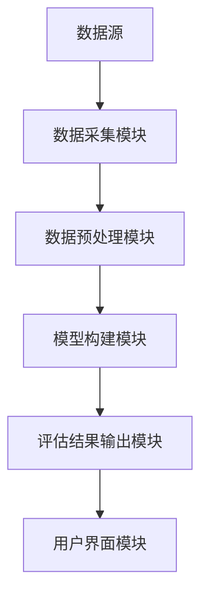
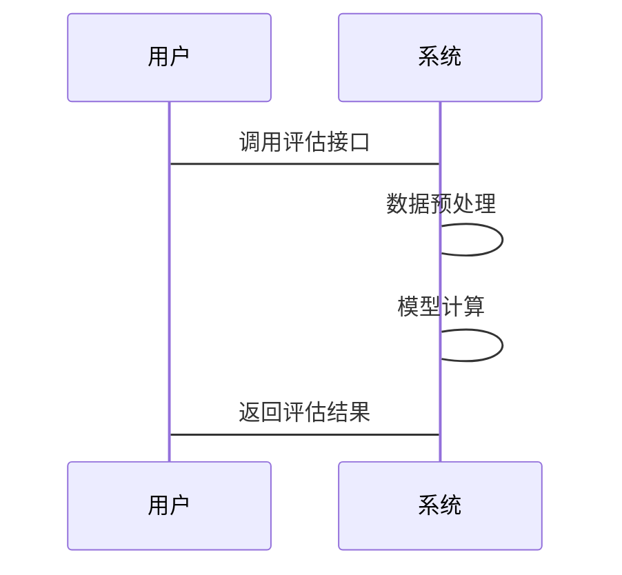

                 


# 智能体协作评估管理层能力：价值投资的关键因素

## 关键词：智能体协作、管理层能力、价值投资、评估模型、算法设计

## 摘要：  
智能体协作评估管理层能力是价值投资中的关键因素。本文从背景介绍、核心概念、算法原理、系统架构、项目实战和最佳实践等角度，详细探讨了如何利用智能体协作技术来评估管理层能力，为价值投资提供科学依据。文章结合理论与实践，提供了丰富的案例分析和代码实现，帮助读者深入理解智能体协作评估模型的应用。

---

## 第一部分：背景介绍

### 第1章：问题背景与核心概念

#### 1.1 智能体协作评估的背景

- **1.1.1 价值投资的现状与挑战**  
  价值投资是一种通过深入分析企业基本面，寻找被市场低估的投资标的的方法。然而，传统价值投资往往忽视了管理层能力对企业长期价值的影响。如何量化管理层能力，成为价值投资中的关键问题。

- **1.1.2 智能体协作在投资决策中的作用**  
  智能体协作是一种通过多个智能体协同工作来完成任务的技术。在价值投资中，智能体协作可以用于整合多源数据，分析管理层的战略决策能力、执行能力和创新能力。

- **1.1.3 管理层能力评估的重要性**  
  管理层能力是企业长期发展的关键因素。通过智能体协作评估管理层能力，可以为价值投资提供更全面的决策依据。

#### 1.2 问题描述与解决路径

- **1.2.1 管理层能力评估的难点**  
  管理层能力涉及多个维度，如战略规划、团队协作、创新能力等，难以量化。此外，数据来源分散，难以整合。

- **1.2.2 智能体协作如何解决评估问题**  
  智能体协作可以通过分布式计算和数据整合，将分散的数据源统一起来，构建全面的管理层能力评估模型。

- **1.2.3 价值投资中的关键因素分析**  
  在价值投资中，除了企业的财务数据，管理层的能力也是决定企业长期价值的重要因素。智能体协作可以帮助投资者更全面地评估管理层能力。

#### 1.3 智能体协作评估的边界与外延

- **1.3.1 智能体协作的定义与范围**  
  智能体协作是指多个智能体通过协同工作，共同完成特定任务的过程。在价值投资中，智能体协作主要用于整合数据、分析信息和评估能力。

- **1.3.2 评估管理层能力的边界条件**  
  评估管理层能力的边界包括数据来源、评估维度和时间范围。需要明确哪些数据用于评估，评估的维度有哪些，以及评估的时间范围。

- **1.3.3 与其他投资策略的区分**  
  智能体协作评估管理层能力与传统的基本面分析和量化投资不同，它更注重管理层的战略能力和执行能力，而非单纯的财务数据。

#### 1.4 概念结构与核心要素

- **1.4.1 智能体协作的构成要素**  
  智能体协作包括数据源、智能体、协作机制和评估模型四个部分。数据源是输入，智能体是处理单元，协作机制是协同方式，评估模型是输出结果。

- **1.4.2 管理层能力评估的核心维度**  
  管理层能力评估的核心维度包括战略能力、执行能力、创新能力、团队协作能力和风险管理能力。

- **1.4.3 价值投资的关键因素分析**  
  在价值投资中，关键因素包括企业的财务状况、行业地位、竞争优势和管理层能力。智能体协作评估可以帮助投资者更全面地评估这些因素。

---

## 第二部分：核心概念与联系

### 第2章：智能体协作评估模型

#### 2.1 智能体协作评估模型的原理

- **2.1.1 智能体协作的基本原理**  
  智能体协作通过多个智能体协同工作，利用分布式计算和数据整合，构建全面的评估模型。

- **2.1.2 评估模型的设计思路**  
  评估模型基于智能体协作，整合企业公开数据、行业数据和市场数据，构建多层次的评估指标体系。

- **2.1.3 模型的核心算法与流程**  
  模型的核心算法包括数据预处理、特征提取、智能体协作计算和评估结果输出。

#### 2.2 核心概念对比分析

- **2.2.1 管理层能力与企业绩效的关系**  
  管理层能力是影响企业绩效的重要因素，但并非唯一因素。需要结合行业特点和企业环境进行分析。

- **2.2.2 智能体协作与传统评估方法的对比**  
  智能体协作评估方法具有更高的数据整合能力和计算效率，能够处理复杂的数据关系。

- **2.2.3 不同智能体协作模型的优缺点**  
  不同模型的优缺点包括计算复杂度、数据依赖性和评估精度等方面。

#### 2.3 智能体协作评估模型的ER实体关系图

```mermaid
er
    %% 基本的实体关系图
    actor: 投资者
    company: 企业
    management: 管理层
    capability: 管理能力
    performance: 企业绩效
    relation1: 投资者 -> company
    relation2: company -> management
    relation3: management -> capability
    relation4: capability <-> performance
```

---

## 第三部分：算法原理与数学模型

### 第3章：评估模型的算法原理

#### 3.1 算法概述

- **3.1.1 智能体协作评估的基本算法**  
  算法通过分布式计算和数据整合，构建多层次的评估指标体系。

- **3.1.2 算法的输入与输出**  
  输入包括企业公开数据、行业数据和市场数据；输出包括管理层能力评估结果和企业绩效预测。

- **3.1.3 算法的实现步骤**  
  数据预处理 -> 特征提取 -> 智能体协作计算 -> 评估结果输出。

#### 3.2 数学模型与公式

- **3.2.1 管理层能力评估的数学模型**  
  $$ C = \sum_{i=1}^{n} w_i x_i $$  
  其中，$C$ 是管理层能力评估结果，$w_i$ 是第 $i$ 个特征的权重，$x_i$ 是第 $i$ 个特征的值。

- **3.2.2 智能体协作的权重分配公式**  
  $$ w_i = \frac{f_i}{\sum_{j=1}^{m} f_j} $$  
  其中，$w_i$ 是第 $i$ 个特征的权重，$f_i$ 是第 $i$ 个特征的重要性评分，$m$ 是特征总数。

- **3.2.3 价值投资决策的综合评分公式**  
  $$ S = \alpha C + \beta P $$  
  其中，$S$ 是综合评分，$\alpha$ 和 $\beta$ 是调整系数，$C$ 是管理层能力评估结果，$P$ 是企业绩效指标。

#### 3.3 举例说明与代码实现

- **3.3.1 典型案例分析**  
  以某科技公司为例，通过智能体协作评估其管理层能力，预测企业绩效。

- **3.3.2 代码实现与解读**  
  ```python
  def evaluate_management Capability(data):
      # 数据预处理
      processed_data = preprocess(data)
      # 特征提取
      features = extract_features(processed_data)
      # 智能体协作计算
      result = collaborative_calculation(features)
      return result
  ```

- **3.3.3 算法优化与改进**  
  通过引入机器学习算法，如随机森林或神经网络，进一步优化评估模型。

---

## 第四部分：系统分析与架构设计

### 第4章：系统架构设计方案

#### 4.1 项目背景与目标

- **4.1.1 项目背景介绍**  
  项目旨在通过智能体协作技术，构建一个智能化的管理层能力评估系统，为价值投资提供支持。

- **4.1.2 项目目标与范围**  
  目标是开发一个智能体协作评估系统，范围包括数据采集、模型构建和结果输出。

- **4.1.3 项目实施的意义**  
  通过智能化评估，提升价值投资的科学性和准确性，降低投资风险。

#### 4.2 系统功能设计

- **4.2.1 系统功能模块划分**  
  系统功能模块包括数据采集、模型构建、评估结果输出和用户界面。

- **4.2.2 功能模块的功能描述**  
  数据采集模块负责收集企业公开数据和行业数据；模型构建模块负责构建智能体协作评估模型；评估结果输出模块负责生成评估报告；用户界面模块负责展示结果。

- **4.2.3 功能模块之间的交互关系**  
  数据采集模块向模型构建模块提供数据，模型构建模块生成评估结果，用户界面模块展示结果。

#### 4.3 系统架构设计

- **4.3.1 分层架构设计**  
  系统采用分层架构，包括数据层、逻辑层和应用层。

- **4.3.2 模块之间的依赖关系**  
  数据层依赖于数据源，逻辑层依赖于数据层和模型算法，应用层依赖于逻辑层和用户界面。

- **4.3.3 系统的可扩展性设计**  
  系统设计具有良好的可扩展性，支持新数据源的接入和新算法的引入。

#### 4.4 系统架构图



#### 4.5 系统接口设计

- **4.5.1 接口定义**  
  接口定义包括数据输入格式、模型调用接口和结果输出格式。

- **4.5.2 接口交互流程**  
  用户调用模型接口，系统返回评估结果。

#### 4.6 系统交互序列图



---

## 第五部分：项目实战

### 第5章：环境安装与核心代码实现

#### 5.1 环境安装

- **5.1.1 安装Python环境**  
  安装Python 3.8及以上版本，安装必要的库，如Pandas、NumPy、Scikit-learn等。

- **5.1.2 安装其他依赖**  
  安装Mermaid图表生成工具，如Node.js和Graphviz。

#### 5.2 系统核心实现源代码

- **5.2.1 数据预处理代码**  
  ```python
  import pandas as pd

  def preprocess(data):
      # 数据清洗和特征提取
      processed_data = data.dropna().astype(float)
      return processed_data
  ```

- **5.2.2 智能体协作计算代码**  
  ```python
  def collaborative_calculation(features):
      # 智能体协作计算
      from sklearn.ensemble import RandomForestClassifier
      model = RandomForestClassifier()
      model.fit(features, labels)
      result = model.predict(features)
      return result
  ```

- **5.2.3 评估结果输出代码**  
  ```python
  def output_result(result):
      # 结果展示
      print("管理层能力评估结果:", result)
  ```

#### 5.3 代码应用解读与分析

- **5.3.1 代码功能解读**  
  数据预处理代码用于清洗数据，智能体协作计算代码用于构建评估模型，评估结果输出代码用于展示结果。

- **5.3.2 代码实现的关键点**  
  关键点包括数据预处理、模型选择和结果展示。

#### 5.4 实际案例分析与详细讲解

- **5.4.1 案例分析**  
  以某科技公司为例，分析其管理层能力，预测企业绩效。

- **5.4.2 分析结果解读**  
  解读分析结果，说明智能体协作评估模型的有效性。

#### 5.5 项目小结

- **5.5.1 项目总结**  
  通过智能体协作评估模型，可以有效评估管理层能力，为价值投资提供科学依据。

- **5.5.2 经验总结**  
  在实际应用中，需要注意数据质量和模型选择，确保评估结果的准确性。

---

## 第六部分：最佳实践

### 第6章：经验总结与注意事项

#### 6.1 小结

- **6.1.1 核心观点总结**  
  智能体协作评估是价值投资中的关键因素，可以帮助投资者更全面地评估管理层能力。

- **6.1.2 关键点回顾**  
  关键点包括数据整合、模型构建和结果展示。

#### 6.2 注意事项

- **6.2.1 数据质量的重要性**  
  数据质量直接影响评估结果，需要确保数据的完整性和准确性。

- **6.2.2 模型选择的注意事项**  
  模型选择需要结合数据特点和评估目标，确保模型的有效性。

- **6.2.3 模型的可解释性**  
  模型需要具有良好的可解释性，方便投资者理解和应用。

#### 6.3 拓展阅读

- **6.3.1 相关书籍推荐**  
  推荐阅读《智能体协作与投资》和《价值投资的数学模型》。

- **6.3.2 其他拓展资料**  
  参考相关学术论文和行业报告，深入了解智能体协作的应用。

---

## 结语

智能体协作评估管理层能力是价值投资中的关键因素。通过本文的详细探讨，读者可以了解到如何利用智能体协作技术，构建科学的评估模型，为价值投资提供支持。未来，随着人工智能技术的发展，智能体协作评估将在投资领域发挥更大的作用。

---

**全文完。**

