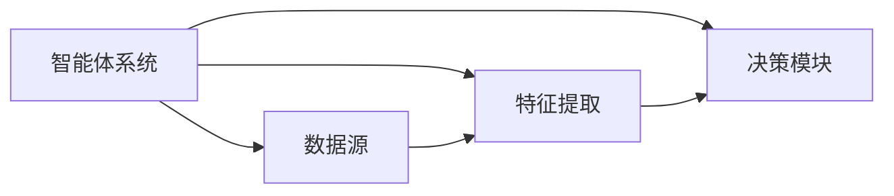
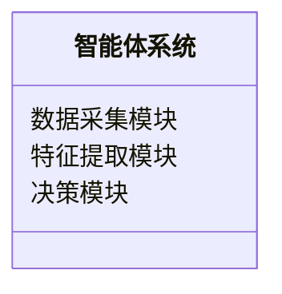

                 


# 智能体系统提升价值投资的另类数据信号提取能力

## 关键词：
- 智能体系统，另类数据，信号提取，价值投资，NLP，强化学习

## 摘要：
本文探讨了智能体系统如何通过提取另类数据信号来提升价值投资能力。文章首先介绍了智能体系统的基本概念和另类数据的背景，然后分析了智能体系统在价值投资中的应用。接着，详细讲解了基于NLP和强化学习的信号提取算法，以及相关的数学模型。最后，通过项目实战展示了智能体系统的实现过程，并总结了未来的研究方向。

---

# 第1章: 智能体系统与另类数据信号提取的背景介绍

## 1.1 智能体系统的基本概念
### 1.1.1 智能体系统的定义与特点
智能体系统是一种能够感知环境、自主决策并采取行动的系统。它具有以下特点：
- **自主性**：无需外部干预，自主完成任务。
- **反应性**：能够实时感知环境变化并做出反应。
- **学习能力**：通过经验优化决策策略。
- **多模态处理**：能够处理多种类型的数据。

### 1.1.2 智能体系统的核心要素与组成
智能体系统由以下几个核心要素组成：
1. **感知模块**：负责收集环境中的数据。
2. **决策模块**：基于感知数据做出决策。
3. **执行模块**：根据决策执行具体操作。
4. **学习模块**：通过反馈优化决策策略。

### 1.1.3 智能体系统与传统数据处理的区别
传统的数据处理方法主要依赖于规则和模式，而智能体系统能够通过学习和自适应优化来处理复杂的数据。

## 1.2 另类数据信号提取的背景与意义
### 1.2.1 传统投资数据的局限性
传统投资数据主要包括价格、成交量等，难以捕捉市场情绪和潜在信号。

### 1.2.2 另类数据的定义与分类
另类数据指的是非传统金融数据，如社交媒体数据、新闻数据等。它们可以提供更多的市场信息，帮助投资者做出更准确的决策。

### 1.2.3 另类数据在价值投资中的应用前景
通过分析另类数据，投资者可以发现潜在的投资机会，提高投资收益。

## 1.3 智能体系统在价值投资中的应用
### 1.3.1 智能体系统如何提升投资决策
智能体系统可以通过分析另类数据，提取有用的信号，帮助投资者做出更明智的决策。

### 1.3.2 另类数据信号提取的核心价值
通过提取另类数据中的有用信号，投资者可以发现市场趋势和潜在风险。

### 1.3.3 智能体系统与价值投资的结合案例
本文将通过具体案例，展示智能体系统在价值投资中的实际应用。

---

# 第2章: 智能体系统与另类数据的核心概念与联系

## 2.1 智能体系统的核心原理
### 2.1.1 智能体系统的感知与决策机制
智能体系统通过感知模块收集数据，决策模块基于数据做出决策。

### 2.1.2 智能体系统的自主学习能力
智能体系统能够通过学习模块不断优化决策策略。

### 2.1.3 智能体系统的多模态数据处理能力
智能体系统能够处理多种类型的数据，如文本、图像等。

## 2.2 另类数据信号提取的关键技术
### 2.2.1 数据清洗与预处理方法
数据清洗是确保数据质量的重要步骤，包括去除噪声、填充缺失值等。

### 2.2.2 数据特征提取的算法选择
特征提取是将数据转换为更有意义的特征表示，常用的方法包括主成分分析（PCA）和LDA等。

### 2.2.3 数据特征的可解释性分析
可解释性分析帮助投资者理解特征对投资决策的影响。

## 2.3 智能体系统与另类数据的关系
### 2.3.1 智能体系统如何利用另类数据
智能体系统通过感知模块收集另类数据，提取有用信号。

### 2.3.2 另类数据对智能体系统性能的影响
高质量的另类数据可以提高智能体系统的决策能力。

### 2.3.3 智能体系统与另类数据的协同优化
通过优化数据处理流程，智能体系统能够更好地利用另类数据。

## 2.4 核心概念原理对比表格
### 表2.1: 智能体系统与传统数据处理方法的对比

| 特性               | 智能体系统              | 传统数据处理方法        |
|--------------------|------------------------|--------------------------|
| 数据处理能力       | 多模态、自适应          | 单一模式、固定规则       |
| 学习能力           | 具有自主学习能力       | 无学习能力               |
| 决策能力           | 基于实时数据动态决策   | 基于固定规则静态决策     |

## 2.5 ER实体关系图


---

# 第3章: 智能体系统中的另类数据信号提取算法原理

## 3.1 基于NLP的文本数据处理算法
### 3.1.1 文本预处理步骤
文本预处理包括分词、去除停用词、词干提取等步骤。

### 3.1.2 文本特征提取方法
常用文本特征提取方法包括TF-IDF和Word2Vec。

### 3.1.3 文本情感分析算法
情感分析算法可以识别文本中的情感倾向，帮助投资者判断市场情绪。

## 3.2 基于强化学习的信号提取算法
### 3.2.1 强化学习的基本原理
强化学习通过智能体与环境的交互，学习最优策略。

### 3.2.2 强化学习在信号提取中的应用
强化学习可以用于训练智能体从另类数据中提取有用的信号。

### 3.2.3 策略网络的设计与实现
策略网络负责根据当前状态输出动作，动作空间包括买入、卖出、持有等。

## 3.3 算法流程图


## 3.4 代码实现
```python
import numpy as np
from sklearn.feature_extraction.text import TfidfVectorizer

# 示例文本数据
texts = ["This is a positive statement", "This is a negative statement"]

# 使用TF-IDF进行特征提取
vectorizer = TfidfVectorizer()
X = vectorizer.fit_transform(texts)

# 可视化特征权重
feature_names = vectorizer.get_feature_names_out()
print(feature_names)
```

---

# 第4章: 智能体系统中的数学模型与公式推导

## 4.1 时间序列分析模型
时间序列分析模型用于分析市场数据的变化趋势。

### 4.1.1 ARIMA模型
ARIMA模型通过自回归和移动平均部分拟合时间序列数据。

公式：
$$ARIMA(p, d, q)$$

### 4.1.2 LSTM模型
LSTM模型在处理时间序列数据方面表现优异。

公式：
$$
f_t = \sigma(W_{f}x_t + U_{f}h_{t-1} + b_f)
$$

## 4.2 强化学习数学模型
强化学习模型通过最大化累积奖励来优化策略。

### 4.2.1 策略梯度方法
策略梯度方法通过优化策略函数来最大化期望奖励。

公式：
$$
\nabla J(\theta) = \mathbb{E}[\nabla \log \pi(a|s) Q(s, a)]
$$

## 4.3 案例分析
通过具体案例，展示数学模型在实际中的应用。

---

# 第5章: 智能体系统与另类数据的系统架构设计方案

## 5.1 系统功能设计
系统功能包括数据采集、特征提取、决策模块等。

### 5.1.1 领域模型
领域模型展示系统各个模块之间的关系。



## 5.2 系统架构设计
系统架构包括前端、后端和数据存储模块。

### 5.2.1 系统架构图


## 5.3 系统接口设计
系统接口包括数据输入接口、特征提取接口和决策输出接口。

### 5.3.1 接口设计文档
- 数据输入接口：接收原始数据。
- 特征提取接口：返回特征向量。
- 决策输出接口：返回决策信号。

## 5.4 系统交互流程
系统交互流程包括数据采集、特征提取、决策模块处理和输出信号。

### 5.4.1 交互流程图


---

# 第6章: 项目实战——基于智能体系统的另类数据信号提取

## 6.1 环境配置
安装必要的库，如Python的scikit-learn、TensorFlow等。

## 6.2 核心实现代码
实现智能体系统的核心模块，包括数据采集、特征提取和决策模块。

```python
import pandas as pd
from sklearn.model_selection import train_test_split
from tensorflow.keras.models import Sequential
from tensorflow.keras.layers import LSTM, Dense

# 示例数据集
data = pd.read_csv('data.csv')
X = data.drop('label', axis=1)
y = data['label']

# 数据分割
X_train, X_test, y_train, y_test = train_test_split(X, y, test_size=0.2)

# 模型构建
model = Sequential()
model.add(LSTM(64, input_shape=(X_train.shape[1], 1)))
model.add(Dense(1, activation='sigmoid'))

model.compile(loss='binary_crossentropy', optimizer='adam', metrics=['accuracy'])

# 模型训练
model.fit(X_train, y_train, epochs=10, batch_size=32)
```

## 6.3 实际案例分析
通过具体案例，展示智能体系统的实际应用效果。

---

# 第7章: 总结与展望

## 7.1 本章小结
总结智能体系统在价值投资中的应用，强调另类数据信号提取的重要性。

## 7.2 未来研究方向
未来可以进一步研究更复杂的模型，如Transformer和图神经网络，提高智能体系统的决策能力。

## 7.3 最佳实践 tips
- 数据质量是关键，确保数据清洗和预处理。
- 结合多种数据源，提高系统的鲁棒性。
- 定期更新模型，适应市场变化。

---

# 附录

## 附录A: 数据集描述
介绍本文中使用的数据集，包括数据来源、格式和特征。

## 附录B: 工具包安装
列出所需的Python库及其安装方法。

## 附录C: 参考文献
列出本文参考的文献和资料。

---

通过以上结构，您可以逐步深入理解智能体系统如何提升价值投资的另类数据信号提取能力。每个章节都详细讲解了相关概念和实现方法，帮助读者系统地掌握这一领域的知识。

