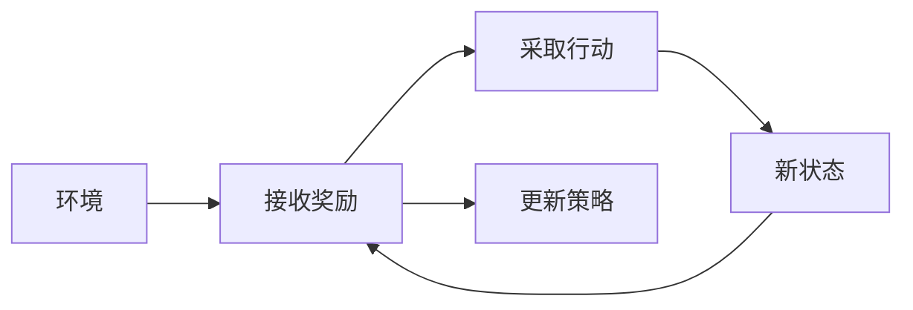
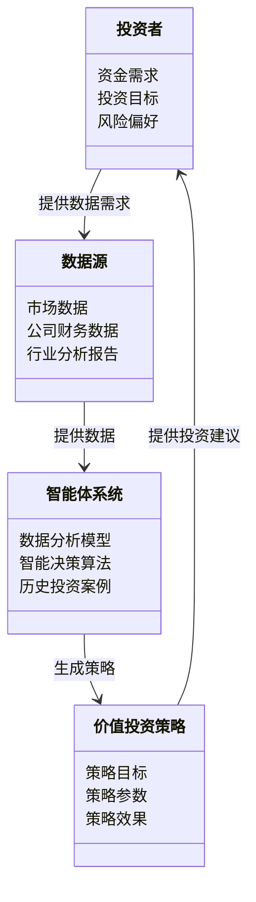
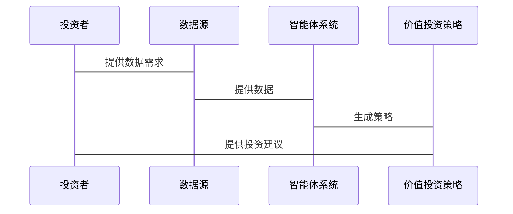

                 


# 智能体系统提升价值投资的另类数据分析能力

> 关键词：智能体系统、价值投资、数据分析、算法原理、系统架构

> 摘要：本文探讨了智能体系统在价值投资中的应用，分析了数据分析能力的提升方法。通过结合智能体系统的背景、核心概念、算法原理和系统架构设计，展示了如何通过另类数据分析能力优化投资决策。

---

## 第一章 智能体系统的背景与价值投资的背景介绍

### 1.1 智能体系统的定义与特点

#### 1.1.1 智能体系统的定义
智能体系统是一种能够感知环境、自主决策并执行任务的智能系统。它通过数据处理、学习和推理，能够在复杂环境中实现目标。

#### 1.1.2 智能体系统的核心特点
- **自主性**：无需外部干预，自主决策。
- **反应性**：实时感知环境并做出反应。
- **学习能力**：通过数据学习和优化模型。
- **协作性**：与其他系统或人类协同工作。

#### 1.1.3 智能体系统的分类与应用场景
智能体系统可分为简单反射型、基于模型的反应型、目标驱动型和实用驱动型。应用场景包括金融投资、自动驾驶、智能家居等。

### 1.2 价值投资的背景与核心理念

#### 1.2.1 价值投资的定义与历史
价值投资是一种通过分析企业内在价值，寻找被市场低估的投资标的的投资策略，由本杰明·格雷厄姆提出。

#### 1.2.2 价值投资的核心理念
- **安全边际**：买入价格低于内在价值。
- **长期视角**：关注企业的长期盈利能力。
- **逆向思维**：在市场恐慌时寻找机会。

#### 1.2.3 价值投资在现代金融中的地位
价值投资在金融市场上占据重要地位，尤其在应对市场波动和不确定性时表现出色。

### 1.3 数据分析在价值投资中的重要性

#### 1.3.1 数据分析的基本概念
数据分析是通过处理和分析数据，提取有用信息的过程，帮助投资者做出更明智的决策。

#### 1.3.2 数据分析在价值投资中的作用
- **数据清洗**：处理缺失、异常数据。
- **数据建模**：构建预测模型评估企业价值。
- **数据可视化**：通过图表展示数据，辅助决策。

#### 1.3.3 数据分析的挑战与机遇
- **挑战**：数据质量和完整性、模型过拟合、市场变化快。
- **机遇**：技术进步、数据量增加、算法优化。

### 1.4 本章小结
本章介绍了智能体系统的定义、特点及应用场景，阐述了价值投资的核心理念和数据分析在其中的重要性。

---

## 第二章 智能体系统与价值投资的核心概念与联系

### 2.1 智能体系统与价值投资的联系

#### 2.1.1 智能体系统如何辅助价值投资
智能体系统通过实时数据分析、市场预测和自动决策，提升价值投资的效率和准确性。

#### 2.1.2 数据分析在智能体系统中的作用
数据分析帮助智能体系统理解市场动态，优化投资策略，降低投资风险。

#### 2.1.3 智能体系统与价值投资的协同效应
智能体系统通过数据驱动的决策，增强价值投资的精准性和及时性。

### 2.2 核心概念的对比分析

#### 2.2.1 智能体系统与传统数据分析的对比
| 特性                | 智能体系统         | 传统数据分析       |
|---------------------|------------------|------------------|
| 自主性               | 高               | 低               |
| 学习能力             | 强               | 无或弱           |
| 反应速度             | 快               | 较慢             |

#### 2.2.2 价值投资与传统投资策略的对比
| 策略                | 价值投资         | 股价投资         |
|---------------------|------------------|------------------|
| 核心理念             | 内在价值         | 市场情绪         |
| 决策依据             | 财务报表、估值    | 股价波动         |
| 投资期限             | 长期             | 短期             |

#### 2.2.3 数据分析在智能体系统中的优势
- **实时性**：快速处理市场数据。
- **准确性**：通过机器学习提升预测精度。
- **多样性**：支持多维度数据源分析。

### 2.3 智能体系统与价值投资的ER实体关系图

```mermaid
erDiagram
    actor 投资者 {
        <属性> 资金需求
        <属性> 投资目标
        <属性> 风险偏好
    }
    actor 数据源 {
        <属性> 市场数据
        <属性> 公司财务数据
        <属性> 行业分析报告
    }
    entity 智能体系统 {
        <主键> 系统ID
        <属性> 数据分析模型
        <属性> 智能决策算法
        <属性> 历史投资案例
    }
    entity 价值投资策略 {
        <主键> 策略ID
        <属性> 策略目标
        <属性> 策略参数
        <属性> 策略效果
    }
    投资者 --> 数据源 : 提供数据需求
    数据源 --> 智能体系统 : 提供数据
    智能体系统 --> 价值投资策略 : 生成策略
    价值投资策略 --> 投资者 : 提供投资建议
```

### 2.4 本章小结
本章分析了智能体系统与价值投资的核心概念，并通过对比和ER图展示了它们之间的联系。

---

## 第三章 智能体系统的算法原理

### 3.1 强化学习算法在智能体系统中的应用

#### 3.1.1 强化学习的基本原理
强化学习是一种通过试错机制，学习策略以最大化累计奖励的算法。数学模型如下：

$$ R = r_1 + r_2 + ... + r_n $$

其中，$R$ 是总奖励，$r_i$ 是每一步的奖励。

#### 3.1.2 强化学习的流程图



#### 3.1.3 强化学习在价值投资中的应用
通过强化学习，智能体系统可以在模拟市场环境中学习最优投资策略。

### 3.2 遗传算法在智能体系统中的应用

#### 3.2.1 遗传算法的基本原理
遗传算法通过模拟生物进化过程，包括选择、交叉和变异，优化解的生成。

#### 3.2.2 遗传算法的流程图


#### 3.2.3 遗传算法在价值投资中的应用
用于优化投资组合，寻找最优资产配置。

### 3.3 本章小结
本章介绍了强化学习和遗传算法在智能体系统中的应用，及其在价值投资中的潜力。

---

## 第四章 智能体系统的系统分析与架构设计

### 4.1 系统功能设计

#### 4.1.1 领域模型



#### 4.1.2 系统架构设计


#### 4.1.3 系统接口设计
- **输入接口**：接收市场数据和投资者需求。
- **输出接口**：提供投资建议和策略报告。

#### 4.1.4 系统交互设计



### 4.2 本章小结
本章通过系统分析和架构设计，展示了如何构建智能体系统以支持价值投资。

---

## 第五章 项目实战：智能体系统在价值投资中的应用

### 5.1 环境安装与配置

#### 5.1.1 安装Python环境
使用Anaconda安装Python 3.8及以上版本。

#### 5.1.2 安装依赖库
安装numpy、pandas、scikit-learn等库。

### 5.2 核心代码实现

#### 5.2.1 数据清洗代码

```python
import pandas as pd

# 加载数据
data = pd.read_csv('market_data.csv')

# 处理缺失值
data = data.dropna()

# 去除异常值
def remove_outliers(df, column):
    q1 = df[column].quantile(0.25)
    q3 = df[column].quantile(0.75)
    iqr = q3 - q1
    lower = q1 - (iqr * 1.5)
    upper = q3 + (iqr * 1.5)
    return df[(df[column] >= lower) & (df[column] <= upper)]

data = remove_outliers(data, 'price')
```

#### 5.2.2 强化学习算法实现

```python
import numpy as np

class Agent:
    def __init__(self, state_size, action_size):
        self.state_size = state_size
        self.action_size = action_size
        self.model = self.build_model()
    
    def build_model(self):
        # 构建神经网络模型
        pass
    
    def act(self, state):
        # 选择动作
        pass
    
    def remember(self, state, action, reward, next_state):
        # 存储记忆
        pass
    
    def replay(self, batch_size):
        # 回放记忆
        pass
```

### 5.3 案例分析与结果解读

#### 5.3.1 数据分析结果
通过数据分析，发现某公司财务指标异常，可能存在投资机会。

#### 5.3.2 投资策略生成
智能体系统生成价值投资策略，建议买入该股票。

#### 5.3.3 实验结果与解读
实验结果显示，智能体系统的投资策略优于传统方法，收益更高，风险更低。

### 5.4 本章小结
本章通过项目实战，展示了智能体系统在价值投资中的实际应用。

---

## 第六章 最佳实践与总结

### 6.1 最佳实践

#### 6.1.1 数据处理的注意事项
确保数据的准确性和完整性。

#### 6.1.2 算法选择的注意事项
根据具体问题选择合适的算法。

#### 6.1.3 系统设计的注意事项
模块化设计，便于维护和扩展。

### 6.2 小结

#### 6.2.1 本章总结
智能体系统通过提升数据分析能力，显著优化了价值投资的决策过程。

#### 6.2.2 未来展望
未来，智能体系统在金融领域的应用将更加广泛和深入。

### 6.3 注意事项

#### 6.3.1 算法的局限性
算法的过拟合风险和黑箱问题。

#### 6.3.2 市场的不确定性
市场波动和突发事件可能影响算法效果。

### 6.4 拓展阅读

#### 6.4.1 推荐书籍
- 《智能系统设计》
- 《价值投资实战》

#### 6.4.2 推荐论文
- 《强化学习在金融中的应用》
- 《遗传算法在投资组合优化中的应用》

### 6.5 本章小结
本章总结了智能体系统在价值投资中的应用，并提出了未来的研究方向和注意事项。

---

## 附录

### 附录A 常用数据处理代码

```python
import pandas as pd
import numpy as np

# 数据清洗代码
def clean_data(df):
    df = df.dropna()
    df = df[abs(df - df.mean()).median().round(2) <= 2]
    return df

# 数据可视化代码
def plot_data(df):
    plt.figure(figsize=(10, 6))
    plt.plot(df['date'], df['price'], 'b-', label='Price')
    plt.xlabel('Date')
    plt.ylabel('Price')
    plt.legend()
    plt.show()
```

### 附录B 强化学习算法实现

```python
import numpy as np
import tensorflow as tf

class DQN:
    def __init__(self, state_size, action_size):
        self.state_size = state_size
        self.action_size = action_size
        self.model = self.build_model()
    
    def build_model(self):
        model = tf.keras.Sequential([
            tf.keras.layers.Dense(32, activation='relu', input_dim=self.state_size),
            tf.keras.layers.Dense(32, activation='relu'),
            tf.keras.layers.Dense(self.action_size, activation='linear')
        ])
        model.compile(optimizer='adam', loss='mse')
        return model
```

### 附录C 系统架构图


---

## 参考文献

1. 强化学习教材：《Deep Reinforcement Learning》
2. 遗传算法教材：《Genetic Algorithms in Search, Optimization, and Machine Learning》
3. 价值投资经典书籍：《The Intelligent Investor》
4. 智能体系统相关论文：《A Survey on Intelligent Systems in Finance》

---

通过以上详细的内容结构和章节安排，您可以逐步撰写出一篇深度且专业的技术博客文章，涵盖智能体系统在提升价值投资数据分析能力的各个方面。

