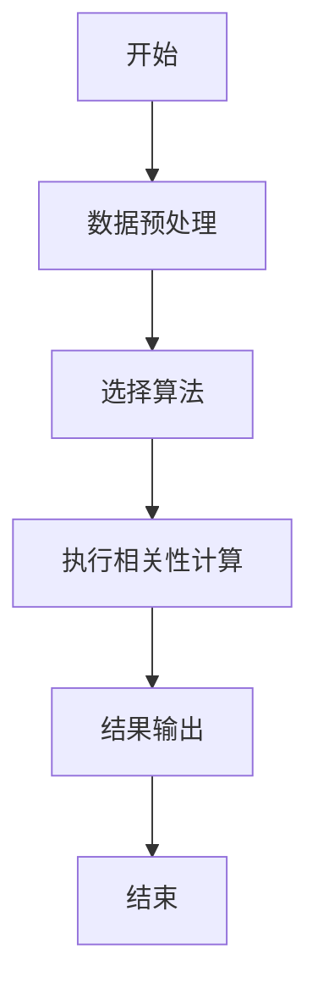

                 

# 智能体系统提升价值投资的另类资产相关性分析

## 关键词：
智能体系统、价值投资、另类资产、相关性分析、强化学习、知识图谱、数学模型

## 摘要：
本文通过分析智能体系统在价值投资中的应用，探讨了另类资产的相关性分析方法。结合强化学习和知识图谱等技术，提出了一种基于智能体系统的相关性分析模型，旨在提升价值投资的决策效率和准确性。

---

# 第1章: 智能体系统与另类资产概述

## 1.1 智能体系统的基本概念

### 1.1.1 智能体的定义与特点
智能体（Intelligent Agent）是指具有感知环境、自主决策和执行任务能力的实体。其特点包括：
- **自主性**：无需外部干预，自主完成任务。
- **反应性**：能够实时感知环境变化并做出响应。
- **学习能力**：通过数据和经验不断优化决策模型。
- **适应性**：能够适应复杂多变的环境。

### 1.1.2 智能体系统的核心要素
智能体系统由以下几个核心要素组成：
1. **感知模块**：负责收集环境中的数据。
2. **决策模块**：基于感知数据，制定决策策略。
3. **执行模块**：根据决策结果执行具体操作。
4. **学习模块**：通过反馈机制不断优化决策模型。

### 1.1.3 智能体系统与传统投资的区别
传统投资依赖人工分析和经验判断，而智能体系统能够通过算法和大数据分析，快速捕捉市场机会，降低人为误差。

---

## 1.2 另类资产的定义与特性

### 1.2.1 另类资产的分类与范围
另类资产主要包括以下几类：
1. **房地产**：包括住宅、商业用房等。
2. **基础设施**：如桥梁、道路等。
3. **私募股权**：未公开上市的企业股权。
4. **对冲基金**：通过杠杆和做空操作获利。
5. **艺术品与收藏品**：如绘画、雕塑、邮票等。

### 1.2.2 另类资产在价值投资中的作用
另类资产能够分散投资风险，提供多元化收益来源。在市场波动较大的情况下，另类资产往往表现出较强的稳定性。

### 1.2.3 另类资产的相关性分析的重要性
相关性分析能够帮助投资者理解不同资产之间的关联性，从而优化投资组合，降低风险。

---

## 1.3 价值投资与智能体系统结合的背景

### 1.3.1 价值投资的传统方法与局限性
传统价值投资依赖于基本面分析，耗时长且依赖人工判断，难以应对市场快速变化。

### 1.3.2 智能体系统在金融领域的应用趋势
随着大数据和人工智能技术的发展，智能体系统在金融领域的应用越来越广泛。

### 1.3.3 另类资产相关性分析的现实需求
市场参与者需要通过智能体系统快速、准确地分析另类资产的相关性，以优化投资决策。

---

## 1.4 本章小结
本章介绍了智能体系统的基本概念和另类资产的特性，探讨了两者结合的背景和意义。

---

# 第2章: 另类资产相关性分析的核心概念

## 2.1 相关性分析的基本原理

### 2.1.1 相关性的数学定义
相关性是衡量两个变量之间关系强度的指标，公式如下：
$$ r = \frac{\sum (x_i - \bar{x})(y_i - \bar{y})}{\sqrt{\sum (x_i - \bar{x})^2 \sum (y_i - \bar{y})^2}} $$

其中：
- $x_i$ 和 $y_i$ 分别是两个变量的观测值。
- $\bar{x}$ 和 $\bar{y}$ 分别是两个变量的平均值。

### 2.1.2 相关性分析的指标与方法
常用的指标包括皮尔逊相关系数和斯皮尔曼相关系数，方法包括回归分析和聚类分析。

### 2.1.3 相关性分析的局限性
相关性分析无法完全解释变量之间的因果关系，且受数据质量的影响较大。

---

## 2.2 智能体系统在相关性分析中的应用

### 2.2.1 智能体系统的核心算法
智能体系统在相关性分析中主要采用强化学习和知识图谱技术。

### 2.2.2 智能体系统在相关性分析中的优势
- **高效性**：能够快速处理大量数据。
- **准确性**：通过算法优化，提高分析结果的准确性。
- **适应性**：能够实时适应市场变化。

### 2.2.3 智能体系统与传统相关性分析的对比
智能体系统在数据处理能力、实时性和适应性方面具有明显优势。

---

## 2.3 另类资产相关性分析的数学模型

### 2.3.1 相关性系数公式
$$ r = \frac{\sum (x_i - \bar{x})(y_i - \bar{y})}{\sqrt{\sum (x_i - \bar{x})^2 \sum (y_i - \bar{y})^2}} $$

### 2.3.2 智能体系统相关性分析的扩展模型
通过引入强化学习机制，可以进一步优化相关性分析模型。

---

## 2.4 本章小结
本章详细介绍了相关性分析的基本原理和智能体系统在其中的应用，探讨了数学模型的构建方法。

---

# 第3章: 智能体系统的核心原理与技术

## 3.1 智能体系统的组成与功能

### 3.1.1 智能体系统的组成结构
智能体系统由感知模块、决策模块、执行模块和学习模块组成。

### 3.1.2 智能体系统的主要功能模块
- **感知模块**：收集环境数据。
- **决策模块**：制定决策策略。
- **执行模块**：执行决策操作。
- **学习模块**：优化决策模型。

### 3.1.3 智能体系统的输入输出关系
输入包括市场数据和用户指令，输出包括决策建议和执行结果。

---

## 3.2 强化学习在智能体系统中的应用

### 3.2.1 强化学习的基本原理
强化学习通过试错机制，逐步优化决策模型。

### 3.2.2 强化学习在相关性分析中的应用
通过强化学习，智能体系统能够快速识别资产之间的相关性。

### 3.2.3 强化学习的优缺点
优点是适应性强，缺点是需要大量数据支持。

---

## 3.3 智能体系统中的知识图谱构建

### 3.3.1 知识图谱的定义与构建方法
知识图谱是一种将知识表示为图结构的数据模型。

### 3.3.2 知识图谱在相关性分析中的作用
通过知识图谱，智能体系统能够更好地理解资产之间的关系。

### 3.3.3 知识图谱与智能体系统的结合
知识图谱为智能体系统提供了知识支持，提高了分析的准确性。

---

## 3.4 本章小结
本章详细介绍了智能体系统的组成和核心技术，探讨了强化学习和知识图谱的应用。

---

# 第4章: 另类资产相关性分析的算法原理

## 4.1 相关性分析的算法选择

### 4.1.1 常见的相关性分析算法
包括皮尔逊相关系数、斯皮尔曼相关系数和聚类分析。

### 4.1.2 算法选择的依据与标准
根据数据类型和分析目标选择合适的算法。

### 4.1.3 算法的优缺点对比
不同算法在计算效率和准确性方面存在差异。

---

## 4.2 智能体系统相关性分析算法的实现

### 4.2.1 算法流程图（使用mermaid）

### 4.2.2 算法流程图解释
流程图展示了从数据预处理到结果输出的完整流程。

### 4.2.3 算法的数学模型
$$ r = \frac{\sum (x_i - \bar{x})(y_i - \bar{y})}{\sqrt{\sum (x_i - \bar{x})^2 \sum (y_i - \bar{y})^2}} $$

---

## 4.3 本章小结
本章详细介绍了相关性分析的算法选择和实现过程。

---

通过以上章节的详细讲解，本文系统地探讨了智能体系统在另类资产相关性分析中的应用，为价值投资者提供了新的思路和工具。

