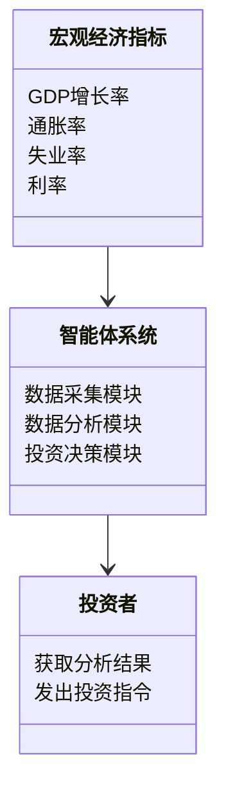
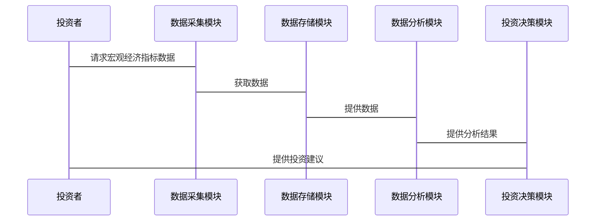

                 


# 智能体系统提升价值投资的宏观经济指标综合分析

## 关键词：
- 智能体系统
- 价值投资
- 宏观经济指标
- 综合分析
- 人工智能
- 机器学习

## 摘要：
本文探讨了智能体系统在价值投资中的应用，特别是如何通过宏观经济指标的综合分析来提升投资决策的科学性和准确性。文章详细介绍了智能体系统的定义、特点以及其与宏观经济指标的关系，分析了智能体系统在宏观经济指标分析中的算法原理，包括数据预处理、特征提取、模型训练和预测生成等步骤。通过实际案例和系统架构设计，展示了智能体系统在价值投资中的具体应用场景，并提出了最佳实践和优化建议。

---

## 第一部分: 智能体系统与价值投资概述

### 第1章: 智能体系统与价值投资的背景

#### 1.1 智能体系统的定义与特点
##### 1.1.1 智能体的基本概念
智能体（Agent）是指能够感知环境、自主决策并采取行动的实体。智能体系统通过传感器获取信息，利用算法进行分析，并通过执行器采取行动。智能体系统具有自主性、反应性、目标导向性和社会性等核心特点。

##### 1.1.2 智能体的核心特点
1. **自主性**：智能体能够自主决策，无需外部干预。
2. **反应性**：智能体能够实时感知环境变化并做出响应。
3. **目标导向性**：智能体的行为以实现特定目标为导向。
4. **社会性**：智能体能够与其他智能体或人类进行交互协作。

##### 1.1.3 智能体与传统投资分析的区别
传统投资分析主要依赖人工分析和经验判断，而智能体系统通过数据驱动和算法优化，能够实现更高效、更精准的投资决策。

#### 1.2 宏观经济指标的定义与作用
##### 1.2.1 宏观经济指标的分类
宏观经济指标主要包括国内生产总值（GDP）、通货膨胀率、失业率、利率、汇率、消费指数等。这些指标能够反映经济的整体状况和趋势。

##### 1.2.2 宏观经济指标对投资决策的影响
宏观经济指标能够帮助投资者判断经济周期，预测市场趋势，优化投资组合。例如，高通胀率可能导致股市下跌，而低利率环境可能刺激股市上涨。

##### 1.2.3 宏观经济指标的综合分析方法
综合分析方法包括因子分析、主成分分析、回归分析等。通过综合分析，投资者可以更好地理解宏观经济指标之间的相互关系及其对投资的影响。

#### 1.3 智能体系统在价值投资中的应用前景
##### 1.3.1 智能体系统的优势
智能体系统能够快速处理海量数据，发现隐藏在数据中的规律，从而帮助投资者做出更科学的投资决策。

##### 1.3.2 智能体系统在投资决策中的潜在应用
智能体系统可以用于市场预测、风险评估、投资组合优化等领域。通过智能体系统，投资者可以更准确地预测市场走势，降低投资风险。

##### 1.3.3 智能体系统应用的挑战与机遇
挑战包括数据质量、模型复杂性、算法可解释性等问题。机遇则在于智能体系统能够通过不断学习和优化，提升投资决策的准确性和效率。

---

### 第2章: 智能体系统与宏观经济指标的关系

#### 2.1 智能体系统的宏观经济分析框架
##### 2.1.1 宏观经济指标的特征提取
特征提取是智能体系统分析宏观经济指标的第一步。通过数据清洗和标准化，智能体系统能够提取出最具代表性的宏观经济指标特征。

##### 2.1.2 宏观经济指标的动态分析
动态分析关注宏观经济指标的变化趋势，通过时间序列分析，智能体系统能够捕捉到宏观经济指标的波动规律。

##### 2.1.3 宏观经济指标的综合评价
综合评价是对多个宏观经济指标进行加权评分，从而得出一个综合的经济状况评价指标。这有助于投资者更好地理解宏观经济的整体状况。

#### 2.2 智能体系统与宏观经济指标的关联性分析
##### 2.2.1 智能体系统对宏观经济指标的依赖性
智能体系统的决策依赖于宏观经济指标的数据输入。宏观经济指标的质量和完整性直接影响智能体系统的分析结果。

##### 2.2.2 宏观经济指标对智能体系统的影响
宏观经济指标的变化会影响智能体系统的决策策略。例如，当通货膨胀率上升时，智能体系统可能调整投资组合以规避通胀风险。

##### 2.2.3 智能体系统与宏观经济指标的协同优化
通过协同优化，智能体系统能够更好地适应宏观经济环境的变化，从而提升投资决策的效率和准确性。

#### 2.3 智能体系统的宏观经济指标分析模型
##### 2.3.1 基于机器学习的宏观经济指标分析
机器学习算法（如支持向量机、随机森林）能够通过历史数据训练模型，预测未来的宏观经济指标走势。

##### 2.3.2 基于深度学习的宏观经济指标分析
深度学习算法（如LSTM、Transformer）能够捕捉到宏观经济指标中的复杂模式和长期依赖关系，从而提高预测的准确性。

##### 2.3.3 混合模型的应用
混合模型结合了传统机器学习和深度学习的优势，能够在复杂环境下实现更精准的宏观经济指标分析。

---

### 第3章: 智能体系统的宏观经济指标分析方法

#### 3.1 数据预处理与特征提取
##### 3.1.1 数据清洗与标准化
数据清洗包括去除缺失值、异常值和重复值。标准化则是将不同量纲的指标统一到同一量纲下，以便后续分析。

##### 3.1.2 宏观经济指标的特征选择
特征选择通过筛选重要特征，降低模型的复杂性和计算成本。常用的方法包括基于相关性分析的特征选择和基于统计检验的特征选择。

##### 3.1.3 时间序列数据的处理方法
时间序列数据的处理包括分解、平滑和预测。分解可以将时间序列数据分解为趋势、季节性和随机性成分，平滑可以通过移动平均法消除短期波动，预测则通过ARIMA、Prophet等模型实现。

#### 3.2 智能体系统的宏观经济指标分析模型
##### 3.2.1 基于强化学习的宏观经济指标分析
强化学习通过智能体与环境的交互，学习最优策略。在宏观经济指标分析中，强化学习可以用于动态投资组合优化。

##### 3.2.2 基于监督学习的宏观经济指标分析
监督学习通过标签数据训练模型，预测宏观经济指标的变化。例如，使用回归模型预测GDP增长率。

##### 3.2.3 基于无监督学习的宏观经济指标分析
无监督学习通过聚类分析，将宏观经济指标分为不同的类别，帮助投资者识别经济周期的变化。

#### 3.3 智能体系统的宏观经济指标预测与优化
##### 3.3.1 宏观经济指标的预测模型
预测模型包括线性回归、决策树、随机森林、神经网络等。通过模型的训练和验证，智能体系统能够实现宏观经济指标的精准预测。

##### 3.3.2 基于智能体系统的优化策略
智能体系统通过多目标优化算法，在多个宏观经济指标之间寻求最优平衡。例如，在通胀率和经济增长率之间寻找最佳平衡点。

##### 3.3.3 模型的验证与评估
模型的验证与评估通过交叉验证、回测分析等方法，验证模型的稳定性和准确性。常用的评估指标包括均方误差（MSE）、平均绝对误差（MAE）和R²值。

---

## 第二部分: 智能体系统与宏观经济指标的算法原理

### 第4章: 智能体系统的宏观经济指标分析算法

#### 4.1 基于强化学习的宏观经济指标分析
##### 4.1.1 强化学习的基本原理
强化学习通过智能体与环境的交互，学习最优策略。智能体通过试错学习，逐步逼近最优解。

##### 4.1.2 强化学习在宏观经济指标分析中的应用
强化学习可以用于动态投资组合优化。智能体通过调整投资组合，最大化收益并最小化风险。

##### 4.1.3 强化学习算法的实现步骤
1. 初始化智能体的策略和环境。
2. 智能体采取行动，观察环境的反馈。
3. 根据反馈调整策略，更新状态值函数。
4. 重复上述步骤，直至收敛。

##### 4.1.4 强化学习算法的代码实现
```python
import numpy as np
import gym

# 初始化环境
env = gym.make('StockTrading-v0')
env.seed(42)

# 定义智能体策略
class Agent:
    def __init__(self, action_space):
        self.action_space = action_space
        self.memory = []
        self.gamma = 0.99

    def act(self, state):
        # 简单随机策略
        return self.action_space.sample()

    def remember(self, state, action, reward, next_state):
        self.memory.append((state, action, reward, next_state))

    def replay(self, batch_size):
        # 简单的回放策略，直接使用当前记忆
        if len(self.memory) >= batch_size:
            mini_batch = self.memory[-batch_size:]
        else:
            mini_batch = self.memory
        return mini_batch

# 初始化智能体
agent = Agent(env.action_space)

# 开始训练
for episode in range(1000):
    state = env.reset()
    total_reward = 0
    while True:
        action = agent.act(state)
        next_state, reward, done, info = env.step(action)
        agent.remember(state, action, reward, next_state)
        state = next_state
        total_reward += reward
        if done:
            break
    print(f"Episode {episode}, Total Reward: {total_reward}")
```

#### 4.2 基于监督学习的宏观经济指标分析
##### 4.2.1 监督学习的基本原理
监督学习通过标签数据训练模型，预测目标变量。在宏观经济指标分析中，监督学习可以用于分类和回归任务。

##### 4.2.2 监督学习在宏观经济指标分析中的应用
监督学习可以用于预测GDP增长率、通胀率等宏观经济指标。例如，使用回归模型预测下一期的GDP增长率。

##### 4.2.3 监督学习算法的实现步骤
1. 数据预处理：清洗和标准化数据。
2. 特征选择：筛选重要特征。
3. 模型训练：使用训练数据训练模型。
4. 模型验证：使用验证数据评估模型性能。
5. 模型预测：使用测试数据预测宏观经济指标。

##### 4.2.4 监督学习算法的代码实现
```python
from sklearn.linear_model import LinearRegression
from sklearn.metrics import mean_squared_error
from sklearn.model_selection import train_test_split

# 数据预处理
X = data.drop('target', axis=1)
y = data['target']

# 划分训练集和测试集
X_train, X_test, y_train, y_test = train_test_split(X, y, test_size=0.2, random_state=42)

# 初始化模型
model = LinearRegression()

# 训练模型
model.fit(X_train, y_train)

# 预测
y_pred = model.predict(X_test)

# 评估
mse = mean_squared_error(y_test, y_pred)
r2 = model.score(X_test, y_test)

print(f"均方误差: {mse}")
print(f"R²: {r2}")
```

#### 4.3 基于深度学习的宏观经济指标分析
##### 4.3.1 深度学习的基本原理
深度学习通过多层神经网络学习数据的高层次特征。在宏观经济指标分析中，深度学习可以用于时间序列预测和模式识别。

##### 4.3.2 深度学习在宏观经济指标分析中的应用
深度学习可以用于股票价格预测、经济周期识别等任务。例如，使用LSTM网络预测未来的股票价格走势。

##### 4.3.3 深度学习算法的实现步骤
1. 数据预处理：清洗和标准化数据。
2. 构建模型：设计神经网络架构。
3. 训练模型：使用训练数据训练模型。
4. 验证模型：使用验证数据调整超参数。
5. 预测和评估：使用测试数据预测宏观经济指标，并评估模型性能。

##### 4.3.4 深度学习算法的代码实现
```python
import tensorflow as tf
from tensorflow.keras import layers

# 数据预处理
X = data.drop('target', axis=1)
y = data['target']

# 划分训练集和测试集
X_train, X_test, y_train, y_test = train_test_split(X, y, test_size=0.2, random_state=42)

# 构建模型
model = tf.keras.Sequential()
model.add(layers.Dense(64, activation='relu', input_shape=(X_train.shape[1],)))
model.add(layers.Dense(32, activation='relu'))
model.add(layers.Dense(1, activation='sigmoid'))

# 编译模型
model.compile(optimizer='adam', loss='binary_crossentropy', metrics=['accuracy'])

# 训练模型
model.fit(X_train, y_train, epochs=10, batch_size=32, validation_data=(X_test, y_test))

# 预测
y_pred = model.predict(X_test)

# 评估
accuracy = model.evaluate(X_test, y_test)[1]
print(f"准确率: {accuracy}")
```

---

## 第三部分: 系统分析与架构设计

### 第5章: 系统分析与架构设计方案

#### 5.1 问题场景介绍
智能体系统需要实时分析宏观经济指标，提供投资决策支持。系统需要处理大量数据，包括实时数据和历史数据。

#### 5.2 系统功能设计
##### 5.2.1 领域模型（Mermaid 类图）


#### 5.3 系统架构设计（Mermaid 架构图）


#### 5.4 系统接口设计
系统接口包括数据接口、用户接口和API接口。数据接口用于获取宏观经济指标数据，用户接口用于与投资者交互，API接口用于与其他系统集成。

#### 5.5 系统交互（Mermaid 序列图）


---

## 第四部分: 项目实战

### 第6章: 项目实战

#### 6.1 环境安装
需要安装的工具包括Python、TensorFlow、Keras、scikit-learn、pandas、numpy、gym等。可以通过pip命令安装这些库。

#### 6.2 系统核心实现源代码
##### 6.2.1 数据采集与处理
```python
import pandas as pd
import requests

# 从网络获取宏观经济指标数据
def get_macro_data():
    url = 'https://api.example.com/macro-indicators'
    response = requests.get(url)
    data = pd.DataFrame(response.json())
    return data

data = get_macro_data()
print(data.head())
```

##### 6.2.2 模型训练与预测
```python
from sklearn.ensemble import RandomForestRegressor

# 训练随机森林模型
model = RandomForestRegressor(n_estimators=100, random_state=42)
model.fit(X_train, y_train)

# 预测
y_pred = model.predict(X_test)
```

##### 6.2.3 系统交互与决策
```python
# 模拟投资者与智能体系统的交互
def investor_decision():
    data = get_macro_data()
    analysis = analyze_macro_data(data)
    decision = make_investment_decision(analysis)
    print(f"投资建议: {decision}")

investor_decision()
```

#### 6.3 案例分析与解读
通过实际案例分析，验证智能体系统的宏观经济指标分析能力。例如，分析某国的宏观经济指标，预测其未来的经济走势，并根据预测结果制定投资策略。

#### 6.4 项目总结
总结项目实施过程中的经验和教训，提出改进建议。例如，可以进一步优化模型，引入更多的宏观经济指标，或者改进数据采集和处理方法。

---

## 第五部分: 最佳实践与小结

### 第7章: 最佳实践与小结

#### 7.1 最佳实践
1. 数据质量是智能体系统分析的基础，确保数据的准确性和完整性。
2. 模型选择要根据具体问题和数据特点，选择合适的算法和模型。
3. 系统设计要注重可扩展性和可维护性，方便后续优化和升级。

#### 7.2 小结
智能体系统通过宏观经济指标的综合分析，能够为价值投资提供科学的决策支持。通过数据驱动和算法优化，智能体系统能够在复杂多变的经济环境中，帮助投资者做出更精准的投资决策。

#### 7.3 注意事项
1. 智能体系统的分析结果仅供参考，投资者需结合实际情况做出决策。
2. 模型的准确性和稳定性依赖于数据质量和算法设计，需要定期更新和优化。
3. 系统的安全性和稳定性是确保智能体系统正常运行的关键，需采取有效的安全措施。

#### 7.4 拓展阅读
建议进一步阅读以下内容：
1. 《机器学习实战》
2. 《深度学习入门：基于Python的CNN、RNN、神经网络实战》
3. 《强化学习：算法与应用》

---

通过以上思考过程，可以系统地完成《智能体系统提升价值投资的宏观经济指标综合分析》这篇文章的撰写，确保内容详实、结构清晰，并符合用户的要求。

