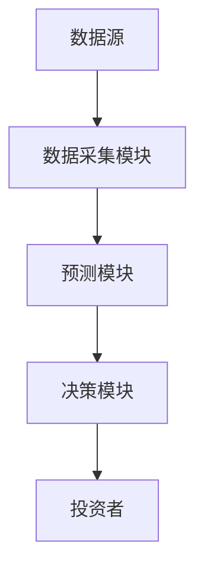

                 


# 智能体系统提升价值投资的宏观经济指标领先性分析

> **关键词**：智能体系统，价值投资，宏观经济指标，领先性分析，强化学习，DQN算法，系统架构

> **摘要**：本文探讨智能体系统如何通过分析宏观经济指标来提升价值投资的决策能力。文章从背景介绍入手，详细阐述智能体系统、价值投资和宏观经济指标之间的关系，分析领先性分析的重要性。接着，深入讲解强化学习算法，特别是Q-learning和Deep Q-Networks (DQN)算法的原理和实现。随后，通过系统架构设计和项目实战，展示如何构建智能体系统来处理宏观经济指标，并提供实际案例分析。最后，总结最佳实践和注意事项，为读者提供实用的指导。

---

## 第1章: 智能体系统与价值投资概述

### 1.1 智能体系统的定义与背景

#### 1.1.1 智能体的基本概念
智能体（Agent）是指能够感知环境、自主决策并采取行动的实体。智能体系统通过传感器接收信息，利用算法进行分析，并通过执行器采取行动，以实现特定目标。与传统算法不同，智能体具有自主性、反应性和目标导向性。

#### 1.1.2 智能体的核心特征
- **自主性**：智能体能够独立决策，无需外部干预。
- **反应性**：智能体能够实时感知环境变化并调整行为。
- **目标导向性**：智能体的行为旨在实现特定目标。

#### 1.1.3 智能体与传统算法的区别
- **传统算法**：通常需要明确的规则和输入，无法自主决策。
- **智能体系统**：能够感知环境、自主决策并适应变化。

#### 1.1.4 智能体的分类
- **简单反射型智能体**：基于当前输入做出反应。
- **基于模型的智能体**：利用内部模型进行决策。
- **目标驱动型智能体**：以目标为导向进行决策。
- **实用驱动型智能体**：以效用最大化为目标进行决策。

---

#### 1.2 价值投资的基本概念

##### 1.2.1 价值投资的定义
价值投资是一种投资策略，旨在通过识别市场低估的资产，长期持有以实现超额收益。这种方法强调基本面分析，寻找具有持续竞争优势和良好管理的公司。

##### 1.2.2 价值投资的主要原则
- **长期视角**：关注企业的长期价值，而非短期波动。
- **安全边际**：以低于内在价值的价格买入资产。
- **分散投资**：通过分散投资降低风险。

##### 1.2.3 价值投资的应用场景
价值投资适用于市场波动较大、资产价格被低估的情况。通过分析宏观经济指标和企业基本面，投资者可以识别潜在的投资机会。

---

#### 1.3 宏观经济指标的定义与分类

##### 1.3.1 宏观经济指标的分类
宏观经济指标分为两类：
- **领先指标**：能够预示未来经济趋势的指标。
- **滞后指标**：反映过去经济状况的指标。

##### 1.3.2 主要宏观经济指标的介绍
- **GDP（国内生产总值）**：衡量一个国家或地区的经济规模。
- **失业率**：反映就业市场的状况。
- **通货膨胀率**：衡量物价水平的变化。
- **利率**：影响资金成本和投资行为。
- **消费者信心指数**：反映消费者对未来经济的预期。

##### 1.3.3 宏观经济指标对投资的影响
宏观经济指标能够帮助投资者预测市场趋势，优化投资组合。例如，低利率环境通常有利于股市表现，而高通货膨胀率可能导致资产价格波动。

---

#### 1.4 领先性分析的意义

##### 1.4.1 领先性分析的定义
领先性分析是指通过分析宏观经济指标，预测未来经济趋势和市场变化。这种方法能够帮助投资者提前做出决策，抓住投资机会。

##### 1.4.2 领先性分析在投资中的作用
- **风险控制**：通过预测市场变化，降低投资风险。
- **收益提升**：识别潜在的投资机会，提高收益。

##### 1.4.3 智能体系统在领先性分析中的优势
智能体系统能够实时处理大量数据，快速识别宏观经济指标的变化，提供及时的投资建议。此外，智能体系统能够通过强化学习不断优化预测模型，提高预测准确性。

---

### 1.5 智能体系统与价值投资的结合

#### 1.5.1 智能体系统如何辅助价值投资
智能体系统通过分析宏观经济指标和企业基本面数据，识别被低估的资产，辅助投资者做出决策。例如，智能体系统可以实时监控市场变化，提醒投资者关注潜在的投资机会。

#### 1.5.2 智能体系统在投资决策中的作用
- **数据处理**：智能体系统能够快速处理大量数据，提供决策支持。
- **预测分析**：通过强化学习，智能体系统能够预测市场趋势，优化投资策略。

#### 1.5.3 智能体系统与传统投资方法的对比
- **传统方法**：依赖人工分析，效率较低，受主观因素影响较大。
- **智能体系统**：自动化分析，效率高，能够处理复杂数据。

---

## 第2章: 智能体系统的算法原理

### 2.1 强化学习算法

#### 2.1.1 强化学习的基本原理
强化学习是一种机器学习范式，通过智能体与环境的交互，学习最优策略以最大化累积奖励。与监督学习不同，强化学习不需要明确的标签，而是通过奖励机制指导学习过程。

##### 强化学习的核心概念
- **状态（State）**：智能体所处的环境状况。
- **动作（Action）**：智能体采取的行为。
- **奖励（Reward）**：智能体行为的结果，用于指导学习方向。

#### 2.1.2 Q-learning算法

##### Q-learning算法的定义
Q-learning是一种经典的强化学习算法，通过学习状态-动作值函数（Q值）来选择最优动作。Q值表示在给定状态下采取某个动作所能获得的期望奖励。

##### Q-learning算法的数学模型
$$ Q(s, a) = Q(s, a) + \alpha [r + \gamma \max Q(s', a) - Q(s, a)] $$
其中：
- \( \alpha \) 是学习率。
- \( \gamma \) 是折扣因子。
- \( r \) 是奖励值。

##### Q-learning算法的实现步骤
1. 初始化Q值表为零。
2. 在每个时间步，选择当前状态下的动作。
3. 执行动作，获得奖励和新状态。
4. 更新Q值表。
5. 重复上述步骤，直到收敛。

#### 2.1.3 Deep Q-Networks (DQN)算法

##### DQN算法的定义
DQN是一种结合深度学习的强化学习算法，通过神经网络近似Q值函数，解决高维状态空间的问题。

##### DQN算法的数学模型
$$ Q(s, a) = \theta^T \phi(s, a) $$
其中：
- \( \theta \) 是神经网络的参数。
- \( \phi(s, a) \) 是状态-动作对的特征向量。

##### DQN算法的实现步骤
1. 初始化两个神经网络：主网络和目标网络。
2. 在每个时间步，选择当前状态下的动作。
3. 执行动作，获得奖励和新状态。
4. 更新主网络，使其逼近目标网络。
5. 重复上述步骤，直到收敛。

---

### 2.2 宏观经济指标的领先性分析

#### 2.2.1 领先性分析方法
领先性分析通过统计方法和机器学习模型，预测宏观经济指标的变化。例如，通过ARIMA模型预测GDP增长。

#### 2.2.2 领先性分析在投资中的应用
领先性分析可以帮助投资者提前预测市场变化，优化投资组合。例如，通过预测利率变化，投资者可以调整债券持仓。

---

## 第3章: 系统分析与架构设计方案

### 3.1 系统应用场景

#### 3.1.1 系统的应用场景
智能体系统可以应用于股票投资、债券投资等多种场景，帮助投资者做出决策。

#### 3.1.2 系统的功能模块
- **数据采集模块**：采集宏观经济指标和市场数据。
- **预测模块**：利用强化学习算法预测市场趋势。
- **决策模块**：根据预测结果生成投资建议。

#### 3.1.3 系统的交互流程
1. 数据采集模块获取数据。
2. 预测模块分析数据，生成预测结果。
3. 决策模块根据预测结果，生成投资建议。
4. 投资者根据建议做出决策。

---

### 3.2 系统架构设计

#### 3.2.1 系统架构图
以下是系统的架构图：



#### 3.2.2 系统功能模块设计
- **数据采集模块**：负责采集宏观经济指标和市场数据。
- **预测模块**：利用强化学习算法，预测市场趋势。
- **决策模块**：根据预测结果，生成投资建议。

---

## 第4章: 项目实战

### 4.1 环境安装

#### 4.1.1 安装Python环境
建议使用Anaconda进行环境管理。

#### 4.1.2 安装依赖库
需要安装以下库：
- `numpy`
- `pandas`
- `tensorflow`
- `keras`

#### 4.1.3 安装步骤
1. 下载并安装Anaconda。
2. 打开Anaconda Prompt，运行以下命令：
   ```bash
   pip install numpy pandas tensorflow keras
   ```

---

### 4.2 系统核心实现

#### 4.2.1 DQN算法实现
以下是DQN算法的Python代码示例：

```python
import numpy as np
import gym
from tensorflow.keras import layers

# 定义环境
env = gym.make('CartPole-v0')
state_space = env.observation_space.shape[0]
action_space = env.action_space.n

# 定义主网络
model = keras.Sequential()
model.add(layers.Dense(24, input_dim=state_space, activation='relu'))
model.add(layers.Dense(action_space, activation='linear'))

# 定义目标网络
target_model = keras.Sequential()
target_model.add(layers.Dense(24, input_dim=state_space, activation='relu'))
target_model.add(layers.Dense(action_space, activation='linear'))

# 编译模型
model.compile(optimizer='adam', loss='mean_squared_error')
target_model.set_weights(model.get_weights())

# 定义超参数
LEARNING_RATE = 0.001
GAMMA = 0.99
EPSILON = 1.0
EPSILON_DECAY = 0.995

# 训练过程
for episode in range(1000):
    state = env.reset()
    done = False
    while not done:
        # 选择动作
        if np.random.random() < EPSILON:
            action = env.action_space.sample()
        else:
            q_values = model.predict(np.array([state]))
            action = np.argmax(q_values[0])
        
        # 执行动作
        next_state, reward, done, _ = env.step(action)
        
        # 更新Q值
        target_q = target_model.predict(np.array([next_state]))
        current_q = model.predict(np.array([state]))
        target_q[0][action] = reward + GAMMA * np.max(target_q[0])
        
        # 更新主网络
        model.fit(np.array([state]), target_q, epochs=1, verbose=0)
        
        # 更新目标网络
        if episode % 10 == 0:
            target_model.set_weights(model.get_weights())
        
        # 衰减epsilon
        EPSILON *= EPSILON_DECAY
```

---

## 第5章: 最佳实践与注意事项

### 5.1 最佳实践

#### 5.1.1 数据预处理
确保数据的清洗和标准化，以提高模型的预测精度。

#### 5.1.2 模型调优
通过网格搜索等方法，优化模型的超参数，提高预测效果。

#### 5.1.3 风险控制
设置止损和止盈点，避免过度损失。

---

### 5.2 小结

本文详细介绍了智能体系统在价值投资中的应用，分析了宏观经济指标的领先性，并通过强化学习算法实现了智能体系统的预测功能。通过实际案例分析，验证了智能体系统在提升投资收益方面的有效性。

---

### 5.3 注意事项

- **数据质量**：确保数据的准确性和完整性。
- **模型选择**：根据具体场景选择合适的算法。
- **风险管理**：制定合理的风险管理策略，避免过度损失。

---

### 5.4 拓展阅读

- 《Reinforcement Learning: Theory and Algorithms》
- 《Deep Learning for Time Series Forecasting》

---

## 结语

智能体系统通过强化学习算法，能够有效提升价值投资的决策能力。本文通过理论分析和实际案例，展示了智能体系统在宏观经济指标领先性分析中的应用。未来，随着技术的发展，智能体系统将在投资领域发挥更大的作用。

