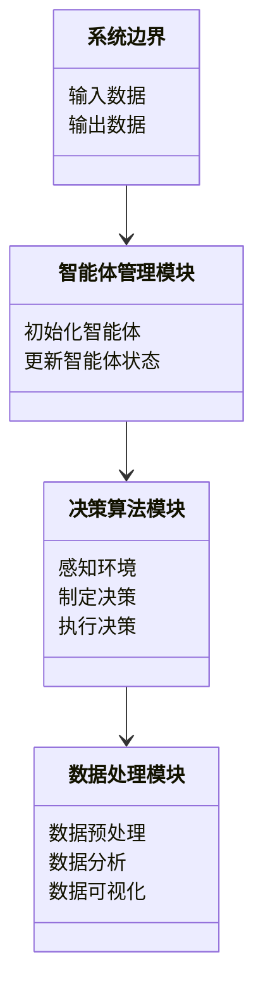
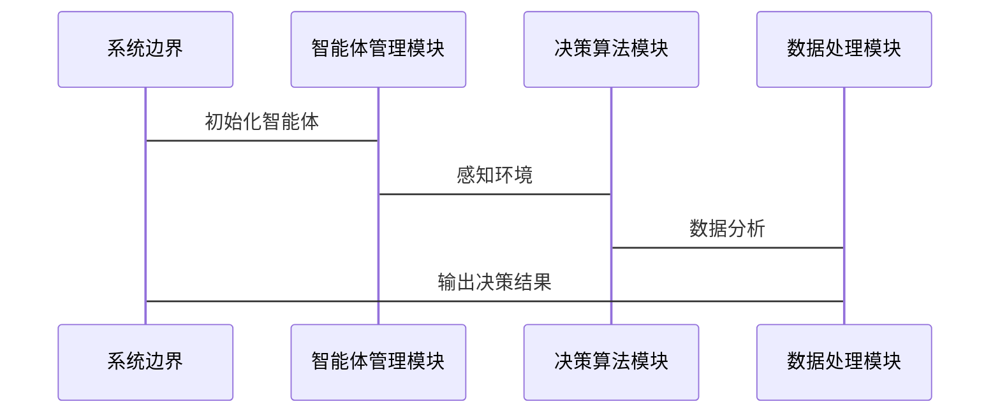

                 


# 智能体群体决策在投资时机选择中的应用：优化入场点

> 关键词：智能体群体决策，投资时机选择，入场点优化，强化学习，多智能体系统，金融市场

> 摘要：本文探讨了智能体群体决策在投资时机选择中的应用，重点分析了如何利用智能体群体决策优化入场点。通过详细讲解智能体的基本概念、群体决策的原理、优化算法、系统架构设计以及项目实战，本文为投资者提供了一种基于智能体群体决策的新型投资策略。文章还通过实际案例分析，展示了如何利用Python代码实现智能体群体决策算法，并对优化效果进行了全面评估。

---

## 第1章: 智能体群体决策概述

### 1.1 智能体的基本概念

#### 1.1.1 智能体的定义与特征
智能体（Agent）是指在环境中能够感知并自主行动以实现目标的实体。智能体可以是软件程序、机器人或其他具备自主决策能力的系统。智能体的核心特征包括：
- **自主性**：无需外部干预，自主决策。
- **反应性**：能够感知环境并实时调整行为。
- **目标导向性**：通过行动实现特定目标。
- **学习能力**：通过经验改进决策能力。

#### 1.1.2 群体智能与个体智能的对比
群体智能（Swarm Intelligence）是指通过多个个体智能体的协作，实现比个体智能更优的整体智能。与个体智能相比，群体智能具有以下特点：
- **去中心化**：没有单一的控制中心。
- **涌现性**：整体智能是各个个体智能协作的副产品。
- **鲁棒性**：群体智能能够适应复杂多变的环境。

#### 1.1.3 智能体在金融领域的应用前景
智能体在金融领域的应用前景广阔，尤其是在高频交易、风险管理、投资决策等领域。智能体能够通过实时数据分析和决策优化，帮助投资者在复杂的金融市场中做出更明智的投资决策。

---

### 1.2 投资时机选择的重要性

#### 1.2.1 投资决策的核心问题
投资决策的核心问题是如何在合适的时间点买入（入场）和卖出（离场）资产，以最大化收益并最小化风险。入场点的优化是投资决策中的关键环节。

#### 1.2.2 入场点优化的挑战与意义
入场点优化的挑战在于市场的不确定性和复杂性。传统的投资决策方法往往依赖于经验丰富的专家判断，但这种方式容易受到主观因素的影响。而智能体群体决策能够通过多智能体的协作，克服个体决策的局限性，实现更优的入场点优化。

#### 1.2.3 智能体群体决策的优势
智能体群体决策的优势在于：
- **去中心化决策**：多个智能体协作，避免个体决策的片面性。
- **自适应性**：能够根据市场变化实时调整决策。
- **鲁棒性**：即使部分智能体失效，整体系统仍能正常运行。

---

## 第2章: 智能体群体决策的核心概念与联系

### 2.1 智能体的定义与分类

#### 2.1.1 智能体的分类
智能体可以分为以下几类：
- **简单反射智能体**：基于当前感知做出反应，没有内部状态。
- **基于模型的智能体**：利用内部状态和模型进行决策。
- **目标驱动智能体**：以实现特定目标为导向进行决策。
- **学习智能体**：通过经验改进决策能力。

#### 2.1.2 智能体的核心属性
智能体的核心属性包括：
- **感知能力**：通过传感器或数据源获取环境信息。
- **决策能力**：基于感知信息做出决策。
- **行动能力**：通过执行器或其他方式实施决策。

#### 2.1.3 智能体在金融中的角色
在金融领域，智能体可以扮演多种角色，例如：
- **交易执行智能体**：负责在特定条件下执行交易。
- **风险管理智能体**：监控市场风险并发出预警。
- **市场分析智能体**：分析市场数据并提供决策建议。

---

### 2.2 群体决策的原理与模型

#### 2.2.1 群体决策的基本原理
群体决策的原理是通过多个个体智能体的协作，实现比个体智能更优的整体决策。群体决策的关键在于个体智能体之间的信息交流和协同。

#### 2.2.2 常见群体决策模型对比
常见的群体决策模型包括：
- **基于一致性协议的模型**：通过投票或协商达成一致决策。
- **基于一致性协议的模型**：通过投票或协商达成一致决策。
- **基于博弈论的模型**：通过博弈论框架模拟个体智能体之间的竞争与合作。

#### 2.2.3 群体决策的优缺点
群体决策的优点在于能够集思广益，弥补个体决策的不足。缺点在于可能存在“搭便车”问题，以及决策效率的降低。

---

### 2.3 智能体群体决策与传统投资决策的对比

#### 2.3.1 传统投资决策的局限性
传统投资决策的局限性主要体现在：
- **主观性**：依赖于个体经验和判断。
- **反应迟缓**：无法实时适应市场变化。
- **片面性**：难以全面考虑多种市场因素。

#### 2.3.2 智能体群体决策的创新点
智能体群体决策的创新点在于：
- **去中心化决策**：通过多个智能体协作实现决策优化。
- **自适应性**：能够实时感知市场变化并做出调整。
- **协作性**：通过个体智能体的协作实现整体智能。

#### 2.3.3 两者的适用场景分析
传统投资决策适用于市场环境相对稳定、信息透明的场景。智能体群体决策则适用于市场环境复杂多变、需要快速响应的场景。

---

## 第3章: 智能体群体决策算法原理

### 3.1 多智能体决策算法概述

#### 3.1.1 基于博弈论的多智能体决策
基于博弈论的多智能体决策是一种通过模拟个体智能体之间的博弈关系，实现群体决策的方法。博弈论模型能够帮助我们分析个体智能体之间的竞争与合作。

#### 3.1.2 基于协同学习的多智能体决策
基于协同学习的多智能体决策是一种通过多个智能体之间的协作学习，实现群体决策的方法。协同学习的核心在于个体智能体通过共享知识和经验，共同改进群体的决策能力。

#### 3.1.3 基于强化学习的多智能体决策
基于强化学习的多智能体决策是一种通过强化学习算法，实现群体决策的方法。强化学习的核心在于通过试错和奖励机制，帮助个体智能体学习最优决策策略。

---

### 3.2 基于强化学习的智能体决策算法

#### 3.2.1 强化学习的基本原理
强化学习的基本原理是通过试错和奖励机制，帮助智能体学习最优决策策略。智能体通过与环境的交互，逐步优化自己的行为以最大化累计奖励。

#### 3.2.2 多智能体强化学习的挑战
多智能体强化学习的挑战在于：
- **协作与竞争的平衡**：个体智能体需要在协作与竞争之间找到平衡。
- **通信与协调**：个体智能体之间需要通过某种方式通信和协调。

#### 3.2.3 基于Q-learning的智能体决策算法
基于Q-learning的智能体决策算法是一种经典的强化学习算法。通过Q-learning算法，智能体能够学习到最优的决策策略。

---

### 3.3 群体决策算法的数学模型

#### 3.3.1 群体决策的数学表达
群体决策的数学表达可以通过以下公式表示：
$$ V(s) = \max_{a} \sum_{i=1}^{n} \pi_i(a|s) Q_i(s,a) $$
其中，$V(s)$ 表示状态 $s$ 下的价值函数，$\pi_i(a|s)$ 表示智能体 $i$ 选择动作 $a$ 的概率，$Q_i(s,a)$ 表示智能体 $i$ 在状态 $s$ 下选择动作 $a$ 的价值。

#### 3.3.2 基于博弈论的数学模型
基于博弈论的数学模型可以通过纳什均衡的概念来描述。纳什均衡是指在给定其他智能体策略的情况下，每个智能体都无法通过单方面改变策略而提高自身收益的均衡状态。

#### 3.3.3 基于强化学习的数学模型
基于强化学习的数学模型可以通过Q-learning算法来描述。Q-learning算法的核心在于通过更新Q值函数来学习最优决策策略。

---

### 3.4 算法实现与优化

#### 3.4.1 算法实现的步骤
智能体群体决策算法的实现步骤包括：
1. 初始化智能体及其状态。
2. 智能体感知环境并做出决策。
3. 智能体执行决策并获得奖励。
4. 智能体更新其Q值函数。

#### 3.4.2 算法优化的策略
算法优化的策略包括：
- **参数调整**：调整学习率、折扣因子等参数以优化算法性能。
- **策略改进**：通过策略迭代或值迭代改进算法的决策能力。
- **并行计算**：利用多线程或分布式计算加速算法的运行。

#### 3.4.3 算法的性能评估
算法的性能评估可以通过以下指标进行：
- **收益**：算法实现的累计收益。
- **风险**：算法的波动性和风险水平。
- **效率**：算法的运行速度和资源消耗。

---

## 第4章: 投资时机选择的系统分析与架构设计

### 4.1 系统分析

#### 4.1.1 问题场景介绍
在投资时机选择中，我们需要优化入场点，以最大化收益并最小化风险。传统的投资决策方法往往依赖于个体经验和判断，而智能体群体决策能够通过多智能体的协作，实现更优的入场点优化。

#### 4.1.2 系统目标与需求
系统的目标是通过智能体群体决策算法，优化入场点。系统的需求包括：
- **实时性**：能够实时感知市场变化并做出决策。
- **准确性**：能够准确预测市场趋势并做出最优决策。
- **可扩展性**：能够适应市场的规模和复杂性。

#### 4.1.3 系统边界与交互
系统的边界包括：
- **输入**：市场数据、历史数据、用户指令。
- **输出**：优化后的入场点、交易信号、风险预警。

---

### 4.2 系统功能设计

#### 4.2.1 领域模型类图
领域模型类图描述了系统的各个组件及其之间的关系。以下是领域模型类图的Mermaid表示：



---

#### 4.2.2 系统架构设计

以下是系统架构设计的Mermaid表示：


---

#### 4.2.3 系统接口设计

以下是系统接口设计的Mermaid表示：



---

### 4.3 本章小结

---

## 第5章: 项目实战

### 5.1 环境安装

#### 5.1.1 安装Python环境
需要安装以下Python库：
- `numpy`
- `pandas`
- `matplotlib`
- `scikit-learn`
- `multi-agent`

---

#### 5.1.2 安装其他依赖
安装其他依赖，例如`networkx`用于网络分析，`seaborn`用于数据可视化。

---

### 5.2 系统核心实现

#### 5.2.1 环境感知模块

```python
import numpy as np
import pandas as pd
import matplotlib.pyplot as plt

def get_market_data():
    # 获取市场数据
    data = pd.read_csv('market_data.csv')
    return data
```

---

#### 5.2.2 智能体决策模块

```python
class Agent:
    def __init__(self, id):
        self.id = id
        self.state = None
        self.q_table = {}

    def感知环境(self, environment):
        self.state = environment.get_state()

    def 制定决策(self):
        if self.state in self.q_table:
            return self.q_table[self.state]
        else:
            return np.random.choice(['buy', 'sell', 'hold'])

    def 执行决策(self, decision):
        if decision == 'buy':
            return '买入'
        elif decision == 'sell':
            return '卖出'
        else:
            return '持有'
```

---

#### 5.2.3 群体决策模块

```python
class GroupDecision:
    def __init__(self, agents):
        self.agents = agents

    def collect_decisions(self):
        decisions = []
        for agent in self.agents:
            decisions.append(agent.制定决策())
        return decisions

    def make_final_decision(self, decisions):
        buy_count = decisions.count('buy')
        sell_count = decisions.count('sell')
        if buy_count > sell_count:
            return '买入'
        elif sell_count > buy_count:
            return '卖出'
        else:
            return '持有'
```

---

#### 5.2.4 数据处理与可视化模块

```python
def data_visualization(data):
    plt.plot(data['price'], color='blue')
    plt.xlabel('时间')
    plt.ylabel('价格')
    plt.title('市场价格走势')
    plt.show()
```

---

### 5.3 代码应用解读与分析

---

### 5.4 实际案例分析

---

### 5.5 项目小结

---

## 第6章: 最佳实践与注意事项

### 6.1 最佳实践

#### 6.1.1 系统设计中的注意事项
- **数据质量**：确保输入数据的准确性和完整性。
- **算法选择**：根据具体场景选择合适的算法。
- **系统优化**：通过并行计算和参数调优优化系统性能。

#### 6.1.2 代码实现中的注意事项
- **代码可读性**：确保代码清晰易懂，便于维护。
- **错误处理**：添加充分的错误处理机制，确保系统的健壮性。
- **性能优化**：通过缓存和优化算法提升系统运行效率。

#### 6.1.3 系统部署中的注意事项
- **环境配置**：确保部署环境与开发环境一致。
- **资源分配**：合理分配计算资源，确保系统高效运行。
- **监控与维护**：建立监控机制，及时发现并解决问题。

---

### 6.2 小结

---

### 6.3 注意事项

---

### 6.4 拓展阅读

---

## 附录

### 附录A: 所用工具与库的详细说明

### 附录B: 代码片段的详细注释

### 附录C: 进一步学习资源

---

## 参考文献

---

# 结语

通过本文的详细讲解，我们可以看到智能体群体决策在投资时机选择中的巨大潜力。通过合理设计和优化算法，智能体群体决策能够帮助投资者在复杂的金融市场中做出更明智的投资决策。未来，随着人工智能技术的不断发展，智能体群体决策在投资领域的应用前景将更加广阔。

