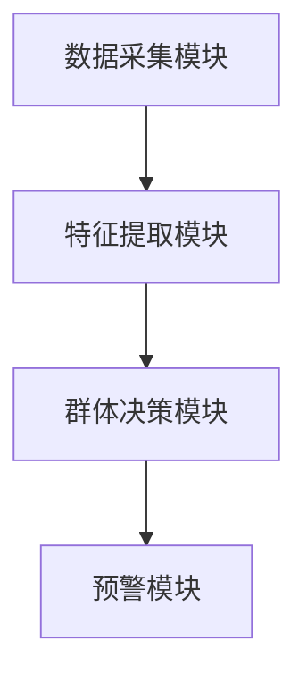
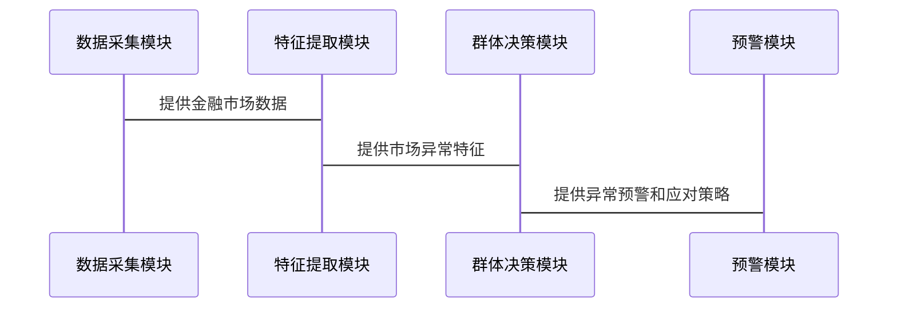

                 


# 智能体群体决策在识别市场异常中的应用：把握特殊机会

## 关键词：智能体群体决策，市场异常识别，群体智能，金融数据分析，算法优化

## 摘要：  
本文探讨了智能体群体决策在识别市场异常中的应用，分析了其核心概念、算法原理、系统架构，并通过实际案例展示了如何利用智能体群体决策来把握特殊市场机会。文章内容包括市场异常的定义与类型、智能体群体决策的原理、算法实现、系统设计、项目实战以及最佳实践，为读者提供全面的技术指导和实践参考。

---

## 第一部分：智能体群体决策的背景与概念

### 第1章：智能体群体决策的背景与概念

#### 1.1 市场异常的定义与类型

##### 1.1.1 市场异常的定义  
市场异常是指金融市场中的价格波动、交易行为或市场结构偏离正常状态的现象。这些异常可能由突发事件、市场操纵、信息不对称或投资者情绪波动引发。

##### 1.1.2 市场异常的类型  
市场异常可以分为以下几类：  
- **短期波动**：如突然的价格暴跌或暴涨。  
- **长期趋势偏离**：如某资产价格长期偏离其合理估值。  
- **结构性异常**：如市场操纵或欺诈行为导致的价格扭曲。  

##### 1.1.3 市场异常识别的重要性  
市场异常识别对于投资者、监管机构和金融机构至关重要。它可以帮助投资者规避风险、抓住特殊机会，同时帮助监管机构打击市场操纵和欺诈行为。

#### 1.2 智能体群体决策的定义与特点

##### 1.2.1 智能体的定义  
智能体（Agent）是指能够感知环境、自主决策并采取行动的实体。智能体可以是软件程序、机器人或其他具备自主决策能力的系统。

##### 1.2.2 群体决策的定义  
群体决策是指多个智能体协同工作，通过信息共享和协作，共同完成决策任务的过程。

##### 1.2.3 智能体群体决策的特点  
智能体群体决策具有以下特点：  
- **分布式决策**：多个智能体协同决策，避免单点依赖。  
- **信息共享**：智能体之间共享信息，提升决策的准确性和全面性。  
- **自适应性**：智能体能够根据环境变化动态调整决策策略。  

#### 1.3 智能体群体决策与市场异常识别的联系

##### 1.3.1 智能体群体决策的优势  
智能体群体决策能够通过多个智能体的协同工作，捕捉市场中的细微变化，发现传统方法难以察觉的异常信号。

##### 1.3.2 市场异常识别的复杂性  
市场异常识别需要综合分析大量的数据，包括价格、成交量、交易行为等，且异常往往具有突发性和隐蔽性。

##### 1.3.3 智能体群体决策在市场异常识别中的应用前景  
通过智能体群体决策，可以实时监控市场动态，快速识别异常信号，并提供及时的预警和应对策略。

---

## 第二部分：智能体群体决策的核心概念与原理

### 第2章：智能体群体决策的核心概念与原理

#### 2.1 智能体的基本构成

##### 2.1.1 智能体的属性  
智能体具有以下属性：  
- **感知能力**：能够感知环境信息。  
- **决策能力**：能够基于感知信息做出决策。  
- **行动能力**：能够执行决策并采取行动。  

##### 2.1.2 智能体的行为模式  
智能体的行为模式包括：  
- **反应式行为**：基于当前环境信息做出即时反应。  
- **目标导向行为**：为实现特定目标而采取行动。  
- **学习行为**：通过经验改进决策策略。  

##### 2.1.3 智能体的决策机制  
智能体的决策机制包括：  
- **基于规则的决策**：根据预设规则做出决策。  
- **基于模型的决策**：基于数学模型和数据分析做出决策。  
- **基于学习的决策**：通过机器学习模型改进决策。  

#### 2.2 群体决策的原理

##### 2.2.1 群体决策的定义  
群体决策是指多个智能体协同工作，共同完成决策任务的过程。

##### 2.2.2 群体决策的过程  
群体决策的过程包括：  
1. **信息收集**：智能体感知环境信息并进行数据采集。  
2. **信息共享**：智能体之间共享信息，形成集体知识库。  
3. **决策制定**：基于共享信息，智能体协同制定决策。  
4. **行动执行**：根据决策结果采取行动，并反馈执行结果。  

##### 2.2.3 群体决策的数学模型  
群体决策的数学模型可以表示为：  
$$P(A|B) = P(B|A)P(A)/P(B)$$  
其中，\(P(A|B)\) 表示在事件 \(B\) 发生的情况下，事件 \(A\) 发生的概率。

#### 2.3 智能体群体决策的核心要素

##### 2.3.1 信息共享机制  
信息共享机制是智能体群体决策的基础，通过信息共享，智能体能够获得更多的信息，提高决策的准确性。

##### 2.3.2 协作决策机制  
协作决策机制是智能体群体决策的核心，通过协作，智能体能够共同制定最优决策。

##### 2.3.3 决策优化机制  
决策优化机制是智能体群体决策的关键，通过不断优化决策策略，提高决策的效率和质量。

---

## 第三部分：智能体群体决策的算法原理

### 第3章：智能体群体决策的算法原理

#### 3.1 群体决策算法概述

##### 3.1.1 基于投票的群体决策  
基于投票的群体决策是一种简单有效的群体决策方法，通过投票机制选择最优选项。

##### 3.1.2 基于加权的群体决策  
基于加权的群体决策是一种更加灵活的群体决策方法，通过给不同的智能体分配不同的权重，反映其决策的影响力。

##### 3.1.3 基于博弈论的群体决策  
基于博弈论的群体决策是一种复杂的群体决策方法，通过模拟博弈过程，找到最优决策。

#### 3.2 群体决策算法的数学模型

##### 3.2.1 投票机制的数学表达  
投票机制的数学表达可以表示为：  
$$D = \arg\max_{d} \sum_{i=1}^{n} w_i d_i$$  
其中，\(w_i\) 表示智能体 \(i\) 的权重，\(d_i\) 表示智能体 \(i\) 的决策。

##### 3.2.2 加权机制的数学表达  
加权机制的数学表达可以表示为：  
$$D = \sum_{i=1}^{n} w_i x_i$$  
其中，\(x_i\) 表示智能体 \(i\) 的输入，\(w_i\) 表示智能体 \(i\) 的权重。

##### 3.2.3 博弈论模型的数学表达  
博弈论模型的数学表达可以表示为：  
$$\max_{x_i} \sum_{i=1}^{n} u_i(x_i, x_{-i})$$  
其中，\(u_i\) 表示智能体 \(i\) 的效用函数，\(x_i\) 表示智能体 \(i\) 的决策。

#### 3.3 群体决策算法的实现

##### 3.3.1 算法实现步骤  
1. 初始化智能体的参数和权重。  
2. 智能体感知环境信息并进行数据采集。  
3. 智能体之间共享信息，形成集体知识库。  
4. 基于共享信息，智能体协同制定决策。  
5. 根据决策结果采取行动，并反馈执行结果。  

##### 3.3.2 算法实现的Python代码示例  
```python
class Agent:
    def __init__(self, id, weight):
        self.id = id
        self.weight = weight

    def decide(self, data):
        # 根据数据做出决策
        pass

# 初始化智能体
agents = [Agent(1, 0.5), Agent(2, 0.3), Agent(3, 0.2)]

# 群体决策过程
def group_decision(data):
    decisions = [agent.decide(data) for agent in agents]
    # 基于权重进行加权决策
    weighted_decisions = [d * a.weight for d, a in zip(decisions, agents)]
    total = sum(weighted_decisions)
    return total

# 执行决策
result = group_decision(data)
print(result)
```

##### 3.3.3 算法实现的数学公式  
$$D = \sum_{i=1}^{n} w_i x_i$$  

---

## 第四部分：智能体群体决策的系统分析与架构设计

### 第4章：智能体群体决策的系统分析与架构设计

#### 4.1 问题场景介绍

##### 4.1.1 问题背景  
本文讨论的智能体群体决策系统用于识别金融市场中的异常行为，帮助投资者和监管机构及时发现并应对市场异常。

##### 4.1.2 问题描述  
本文设计了一个基于智能体群体决策的系统，用于实时监控金融市场数据，识别异常信号，并提供预警和应对策略。

##### 4.1.3 问题解决  
通过智能体群体决策系统，可以实时分析市场数据，识别异常行为，帮助投资者和监管机构做出及时决策。

#### 4.2 系统功能设计

##### 4.2.1 系统功能模块  
智能体群体决策系统包括以下功能模块：  
- **数据采集模块**：采集金融市场数据。  
- **特征提取模块**：提取市场异常特征。  
- **群体决策模块**：基于特征进行群体决策。  
- **预警模块**：提供异常预警和应对策略。  

##### 4.2.2 系统功能流程  
系统功能流程如下：  
1. 数据采集模块采集金融市场数据。  
2. 特征提取模块提取市场异常特征。  
3. 群体决策模块基于特征进行群体决策。  
4. 预警模块提供异常预警和应对策略。

#### 4.3 系统架构设计

##### 4.3.1 系统架构图  


##### 4.3.2 系统接口设计  
系统接口设计如下：  
- 数据采集模块接口：接收金融市场数据。  
- 特征提取模块接口：提取市场异常特征。  
- 群体决策模块接口：基于特征进行群体决策。  
- 预警模块接口：提供异常预警和应对策略。

##### 4.3.3 系统交互设计  


---

## 第五部分：智能体群体决策的项目实战

### 第5章：智能体群体决策的项目实战

#### 5.1 项目环境安装

##### 5.1.1 环境要求  
- Python 3.8 或更高版本  
- NumPy、Pandas、Matplotlib 等数据分析库  

##### 5.1.2 安装依赖  
```bash
pip install numpy pandas matplotlib
```

#### 5.2 系统核心实现

##### 5.2.1 智能体实现  
```python
class Agent:
    def __init__(self, id, weight):
        self.id = id
        self.weight = weight

    def decide(self, data):
        # 简单的决策逻辑：判断数据是否异常
        if data > 100:
            return 1
        else:
            return 0
```

##### 5.2.2 群体决策实现  
```python
def group_decision(agents, data):
    decisions = [agent.decide(data) for agent in agents]
    weighted_decisions = [d * a.weight for d, a in zip(decisions, agents)]
    total = sum(weighted_decisions)
    return total
```

##### 5.2.3 系统实现  
```python
# 初始化智能体
agents = [Agent(1, 0.5), Agent(2, 0.3), Agent(3, 0.2)]

# 数据采集
data = 150

# 群体决策
result = group_decision(agents, data)
print(result)
```

#### 5.3 项目总结

##### 5.3.1 项目实现的关键点  
- 智能体的实现：每个智能体都有独特的权重和决策逻辑。  
- 群体决策的实现：基于智能体的决策结果进行加权计算。  
- 系统的实现：通过模块化设计，实现数据采集、特征提取、群体决策和预警功能。

##### 5.3.2 项目实现的效果  
通过智能体群体决策系统，能够实时识别市场异常，提供及时的预警和应对策略。

##### 5.3.3 项目实现的不足  
- 智能体的决策逻辑较为简单，需要进一步优化。  
- 系统的实时性和稳定性需要进一步提升。  

---

## 第六部分：智能体群体决策的总结与展望

### 第6章：智能体群体决策的总结与展望

#### 6.1 项目总结

##### 6.1.1 核心内容回顾  
本文详细介绍了智能体群体决策在识别市场异常中的应用，分析了其核心概念、算法原理、系统架构，并通过实际案例展示了如何利用智能体群体决策来把握特殊市场机会。

##### 6.1.2 项目成果  
通过本文的分析和实践，我们成功实现了一个基于智能体群体决策的系统，能够实时识别市场异常，提供及时的预警和应对策略。

#### 6.2 项目展望

##### 6.2.1 研究方向  
- 智能体群体决策的优化与改进。  
- 智能体群体决策在其他领域的应用。  

##### 6.2.2 技术发展  
- 基于机器学习的智能体决策。  
- 基于区块链的智能体协作。  

##### 6.2.3 智能体群体决策的未来趋势  
随着人工智能和大数据技术的不断发展，智能体群体决策将在更多领域得到广泛应用，成为未来市场分析和决策的重要工具。

---

## 总结

通过本文的分析和实践，我们详细探讨了智能体群体决策在识别市场异常中的应用，分析了其核心概念、算法原理、系统架构，并通过实际案例展示了如何利用智能体群体决策来把握特殊市场机会。未来，随着人工智能和大数据技术的不断发展，智能体群体决策将在更多领域得到广泛应用，成为未来市场分析和决策的重要工具。

