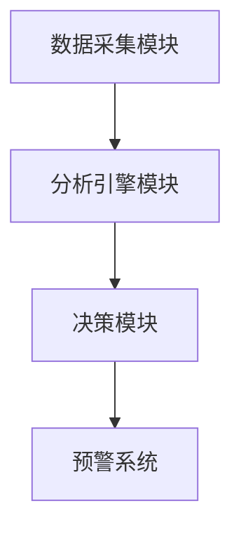
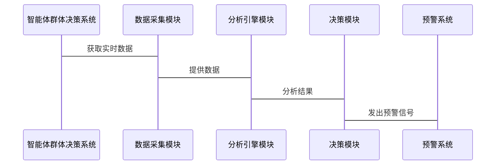

                 


# 智能体群体决策在识别系统性风险中的应用：提前预警

## 关键词：智能体群体决策，系统性风险，群体智能，风险预警，分布式计算

## 摘要：智能体群体决策是一种通过多个智能体协同工作来识别和预测系统性风险的方法。本文将详细探讨智能体群体决策的核心原理、算法模型、系统架构及其在风险预警中的实际应用，通过案例分析和代码实现，展示如何利用智能体群体决策提前预警系统性风险，为金融、经济和社会系统的稳定运行提供有效支持。

---

# 第一章：系统性风险的背景与挑战

## 1.1 系统性风险的基本概念

### 1.1.1 系统性风险的定义
系统性风险是指在整个系统中广泛存在，并可能引发连锁反应，导致系统性崩溃的风险。它不同于个体风险，而是源于系统内部的相互关联和相互作用。

### 1.1.2 系统性风险的特征
- **广泛性**：影响整个系统的各个部分。
- **关联性**：系统中各个部分相互依赖，风险在系统内传播。
- **复杂性**：系统性风险的来源和表现形式复杂多样。
- **不可预测性**：由于系统的非线性和复杂性，系统性风险难以准确预测。

### 1.1.3 系统性风险的来源与表现形式
- **金融市场的系统性风险**：如金融危机、市场崩盘等。
- **经济系统的系统性风险**：如经济衰退、通货膨胀等。
- **社会系统的系统性风险**：如社会动荡、公共安全事件等。

## 1.2 系统性风险对社会和经济的影响

### 1.2.1 系统性风险对金融市场的冲击
- **市场崩盘**：系统性风险可能导致金融市场的剧烈波动，如2008年的金融危机。
- **投资者信心丧失**：系统性风险会削弱投资者对市场的信心，导致资金撤离。

### 1.2.2 系统性风险对实体经济的连锁反应
- **企业倒闭**：系统性风险可能导致大量企业倒闭，进而引发失业潮。
- **供应链中断**：系统性风险可能破坏全球供应链，影响生产和贸易。

### 1.2.3 系统性风险的预警与应对
- **预警机制**：通过监测系统中的早期信号，提前发出预警。
- **应对措施**：采取有效的政策和措施，减少系统性风险的影响。

---

# 第二章：智能体群体决策的基本概念

## 2.1 智能体的基本定义与特征

### 2.1.1 智能体的定义
智能体（Agent）是指具有感知环境、自主决策、执行操作能力的实体。智能体可以是软件程序、机器人或其他能够独立执行任务的实体。

### 2.1.2 智能体的核心属性
- **自主性**：智能体能够自主决策，无需外部干预。
- **反应性**：智能体能够感知环境并做出实时反应。
- **社会性**：智能体能够与其他智能体或人类进行交互和协作。
- **学习能力**：智能体能够通过经验改进自身的决策能力。

### 2.1.3 智能体的分类与应用场景
- **简单反应式智能体**：基于当前感知做出反应，适用于简单的任务。
- **基于模型的智能体**：利用内部模型和知识进行决策，适用于复杂任务。
- **学习型智能体**：通过机器学习算法不断优化自身的决策能力，适用于动态环境。

## 2.2 群体决策的基本原理

### 2.2.1 群体决策的定义
群体决策是指多个个体或智能体通过协同工作，共同做出决策的过程。群体决策强调个体之间的协作和信息共享，以达到整体最优或个体最优的目标。

### 2.2.2 群体决策的特征
- **分布性**：决策过程分布在多个个体或智能体之间，没有中央控制。
- **多样性**：个体之间的决策可能有不同的偏好和目标。
- **动态性**：群体决策过程可能随着环境的变化而动态调整。

### 2.2.3 群体决策与个体决策的区别
- **决策主体**：个体决策由单个主体做出，群体决策由多个主体共同做出。
- **信息共享**：个体决策基于个体信息，群体决策基于群体信息共享。
- **决策结果**：个体决策可能仅考虑个体利益，群体决策考虑群体整体利益。

---

# 第三章：智能体群体决策在系统性风险识别中的应用前景

## 3.1 系统性风险识别的难点与痛点

### 3.1.1 系统性风险的复杂性
- 系统性风险往往源于系统内部的复杂相互作用，难以通过单一方法进行预测和分析。
- 系统性风险的表现形式多样，可能涉及多个领域和层面。

### 3.1.2 系统性风险的隐蔽性
- 系统性风险在早期可能不易察觉，往往在系统崩溃时才被发现。
- 系统性风险的传播速度极快，可能在短时间内造成巨大影响。

### 3.1.3 系统性风险的预测难度
- 系统性风险的预测需要综合考虑多个因素，包括经济、社会、技术等，预测模型的复杂性较高。
- 数据的不完整性和不确定性增加了系统性风险预测的难度。

## 3.2 智能体群体决策的优势与潜力

### 3.2.1 智能体群体决策的分布式特性
- 智能体群体决策不需要依赖中央控制，可以在分布式网络中进行实时监测和预警。
- 每个智能体都可以独立工作，同时与其他智能体协同，形成整体的决策能力。

### 3.2.2 智能体群体决策的自适应能力
- 智能体群体决策能够根据环境的变化自适应调整决策策略，提高系统的灵活性和应对能力。
- 智能体可以通过学习和优化不断改进自身的决策能力，适应复杂的系统性风险。

### 3.2.3 智能体群体决策的多维度信息处理能力
- 智能体群体决策可以通过多个智能体协同工作，整合多源信息，提高系统性风险识别的准确性和全面性。
- 每个智能体都可以关注不同的风险因素，形成多层次、多维度的风险监测网络。

---

# 第四章：智能体群体决策的核心概念与联系

## 4.1 智能体群体决策的核心概念

### 4.1.1 智能体的个体决策模型
- 每个智能体都有自己的决策模型，基于感知到的信息做出决策。
- 个体决策模型可以是基于规则的、基于模型的或基于机器学习的。

### 4.1.2 群体决策的形成机制
- 群体决策是通过个体智能体之间的交互和信息共享形成的。
- 群体决策的结果可能是个体决策的加权平均、投票结果或其他形式的组合。

### 4.1.3 群体决策的结果表达
- 群体决策的结果可以是整体决策、共识决策或分布式决策。
- 群体决策的结果需要通过某种方式整合个体智能体的决策结果。

## 4.2 智能体群体决策的核心要素对比

### 4.2.1 智能体个体属性对比表

| 属性         | 个体决策 | 群体决策 |
|--------------|----------|----------|
| 决策主体     | 单个智能体 | 多个智能体 |
| 信息来源     | 个体信息 | 群体信息 |
| 决策目标     | 个体目标 | 群体目标 |
| 决策结果     | 个体结果 | 群体结果 |

### 4.2.2 群体决策与个体决策的对比分析
- **个体决策**：基于个体信息和个体目标，决策结果仅影响个体。
- **群体决策**：基于群体信息和群体目标，决策结果影响整个群体。

### 4.2.3 群体决策系统的ER实体关系图

```mermaid
er
    顾客: 智能体
        + ID: 整数
        + 名称: 字符串
        + 类型: 字符串
    产品: 决策结果
        + ID: 整数
        + 结果: 字符串
        + 时间戳: 字符串
    订单: 交互记录
        + ID: 整数
        + 智能体ID: 整数
        + 决策结果ID: 整数
```

---

# 第五章：智能体群体决策的算法原理与数学模型

## 5.1 智能体群体决策的核心算法

### 5.1.1 分布式计算算法
- **分布式计算**：通过多个智能体协同工作，完成计算任务。
- **并行计算**：多个智能体同时进行计算，提高计算效率。

### 5.1.2 博弈论模型
- **纳什均衡**：在群体决策中，每个智能体的决策都是最优的，且无法通过单方面改变决策而提高自身收益。
- **合作博弈**：智能体之间可以通过合作实现整体最优。

### 5.1.3 群体智能算法
- **蚁群算法**：模拟蚂蚁觅食过程，用于路径规划和优化。
- **粒子群优化算法**：模拟鸟群觅食过程，用于函数优化和问题求解。

## 5.2 智能体群体决策的数学模型

### 5.2.1 基于博弈论的群体决策模型
$$ \text{纳什均衡}：\forall i, u_i(x_i, x_{-i}) \geq u_i(x_i', x_{-i}) $$
其中，$x_i$是智能体i的策略，$x_{-i}$是其他智能体的策略组合，$u_i$是智能体i的效用函数。

### 5.2.2 基于群体智能的优化模型
$$ \min_{x} f(x) $$
$$ \text{约束条件}：g(x) \leq 0 $$

---

# 第六章：智能体群体决策的系统架构与实现

## 6.1 系统分析与架构设计

### 6.1.1 问题场景介绍
- **金融市场中的系统性风险**：通过智能体群体决策，实时监测市场的波动，识别潜在的系统性风险。
- **经济系统中的系统性风险**：通过智能体群体决策，分析经济指标，预测经济危机。

### 6.1.2 系统功能设计
- **数据采集模块**：采集系统的实时数据，如市场数据、经济指标等。
- **分析引擎模块**：对数据进行分析，识别潜在的系统性风险。
- **决策模块**：基于分析结果，做出群体决策，发出预警信号。

### 6.1.3 系统架构设计



### 6.1.4 系统接口设计
- **数据接口**：与数据源对接，获取实时数据。
- **预警接口**：向用户或系统发出预警信号。

### 6.1.5 系统交互设计



---

# 第七章：智能体群体决策的项目实战

## 7.1 项目环境与安装

### 7.1.1 环境要求
- **操作系统**：Linux/Windows/MacOS
- **编程语言**：Python 3.8+
- **框架与库**：NumPy, Pandas, Matplotlib, scikit-learn

### 7.1.2 安装依赖
```bash
pip install numpy pandas matplotlib scikit-learn
```

## 7.2 项目核心代码实现

### 7.2.1 数据采集模块
```python
import numpy as np
import pandas as pd

def collect_data():
    # 从数据源获取实时数据
    data = pd.DataFrame(np.random.randn(100, 5), columns=['A', 'B', 'C', 'D', 'E'])
    return data

if __name__ == '__main__':
    data = collect_data()
    print(data.head())
```

### 7.2.2 分析引擎模块
```python
from sklearn.decomposition import PCA

def analyze_data(data):
    # 使用PCA进行数据分析
    pca = PCA(n_components=2)
    principal_components = pca.fit_transform(data)
    return principal_components

if __name__ == '__main__':
    data = collect_data()
    components = analyze_data(data)
    print(components.shape)
```

### 7.2.3 决策模块
```python
import numpy as np

def make_decision(components):
    # 基于主成分分析结果做出决策
    threshold = np.mean(components, axis=0)
    decision = components > threshold
    return decision

if __name__ == '__main__':
    data = collect_data()
    components = analyze_data(data)
    decision = make_decision(components)
    print(decision)
```

### 7.2.4 预警系统
```python
import time

def issue_warning(decision):
    # 根据决策结果发出预警信号
    if decision.sum() > 0:
        print("系统性风险预警！")
    else:
        print("系统稳定运行。")

if __name__ == '__main__':
    data = collect_data()
    components = analyze_data(data)
    decision = make_decision(components)
    issue_warning(decision)
```

## 7.3 实际案例分析与结果解读

### 7.3.1 案例介绍
- **案例名称**：金融市场系统性风险预警系统
- **案例背景**：通过智能体群体决策，实时监测金融市场的波动，识别潜在的系统性风险。

### 7.3.2 数据分析与结果展示
- **数据采集**：采集金融市场中的实时数据，如股票价格、指数、成交量等。
- **数据分析**：使用主成分分析（PCA）对数据进行降维，识别潜在的风险因素。
- **决策结果**：基于分析结果，智能体群体决策系统发出系统性风险预警。

### 7.3.3 代码实现与结果解读
- **代码实现**：如上所述，通过数据采集、分析、决策和预警模块实现系统性风险预警。
- **结果解读**：当决策模块识别出潜在的系统性风险时，预警系统会发出预警信号，提醒相关人员采取应对措施。

---

# 第八章：智能体群体决策的总结与展望

## 8.1 小结

智能体群体决策是一种通过多个智能体协同工作来识别和预测系统性风险的方法。本文详细探讨了智能体群体决策的核心原理、算法模型、系统架构及其在风险预警中的实际应用。通过案例分析和代码实现，展示了如何利用智能体群体决策提前预警系统性风险。

## 8.2 注意事项

- **数据质量问题**：智能体群体决策的结果依赖于数据的准确性和完整性，数据质量直接影响决策的准确性。
- **算法选择与优化**：不同的算法适用于不同的场景，选择合适的算法并进行优化是确保智能体群体决策有效性的关键。
- **系统的可扩展性**：随着系统规模的扩大，需要确保系统的可扩展性和性能。

## 8.3 拓展阅读

- **推荐书籍**：
  - 《群体智能：分布式计算的社会学基础》
  - 《分布式系统：概念与设计》
- **推荐论文**：
  - "Multi-Agent Systems: A Modern Approach"
  - "Game Theory and Distributed Computing"

---

# 结语

智能体群体决策在识别系统性风险中的应用前景广阔。通过智能体群体决策，可以在复杂系统中实时监测潜在风险，提前发出预警信号，为金融、经济和社会系统的稳定运行提供有力支持。未来，随着人工智能和分布式计算技术的不断发展，智能体群体决策将在更多领域发挥重要作用。

