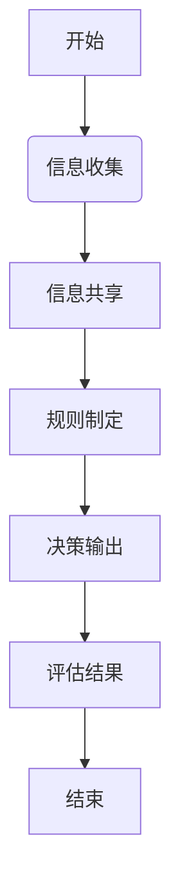
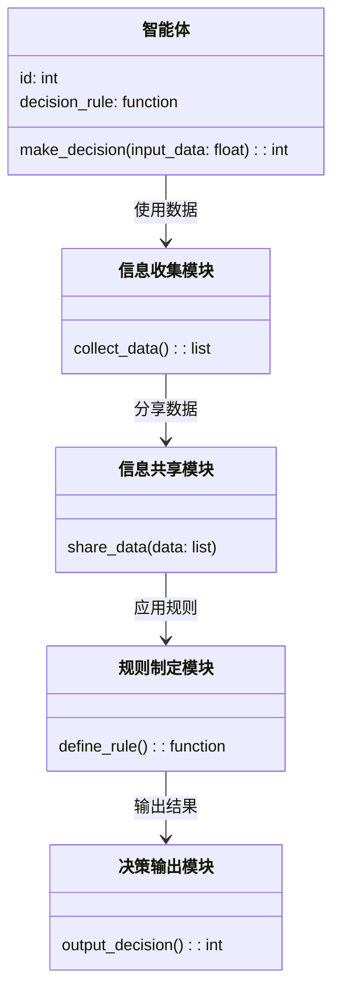

                 


# 智能体群体决策在识别长期价值创造者中的应用

> 关键词：智能体，群体决策，长期价值创造，算法原理，系统架构，项目实战

> 摘要：本文探讨了智能体群体决策在识别长期价值创造者中的应用。通过分析智能体与群体决策的核心概念、算法原理、系统架构以及实际项目案例，本文旨在揭示如何利用智能体群体决策技术有效识别和评估长期价值创造者，为企业决策提供理论依据和实践指导。

---

# 第1章 智能体群体决策的背景与问题描述

## 1.1 智能体群体决策的背景

### 1.1.1 从个体决策到群体决策的演进

随着人工智能技术的快速发展，智能体（Agent）逐渐成为决策过程中的重要参与者。传统的个体决策模式依赖于单个智能体的独立判断，而群体决策则强调多个智能体协同工作，通过信息共享和知识整合，形成更优的决策结果。这种演进不仅提高了决策的效率和准确性，还为复杂问题的解决提供了新的思路。

### 1.1.2 智能体技术的发展与应用

智能体技术近年来取得了显著进展，从简单的规则驱动智能体到复杂的强化学习智能体，其应用范围不断扩大。在金融、医疗、教育等领域，智能体技术已经被用于辅助决策、优化资源配置和提升用户体验。群体决策作为智能体技术的重要分支，尤其在分布式系统和复杂问题中展现出独特优势。

### 1.1.3 长期价值创造者的识别需求

在商业和社会活动中，识别长期价值创造者对于组织的可持续发展至关重要。传统的价值评估方法往往依赖于短期指标，难以捕捉长期价值创造者的潜力。智能体群体决策通过多维度分析和长期数据积累，为识别和培养长期价值创造者提供了新的可能性。

---

## 1.2 问题背景与问题描述

### 1.2.1 价值创造者识别的挑战

传统价值评估方法通常依赖于财务指标、市场表现等短期数据，难以全面反映个人或团队的长期贡献。此外，个体决策的局限性使得价值创造者的识别过程缺乏系统性和全面性。

### 1.2.2 群体决策在价值识别中的优势

群体决策通过多个智能体的协同工作，能够整合更多信息和视角，从而更全面地评估价值创造者的潜力。智能体群体决策不仅能够捕捉个体的短期表现，还能通过长期数据积累，识别出那些能够持续创造价值的个体或团队。

### 1.2.3 问题的边界与外延

智能体群体决策在价值创造者识别中的应用需要明确问题的边界。例如，如何定义“长期价值”、如何选择智能体的决策规则、如何处理数据的实时性与历史性等问题都需要在应用过程中加以考虑。

---

## 1.3 核心概念与核心要素

### 1.3.1 智能体的定义与特征

智能体是指能够感知环境、自主决策并采取行动的实体。智能体具有以下核心特征：
- **自主性**：能够自主决策，无需外部干预。
- **反应性**：能够根据环境变化调整行为。
- **目标导向**：具有明确的目标，并通过行动实现目标。

### 1.3.2 群体决策的核心要素

群体决策是指多个智能体协同工作，共同完成决策任务的过程。其核心要素包括：
- **决策规则**：智能体之间的互动规则。
- **信息共享**：智能体之间共享的信息。
- **决策结果**：最终的决策输出。

### 1.3.3 长期价值创造者的定义与属性

长期价值创造者是指那些能够在较长时间内持续为组织或社会创造价值的个体或团队。其核心属性包括：
- **持续性**：长期稳定的贡献。
- **创新性**：能够提出新的想法和解决方案。
- **协作性**：能够与他人有效协作。

---

## 1.4 本章小结

本章从智能体群体决策的背景出发，分析了传统价值创造者识别的挑战，介绍了智能体和群体决策的核心概念，明确了长期价值创造者的定义与属性。这些内容为后续章节的深入分析奠定了基础。

---

# 第2章 智能体群体决策的核心概念与联系

## 2.1 智能体与群体决策的关系

### 2.1.1 智能体的属性与特征

智能体的属性和特征决定了其在群体决策中的角色和行为方式。例如，自主性和目标导向使得智能体能够在群体决策中提出独立的见解。

### 2.1.2 群体决策的机制与特点

群体决策的机制包括信息共享、规则制定和结果整合。其特点在于通过多个智能体的协同工作，实现更优的决策结果。

### 2.1.3 智能体与群体决策的协同关系

智能体与群体决策的协同关系体现在信息共享、规则制定和结果整合三个方面。通过智能体的协同工作，群体决策能够实现信息的全面整合和决策的优化。

---

## 2.2 长期价值创造者的识别模型

### 2.2.1 价值创造者的识别维度

价值创造者的识别维度包括贡献度、创新性和协作性三个方面。通过多维度的分析，能够更全面地评估个体的长期价值创造能力。

### 2.2.2 智能体群体决策的模型构建

智能体群体决策的模型构建需要考虑智能体的决策规则、信息共享机制和决策结果的整合方式。通过模型的构建，可以实现对长期价值创造者的有效识别。

### 2.2.3 模型的输入与输出

模型的输入包括个体的行为数据、历史表现和环境信息。输出则是对个体长期价值创造能力的评估结果。

---

## 2.3 核心概念对比分析

### 2.3.1 智能体与传统决策模型的对比

智能体与传统决策模型的主要区别在于自主性和适应性。智能体能够自主决策并适应环境变化，而传统决策模型通常依赖于固定的规则和数据。

### 2.3.2 群体决策与个体决策的对比

群体决策与个体决策的主要区别在于信息共享和决策结果的整合方式。群体决策通过多个个体的协同工作，能够实现更优的决策结果。

### 2.3.3 价值创造者识别的对比分析

通过对不同识别方法的对比分析，可以发现智能体群体决策在长期价值创造者识别中的优势，例如信息整合能力强、决策结果更优等。

---

## 2.4 实体关系图与流程图

### 2.4.1 实体关系图（ER图）

```mermaid
erd
  entity 智能体 {
    key 属性：id
    属性：决策能力, 行为模式
  }
  entity 价值创造者 {
    key 属性：id
    属性：价值贡献, 时间跨度
  }
  entity 群体决策过程 {
    属性：决策结果, 决策时间
  }
  智能体 --> 群体决策过程: 参与决策
  价值创造者 --> 群体决策过程: 作为决策对象
```

### 2.4.2 简化流程图


---

## 2.5 本章小结

本章通过分析智能体与群体决策的关系，构建了长期价值创造者的识别模型，并通过对比分析和实体关系图，明确了智能体群体决策在价值识别中的优势。

---

# 第3章 智能体群体决策的算法原理

## 3.1 算法原理概述

智能体群体决策的算法原理包括信息收集、信息共享、规则制定和决策输出四个主要步骤。通过算法的实现，可以实现对长期价值创造者的有效识别。

---

## 3.2 算法实现代码

### 3.2.1 算法流程图



### 3.2.2 算法实现代码

```python
class Agent:
    def __init__(self, id, decision_rule):
        self.id = id
        self.decision_rule = decision_rule

    def make_decision(self, input_data):
        # 根据决策规则生成决策输出
        return self.decision_rule(input_data)

def decision_rule(input_data):
    # 示例决策规则
    if input_data > 0.5:
        return 1
    else:
        return 0

# 示例运行
agent1 = Agent(1, decision_rule)
input_data = 0.6
output = agent1.make_decision(input_data)
print(output)  # 输出：1
```

### 3.2.3 算法原理的数学模型

智能体群体决策的数学模型可以表示为：

$$ \text{决策结果} = \sum_{i=1}^{n} w_i \cdot x_i $$

其中，$w_i$ 是第 $i$ 个智能体的权重，$x_i$ 是第 $i$ 个智能体的决策输出。

---

## 3.3 算法实现的详细解读

通过Python代码实现智能体群体决策算法，可以清晰地看到算法的实现过程。算法的核心在于决策规则的制定和信息的共享，通过这些步骤，可以实现对长期价值创造者的有效识别。

---

## 3.4 本章小结

本章通过算法原理和代码实现，详细解读了智能体群体决策的实现过程。通过数学模型和代码示例，可以更深入地理解算法的工作原理和实际应用。

---

# 第4章 系统分析与架构设计

## 4.1 问题场景介绍

智能体群体决策系统需要解决的问题包括信息收集、信息共享、规则制定和决策输出。通过系统的构建，可以实现对长期价值创造者的有效识别。

---

## 4.2 系统功能设计

### 4.2.1 功能模块划分

系统功能模块包括信息收集模块、信息共享模块、规则制定模块和决策输出模块。每个模块的功能和交互关系需要通过类图和序列图进行描述。

### 4.2.2 功能模块的类图表示



---

## 4.3 系统架构设计

### 4.3.1 系统架构的总体设计

智能体群体决策系统的总体架构包括数据层、业务逻辑层和表现层。数据层负责数据的存储和管理，业务逻辑层负责智能体的决策和规则制定，表现层负责结果的展示和交互。

### 4.3.2 系统架构的详细描述

数据层：包括数据存储和数据访问组件。业务逻辑层：包括智能体的决策逻辑和规则制定组件。表现层：包括用户界面和结果展示组件。

---

## 4.4 本章小结

本章通过系统分析和架构设计，明确了智能体群体决策系统的功能模块和总体架构。通过类图和序列图的描述，可以更清晰地理解系统的实现过程。

---

# 第5章 项目实战

## 5.1 环境安装

### 5.1.1 Python环境的安装与配置

安装Python和必要的库，如numpy、pandas、matplotlib等。确保环境配置正确，以便后续代码的运行。

### 5.1.2 开发工具的安装与配置

安装并配置开发工具，如PyCharm、Jupyter Notebook等，以便进行代码编写和调试。

---

## 5.2 系统核心实现源代码

### 5.2.1 信息收集模块的实现

通过Python代码实现信息收集模块，例如：

```python
import pandas as pd

def collect_data(file_path):
    data = pd.read_csv(file_path)
    return data
```

### 5.2.2 信息共享模块的实现

通过共享数据实现智能体之间的信息交互，例如：

```python
def share_data(data):
    print("共享数据：")
    print(data.head())
```

### 5.2.3 规则制定模块的实现

通过决策规则的制定，实现智能体的决策逻辑，例如：

```python
def define_rule(data):
    return data['score'] > 0.7
```

### 5.2.4 决策输出模块的实现

通过决策输出模块，实现最终的决策结果，例如：

```python
def output_decision(result):
    print(f"决策结果：{result}")
```

---

## 5.3 代码应用解读与分析

通过代码的运行，可以得到最终的决策结果。通过对代码的解读和分析，可以更深入地理解智能体群体决策的实现过程。

---

## 5.4 实际案例分析与详细讲解

通过实际案例的分析，可以验证智能体群体决策算法的有效性和准确性。通过对案例的详细讲解，可以更好地理解算法的应用和实际效果。

---

## 5.5 本章小结

本章通过项目实战，详细讲解了智能体群体决策系统的实现过程。通过对代码的解读和案例的分析，可以更深入地理解算法的实际应用和效果。

---

# 第6章 最佳实践与小结

## 6.1 小结

智能体群体决策在识别长期价值创造者中的应用具有重要的理论意义和实践价值。通过智能体的协同工作，可以实现对长期价值创造者的有效识别和评估。

---

## 6.2 注意事项

在实际应用中，需要注意智能体的决策规则和信息共享机制的设计，确保系统的稳定性和可靠性。同时，还需要关注数据的准确性和实时性，以提高决策的准确性和及时性。

---

## 6.3 拓展阅读

推荐相关领域的优秀书籍和论文，供读者进一步学习和研究。例如：

- 《群体智能》
- 《智能体技术与应用》
- 《决策理论与方法》

---

# 结语

智能体群体决策在识别长期价值创造者中的应用是一个复杂而富有挑战性的课题。通过本文的分析和实践，我们可以看到智能体群体决策在理论和实践中的巨大潜力。未来，随着人工智能技术的不断发展，智能体群体决策的应用将更加广泛和深入。

--- 

> 以上是文章的完整目录大纲和部分章节内容，您可以根据实际需求进一步补充和完善每个章节的内容。

