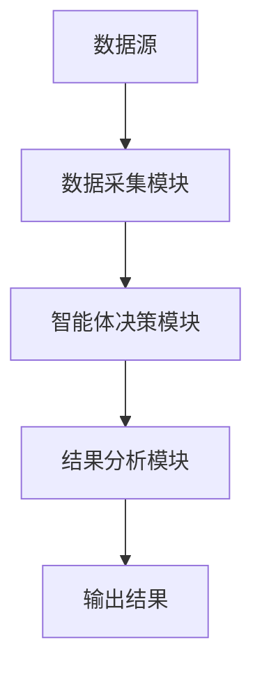

                 


# 智能体群体决策在资产配置中的应用：优化投资组合

## 关键词：智能体，群体决策，资产配置，投资组合优化，分布式计算，粒子群优化，遗传算法

## 摘要：智能体群体决策是一种通过多个智能体协同工作来优化决策的方法。本文探讨了智能体群体决策在资产配置中的应用，特别是在优化投资组合方面。文章详细分析了智能体群体决策的核心原理，介绍了相关的算法模型，如粒子群优化和遗传算法，并通过实际案例展示了如何将这些算法应用于投资组合优化。通过系统分析和架构设计，本文为读者提供了从理论到实践的全面指导。

---

## 第一部分：智能体群体决策的背景与概念

### 第1章：智能体群体决策概述

#### 1.1 智能体群体决策的基本概念
- **智能体的定义与特征**
  - 智能体（Agent）是能够感知环境并采取行动以实现目标的实体。
  - 智能体可以是软件程序、算法或其他自动化系统。
  - 智能体具有自主性、反应性、目标导向性和社会性。

- **群体决策的定义与特点**
  - 群体决策是指多个智能体共同参与决策过程，以达到最优或满意的结果。
  - 群体决策的优势在于利用多个个体的智慧和信息，避免单点决策的局限性。
  - 群体决策的关键在于信息共享和协调。

- **智能体群体决策的必要性与优势**
  - 金融市场复杂性增加，单个决策者难以处理所有信息。
  - 智能体群体决策能够通过分布式计算提高决策的准确性和鲁棒性。
  - 群体决策可以避免个体决策的偏差，实现更优的结果。

#### 1.2 资产配置与投资组合优化
- **资产配置的基本概念**
  - 资产配置是指将资金分配到不同资产类别（如股票、债券、房地产等）以实现投资目标。
  - 资产配置的核心在于平衡风险和收益，最大化投资回报。

- **投资组合优化的目标与方法**
  - 投资组合优化的目标是找到最优的资产组合，以实现最大收益或最小风险。
  - 传统方法包括均值-方差优化（Markowitz优化）和因子模型等。

- **传统资产配置方法的局限性**
  - 传统方法假设资产回报符合正态分布，忽视了实际市场中的非线性关系。
  - 传统方法难以处理大数据和复杂场景下的优化问题。
  - 单一决策模型可能无法捕捉市场中的所有信息。

---

## 第二部分：智能体群体决策的核心概念与原理

### 第2章：智能体群体决策的核心原理

#### 2.1 智能体的决策机制
- **单个智能体的决策过程**
  - 每个智能体根据自身信息和环境状态做出决策。
  - 决策过程可能基于预设规则或学习算法。

- **智能体之间的信息交互**
  - 智能体之间通过共享信息或协调行动来达成一致或协同决策。
  - 信息交互可以通过局部通信或全局通信实现。

- **群体决策的收敛性分析**
  - 智能体群体决策的过程通常会收敛到一个稳定状态。
  - 收敛性依赖于算法的设计和信息交互的机制。

#### 2.2 群体决策的数学模型
- **基于个体偏好的群体决策模型**
  - 每个智能体有一个偏好排序，群体决策需要综合这些偏好。
  - 通过投票机制或加权和的方式得出最终决策。

- **基于共识的群体决策模型**
  - 群体决策过程以达成共识为目标，通过多次迭代调整个体决策。
  - 共识模型适用于分布式系统中的决策问题。

- **智能体群体决策与传统优化方法的对比**
  - 传统优化方法通常基于单点计算，而群体决策利用分布式计算。
  - 群体决策在处理多目标优化问题时更具灵活性。

---

## 第三部分：算法原理讲解

### 第3章：智能体群体决策的算法实现

#### 3.1 粒子群优化（PSO）算法
- **粒子群优化算法的基本原理**
  - 粒子群优化是一种模拟鸟群觅食行为的优化算法。
  - 算法通过更新粒子的位置和速度，寻找目标函数的最优解。

- **PSO算法的流程图**
  ```mermaid
  graph TD
      A[开始] --> B[初始化粒子群]
      B --> C[计算适应度]
      C --> D[更新速度和位置]
      D --> E[检查终止条件]
      E --> F[输出最优解]
      F --> G[结束]
  ```

- **PSO算法的Python实现**
  ```python
  import random

  def psooptimize(n_particles, max_iterations, search_space):
      particles = [{'position': random.uniform(search_space[0], search_space[1]), 
                    'velocity': 0, 
                    'fitness': 0} for _ in range(n_particles)]
      
      for _ in range(max_iterations):
          for particle in particles:
              # 计算适应度
              particle['fitness'] = evaluate_fitness(particle['position'])
              # 更新速度和位置
              particle['velocity'] = 0.8 * particle['velocity'] + 2 * random.random() * (particle['fitness'] - 0.5)
              new_position = particle['position'] + particle['velocity']
              if new_position < search_space[0]:
                  new_position = search_space[0]
              if new_position > search_space[1]:
                  new_position = search_space[1]
              particle['position'] = new_position
      return particles

  def evaluate_fitness(position):
      return -(position**2) + 4*position + 5
  ```

- **PSO算法在投资组合优化中的应用**
  - 使用PSO算法优化投资组合的收益与风险平衡。
  - 设置目标函数为最大化收益或最小化风险。

#### 3.2 遗传算法（GA）的应用
- **遗传算法的基本原理**
  - 遗传算法模拟生物进化过程，通过选择、交叉和变异生成新的解。
  - 适用于复杂的优化问题，特别是组合优化。

- **GA算法的流程图**
  ```mermaid
  graph TD
      A[开始] --> B[初始化种群]
      B --> C[计算适应度]
      C --> D[选择父代]
      D --> E[交叉和变异]
      E --> F[新种群]
      F --> G[检查终止条件]
      G --> H[输出最优解]
      H --> I[结束]
  ```

- **GA算法的Python实现**
  ```python
  import random

  def geneticoptimize(population_size, max_iterations, gene_length):
      population = [{'genes': [random.randint(0,1) for _ in range(gene_length)], 
                     'fitness': 0} for _ in range(population_size)]
      
      for _ in range(max_iterations):
          for individual in population:
              individual['fitness'] = evaluate_fitness(individual['genes'])
          
          new_population = []
          for _ in range(population_size):
              parent1 = random.choice(population)
              parent2 = random.choice(population)
              child = crossover(parent1, parent2)
              child = mutate(child)
              new_population.append(child)
          population = new_population
      return population

  def evaluate_fitness(genes):
      return sum(genes)

  def crossover(parent1, parent2):
      child = []
      for i in range(len(parent1['genes'])):
          if random.random() < 0.5:
              child.append(parent1['genes'][i])
          else:
              child.append(parent2['genes'][i])
      return {'genes': child, 'fitness': 0}

  def mutate(child):
      for i in range(len(child['genes'])):
          if random.random() < 0.1:
              child['genes'][i] = 1 - child['genes'][i]
      return child
  ```

- **GA算法在投资组合优化中的应用**
  - 使用GA算法优化资产组合，以最大化收益或最小化风险。
  - 通过基因表示资产的选择，适应度函数为目标函数。

---

## 第四部分：数学模型与公式

### 第4章：优化问题的数学建模

#### 4.1 投资组合优化的数学模型
- **目标函数**
  $$ \text{最大化收益} = \sum_{i=1}^{n} w_i r_i $$
  $$ \text{最小化风险} = \sum_{i=1}^{n} \sum_{j=1}^{n} w_i w_j \sigma_{ij} $$
  其中，\( w_i \) 是资产 \( i \) 的权重，\( r_i \) 是资产 \( i \) 的预期收益，\( \sigma_{ij} \) 是资产 \( i \) 和 \( j \) 的协方差。

- **约束条件**
  $$ \sum_{i=1}^{n} w_i = 1 $$
  $$ w_i \geq 0 \quad \text{对所有} i $$

#### 4.2 智能体群体决策的数学表达
- **群体决策模型**
  $$ f(x) = \sum_{i=1}^{m} a_i g_i(x) $$
  其中，\( g_i(x) \) 是个体 \( i \) 的决策函数，\( a_i \) 是权重系数。

- **共识模型**
  $$ x_{k+1} = x_k + \sum_{i=1}^{n} \alpha_i (x_i - x_k) $$
  其中，\( \alpha_i \) 是个体 \( i \) 的影响权重，\( x_k \) 是当前共识。

---

## 第五部分：系统分析与架构设计

### 第5章：系统架构设计

#### 5.1 系统功能设计
- **数据采集模块**
  - 从金融市场获取实时或历史数据。
  - 数据包括资产价格、收益、风险指标等。

- **智能体决策模块**
  - 分布式智能体协同决策，优化投资组合。
  - 使用PSO或GA算法进行优化。

- **结果分析模块**
  - 对优化结果进行评估和分析。
  - 生成报告或可视化结果。

#### 5.2 系统架构图


---

## 第六部分：项目实战

### 第6章：智能体群体决策优化投资组合的实现

#### 6.1 环境安装与配置
- 安装必要的Python库：numpy、pandas、matplotlib、scipy。
- 安装Mermaid图生成工具。

#### 6.2 核心实现代码
- 使用PSO算法优化投资组合的Python代码
  ```python
  import numpy as np
  import matplotlib.pyplot as plt

  def evaluate_portfolio(weights, returns):
      return -np.mean(returns.dot(weights))  # 最小化收益

  def pso_optimize(n_assets, n_particles, max_iter, bounds):
      dimensions = n_assets
      particles = n_particles
      iterations = max_iter

      # 初始化粒子群
      positions = np.random.uniform(bounds[0], bounds[1], (particles, dimensions))
      velocities = np.zeros((particles, dimensions))
      fitness = np.zeros(particles)

      for _ in range(iterations):
          # 计算适应度
          for i in range(particles):
              fitness[i] = evaluate_portfolio(positions[i], returns)

          # 更新速度和位置
          for i in range(particles):
              for j in range(dimensions):
                  velocities[i][j] = 0.8 * velocities[i][j] + 2 * np.random.random() * (fitness[i] - np.mean(fitness))

          new_positions = positions + velocities
          for i in range(particles):
              for j in range(dimensions):
                  if new_positions[i][j] < bounds[0]:
                      new_positions[i][j] = bounds[0]
                  if new_positions[i][j] > bounds[1]:
                      new_positions[i][j] = bounds[1]

          positions = new_positions

      best_position = positions[np.argmin(fitness)]
      return best_position

  # 示例数据
  n_assets = 5
  returns = np.array([0.1, 0.15, 0.12, 0.08, 0.2])
  bounds = (0, 1)
  n_particles = 20
  max_iter = 50

  optimal_weights = pso_optimize(n_assets, n_particles, max_iter, bounds)
  print("最优权重：", optimal_weights)
  ```

#### 6.3 结果分析与解读
- 可视化投资组合的收益和风险曲线。
- 对比不同算法（PSO和GA）的优化效果。

---

## 第七部分：最佳实践与总结

### 第7章：最佳实践与注意事项

#### 7.1 最佳实践
- **算法选择**
  - 根据问题规模和约束选择合适的算法（PSO、GA等）。
  - 对比不同算法的性能和收敛速度。

- **参数调优**
  - 调整算法参数（如粒子数、迭代次数）以获得最佳效果。
  - 使用网格搜索或随机搜索进行参数优化。

- **风险管理**
  - 定期监控和评估投资组合的风险。
  - 设置止损点以防止重大损失。

#### 7.2 小结
- 智能体群体决策为资产配置提供了一种新的思路。
- 算法的选择和参数调优对优化效果至关重要。
- 未来可以结合机器学习和大数据技术进一步提升优化能力。

---

## 第八部分：拓展阅读

### 第8章：进一步学习与资源

#### 8.1 推荐书籍
- 《群体智能：算法与应用》
- 《投资学》

#### 8.2 在线资源
- 群体智能相关的学术论文。
- 开源代码和工具库。

---

通过以上结构，我们可以系统地了解智能体群体决策在资产配置中的应用，并通过实际案例和算法实现，深入掌握投资组合优化的技巧和方法。

