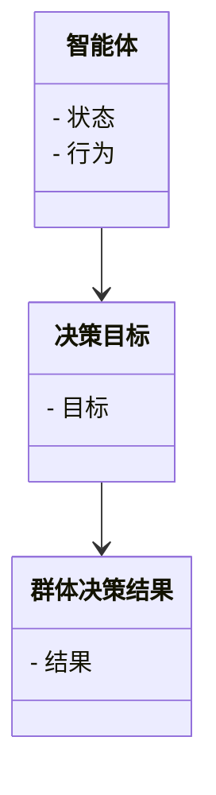
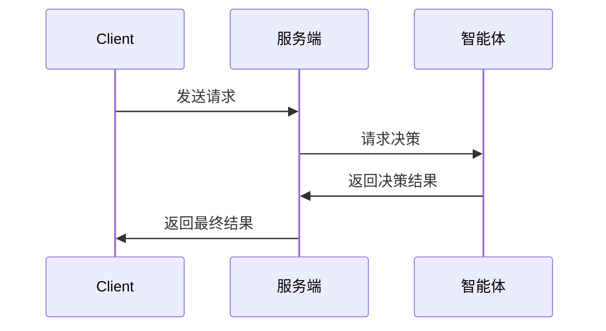

                 


# 智能体群体决策在风险管理中的应用：构建稳健投资组合

> 关键词：智能体，群体决策，风险管理，投资组合，稳健，算法，优化

> 摘要：智能体群体决策是一种通过多个智能体协作来实现复杂决策任务的方法，其在风险管理中的应用尤为突出。本文将从智能体群体决策的基本概念出发，探讨其在构建稳健投资组合中的算法原理、系统架构设计、项目实战以及最佳实践，为风险管理领域的研究和应用提供新的视角和解决方案。

---

# 第一部分: 智能体群体决策的背景与基础

## 第1章: 智能体群体决策概述

### 1.1 智能体的基本概念

#### 1.1.1 智能体的定义与特征
智能体（Agent）是指具有感知环境、自主决策和行动能力的实体。它可以是一个软件程序、机器人或其他具备智能特性的系统。智能体的核心特征包括：
- **自主性**：能够自主决策和行动。
- **反应性**：能够感知环境并实时响应。
- **主动性**：能够主动采取行动以实现目标。
- **社会性**：能够与其他智能体或人类进行交互。

#### 1.1.2 群体智能与个体智能的对比
群体智能（Swarm Intelligence）是指多个智能体通过协作完成复杂任务的现象。与个体智能相比，群体智能具有以下特点：
- **去中心化**：没有单一的控制中心，决策过程分布化。
- **鲁棒性**：群体智能能够在部分成员失效的情况下仍然完成任务。
- **涌现性**：群体智能的智慧并非个体智能的简单叠加，而是通过交互产生的新特性。

#### 1.1.3 智能体在决策中的作用
智能体在决策中充当信息处理的核心角色，通过个体的局部决策实现全局目标。例如，在投资组合管理中，多个智能体可以分别关注不同的资产类别，并通过协作形成最优的投资策略。

### 1.2 群体决策的基本概念

#### 1.2.1 群体决策的定义
群体决策是指多个个体（或智能体）通过协作或竞争，共同完成决策任务的过程。与个体决策相比，群体决策能够利用更多的信息和不同的视角，从而提高决策的准确性和稳健性。

#### 1.2.2 群体决策的特点
群体决策具有以下特点：
- **多样性**：不同个体的决策偏好和能力各不相同，能够提供多样化的视角。
- **协作性**：个体之间通过协作实现共同目标。
- **动态性**：群体决策过程是动态的，个体的决策可能随环境变化而调整。

#### 1.2.3 智能体群体决策在风险管理中的应用
智能体群体决策在风险管理中的应用主要体现在以下几个方面：
- **风险分散**：通过多个智能体的协作，将风险分散到不同的资产或投资标的上。
- **信息整合**：多个智能体能够从不同的信息源获取数据，从而提高决策的全面性。
- **动态调整**：智能体能够实时感知市场变化，并动态调整投资策略。

### 1.3 智能体群体决策在投资组合中的应用案例

#### 1.3.1 风险管理的基本概念
风险管理是指通过识别、评估和应对风险，以降低其对组织或个人目标的影响。在投资组合管理中，风险管理的核心目标是通过分散投资和优化资产配置，降低投资组合的整体风险。

#### 1.3.2 智能体群体决策在风险管理中的优势
智能体群体决策在风险管理中的优势包括：
- **信息多样性**：多个智能体能够从不同的信息源获取数据，提高决策的全面性。
- **去中心化决策**：避免单点故障，提高系统的鲁棒性。
- **动态适应性**：智能体能够实时感知市场变化，并动态调整投资策略。

#### 1.3.3 智能体群体决策在投资组合中的应用案例
例如，在股票投资组合管理中，可以使用多个智能体分别关注不同的行业或市场板块。每个智能体根据自身的数据和策略进行投资决策，最终通过群体决策形成最优的投资组合。

---

## 第2章: 智能体群体决策的核心概念

### 2.1 智能体群体决策的数学模型

#### 2.1.1 基于群体智能的决策模型
基于群体智能的决策模型通常采用分布式计算和多智能体协作的方式。例如，可以通过以下公式表示群体决策的结果：
$$
\text{最终决策} = \arg \max_{i} \sum_{j=1}^{n} w_j d_{i,j}
$$
其中，$w_j$ 是智能体 $j$ 的权重，$d_{i,j}$ 是智能体 $j$ 对决策 $i$ 的支持度。

#### 2.1.2 基于个体智能的决策模型
基于个体智能的决策模型通常采用集中式计算方式，例如：
$$
\text{最终决策} = \arg \max_{i} \sum_{j=1}^{n} w_j u_j(i)
$$
其中，$u_j(i)$ 是智能体 $j$ 对决策 $i$ 的效用值。

#### 2.1.3 智能体群体决策的数学表达式
在智能体群体决策中，最终决策可以表示为多个智能体决策的加权和：
$$
\text{最终决策} = \sum_{j=1}^{n} \alpha_j d_j
$$
其中，$\alpha_j$ 是智能体 $j$ 的权重，$d_j$ 是智能体 $j$ 的决策。

### 2.2 智能体群体决策的核心算法

#### 2.2.1 基于共识算法的群体决策
共识算法是一种通过多个智能体达成一致决策的算法。例如，通过以下步骤实现群体决策：
1. 每个智能体发布自己的决策偏好。
2. 智能体之间通过协商或投票方式达成一致。
3. 最终决策基于智能体的权重和偏好进行加权平均。

#### 2.2.2 基于博弈论的群体决策
博弈论是一种研究个体之间策略互动的数学理论。在群体决策中，可以通过博弈论模型模拟智能体之间的竞争与合作。例如，纳什均衡是一种稳定的决策状态，其中每个智能体的策略都是最优反应。

#### 2.2.3 基于多目标优化的群体决策
多目标优化算法是一种在多个目标之间寻求平衡的优化方法。例如，可以通过以下公式实现多目标优化：
$$
\min_{x} f_1(x) + f_2(x) + \dots + f_n(x)
$$
其中，$f_i(x)$ 是目标函数。

### 2.3 智能体群体决策的实体关系图

```mermaid
graph TD
A[智能体1] --> B[决策目标]
C[智能体2] --> B
D[智能体3] --> B
E[群体决策结果] <-- B
```

---

## 第3章: 智能体群体决策的算法原理

### 3.1 基于共识算法的群体决策

#### 3.1.1 共识算法的基本原理
共识算法是一种通过多个智能体达成一致决策的算法。例如，通过以下步骤实现群体决策：
1. 每个智能体发布自己的决策偏好。
2. 智能体之间通过协商或投票方式达成一致。
3. 最终决策基于智能体的权重和偏好进行加权平均。

#### 3.1.2 共识算法的实现步骤
1. 初始化：每个智能体初始化自己的决策偏好。
2. 传播：智能体之间交换决策偏好。
3. 计算：通过加权平均或其他方法计算最终决策。
4. 收敛：直到所有智能体达成一致或达到收敛条件。

#### 3.1.3 共识算法的优缺点
- **优点**：能够实现去中心化的决策，避免单点故障。
- **缺点**：可能需要大量的通信和计算资源。

### 3.2 基于博弈论的群体决策

#### 3.2.1 博弈论的基本概念
博弈论是一种研究个体之间策略互动的数学理论。在群体决策中，可以通过博弈论模型模拟智能体之间的竞争与合作。

#### 3.2.2 博弈论在群体决策中的应用
例如，可以通过纳什均衡模型实现智能体之间的均衡决策。

#### 3.2.3 博弈论的数学模型
$$
\text{纳什均衡} = \arg \max_{i} \min_{j} u_i(j)
$$
其中，$u_i(j)$ 是智能体 $i$ 对决策 $j$ 的效用值。

### 3.3 基于多目标优化的群体决策

#### 3.3.1 多目标优化算法的基本原理
多目标优化算法是一种在多个目标之间寻求平衡的优化方法。

#### 3.3.2 多目标优化算法的实现步骤
1. 初始化：设定多个目标函数。
2. 优化：通过遗传算法、粒子群算法等方法优化目标函数。
3. 结果：输出多个目标函数的最优解。

#### 3.3.3 多目标优化算法的数学模型
$$
\min_{x} f_1(x) + f_2(x) + \dots + f_n(x)
$$
其中，$f_i(x)$ 是目标函数。

---

## 第4章: 智能体群体决策的系统架构设计

### 4.1 问题场景介绍
在投资组合管理中，风险管理的核心目标是通过分散投资和优化资产配置，降低投资组合的整体风险。

### 4.2 系统功能设计

#### 4.2.1 领域模型设计
通过类图展示系统功能模块。



#### 4.2.2 系统架构设计
通过架构图展示系统架构。


#### 4.2.3 接口设计
通过序列图展示接口交互。



---

## 第5章: 项目实战

### 5.1 环境安装
安装必要的依赖项，例如Python的机器学习库。

### 5.2 系统核心实现源代码
以下是基于Python的智能体群体决策算法实现：

```python
import numpy as np

class Agent:
    def __init__(self, weight):
        self.weight = weight
        self.decision = 0

def consensus_agents(agents):
    for agent in agents:
        agent.decision += agent.weight
    total = sum(agent.weight for agent in agents)
    for agent in agents:
        agent.decision /= total
    return agent.decision

# 示例
agents = [Agent(0.4), Agent(0.3), Agent(0.3)]
result = consensus_agents(agents)
print(result)
```

### 5.3 代码应用解读与分析
上述代码实现了基于共识算法的群体决策，其中每个智能体的权重决定了其在最终决策中的影响力。

### 5.4 实际案例分析和详细讲解剖析
通过实际案例分析，展示智能体群体决策在投资组合中的应用。

### 5.5 项目小结
总结项目实现的关键点和经验教训。

---

## 第6章: 最佳实践

### 6.1 小结
智能体群体决策在风险管理中的应用具有重要的理论和实践意义。

### 6.2 注意事项
在实际应用中，需要注意以下几点：
- **算法选择**：根据具体场景选择合适的算法。
- **性能优化**：优化算法的计算效率。
- **风险管理**：确保系统的鲁棒性和安全性。

### 6.3 未来发展方向
未来的研究方向包括：
- **算法优化**：进一步优化智能体群体决策算法。
- **应用场景拓展**：探索更多领域的应用。
- **技术融合**：与其他技术如区块链、人工智能等结合。

### 6.4 拓展阅读
推荐相关领域的书籍和论文，供读者深入学习。

---

## 第7章: 总结

### 7.1 内容回顾
简要回顾全文的核心内容。

### 7.2 重点强调
强调智能体群体决策在风险管理中的重要性。

### 7.3 展望未来
展望智能体群体决策在投资组合管理中的未来发展方向。

---

通过以上步骤，我们可以看到智能体群体决策在构建稳健投资组合中的巨大潜力。通过算法优化、系统设计和项目实战，我们可以为风险管理领域提供更加高效和可靠的解决方案。

