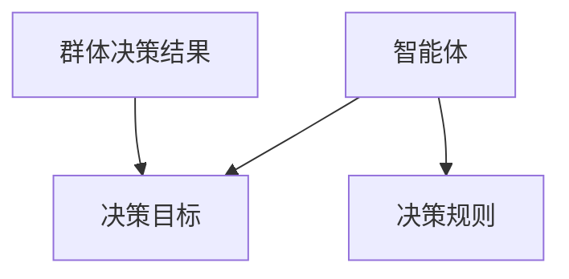
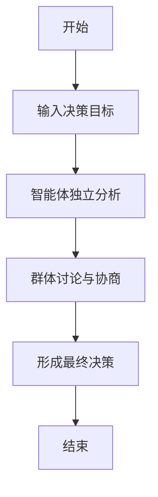
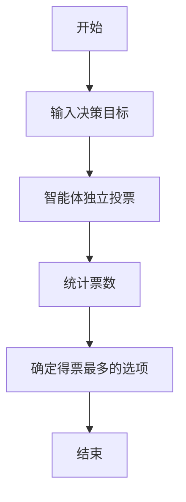
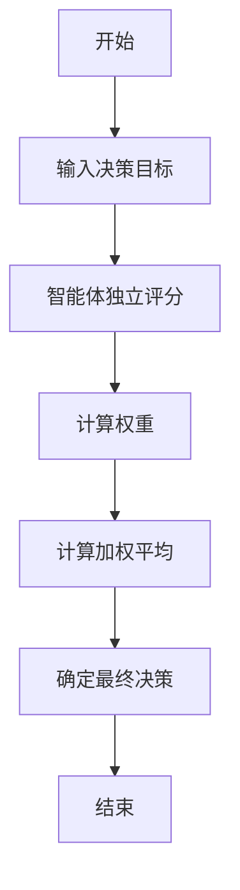
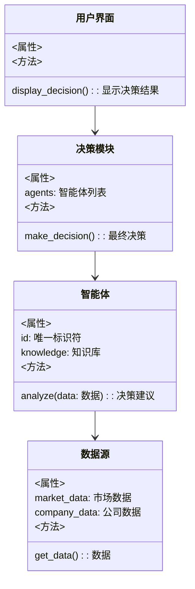
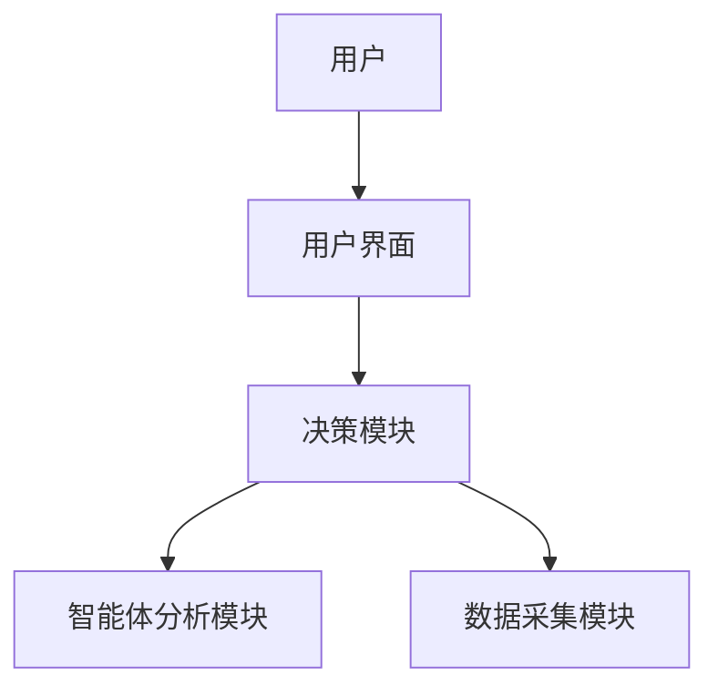
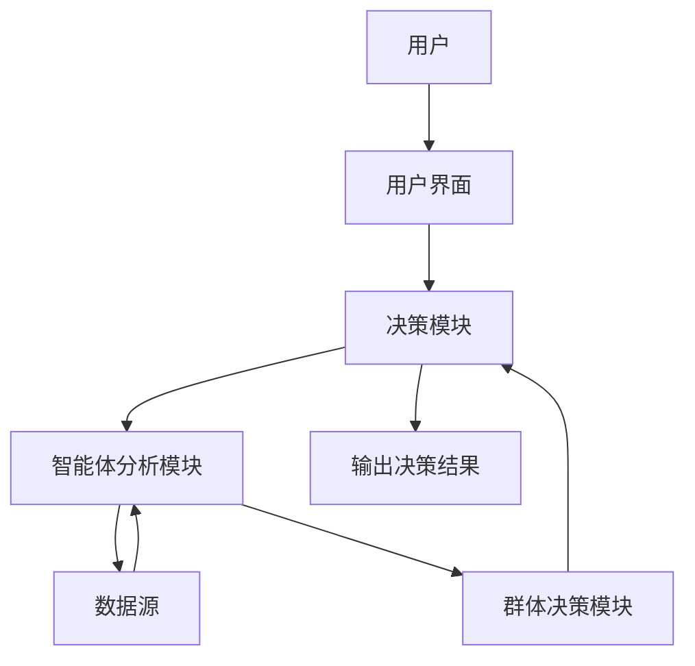

                 


# 智能体群体决策：平衡定量与定性分析在价值投资中的权重

> 关键词：智能体群体决策、定量分析、定性分析、价值投资、决策权重

> 摘要：智能体群体决策是一种通过多个智能体协同工作来实现决策的方法，其核心在于平衡定量与定性分析在决策过程中的权重。本文将深入探讨智能体群体决策的核心概念、算法原理、系统架构设计以及实际应用场景，特别是如何在价值投资中实现定量与定性分析的优化组合，从而提高决策的准确性和可靠性。

---

## 第一部分: 智能体群体决策概述

### 第1章: 智能体群体决策的背景与概念

#### 1.1 智能体群体决策的背景
智能体（Agent）是指能够感知环境、做出决策并采取行动的实体，可以是软件程序、机器人或其他智能系统。智能体群体决策则是指多个智能体协同工作，共同完成决策任务的过程。随着人工智能技术的快速发展，智能体群体决策在金融、医疗、交通等领域得到了广泛应用。

#### 1.2 问题背景与问题描述
在价值投资中，决策者需要综合考虑市场趋势、公司基本面、行业动态等多种因素。然而，单个决策者的能力有限，容易受到主观偏见和信息不全的影响。通过引入智能体群体决策，可以将多个智能体的分析结果整合起来，形成更加全面和客观的决策依据。

#### 1.3 智能体群体决策的核心要素
智能体群体决策的核心要素包括：
1. **智能体的独立分析能力**：每个智能体能够独立地对问题进行分析，并提出自己的决策建议。
2. **群体决策机制**：通过某种规则或算法，将多个智能体的决策结果整合为最终的决策方案。
3. **定量与定性分析的结合**：定量分析依赖数据和模型，而定性分析则依赖经验和主观判断，两者的结合能够提高决策的全面性。

#### 1.4 本章小结
智能体群体决策通过多个智能体的协同工作，能够有效整合定量与定性分析的结果，从而提高决策的准确性和可靠性。

---

### 第2章: 智能体群体决策的核心概念与联系

#### 2.1 智能体的定义与属性
智能体具有以下属性：
- **自主性**：能够自主感知环境并做出决策。
- **反应性**：能够根据环境变化调整行为。
- **社交能力**：能够与其他智能体或人类进行交互。

#### 2.2 群体决策的机制与流程
群体决策的流程包括以下步骤：
1. **问题定义**：明确决策的目标和范围。
2. **智能体独立分析**：每个智能体独立分析问题并提出决策建议。
3. **群体讨论与协商**：智能体之间通过讨论和协商，整合不同的决策建议。
4. **形成最终决策**：基于协商结果，形成最终的决策方案。

#### 2.3 定量与定性分析的对比
| 对比维度 | 定量分析 | 定性分析 |
|----------|----------|----------|
| 数据来源 | 数值数据、统计模型 | 文本数据、专家意见 |
| 分析方法 | 统计分析、机器学习 | 逻辑推理、案例分析 |
| 优点     | 客观性强、可重复性高 | 主观性强、灵活性高 |
| 缺点     | 易受数据偏差影响 | 易受主观偏见影响 |

#### 2.4 实体关系图与流程图
##### 实体关系图（ER图）


##### 决策流程图


#### 2.5 本章小结
通过对比定量与定性分析的特点，可以更好地理解智能体群体决策中两者结合的重要性。

---

## 第二部分: 智能体群体决策的算法原理

### 第3章: 智能体群体决策的算法原理

#### 3.1 基础算法原理
##### 3.1.1 投票机制
投票机制是一种简单的群体决策方法，每个智能体投出自己的决策结果，最终结果由得票最多的选项决定。

##### 3.1.2 加权平均法
加权平均法通过给每个智能体分配不同的权重，将它们的决策结果加权平均，形成最终的决策结果。

##### 3.1.3 贝叶斯决策
贝叶斯决策是一种基于概率论的决策方法，通过计算各个决策方案的概率，选择概率最大的方案作为最终决策。

#### 3.2 算法流程图
##### 投票机制流程图


##### 加权平均法流程图


#### 3.3 数学模型与公式
##### 投票机制
$$ \text{最终决策} = \arg\max_{i} \sum_{j=1}^{n} w_j \cdot d_j[i] $$
其中，$w_j$ 是智能体 $j$ 的权重，$d_j[i]$ 是智能体 $j$ 对决策方案 $i$ 的支持程度。

##### 加权平均法
$$ \text{最终决策} = \sum_{j=1}^{n} w_j \cdot d_j[i] $$
其中，$w_j$ 是智能体 $j$ 的权重，$d_j[i]$ 是智能体 $j$ 对决策方案 $i$ 的评分。

#### 3.4 本章小结
通过投票机制和加权平均法，可以有效地整合智能体的决策结果，形成最终的决策方案。

---

## 第三部分: 智能体群体决策的系统架构设计

### 第4章: 智能体群体决策的系统架构设计

#### 4.1 问题场景介绍
在价值投资中，智能体群体决策系统需要处理大量的市场数据、公司财务数据以及行业动态，通过多个智能体的协同工作，为投资者提供可靠的决策支持。

#### 4.2 系统功能设计
##### 系统功能模块
- **数据采集模块**：采集市场数据、公司财务数据等。
- **智能体分析模块**：每个智能体独立分析数据并提出决策建议。
- **群体决策模块**：整合智能体的决策结果，形成最终的决策方案。
- **用户交互模块**：为用户提供决策结果的可视化界面。

##### 领域模型（类图）


#### 4.3 系统架构设计
##### 系统架构图


##### 系统交互设计


#### 4.4 本章小结
通过系统架构设计，可以更好地理解智能体群体决策在实际应用中的实现方式。

---

## 第四部分: 智能体群体决策的项目实战

### 第5章: 智能体群体决策的项目实战

#### 5.1 项目介绍
本项目旨在开发一个智能体群体决策系统，用于价值投资中的决策支持。系统将通过多个智能体的协同工作，整合定量与定性分析的结果，为投资者提供可靠的决策支持。

#### 5.2 系统实现
##### 环境配置
```bash
pip install numpy pandas scikit-learn
```

##### 核心代码实现
```python
class Agent:
    def __init__(self, id, knowledge):
        self.id = id
        self.knowledge = knowledge

    def analyze(self, data):
        # 简单的分析逻辑
        return self.knowledge.predict(data)

class DecisionModule:
    def __init__(self, agents):
        self.agents = agents

    def make_decision(self, data):
        # 收集所有智能体的分析结果
        suggestions = [agent.analyze(data) for agent in self.agents]
        # 统计每个决策方案的得票数
        vote_count = {}
        for suggestion in suggestions:
            if suggestion in vote_count:
                vote_count[suggestion] += 1
            else:
                vote_count[suggestion] = 1
        # 确定得票最多的方案
        max_votes = max(vote_count.values())
        candidates = [k for k, v in vote_count.items() if v == max_votes]
        return candidates[0] if len(candidates) == 1 else candidates
```

##### 测试与结果
```python
# 初始化智能体
agent1 = Agent(1, KnowledgeBase())
agent2 = Agent(2, KnowledgeBase())
agents = [agent1, agent2]

# 初始化决策模块
dm = DecisionModule(agents)

# 测试数据
data = {
    'market': '上涨',
    'company': '盈利',
    'industry': '增长'
}

# 执行决策
decision = dm.make_decision(data)
print(f"最终决策: {decision}")
```

#### 5.3 本章小结
通过实际项目案例，可以更好地理解智能体群体决策在价值投资中的应用。

---

## 第五部分: 总结与展望

### 第6章: 总结与展望

#### 6.1 本章小结
智能体群体决策通过多个智能体的协同工作，能够有效整合定量与定性分析的结果，从而提高决策的准确性和可靠性。本文从核心概念、算法原理、系统架构设计到项目实战，全面介绍了智能体群体决策在价值投资中的应用。

#### 6.2 未来研究方向
1. **更复杂的群体决策算法**：研究更复杂的群体决策算法，如分布式计算和多目标优化。
2. **动态环境下的决策调整**：研究如何在动态环境下实时调整决策方案。
3. **人机协作决策系统**：研究如何将人类专家的决策与智能体的决策相结合，形成更高效的决策系统。

#### 6.3 注意事项
在实际应用中，需要注意以下几点：
1. **数据质量**：确保数据的准确性和完整性。
2. **算法选择**：根据具体场景选择合适的算法。
3. **系统安全性**：确保系统的安全性和稳定性。

#### 6.4 拓展阅读
推荐以下书籍和论文：
- 《群体智能》
- 《分布式计算与一致性算法》
- 《决策科学与人工智能》

#### 6.5 本章小结
智能体群体决策在价值投资中的应用前景广阔，未来的研究将更加注重算法的复杂性和系统的动态适应性。

---

## 参考文献

1. Russell, S., & Norvig, P. (2010). Artificial Intelligence: A Modern Approach.
2. Drogoul, A., et al. (2020). MAutor: A modular and scalable approach for multi-agent systems.
3. Von Solms, R., & Van Dyk, M. (2003). An agent-oriented approach to the integration of distributed information systems.

---

通过以上结构，我们可以清晰地看到智能体群体决策在价值投资中的应用，以及如何平衡定量与定性分析的权重。

